

  
   

Universidad Peruana de Ciencias Aplicadas

Carrera de Ingeniería de Software

 

**1ACC0238**

**Aplicaciones para Dispositivos Móviles**

NRC   **13980**

Docente

**Mayta Guillermo, Jorge Luis**   

**Informe del Trabajo Final**

Equipo  
**GreenMinds**

Proyecto  
**EcoMind**   

**Integrantes**

<table style="border-collapse: collapse; border: none;">
  <tr>
    <th style="border: none; text-align: left; padding-right: 20px;">Código</th>
    <th style="border: none; text-align: left;">Apellidos y Nombres</th>
  </tr>
  <tr>
    <td style="border: none; padding-right: 20px;">u20241e158</td>
    <td style="border: none;">Aponte Pablo, Isabel Luisa</td>
  </tr>
  <tr>
    <td style="border: none; padding-right: 20px;">u202410678</td>
    <td style="border: none;">Astocondor Bazan, Alejandra Isabel</td>
  </tr>
  <tr>
    <td style="border: none; padding-right: 20px;">u202410254</td>
    <td style="border: none;">Dulanto Espino, Leo César</td>
  </tr>
  <tr>
    <td style="border: none; padding-right: 20px;">u202410093</td>
    <td style="border: none;">Pajes Leon, Mauricio Luis</td>
  </tr>
  <tr>
    <td style="border: none; padding-right: 20px;">u202416107</td>
    <td style="border: none;">Philco Mota, Katty Yolanda</td>
  </tr>
</table>

 

**Período 202620**

**Setiembre 2026**

# Registro de Versiones del Informe

| Version | Fecha | Autor | Descripción de modificación |
| -------- | -------- | -------- | -------- |
| 1.0.0    | 01/09/2026     | Alejandra Astocondor     | initial commit   docs: añadir estructura del proyecto |
| 1.0.0    | 06/09/2026     | Katty Philco | docs: agregar Startup Profile   docs: añadir antecedentes y problemática  |
| 1.0.0    | 07/09/2026     | Isabel Aponte   | docs: agregar  competidores   docs: agregar estrategias y tacticas   docs: agregar segmento objetivo  |
| 1.0.0    | 09/09/2026     | Alejandra Astocondor   | docs: agregar lean UX Process |
| 1.0.0    | 15/09/2026     |  Isabel Aponte, Alejandra Astocondor  | docs: agregar diseño de entrevistas    docs: agregar registro de entrevistas   docs: agregar Big Picture EventStorming y EventStorming   docs: agregar Candidate Context Discovery  |
| 1.0.0    | 16/09/2026     |  Leo Dulanto, Alejandra Astocondor  | docs: agregar user stories    docs: agregar message flow   docs: agregar product backlog   docs: agregar impact mapping  |
| 1.0.0    | 17/09/2026     | Katty Philco, Isabel Aponte   | docs: agregar registro de entrevistas   docs: agregar sección Needfinding   docs: agregar Bounded Context: Monetization   docs: agregar Bounded Context Software Architecture Component Level and code diagrams     |
| 1.0.0    | 00/09/2026     |    | docs: agregar    docs: agregar    docs: agregar  |
| 1.0.0    | 00/09/2026     |    | docs: agregar    docs: agregar    docs: agregar  |

# Projet Report Collaboration Insights

Project Report URL: https://github.com/upc-pre-202620-13980-greenminds/GreenMinds_Report.git 

*AV1*

Durante el desarrollo de la entrega AV1, el equipo organizó la elaboración del informe mediante la asignación de responsabilidades por secciones, lo que permitió un trabajo colaborativo y paralelo entre los integrantes. Cada miembro contribuyó en función de su área asignada, abarcando aspectos de experiencia de usuario, análisis de negocio y arquitectura del sistema.

El proceso de desarrollo del informe se realizó de manera incremental, integrando progresivamente los contenidos conforme se avanzaba en el proyecto. Esto se refleja en el Registro de Versiones del Informe, donde se evidencia la evolución del documento desde la estructura inicial hasta la incorporación de elementos como Lean UX, análisis competitivo, user stories, arquitectura de software, wireframes y flujos de interacción.

Asimismo, todos los integrantes participaron activamente en la elaboración del informe, realizando aportes continuos que permitieron consolidar una documentación coherente y alineada entre sus distintas secciones. Esta colaboración se evidencia en los analíticos de contribución y commits, los cuales reflejan la participación distribuida del equipo.

# Tabla de contenidos

[Student Outcome](#abet---eac---student-outcome-7)  
[Objetivos SMART](#objetivos-smart)  

**Capítulo I: Presentación**  
1.1. [Startup Profile](#11-startup-profile)  
1.1.1. [Descripción de la Startup](#111-descripción-de-la-startup)  
1.1.2. [Perfiles de integrantes del equipo](#112-perfiles-de-integrantes-del-equipo)  
1.2. [Solution Profile](#12-solution-profile)  
1.2.1. [Antecedentes y problemática](#121-antecedentes-y-problemática)  
1.2.2. [Lean UX Process](#122-lean-ux-process)  
1.2.2.1. [Lean UX Problem Statements](#1221-lean-ux-problem-statements)  
1.2.2.2. [Lean UX Assumptions](#1222-lean-ux-assumptions)  
1.2.2.3. [Lean UX Hypothesis Statements](#1223-lean-ux-hypothesis-statements)  
1.2.2.4. [Lean UX Canvas](#1224-lean-ux-canvas)  
1.3. [Segmentos objetivo](#13-segmentos-objetivo)  

**Capítulo II: Requirements Development and Software Solution Design**  
2.1. [Competidores](#21-competidores)  
2.1.1. [Análisis competitivo](#211-análisis-competitivo)  
2.1.2. [Estrategias y tácticas frente a competidores](#212-estrategias-y-tácticas-frente-a-competidores)  
2.2. [Entrevistas](#22-entrevistas)  
2.2.1. [Diseño de entrevistas](#221-diseño-de-entrevistas)  
2.2.2. [Registro de entrevistas](#222-registro-de-entrevistas)  
2.2.3. [Análisis de entrevistas](#223-análisis-de-entrevistas)  
2.3. [Needfinding](#23-needfinding)  
2.3.1. [User Personas](#231-user-personas)  
2.3.2. [User Task Matrix](#232-user-task-matrix)  
2.3.3. [User Journey Mapping](#233-user-journey-mapping)  
2.3.4. [Empathy Mapping](#234-empathy-mapping)  
2.3.5. [Big Picture EventStorming](#235-big-picture-eventstorming)  
2.3.6. [Ubiquitous Language](#236-ubiquitous-language)  
2.4. [Requirements Specification](#24-requirements-specification)  
2.4.1. [User Stories](#241-user-stories)  
2.4.2. [Impact Mapping](#242-impact-mapping)  
2.4.3. [Product Backlog](#243-product-backlog)  
2.5. [Strategic-Level Domain-Driven Design](#25-strategic-level-domain-driven-design)  
2.5.1. [EventStorming](#251-eventstorming)  
2.5.1.1. [Candidate Context Discovery](#2511-candidate-context-discovery)  
2.5.1.2. [Domain Message Flows Modeling](#2512-domain-message-flows-modeling)  
2.5.1.3. [Bounded Context Canvases](#2513-bounded-context-canvases)  
2.5.2. [Context Mapping](#252-context-mapping)  
2.5.3. [Software Architecture](#253-software-architecture)  
2.5.3.1. [Software Architecture Context Level Diagrams](#2531-software-architecture-context-level-diagrams)  
2.5.3.2. [Software Architecture Container Level Diagrams](#2532-software-architecture-container-level-diagrams)  
2.5.3.3. [Software Architecture Deployment Diagrams](#2533-software-architecture-deployment-diagrams)  
2.6. [Tactical-Level Domain-Driven Design](#26-tactical-level-domain-driven-design)  
2.6.1. [Bounded Context: IAM](#261-bounded-context-iam)  
2.6.1.1. [Domain Layer](#2611-domain-layer)  
2.6.1.2. [Interface Layer](#2612-interface-layer)  
2.6.1.3. [Application Layer](#2613-application-layer)  
2.6.1.4. [Infrastructure Layer](#2614-infrastructure-layer)  
2.6.1.5. [Bounded Context Software Architecture Component Level Diagrams](#2615-bounded-context-software-architecture-component-level-diagrams)  
2.6.1.6. [Bounded Context Software Architecture Code Level Diagrams](#2616-bounded-context-software-architecture-code-level-diagrams)  
2.6.1.6.1. [Bounded Context Domain Layer Class Diagrams](#26161-bounded-context-domain-layer-class-diagrams)  
2.6.1.6.2. [Bounded Context Database Design Diagram](#26162-bounded-context-database-design-diagram)  
2.6.2. [Bounded Context: Profile](#262-bounded-context-profile)  
2.6.2.1. [Domain Layer](#2621-domain-layer)  
2.6.2.2. [Interface Layer](#2622-interface-layer)  
2.6.2.3. [Application Layer](#2623-application-layer)  
2.6.2.4. [Infrastructure Layer](#2624-infrastructure-layer)  
2.6.2.5. [Bounded Context Software Architecture Component Level Diagrams](#2625-bounded-context-software-architecture-component-level-diagrams)  
2.6.2.6. [Bounded Context Software Architecture Code Level Diagrams](#2626-bounded-context-software-architecture-code-level-diagrams)  
2.6.2.6.1. [Bounded Context Domain Layer Class Diagrams](#26261-bounded-context-domain-layer-class-diagrams)  
2.6.2.6.2. [Bounded Context Database Design Diagram](#26262-bounded-context-database-design-diagram)  
2.6.3. [Bounded Context: Learning](#263-bounded-context-learning)  
2.6.3.1. [Domain Layer](#2631-domain-layer)  
2.6.3.2. [Interface Layer](#2632-interface-layer)  
2.6.3.3. [Application Layer](#2633-application-layer)  
2.6.3.4. [Infrastructure Layer](#2634-infrastructure-layer)  
2.6.3.5. [Bounded Context Software Architecture Component Level Diagrams](#2635-bounded-context-software-architecture-component-level-diagrams)  
2.6.3.6. [Bounded Context Software Architecture Code Level Diagrams](#2636-bounded-context-software-architecture-code-level-diagrams)  
2.6.3.6.1. [Bounded Context Domain Layer Class Diagrams](#26361-bounded-context-domain-layer-class-diagrams)  
2.6.3.6.2. [Bounded Context Database Design Diagram](#26362-bounded-context-database-design-diagram)  
2.6.4. [Bounded Context: Quests](#264-bounded-context-quests)  
2.6.4.1. [Domain Layer](#2641-domain-layer)  
2.6.4.2. [Interface Layer](#2642-interface-layer)  
2.6.4.3. [Application Layer](#2643-application-layer)  
2.6.4.4. [Infrastructure Layer](#2644-infrastructure-layer)  
2.6.4.5. [Bounded Context Software Architecture Component Level Diagrams](#2645-bounded-context-software-architecture-component-level-diagrams)  
2.6.4.6. [Bounded Context Software Architecture Code Level Diagrams](#2646-bounded-context-software-architecture-code-level-diagrams)  
2.6.4.6.1. [Bounded Context Domain Layer Class Diagrams](#26461-bounded-context-domain-layer-class-diagrams)  
2.6.4.6.2. [Bounded Context Database Design Diagram](#26462-bounded-context-database-design-diagram)  
2.6.5. [Bounded Context: Community](#265-bounded-context-community)  
2.6.5.1. [Domain Layer](#2651-domain-layer)  
2.6.5.2. [Interface Layer](#2652-interface-layer)  
2.6.5.3. [Application Layer](#2653-application-layer)  
2.6.5.4. [Infrastructure Layer](#2654-infrastructure-layer)  
2.6.5.5. [Bounded Context Software Architecture Component Level Diagrams](#2655-bounded-context-software-architecture-component-level-diagrams)  
2.6.5.6. [Bounded Context Software Architecture Code Level Diagrams](#2656-bounded-context-software-architecture-code-level-diagrams)  
2.6.5.6.1. [Bounded Context Domain Layer Class Diagrams](#26561-bounded-context-domain-layer-class-diagrams)  
2.6.5.6.2. [Bounded Context Database Design Diagram](#26562-bounded-context-database-design-diagram)  
2.6.6. [Bounded Context: Gamification](#266-bounded-context-gamification)  
2.6.6.1. [Domain Layer](#2661-domain-layer)  
2.6.6.2. [Interface Layer](#2662-interface-layer)  
2.6.6.3. [Application Layer](#2663-application-layer)  
2.6.6.4. [Infrastructure Layer](#2664-infrastructure-layer)  
2.6.6.5. [Bounded Context Software Architecture Component Level Diagrams](#2665-bounded-context-software-architecture-component-level-diagrams)  
2.6.6.6. [Bounded Context Software Architecture Code Level Diagrams](#2666-bounded-context-software-architecture-code-level-diagrams)  
2.6.6.6.1. [Bounded Context Domain Layer Class Diagrams](#26661-bounded-context-domain-layer-class-diagrams)  
2.6.6.6.2. [Bounded Context Database Design Diagram](#26662-bounded-context-database-design-diagram)  
2.6.7. [Bounded Context: Monetization](#267-bounded-context-monetization)  
2.6.7.1. [Domain Layer](#2671-domain-layer)  
2.6.7.2. [Interface Layer](#2672-interface-layer)  
2.6.7.3. [Application Layer](#2673-application-layer)  
2.6.7.4. [Infrastructure Layer](#2674-infrastructure-layer)  
2.6.7.5. [Bounded Context Software Architecture Component Level Diagrams](#2675-bounded-context-software-architecture-component-level-diagrams)  
2.6.7.6. [Bounded Context Software Architecture Code Level Diagrams](#2676-bounded-context-software-architecture-code-level-diagrams)  
2.6.7.6.1. [Bounded Context Domain Layer Class Diagrams](#26761-bounded-context-domain-layer-class-diagrams)  
2.6.7.6.2. [Bounded Context Database Design Diagram](#26762-bounded-context-database-design-diagram)  

**Capítulo III: Solution UI/UX Design**  
3.1. [Product Design](#31-product-design)  
3.1.1. [Style Guidelines](#311-style-guidelines)  
3.1.1.1. [General Style Guidelines](#3111-general-style-guidelines)  
3.1.2. [Information Architecture](#312-information-architecture)  
3.1.2.1. [Organization Systems](#3121-organization-systems)  
3.1.2.2. [Labelling Systems](#3122-labelling-systems)  
3.1.2.3. [SEO Tags and Meta Tags](#3123-seo-tags-and-meta-tags)  
3.1.2.4. [Searching Systems](#3124-searching-systems)  
3.1.2.5. [Navigation Systems](#3125-navigation-systems)  
3.1.3. [Landing Page UI Design](#313-landing-page-ui-design)  
3.1.3.1. [Landing Page Wireframe](#3131-landing-page-wireframe)  
3.1.3.2. [Landing Page Mock-up](#3132-landing-page-mock-up)  
3.1.4. [Mobile Applications UX/UI Design](#314-mobile-applications-uxui-design)  
3.1.4.1. [Mobile Applications Wireframes](#3141-mobile-applications-wireframes)  
3.1.4.2. [Mobile Applications Wireflow Diagrams](#3142-mobile-applications-wireflow-diagrams)  
3.1.4.3. [Mobile Applications Mock-ups](#3143-mobile-applications-mock-ups)  
3.1.4.4. [Mobile Applications User Flow Diagrams](#3144-mobile-applications-user-flow-diagrams)  
3.1.4.5. [Mobile Applications Prototyping](#3145-mobile-applications-prototyping)  

**Capítulo IV: Product Implementation & Validation**  
1. [Product Implementation & Validation](#4-product-implementation-&-validation)  
4.1. [Software Configuration Management](#41-software-configuration-management)  
4.1.1. [Software Development Environment Configuration](#411-software-development-environment-configuration)  
4.1.2. [Source Code Management](#412-source-code-management)  
4.1.3. [Source Code Style Guide & Conventions](#413-source-code-style-guide--conventions)  
4.1.4. [Software Deployment Configuration](#414-software-deployment-configuration)  
4.2. [Landing Page & Mobile Application Implementation](#42-landing-page--mobile-application-implementation)  
4.2.1. [Sprint 1](#421-sprint-1)  
4.2.1.1. [Sprint Planning 1](#4211-sprint-planning-1)  
4.2.1.2. [Aspect Leaders and Collaborators](#4212-aspect-leaders-and-collaborators)  
4.2.1.3. [Sprint Backlog 1](#4213-sprint-backlog-1)  
4.2.1.4. [Development Evidence for Sprint Review](#4214-development-evidence-for-sprint-review)  
4.2.1.5. [Testing Suite Evidence for Sprint Review](#4215-testing-suite-evidence-for-sprint-review)  
4.2.1.6. [Execution Evidence for Sprint Review](#4216-execution-evidence-for-sprint-review)  
4.2.1.7. [Services Documentation Evidence for Sprint Review](#4217-services-documentation-evidence-for-sprint-review)  
4.2.1.8. [Software Deployment Evidence for Sprint Review](#4218-software-deployment-evidence-for-sprint-review)  
4.2.1.9. [Team Collaboration Insights during Sprint](#4219-team-collaboration-insights-during-sprint)  
4.3. [Validation Interviews](#43-validation-interviews)  
4.3.1. [Diseño de Entrevistas](#431-diseño-de-entrevistas)  
4.3.2. [Registro de Entrevistas](#432-registro-de-entrevistas)  
4.3.3. [Evaluaciones según heurísticas](#433-evaluaciones-según-heurísticas)

[Conclusiones](#conclusiones)  
[Conclusiones y Recomendaciones](#conclusiones-y-recomendaciones)  
[Video App Validation](#video-app-validation)  
[Video About the Product](#video-about-the-product)  
[Video About the Team](#video-about-the-team)  
[Glosario](#glosario)  
[Bibliografía](#bibliografía)  
[Anexos](#anexos)

# ABET - EAC - Student Outcome 7

El curso contribuye al cumplimiento del Student Outcome ABET:
**ABET – EAC - Student Outcome 7**

**Criterio:** La capacidad de adquirir y aplicar nuevos conocimientos según sea necesario, utilizando estrategias deaprendizaje apropiadas.

En el siguiente cuadro se describe las acciones realizadas y enunciados de conclusiones por parte del grupo, que permiten sustentar el haber alcanzado el logro del ABET – EAC - Student Outcome 7.

| Criterio Especifico | Acciones realizadas | Conclusiones |
| -------- | -------- | -------- |
| **Actualiza conceptos y conocimientos necesarios para su desarrollo profesional y en especial para su proyecto en soluciones de software.** | Aponte Pablo, Isabel Luisa  *AV1*   Aa.        Astocondor Bazan, Alejandra Isabel   *AV1*   Aa       Dulanto Espino, Leo César   *AV1*   Aa.        Pajes Leon, Mauricio Luis   *AV1*   Aa.       Philco Mota, Katty Yolanda   *AV1*   Aa.     | *AV1*   El equipo...      |
| **Reconoce la necesidad del aprendizaje permanente para el desempeño profesional y el desarrollo de proyectos en soluciones de software.** | Aponte Pablo, Isabel Luisa  *AV1*   Aa.        Astocondor Bazan, Alejandra Isabel   *AV1*   Aa       Dulanto Espino, Leo César   *AV1*   Aa.        Pajes Leon, Mauricio Luis   *AV1*   Aa.       Philco Mota, Katty Yolanda   *AV1*   Aa.      | *AV1*   El equipo ...   |

# Objetivos Smart

# Capítulo I: Introducción

## 1.1. Startup Profile

### 1.1.1. Descripción del startup

**Nombre de la startup**

GreenMinds

**Descripción**

ECOMIND es una plataforma interactiva que busca fortalecer la conciencia ambiental en escolares a través de la gamificación y dinámicas educativas como retos y juegos prácticos. Su propuesta no solo transmite conocimientos sobre reciclaje, ahorro de agua, eficiencia energética y cuidado del entorno, sino que también busca transformar hábitos cotidianos al involucrar tanto a los estudiantes como a sus familias y comunidades. A diferencia de otras herramientas, funciona en modalidad online y offline, lo que hace accesible en contextos con limitaciones de conectividad y garantiza su alcance en zonas urbanas y rurales.

**Visión**

Posicionarnos en el corto y mediano plazo como la plataforma educativa de referencia en conciencia ambiental para escolares en el Perú, ampliando gradualmente nuestro alcance hacia otras comunidades y paises de la región. Aspiramos a contribuir en la construcción de una generación más consciente, capaz de integrar hábitos sostenibles en su vida cotidiana y de inspirar cambios positivos en su entorno.

**Misión**

Brindar a los escolares una educación ambiental innovadora, accesible y dinámica que convierta el aprendizaje en una experiencia significativa. A través de la gamificación, buscamos que los niños no solo adquieran conocimientos, sino que desarrollen actitudes responsables y prácticas sostenibles que puedan replicar en su vida diaria y en sus entornos familiares y comunitarios.

**Propuesta de Valor**

GreenMinds convierte la educación ambiental en una experiencia práctica y motivadora mediante gamificación. Los estudiantes no solo aprenden, sino que aplican hábitos sostenibles en su vida diaria a través de retos interactivos.

La plataforma es accesible online y offline, lo que permite su uso en distintos contextos, incluyendo zonas con baja conectividad. Además, involucra a la familia y comunidad, generando un impacto real más allá del aula.

**Características principales**

GreenMinds ofrece un sistema de retos gamificados que motiva a los estudiantes a participar activamente en actividades relacionadas con el reciclaje, el ahorro de agua y la eficiencia energética. Estas actividades están organizadas en retos progresivos que fomentan el aprendizaje mediante la acción.

La plataforma incorpora un sistema de logros y recompensas que incentiva la constancia y el compromiso, permitiendo a los usuarios acumular puntos, desbloquear reconocimientos y visualizar su progreso. Este enfoque refuerza la motivación y convierte el aprendizaje en una experiencia entretenida.

Asimismo, promueve la participación familiar, integrando actividades que pueden realizarse en casa y fortaleciendo el aprendizaje en el entorno cotidiano del estudiante. A esto se suma la creación de comunidades educativas, donde los usuarios pueden interactuar, colaborar y participar en rankings o retos grupales.

GreenMinds también permite el seguimiento del progreso individual, mostrando avances, rachas y niveles de compromiso, lo que ayuda a los estudiantes a tomar conciencia de su impacto. Además, incluye contenido educativo interactivo como videos, lecturas e infografías que complementan los retos prácticos.

Finalmente, la plataforma ofrece opciones de personalización, como la creación de avatares y perfiles, lo que incrementa la conexión del usuario con la experiencia y refuerza su motivación.

### 1.1.2. Perfiles de integrantes del equipo

| Foto | Nombre | Descripción |
| -------- | -------- | -------- |
|  | Aponte Pablo, Isabel Luisa (u20241e158) | Estudiante de Ingeniería de Software. Me interesa la programación y el desarrollo de soluciones prácticas. Tengo conocimientos en C++ y otras herramientas tecnólogicas, me caracterizo por ser responsable, organizada y enfocada en el trabajo en equipo. |
|  | Astocondor Bazan, Alejandra Isabel (U202410678) | Estudiante de Ingeniería de Software, enfocada en el desarrollo de soluciones tecnológicas. Poseo habilidades en programación y diseño digital. Me caracterizo por mi creatividad, responsabilidad y capacidad de adaptación. |
|  | Dulanto Espino, Leo César (U202410254) | Estudiante de Ingeniería de Software, con conocimientos en C++, Python y fundamentos de desarrollo web y Java. Me gusta crear soluciones creativas a problemas y apoyar activamente al equipo en los proyectos. |
|  | Pajés León, Mauricio Luis (u202410093) | Mi nombre es Mauricio Luis Pajés León y estudio Ingeniería de Software en la UPC. Me enfoco en el desarrollo Backend, principalmente con TypeScript y Node.js, integración de APIs, bases de datos y procesamiento de eventos en AWS. También manejo C++, Python, Java con Spring Boot, .NET y Angular, y tengo conocimientos en patrones de software y bases de datos SQL y NoSQL. Me interesa seguir aprendiendo nuevas tecnologías, desarrollar soluciones confiables y trabajar en equipo. |
|  | Philco Mota, Katty Yolanda (u202416107) | Soy una persona responsable y comprometida con mi crecimiento académico. Cuento con conocimientos en programación, especialmente en C++, así como en estructuras de datos, algoritmos y desarrollo de soluciones tecnológicas orientadas a proyectos reales. |
## 1.2. Solution Profile

### 1.2.1. Antecedentes y problemática

La falta de conciencia ambiental constituye un problema que afecta tanto al planeta como a la calidad de vida de las personas, pues provoca contaminación, riesgos para la salud y un uso ineficiente de recursos básicos como el agua y la energía. Este problema se manifiesta principalmente durante la etapa escolar, cuando deberían consolidarse valores y hábitos sostenibles, pero no siempre ocurre porque los aprendizajes en la escuela no encuentran continuidad en el hogar ni respaldo en la comunidad. 

Surge sobre todo en espacios cercanos a los estudiantes, donde las prácticas cotidianas no refuerzan lo enseñado en el aula. Los más afectados son los escolares de educación básica, en quienes la ausencia de una conciencia ambiental sólida limita la adopción de conductas responsables en su vida diaria. 

Entre las causas destacan: la cultura consumista, que promueve la compra y el desecho excesivo; las prioridades económicas y de seguridad que desplazan la preocupación ambiental; y la falta de educación ambiental, que deja a los ciudadanos sin claridad sobre cómo sus acciones diarias contribuyen al deterioro del entorno. 

Esta situación surge porque los conocimientos transmitidos en la escuela no se consolidan en la práctica cotidiana, ya que los hogares y comunidades mantienen hábitos poco sostenibles. Los datos muestran la magnitud del problema: en el Perú, solo el 1,8 % de los residuos municipales generados en 2022 fueron valorizados, reflejando un bajo aprovechamiento de materiales reciclables. Asimismo, en Madre de Dios, un estudio con estudiantes de secundaria reveló que la mayoría presentaba niveles apenas moderados de conciencia y actitudes ambientales, con solo un porcentaje reducido que alcanzó niveles altos o muy adecuados. 

**Aplicación de 5W+2H:** 

**¿Cuál es el problema? (What?)**

La conciencia ambiental puede entenderse como el nivel de conocimientos, actitudes y prácticas que desarrollan los individuos para actuar de manera responsable con el entorno, integrando valores de respeto y cuidado hacia los recursos naturales (Chuliá, 1995). La falta de esta se ha convertido en un problema que, además de afectar nuestro planeta, impacta directamente en la calidad de vida de las personas, ya que genera entornos contaminados, riesgos para la salud y un uso ineficiente de recursos básicos como el agua y la energía. 

**¿Cuándo sucede el problema? (When?)** 

El problema de la falta de conciencia ambiental se manifiesta principalmente durante la etapa escolar. Es en esta fase donde deberían consolidarse actitudes responsables hacia el entorno y prácticas sostenibles que se mantengan a lo largo de la vida. Sin embargo, cuando este proceso no ocurre de manera adecuada, los escolares no desarrollan una conciencia ambiental sólida, lo que se traduce en conductas poco responsables frente al cuidado del medio ambiente en su vida cotidiana. 

**¿Dónde surge el problema? (Where?)** 

El problema de la falta de conciencia ambiental surge principalmente en los espacios de socialización más cercanos a los estudiantes: la escuela, el hogar y la comunidad. Si bien en las instituciones educativas se incluyen contenidos ambientales en el currículo, estos aprendizajes muchas veces no se consolidan porque no encuentran respaldo en el entorno familiar ni en la cultura comunitaria. Según Róger Martinez (2010), “la educación ambiental debe constituir un proceso integral, que juega su papel en todo el entramado de la enseñanza y el aprendizaje” (p. 97). 

**¿A quiénes les sucede el problema? (Who?)** 

El problema de la falta de conciencia ambiental afecta principalmente a los escolares de educación básica, tanto en primaria como en secundaria, quienes se encuentran en una etapa crucial para la formación de valores y hábitos sostenibles. Estos estudiantes, al no desarrollar una conciencia ambiental sólida, tienen mayores dificultades para incorporar prácticas responsables en su vida cotidiana. 

**¿Cuál es la causa del problema? (Why?)** 

Entre las principales causas están: 

**Cultura de consumismo:** se impulsa a las personas a adquirir productos que no responden a necesidades reales, sino a deseos creados por la publicidad y las tendencias sociales. Este patrón de consumo lleva a valorar más la posesión y el estatus que el uso responsable de los recursos, generando hábitos de compra excesiva, desecho rápido y desperdicio (Reyes, 2018). 

**Prioridades económicas/seguridad:** en muchos contextos, especialmente en países en desarrollo, las preocupaciones inmediatas de la población están relacionadas con la estabilidad económica, la generación de ingresos y la seguridad personal. Estas prioridades suelen desplazar la atención hacia el cuidado del medio ambiente, que se percibe como un tema secundario o de largo plazo. 

**Falta de educación ambiental:**  muchos escolares y ciudadanos desconocen cómo sus acciones cotidianas, como el consumo excesivo de agua, la disposición inadecuada de residuos o el uso indiscriminado de plásticos, contribuyen al deterioro del entorno. 

**¿Qué llevo a la persona a llegar a esa situación?** (How) 

La falta de conciencia ambiental es el resultado de un proceso en el que los aprendizajes recibidos en la escuela no logran consolidarse en su vida cotidiana. Aunque en el aula se transmiten conocimientos básicos sobre reciclaje, ahorro de agua y cuidado de los recursos, estos no encuentran continuidad en el hogar ni respaldo en la comunidad, donde persisten hábitos de sobreconsumo y prácticas poco sostenibles. 

**Estadísticas o datos que sustenten la problemática (How much?)** 

En el Perú, la gestión de residuos sólidos evidencia serias limitaciones. Aunque la valorización de residuos municipales pasó de 17 189 toneladas en 2014 a 148 559 toneladas en 2022, este volumen representa apenas el 1,8 % del total generado a nivel nacional (Ministerio del Ambiente, 2024), lo que refleja un bajo nivel de aprovechamiento de materiales reciclables.

**Figura 1**
*Porcentaje de residuos sólidos municipales valorizados con respecto a lo generado según departamento*

Nota.*Adaptado de Anuario estadístico del sector Ambiente 2023, por el Ministerio del Ambiente, 2023.*

Un estudio realizado en Madre de Dios mostró que el 35,4 % de los estudiantes tenía un nivel moderado de conciencia ambiental, el 28,7 % un nivel alto y solo el 7,2 % alcanzó un nivel muy alto, mientras que un 5,5 % se ubicó en un nivel muy bajo. Respecto a las actitudes proambientales, el 43,7 % presentó niveles parcialmente adecuados y apenas un 3,3 % logró niveles muy adecuados (Estrada, et al. 2022). 

**Figura 2**

*Resultados descriptivos de conciencia ambiental y las actitudes proambientales de los estudiantes de la Institución Educativa Almirante Miguel Grau Seminario de Madre de Dios, Perú.*

Nota. *Adaptado de Conciencia ambiental y actitudes proambientales en estudiantes de educación secundaria de Madre de Dios, Perú, por Estrada E., 2022.* 

### 1.2.2. Lean UX Process

#### *1.2.2.1. Lean UX Problem Statements*

EcoMind propone una aplicación móvil educativa que promueve la conciencia ambiental en niños mediante retos interactivos y actividades familiares. A través de un diseño centrado en el usuario, inclusivo y gamificado, busca convertir el aprendizaje ecológico en una experiencia divertida y cotidiana. Su objetivo es integrar a padres e hijos en un entorno digital que fomente hábitos sostenibles y fortalezca el compromiso con el cuidado del planeta. 

Dentro de las escuelas primarias, se quiere que los estudiantes transformen la educación ambiental en hábitos sostenibles que se practiquen de manera constante en el hogar y la comunidad. no obstante, observamos que lo aprendido en el aula no cuenta con un proceso continuo y verificable que lo enlace con la rutina cotidiana, lo que se refleja en pocas eco acciones fuera de clase y baja permanencia en el tiempo. Aunque en la actualidad existen diversas plataformas y programas de educación ambiental y gamificación, identificamos que la continuidad, especialmente en el hogar y la comunidad, son débiles. Ahí radica la oportunidad que se desea aprovechar: intervenir en esa brecha de continuidad y verificación del comportamiento ambiental. Finalmente, todo ello ocurre bajo restricciones de tiempo pedagógico, brechas de conectividad y acceso a dispositivos. 

¿Como podríamos garantizar esa continuidad y acompañamiento entre escuela, hogar y comunidad, bajo dichas restricciones? 

#### *1.2.2.2. Lean UX Assumptions*

**Assumptions Worksheet**

1. ¿Quién es el usuario? 

Estudiantes de primaria (6–12 años): niños que inician la formación de hábitos ambientales y requieren actividades visuales, breves e interactivas para consolidar lo aprendido en la escuela.

Padres de familia de escolares de primaria: adultos responsables de reforzar y acompañar las prácticas sostenibles en el hogar, asegurando continuidad en las eco-acciones.

2. ¿Dónde encaja nuestro producto en su trabajo o vida? 

En el hogar: plataforma para completar mini-retos familiares y dar seguimiento a las eco-acciones.

Conexión comunitaria: registro de actividades ambientales que trascienden el aula y se vinculan con la comunidad.

3. ¿Qué problemas tiene nuestro producto que resolver? 

En escolares de primaria: dificultad para trasladar lo aprendido en la escuela a la vida diaria, ya que los contenidos ambientales no siempre se refuerzan en casa o comunidad.

En padres de familia: falta de recursos y estrategias claras para apoyar a los niños en la práctica de hábitos sostenibles dentro del hogar.

En general: ausencia de retroalimentación y medición de impacto que permitan dar continuidad a las eco-acciones.

4. ¿Cuándo y cómo es usado nuestro producto? 

En el hogar, como parte de tareas, eco-retos o proyectos familiares.

En la comunidad, registrando prácticas ambientales conjuntas.

El producto puede usarse en cualquier momento y lugar, tanto en modo online como en modo offline con sincronización diferida, asegurando continuidad incluso en contextos de baja conectividad.

5. ¿Qué características son importantes? 

Misiones y minijuegos progresivos adaptados a escolares y familias.

Gamificación: puntos, insignias y rankings para incentivar la participación conjunta.

Modo offline con registro y posterior sincronización de actividades.

Interfaz visual, inclusiva y fácil de usar, adecuada para niños y adultos.

6. ¿Cómo debería verse nuestro producto y cómo comportarse?

La aplicación debe presentar un diseño colorido, dinámico e intuitivo, con ilustraciones y personajes que conecten con los escolares y resulten comprensibles para los padres. La navegación debe ser clara, sencilla y atractiva, sin elementos que distraigan del aprendizaje.

En términos de funcionamiento, se espera que la plataforma sea ágil, responsiva y accesible, con tiempos de carga mínimos y transiciones fluidas. Debe comportarse como una experiencia de juego educativo con retroalimentación constante, transmitiendo confianza a las familias mediante visualización de progreso e indicadores claros del impacto de las eco-acciones.

**Assumptions**

- Creo que mis clientes necesitan una plataforma educativa que integre comunidad y hogar para reforzar la conciencia ambiental a través de actividades prácticas y gamificadas. 

- Estas necesidades se pueden resolver con mini-retos, eco-acciones y reportes de impacto que motiven la continuidad de hábitos sostenibles. 

- Mis clientes iniciales son (o serán) escolares de primaria (6–12 años) y sus padres de familia, interesados en adoptar hábitos ambientales dentro y fuera del aula. 

- El valor #1 que un cliente quiere de mi servicio es la posibilidad de ver resultados tangibles en la formación de hábitos sostenibles en los niños. 

- El cliente también puede obtener estos beneficios adicionales: participación conjunta entre escuela y hogar, retroalimentación inmediata y reconocimiento familiar y comunitario. 

- Voy a adquirir la mayoría de mis clientes a través de programas ambientales escolares y difusión digital en redes sociales. 

- Haré dinero a través de herramientas de monetización relacionadas a los aspectos de gamificación y personalización de avatar. 

- Mi competencia principal en el mercado será aplicaciones educativas ambientales como Happy Little Planet o Defensor de la Naturaleza. 

- Los venceremos debido a nuestra propuesta integral que combina hogar y comunidad, con funcionalidad offline y un sistema de gamificación. 

- Mi mayor riesgo de producto es que las familias no utilicen la plataforma de manera constante. 

- Resolveremos esto a través de estrategias de gamificación, incentivos visibles (insignias, rankings) y actividades comunitarias que refuercen la continuidad. 

- ¿Qué otras suposiciones tenemos? Que las familias valorarán la visualización de progreso como evidencia de aprendizaje. Si esta suposición se prueba falsa, el proyecto podría tener baja adopción en los hogares. 

- Suponemos que los escolares se sentirán motivados por las misiones breves, visuales y progresivos, siempre que reciban retroalimentación inmediata al completar actividades.

- Suponemos que los padres estarán dispuestos a participar si las actividades familiares son simples, de corta duración y se pueden realizar con recursos disponibles en casa.

- Suponemos que los colegios pueden convertirse en aliados estratégicos para recomendar la plataforma como complemento de educación ambiental.

- Suponemos que el sistema de ranking, puntos, rachas y recompensas aumentará la frecuencia de uso sin desplazar el propósito educativo de la solución.

- Suponemos que la comunidad y los eventos ambientales cercanos fortalecerán la continuidad de hábitos sostenibles fuera del aula.

- Suponemos que una Landing Page clara, con testimonios y una propuesta de valor directa, facilitará la comprensión del producto y la conversión de visitantes en usuarios registrados.

- Suponemos que la personalización de avatares, cosméticos y recompensas virtuales incrementará la conexión emocional de los escolares con la aplicación.

- Suponemos que los usuarios aceptarán un modelo freemium si las funciones gratuitas entregan valor educativo suficiente y la monetización se basa en compra de moneda de la aplicación para los customizables.

**User Outcomes**

- Los escolares podrán convertir contenidos de educación ambiental en acciones concretas mediante retos, miniactividades y eco-acciones verificables.

- Los escolares podrán visualizar su avance mediante puntos, rachas, logros y rankings, reforzando su motivación para continuar participando.

- Los padres podrán acompañar el aprendizaje ambiental de sus hijos mediante actividades familiares, reportes de progreso y evidencias de retos completados.

- Las familias podrán incorporar hábitos sostenibles en su rutina diaria, conectando lo aprendido en la escuela con prácticas reales en el hogar y la comunidad.

- Los usuarios podrán participar en espacios comunitarios, eventos y logros colectivos que refuercen la colaboración ambiental.

**Business Outcomes**

- Incrementar la adopción inicial de EcoMind mediante instituciones educativas, Landing Page y difusión digital.

- Mejorar la retención de usuarios a través de mecánicas de gamificación, recompensas, personalización y seguimiento del progreso.

- Validar el interés de padres y estudiantes por una solución educativa ambiental que combine escuela, hogar y comunidad.

- Generar una base de usuarios que permita evaluar el modelo freemium y futuras funciones premium de seguimiento, personalización o recompensas.

- Posicionar a EcoMind como una plataforma educativa diferenciada frente a competidores, al integrar gamificación, participación familiar, comunidad y accesibilidad.

#### *1.2.2.3. Lean UX Hypothesis Statements*
**Hypothesis Statement 1**

Creemos que la implementación de actividades didácticas y gamificadas captará el interés de los niños para su contribución hacia el medio ambiente. Sabremos que lo hemos logrado, cuando al menos un 30% de los niños/estudiantes completen los mini-retos de forma semanal.

**Hypothesis Statement 2**

Creemos que añadir un modo offline permitirá acceso desde cualquier lugar y atraerá a nuevos usuarios de sectores o zonas de menos recursos. Sabremos que lo hemos logrado, cuando haya un incremento de 15% de usuarios que sean de zonas rurales o baja conectividad.

**Hypothesis Statement 3**

Creemos que incentivar a padres e hijos con actividades/mini-retos conjuntos harán que agreguen actividades eco-amigables dentro del hogar. Sabremos que lo hemos logrado, cuando al menos un 40% de las familias registradas complete/publique las actividades conjuntas que realizaron

**Hypothesis Statement 4**

Creemos que integrar un sistema de ranking motivara a los niños a una participación constante en las actividades. Sabremos que lo hemos logrado,cuando los niños aumenten en un 5% en tiempo/días de uso de la aplicación de forma mensual.

#### *1.2.2.4. Lean UX Canvas*

Link: https://canva.link/9mzenct40v5ocok

**Figura 3**

*Lean Product Canvas*

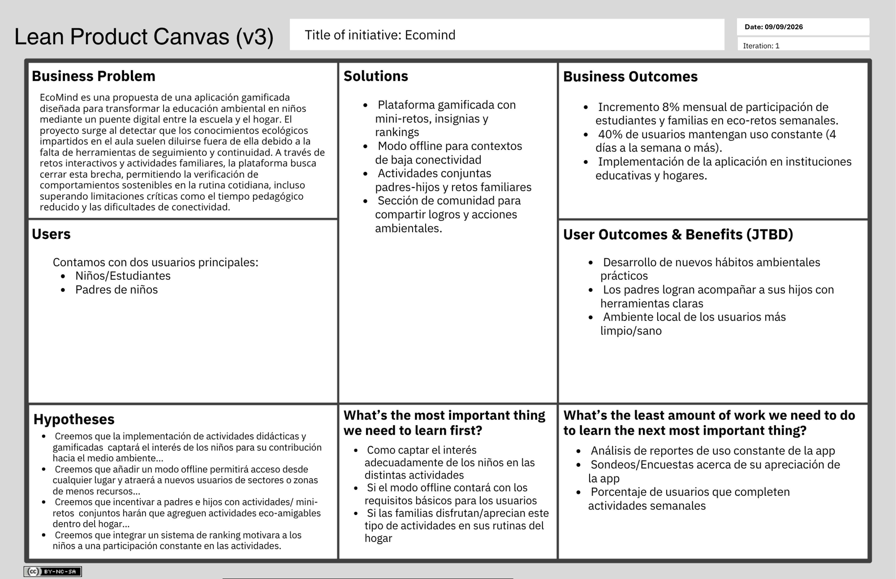

## 1.3. Segmentos objetivo

Los segmentos objetivo comprenden a los usuarios finales a los que nuestra solución busca atender. Para el caso de nuestra plataforma, se han determinado los siguientes perfiles prioritarios:

#### Segmento objetivo #1: Estudiantes de Primaria
Este segmento está constituido por niños y niñas en etapa escolar que se encuentran en una fase crucial para la formación de valores y hábitos sostenibles, y que requieren estímulos visuales y lúdicos para integrar el aprendizaje a su vida diaria.

**Aspectos demográficos:**
* Edad: 6 a 12 años.
* Género: Masculino y femenino.
* Nivel Educativo: Educación Primaria.
* Ubicación: Zonas urbanas y rurales.
* Nivel digital: Nativo digital; usuarios habituales de dispositivos móviles y tablets para juegos (como Roblox) y comunicación (Discord).

**Aspectos conductuales:**
Su aprendizaje es principalmente visual y práctico; prefieren aprender jugando, viendo videos o mediante retos interactivos. Se motivan con sistemas de recompensa y reconocimiento (puntos, insignias). Suelen conocer la teoría sobre el cuidado ambiental por la escuela, pero les cuesta aplicarla de forma constante en casa sin un incentivo o recordatorio dinámico.

**Información estadística de sustento:**
Para el segmento de estudiantes de primaria, las investigaciones indican que, si bien un 65.42% manifiesta una conciencia ambiental alta a nivel teórico, existe una brecha crítica en la práctica real, donde solo el 44.86% alcanza un nivel alto de sensibilidad emocional hacia el entorno (Bendezú, 2019).

**Necesidad:**
El estudiante requiere una experiencia de aprendizaje gamificada que convierta las tareas ecológicas (como reciclar o ahorrar agua) en "misiones" divertidas. Necesita una herramienta que le brinde retroalimentación inmediata sobre sus logros, permitiéndole ver el impacto real de sus acciones de manera sencilla y atractiva.

#### Segmento objetivo #2: Padres de Familia
Este segmento comprende a los adultos responsables del hogar, quienes actúan como el nexo principal para que los hábitos aprendidos en la escuela se consoliden en la rutina familiar cotidiana.
Aspectos demográficos:

* Edad: 30 a 62 años.
* Género: Masculino y femenino.
* Nivel Educativo: Superior técnica, universitaria o secundaria completa.
* Ubicación: Áreas residenciales y comunidades con acceso a servicios básicos.
* Nivel digital: Básico a intermedio; utilizan el celular para comunicación (WhatsApp), redes sociales y gestión laboral/bancaria.

**Aspectos conductuales:**
Valoran profundamente la educación ambiental como parte de la formación de sus hijos, pero enfrentan dificultades de tiempo o falta de estrategias claras para motivarlos. Buscan herramientas que sean seguras, educativas y que fomenten la unión familiar a través de actividades conjuntas.

**Información estadística de sustento:**
Respecto a los padres de familia, las investigaciones destacan que su involucramiento es fundamental, ya que el 72.53% de ellos logra adoptar hábitos sostenibles en el hogar tras la influencia de programas educativos ambientales iniciados por sus hijos (Taco et al., 2025).

**Necesidad:**
El padre de familia requiere una guía práctica y recursos simplificados (como guías o FAQs) para acompañar a sus hijos en el desarrollo de hábitos sostenibles. Necesita reportes de impacto y progreso que le den la seguridad de que sus hijos están aprendiendo de forma verificable, reforzando la conexión entre la escuela y el hogar.

# Capítulo II: Requirements Development and Software Solution Design

## 2.1. Competidores

#### 1. Defensor de la naturaleza  
Defensor de la naturaleza es una aplicación móvil educativa y ecológica dirigida a niños, orientada a fomentar la conciencia ambiental de manera lúdica y accesible. Lanzada por Y-Group Games, esta app ofrece una serie de minijuegos interactivos en los que los pequeños limpian jardines, parques y zonas de juego, plantan árboles y flores, clasifican residuos y limpian ríos y estanques contaminados. La experiencia está diseñada especialmente para enseñar a los niños la importancia de proteger la naturaleza y los entornos que los rodea. (Y-Group Games. (s. f.)  

#### 2. Happy Litle Planet  
Happy Little Planet es una aplicación educativa diseñada para niños, cuyo objetivo es enseñar hábitos sostenibles y el cuidado del medio ambiente de manera lúdica e interactiva. La app combina juegos educativos y libros con audio, proporcionando experiencias de aprendizaje divertidas y dinámicas que ayudan a los niños a comprender conceptos como reciclaje, ahorro de recursos y respeto por la naturaleza. (Adrilo Rincz, s.f.)   

#### 3. Earth Cubs  
Earth Cubs es una aplicación educativa orientada a niños, cuyo propósito es enseñar sobre el medio ambiente, la sostenibilidad y el cambio climático mediante experiencias lúdicas e interactivas. La app combina minijuegos, acertijos, cómics y videos, además de recursos para el aula, ofreciendo un aprendizaje dinámico que motiva a los más pequeños a desarrollar conciencia ambiental y hábitos responsables con la naturaleza. (Earth Cubs, s.f.)

### 2.1.1. Análisis competitivo

|  | Competitive Analysis Landscape |
|---|---|
| ¿Por qué llevar a cabo este análisis? | Llevamos a cabo este análisis con la finalidad de conocer a los competidores, identificar sus fortalezas y debilidades, y definir estrategias de diferenciación y posicionamiento para Green Mind. |

|  |  | **Green Mind** | **Defensor de la Naturaleza** | **Happy Little Planet** | **Earth Cubs** |
|---|---|---|---|---|---|
| **Perfil** | Logo |  |  |  |  |
|  | Overview | Plataforma educativa gamificada que enseña hábitos sostenibles a escolares, con acceso en línea y sin conexión, e involucra a familias y comunidades. | Juego móvil centrado en acciones ambientales directas dentro de un entorno lúdico. | Aplicación educativa infantil que enseña hábitos sostenibles y cuidado ambiental mediante juegos interactivos y audiolibros, con acompañamiento de los padres. | Aplicación educativa gamificada que enseña a los niños sobre el medio ambiente, la sostenibilidad y el cambio climático mediante minijuegos, acertijos, cómics y recursos escolares. |
|  | Ventaja competitiva | Plataforma inclusiva con acceso en línea y sin conexión, que conecta el aprendizaje escolar con la participación de las familias y comunidades. | Educación ambiental sencilla y entretenida para niños de primeras edades. | Aprendizaje ambiental lúdico y seguro para niños pequeños, con participación de los padres y contenido disponible sin conexión. | Contenidos educativos integrales, diversos y orientados a generar un impacto real. |
| **Perfil de marketing** | Mercado objetivo | Escolares y padres de familia interesados en el cuidado ambiental. | Niños de educación preescolar y primeros grados de primaria. | Niños pequeños y padres interesados en la educación ambiental. | Niños de educación preescolar y primaria, así como sus padres y educadores. |
|  | Estrategias de marketing | Promoción en redes sociales, alianzas con instituciones educativas y actividades con familias y comunidades. | Promoción en tiendas de aplicaciones y uso de una propuesta visual atractiva para el público infantil. | Promoción en tiendas de aplicaciones, blogs y redes sociales sobre educación infantil, con énfasis en una experiencia visual segura y atractiva. | Difusión multiplataforma y colaboración con escuelas y asociaciones ambientales. |
| **Perfil de Producto** | Productos y servicios | Plataforma gamificada con minirretos, juegos educativos y actividades sobre hábitos sostenibles. | Aplicación móvil con minijuegos ecológicos interactivos. | Juegos educativos interactivos, audiolibros y contenido descargable para utilizar sin conexión. | Plataforma digital con juegos, videos y recursos educativos. |
|  | Precios y costos | Acceso gratuito, con suscripciones y microtransacciones opcionales. | Aplicación gratuita financiada mediante anuncios. | Aplicación gratuita. | Aplicación gratuita con acceso a contenidos básicos. |
|  | Canales de distribución | Plataforma web, aplicación móvil y acceso sin conexión. | Aplicación móvil disponible en Google Play. | Aplicación móvil disponible en Google Play y App Store, además de un sitio web oficial. | Sitio web oficial y aplicaciones móviles disponibles en App Store y Google Play. |
| **Análisis SWOT** | Fortalezas | Gamificación que fomenta la motivación, acceso en línea y sin conexión, e integración de familias y comunidades. | Juego sencillo, divertido y accesible para niños pequeños. | Vincula el aprendizaje digital con acciones ambientales en la vida cotidiana. | Combina diversión y educación ambiental con una amplia variedad de contenidos. |
|  | Debilidades | Requiere inversión constante para desarrollar, mantener y actualizar los juegos y contenidos. | Contenido limitado y dependencia de la publicidad. | Contenido limitado y poca interacción social entre usuarios. | Su enfoque amplio puede dificultar la especialización y exige actualizaciones constantes. |
|  | Oportunidades | Creciente interés por la educación ambiental y posibilidad de establecer alianzas con colegios, municipalidades y organizaciones ambientales. | Crecimiento de la demanda de aplicaciones educativas con temática ecológica. | Expansión hacia grupos de mayor edad e incorporación de experiencias multijugador. | Integración de nuevos contenidos ambientales y ampliación de su presencia educativa global. |
|  | Amenazas | Competencia de aplicaciones educativas consolidadas y aparición constante de nuevas alternativas digitales. | Alta competencia de aplicaciones educativas similares. | Necesidad de actualizaciones frecuentes y elevada competencia en el mercado de aplicaciones educativas. | Riesgo de quedar rezagada frente a plataformas digitales más innovadoras. |

### 2.1.2. Estrategias y tácticas frente a competidores

#### Estrategias

1. **Acceso inclusivo y continuidad**  
   ECOMIND funcionará tanto online como offline, asegurando que los escolares puedan seguir aprendiendo y realizando actividades educativas incluso en zonas con conectividad limitada o desde sus hogares.

2. **Gamificación y personalización mediante tecnología**  
   La plataforma incorporará gamificación avanzada para el seguimiento del progreso y recomendaciones automáticas. Esto permitirá personalizar el aprendizaje y mantener el interés de los usuarios.

#### Tácticas

#### Desarrollo de contenido hiperlocalizado  
Creación de retos, misiones y juegos basados en situaciones reales, con énfasis en acciones concretas de cuidado ambiental que los escolares puedan aplicar en su entorno.

#### Gamificación con incentivos y seguimiento  
Implementación de puntos, medallas, niveles y rankings para motivar a los niños. Además, los padres podrán acceder a reportes de progreso, reforzando el aprendizaje y fomentando hábitos sostenibles.

#### Aprovechamiento de debilidades de la competencia

1. **Frente a Defensor de la Naturaleza**  
   Dado que su experiencia es limitada y depende de publicidad para financiar el contenido, ECOMIND ofrecerá contenido más completo y libre de anuncios, garantizando aprendizaje continuo y mayor motivación de los usuarios.

## 2.2. Entrevistas

### 2.2.1. Diseño de entrevistas

**Escolares de primaria:**

1. ¿Cuál es tu nombre y cuántos años tienes? 

2. ¿Qué cosas te gusta hacer en tu tiempo libre? 

3. ¿Usas celular, Tablet o computadora? ¿Qué aplicaciones te gustan más? 

4. ¿Has aprendido en tu colegio algo sobre el cuidado del medio ambiente? ¿Qué es lo que más recuerdas? 

5. ¿Qué cosas haces tú en casa para ayudar al planeta? (ejemplo: separar basura, ahorrar agua, apagar luces).

6. ¿Qué es lo que más te divierte o motiva a hacerlo? 

7. Si pudieras aprender con juegos o retos sobre cómo cuidar el medio ambiente, ¿te gustaría? ¿Por qué? 

8. ¿Prefieres usar una aplicación en celular/Tablet o prefieres actividades en papel? ¿Por qué? 

9. ¿Cómo te gusta aprender más? ¿Jugando, viendo videos, ¿leyendo o escuchando? 

**Padres de familia:**

1. ¿Podría contarme un poco de usted? (edad, ocupación, hijos, lugar de residencia). 

2. ¿Qué nivel de confianza tiene en el uso de celulares o aplicaciones?

3. ¿Qué actividades suelen realizar en familia durante la semana? 

4. ¿Qué importancia le da al tema del cuidado del medio ambiente en la educación de sus hijos? 

5. ¿Qué acciones realizan en casa relacionadas con el medio ambiente? 

6. ¿Con qué dificultades se encuentran al intentar enseñar hábitos sostenibles en casa? 

7. Si existiera una aplicación con retos simples para que sus hijos aprendan y practiquen acciones ambientales, ¿la usaría en familia? ¿Por qué sí o por qué no? 

8. ¿Qué cosas le ayudarían a usted a motivar más a sus hijos en este tema? 

9. ¿Qué espera que su hijo logre aprender en los próximos años sobre el medio ambiente? 

### 2.2.2. Registro de entrevistas

**Video de la entrevista** :

https://upcedupe-my.sharepoint.com/:v:/g/personal/u20241e158_upc_edu_pe/IQDVAq3-toxSRoOd5eQBFJiXAcM9ehiLBiamDJHJehpaV3M?nav=eyJyZWZlcnJhbEluZm8iOnsicmVmZXJyYWxBcHAiOiJTdHJlYW1XZWJBcHAiLCJyZWZlcnJhbFZpZXciOiJTaGFyZURpYWxvZy1MaW5rIiwicmVmZXJyYWxBcHBQbGF0Zm9ybSI6IldlYiIsInJlZmVycmFsTW9kZSI6InZpZXcifX0%3D&e=h6jWg7

#### Segmento: Padres de Familia
 

| **Entrevista Nro. 1** |
|---|
|  |
| **Entrevistado N°1:** Pedro Eulogio Pablo  **Edad:** 49 años **Ubicación:** Barranca, Barranca, Lima   **Entrevista:**  **Instante del que inicia:** 0:00  **Duración:** 4:52   **Resumen:**   Nuestro entrevistado es Pedro Eulogio Pablo, un padre de familia de 49 años que vive en Barranca, región Lima. Tiene dos hijos de 9 y 15 años, quienes acompañan cursos en primaria y secundaria. Su rutina semanal se centra en el trabajo y en el acompañamiento a sus hijos en sus estudios, dedicando las tardes a comprender y revisar sus clases.  En cuanto al uso de la tecnología, Pedro tiene un nivel básico, ya que utiliza principalmente su celular para llamadas y WhatsApp. En contraste, sus hijos emplean aplicaciones más sofisticadas, acceso a redes sociales. Respecto al medio de la familia, Pedro le otorga gran importancia dentro de la educación familiar. En sus acciones más comunes son el reciclaje, la correcta disposición de los desechos y la limpieza de los espacios. Sin embargo, enfrenta dificultades porque sus hijos a veces olvidan prácticas básicas, como correr los caños o apagar las luces.  Para mejorar sus prácticas ambientales, Pedro está dispuesto a utilizar una aplicación con retos simples y premios que incentiven a que sus hijos realicen actividades cotidianas que les son importantes. A partir de la información que nos proporciona, hemos identificado que los hijos no solo practican en casa, sino que también comparten estas prácticas con su comunidad, creando autónomos en torno a los incentivos. |

| **Entrevista Nro. 2** |
|---|
|  |
| **Entrevistado N°2:** Manuel Pajes  **Edad:** 52 años **Ubicación:** San Miguel, Lima   **Entrevista:** [Video de la entrevista Nro. 2 - Manuel Pajes](https://upcedupe-my.sharepoint.com/personal/u202410093_upc_edu_pe/_layouts/15/stream.aspx?id=%2Fpersonal%2Fu202410093%5Fupc%5Fedu%5Fpe%2FDocuments%2FManuel%20Pajes%2Emp4&referrer=StreamWebApp%2EWeb&referrerScenario=AddressBarCopied%2Eview%2E2559e663%2Def0a%2D4632%2D94a0%2Dc1d5999434f4) **Instante del que inicia:** 0:03  **Duración:** 4:46   **Resumen:**   Manuel Pajes tiene 52 años, es padre de tres hijos y es ingeniero electrónico dedicado a actividades comerciales relacionadas con su carrera. Se considera bastante seguro al utilizar celulares y aplicaciones; menciona redes sociales y aplicaciones bancarias, entre otras. Durante la semana, el trabajo, el colegio y los estudios de sus hijos limitan las actividades compartidas. Algunos fines de semana salen a comer y a pasar tiempo en familia, aunque no lo hacen con mucha frecuencia.  Considera muy importante el cuidado del medio ambiente, pero reconoce que las ocupaciones diarias dificultan dedicarle atención y que su familia no es especialmente proactiva. En casa les piden a los hijos apagar las luces, evitar dejar correr el agua durante mucho tiempo y moderar el uso de la terma. Explica que los hijos suelen olvidar estas indicaciones y que los padres tampoco mantienen un seguimiento constante, por lo que todavía no han consolidado esos hábitos.  Afirma que utilizaría en familia una aplicación con retos ambientales simples. Le parece útil que tanto los hijos como los adultos reciban recordatorios y aprendan mediante actividades cotidianas de forma lúdica. Para motivarlos, valora los recursos visuales, didácticos y entretenidos que ayuden a tomar conciencia. Espera que sus hijos interioricen el cuidado del medio ambiente hasta practicarlo de manera natural como parte de sus hábitos. |

| **Entrevista Nro. 3** |
|---|
|  |
| **Entrevistado N°3:** Madeline León  **Edad:** 49 años **Ubicación:** San Miguel, Lima   **Entrevista:** [Video de la entrevista Nro. 3 - Madeline León](https://upcedupe-my.sharepoint.com/personal/u202410093_upc_edu_pe/_layouts/15/stream.aspx?id=%2Fpersonal%2Fu202410093%5Fupc%5Fedu%5Fpe%2FDocuments%2FMadeline%20Leon%2Emp4&referrer=StreamWebApp%2EWeb&referrerScenario=AddressBarCopied%2Eview%2E81dce685%2D6c9a%2D418b%2Daad1%2D7c5e5a81d507) **Instante del que inicia:** 0:08  **Duración:** 5:48   **Resumen:**   Madeline León tiene 49 años, es madre de tres hijos y actualmente se dedica al hogar. Describe su manejo de celulares y aplicaciones como el necesario para su vida cotidiana, principalmente para realizar consultas y resolver dudas. Durante la semana, las ocupaciones de cada integrante dificultan otras actividades, pero procuran desayunar y almorzar juntos. Los fines de semana salen y realizan más actividades en familia.  Otorga mucha importancia al cuidado ambiental porque lo relaciona con vivir bien, respirar y mantener un entorno saludable para las personas y otros seres vivos. Como prácticas domésticas, menciona que le gusta tener plantas y que guarda las pilas usadas en una botella para llevarlas a un punto de acopio cuando se llena, porque reconoce su efecto contaminante. Enseñar hábitos sostenibles a sus hijos le cuesta esfuerzo: señala que consigue resultados, pero debe estar pendiente de ellos y recordarles estas prácticas porque permanecen ocupados.  Indica que sí utilizaría en familia una aplicación con retos ambientales simples. Para motivar a sus hijos, propone viajar a lugares con vegetación, aire y agua limpios y comparar esos entornos con las grandes ciudades, de modo que valoren más su cuidado. Espera que las acciones ambientales se conviertan en una rutina y considera útiles los recordatorios y la enseñanza continua. Desea que sus hijos mantengan esos hábitos por su propio futuro y cuando formen sus familias. |

#### Segmento objetivo: Escolares de Primaria

| **Entrevista Nro. 1** |
|---|
|  |
| **Entrevistado N°1:** Pablo Astocondor  **Edad:** 11 años **Ubicación:** Pueblo Libre, Lima   **Entrevista:**  **Instante del que inicia:** 4:53    **Duración:** 3:15   **Resumen:**   Nuestro entrevistado es Pablo, un estudiante de 11 años. En su tiempo libre le gusta jugar con sus juguetes, salir, utilizar la consola o la PC, y también emplear aplicaciones como Roblox para jugar y Discord para comunicarse.  En relación con el cuidado del medio ambiente, recuerda que en su colegio le han enseñado sobre el ahorro de agua, no botar botellas y guardar chapas. En su casa procura no usar muchas bolsas de plástico. Lo que más lo motiva es haber visto en la provincia la acumulación de basura y cómo afecta tanto a las personas como a los animales, lo que lo hace reflexionar sobre la importancia de reducir los desechos.  Sobre la forma de aprender, señala que prefiere actividades digitales, aunque también reconoce el valor de las que son en papel. Le gusta aprender escuchando, viendo videos y leyendo textos cortos. Además, considera que los juegos pueden servir como herramienta de aprendizaje si tienen mecánicas bien diseñadas, aunque algunos pueden resultar adictivos.  Finalmente, Pablo demuestra que disfruta combinar distintas formas de aprendizaje y entretenimiento, mostrando una postura crítica frente al uso de videojuegos educativos. |

| **Entrevista Nro. 2** |
|---|
|  |
| **Entrevistado N°2:** Gianfranco de la Cruz   **Edad:** 12 años **Ubicación:** La Molina, Lima   **Entrevista:**  **Instante del que inicia:** 7:00   **Duración:** 3:40   **Resumen:**   El entrevistado se llama Gianfranco de la Cruz, tiene 12 años y está por culminar la primaria. Le gusta pasar el tiempo usando su celular, ya sea para jugar o ver videos.  Nos menciona que en su colegio sí le han enseñado de manera regular sobre el cuidado del ambiente, como la implementación de tachos de basura específicos para reciclaje. Sin embargo, fuera del colegio no tiene muy claro qué actividades o acciones puede realizar, aparte de mantener limpias sus zonas de convivencia.  Por último, menciona que actualmente realiza este tipo de acciones más por ayudar que por motivación propia. Sin embargo, la idea de aprender nuevas formas de apoyo mediante juegos o videos le parecería motivante para esforzarse más. |

| **Entrevista Nro. 3** |
|---|
|  |
| **Entrevistado N°3:** Jeicob Ríos   **Edad:** 11 años **Ubicación:** Surquillo, Lima   **Entrevista:**  **Instante del que inicia:** 10:41   **Duración:** 3:00   **Resumen:**    El entrevistado se llama Jeicob Ríos, el utiliza principalmente su teléfono celular durante su tiempo libre, ya que no cuenta con tablet y su aplicación predilecta es Roblox. Al evaluar el uso de herramientas digitales frente al papel, manifiesta una clara preferencia por el celular argumentando que realiza sus actividades más rápido al evitar escribir tanto a mano. Esta conducta pone en evidencia un perfil de interacción digital enfocado en la eficiencia y rapidez operativa.   En cuanto a su conciencia ambiental, señala que en el colegio aprendió a reciclar la mayor cantidad de objetos posible para no dañar los hábitats de los animales ni la capa de ozono. En el ámbito del hogar, contribuye de forma directa mediante el ahorro de agua. Asimismo, su mayor motivación y entretenimiento ecológico reside en el reciclaje creativo, disfrutando la transformación de botellas plásticas en macetas y portalápices. Respecto a sus canales de interacción y estilo de aprendizaje, el entrevistado destaca que su forma preferida de recibir información es escuchando. De igual manera, expresa entusiasmo por aprender sobre el cuidado del planeta mediante juegos o retos interactivos, señalando que dispone de tiempo libre en casa. |

### 2.2.3. Análisis de entrevistas
**Segmento: Padres de familia**

**1. Perfil general (edad, ocupación, hijos, residencia):**

* Edad promedio: 50 años (49, 52 y 49).
* Todos tienen hijos en edad escolar (inicial, primaria y secundaria).
* Viven en Lima Metropolitana y Barranca.
     
**2. Nivel de confianza con tecnología (celulares/aplicaciones)**

**Figura 4**

*Nivel de confianza en la tecnología - Padres*

 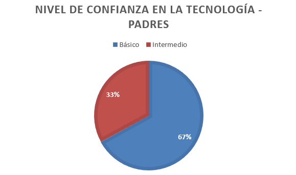 
 
**3. Actividades familiares durante la semana:**

En relación con las actividades familiares, los padres señalaron que durante la semana revisan clases y tareas con sus hijos, conversan en las tardes y comparten más tiempo durante los fines de semana.

**4. Importancia del medio ambiente en la educación de los hijos:**

Sobre la importancia del medio ambiente en la educación de sus hijos, el 100% de los entrevistados lo considera fundamental, asociándolo con problemas actuales como sequías, contaminación y el exceso de desechos.

**5. Acciones ambientales realizadas en casa**

En cuanto a las acciones ambientales realizadas en casa, todos afirmaron practicar el ahorro de agua y energía. Además, realizan reciclaje y utilizan bolsas reutilizables o deposita correctamente los desechos.

**6. Dificultades al enseñar hábitos sostenibles a los hijos**

**Figura 5**

*Dificultades en las enseñanzas - Padres*

 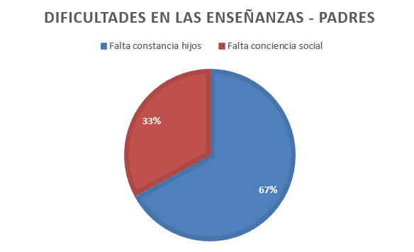 
 
**7. Aplicaciones educativas Ambientales**

Frente al uso de aplicaciones educativas ambientales, todos los padres estarían dispuestos a utilizarlas, siempre que sean prácticas y sencillas. 

**8. Motivación para los hijos**

En cuanto a la motivación de los hijos, los padres mencionaron que responden mejor cuando hay premios y logros visibles, dinámicas familiares o cuando sienten que sus acciones tienen un impacto en la comunidad.

**9. Expectativas de aprendizaje ambiental:**

Con respecto a las expectativas de aprendizaje ambiental, los padres desean que sus hijos asuman responsabilidades tanto en el hogar como en la comunidad, y que desarrollen una conciencia crítica frente al consumo de agua, energía y residuos.

**Segmento: Escolares de primaria:**

**1. Perfil general (nombre, edad, residencia):**
* Edad promedio: 11 años (11, 12 y 11).
* Residentes en Lima (Pueblo Libre, La Molina, Surquillo).
  
**2. Actividades en tiempo libre:**

Respecto a sus actividades en el tiempo libre, los escolares disfrutan jugar en consola o computadora y pasar tiempo en plataformas digitales para la visualización de vídeos.

**Figura 6**

Uso de aparatos tecnológicos- Escolares

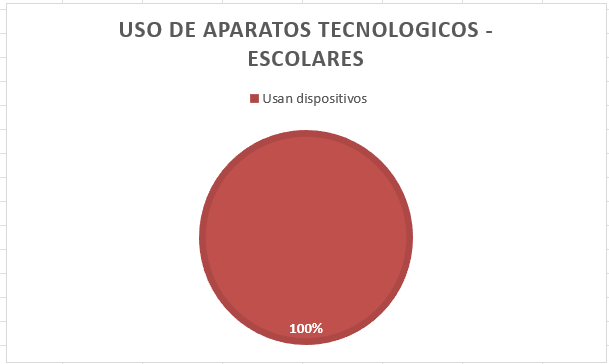 
 
**3. Aprendizaje escolar sobre medio ambiente:**

Sobre el aprendizaje escolar en temas ambientales, los niños identificaron prácticas como el ahorro de agua y energía, la separación de basura, la reducción de plásticos y la conciencia frente a la contaminación futura.

**4. Acciones ambientales en casa:**

Dentro de las acciones ambientales en casa practican apagar luces y ahorrar agua, otro practica el reciclaje o la reducción de bolsas plásticas, y también se enfocan en mantener limpio su espacio,

**5. Motivación para hacerlo:**

**Figura 7**

*Motivación de escolares*

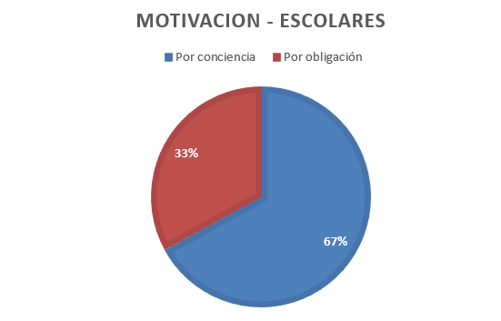
 
**7. Aprender con juegos o retos**

**Figura 8**
*Juegos educativos - Escolares*

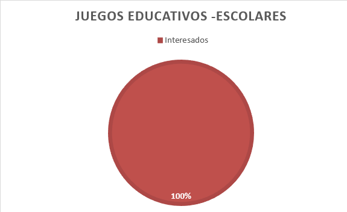 
 
**8. Preferencias entre lo digital o papel**

**Figura 9**

*Preferencia en los escolares*

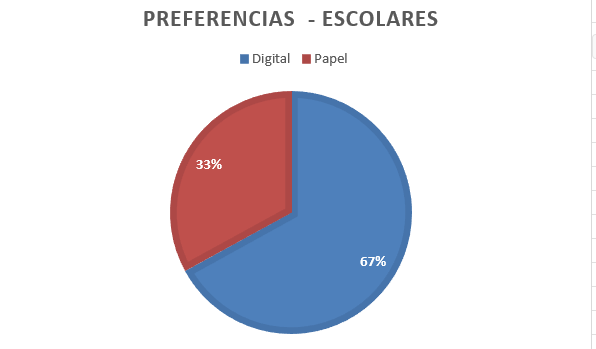 
  
**9. Forma de aprender favorita**

En cuanto a la forma de aprender, todos mostraron interés en juegos y retos relacionados con el medio ambiente.

**Análisis comparativo**

El análisis de entrevistas evidencia una diferencia clara en el nivel de confianza tecnológica entre padres e hijos. Mientras que los padres presentan un manejo básico o intermedio, lo que implica la necesidad de aplicaciones simples y fáciles de usar, los escolares muestran un dominio más alto de dispositivos y plataformas digitales, lo que refleja una motivación clara hacia el aprendizaje mediante entornos digitales.

En cuanto a la educación ambiental, los padres perciben este aspecto como una responsabilidad tanto familiar como comunitaria, asociándolo a prácticas de ahorro y reciclaje en el hogar. Por su parte, los hijos lo relacionan más directamente con el futuro y con su entorno inmediato, mostrando interés en acciones como el cuidado del agua, la energía y la reducción de plásticos. Sin embargo, ambos segmentos comparten limitaciones que deben considerarse. Los padres enfrentan la falta de constancia de sus hijos al mantener hábitos sostenibles, así como una escasa conciencia comunitaria. 

En el caso de los escolares, algunos presentan una motivación débil al asumir estas prácticas y existe el riesgo de que las aplicaciones o juegos se vuelvan adictivos si no se diseñan adecuadamente. Frente a este panorama, se identifica una oportunidad clara para el desarrollo de una aplicación educativa ambiental con retos sencillos, dinámicos e incentivados que fortalezcan el vínculo entre familia y la conciencia ambiental.

## 2.3. Needfinding

### 2.3.1. User Personas
**Primer Segmento Objetivo (Padres de Familia)**

*Figura 10 (User Persona 1)*  
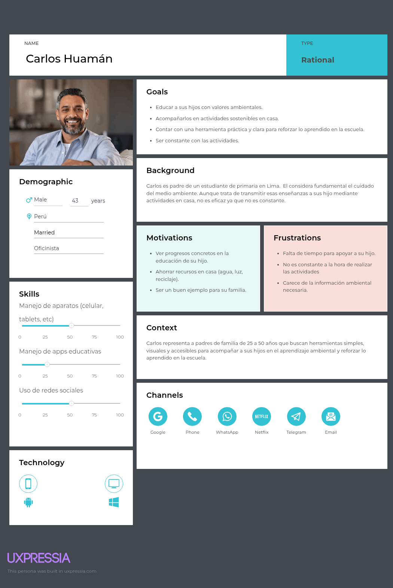

**Segundo Segmento Objetivo (Escolares de primaria)**

*Figura 11 (User Persona 2)*  
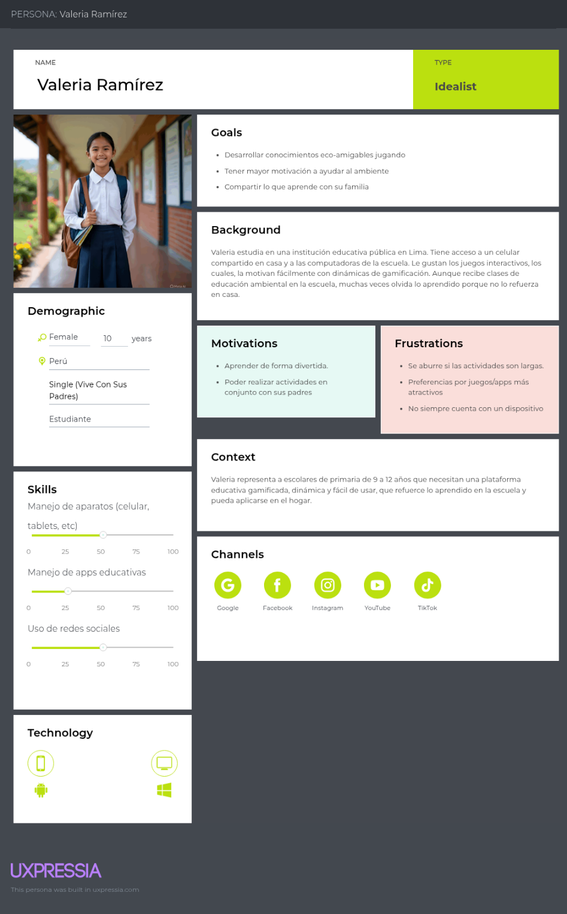

### 2.3.2. User Task Matrix
**Primer Segmento Objetivo (Padres de Familia)**

*Figura 12 (User Task Matrix 1)*  
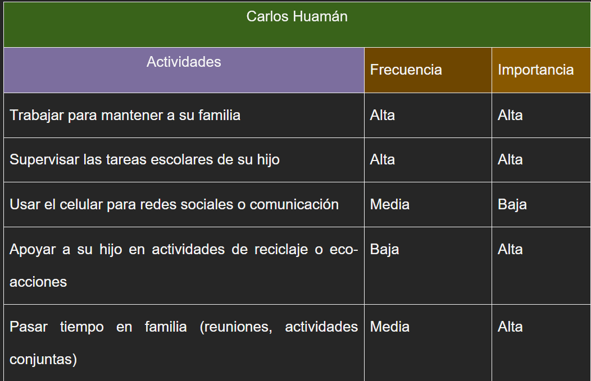

**Segundo Segmento Objetivo (Escolares de primaria)**

*Figura 13 (User Task Matrix 2)*  
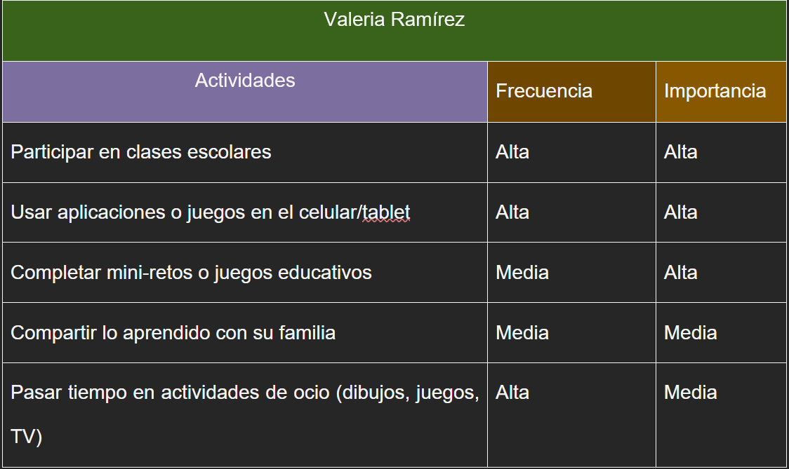

### 2.3.3. User Journey Mapping
**Primer Segmento Objetivo (Padres de Familia)**

*Figura 14 (User Journey Mapping 1)*  
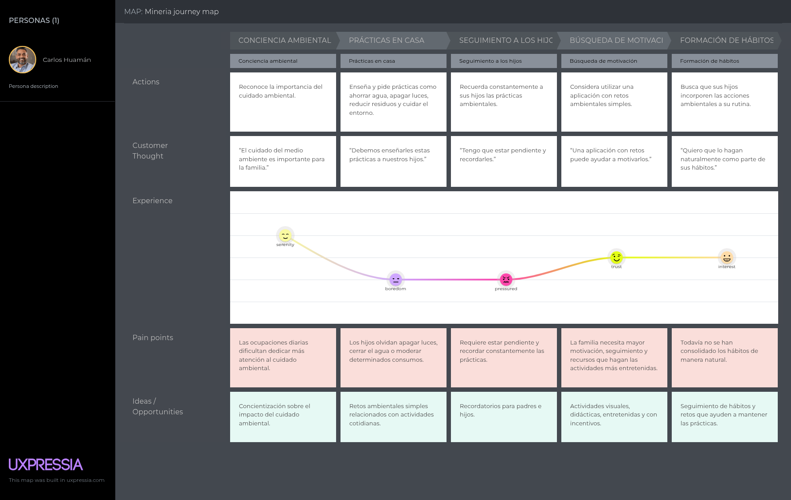

**Segundo Segmento Objetivo (Escolares de primaria)**

*Figura 15 (User Journey Mapping 2)*  
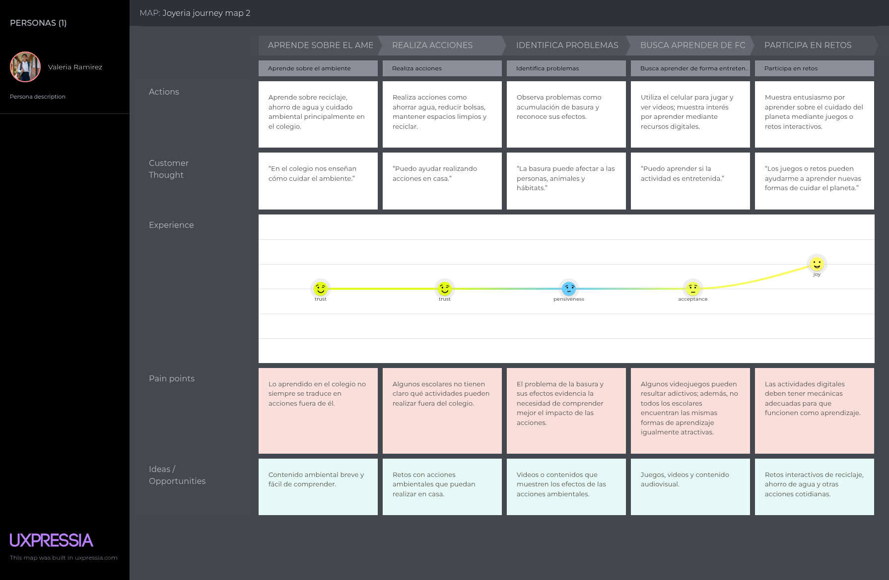

### 2.3.4. Empathy Mapping
**Primer Segmento Objetivo (Padres de Familia)**

*Figura 16 (Empathy Mapping 1)*  
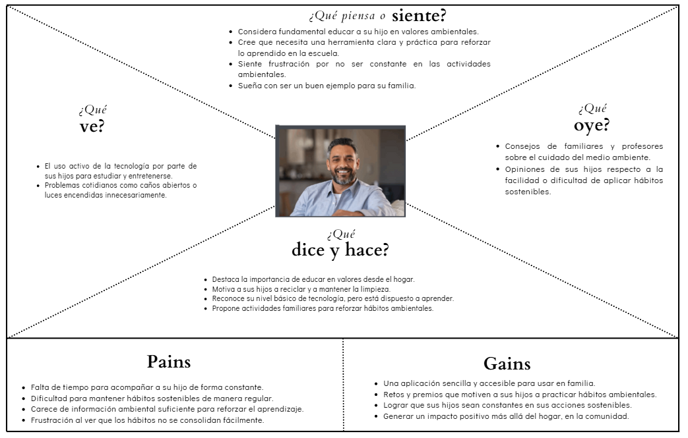

**Segundo Segmento Objetivo (Escolares de primaria)**

*Figura 17 (Empathy Mapping 2)*  
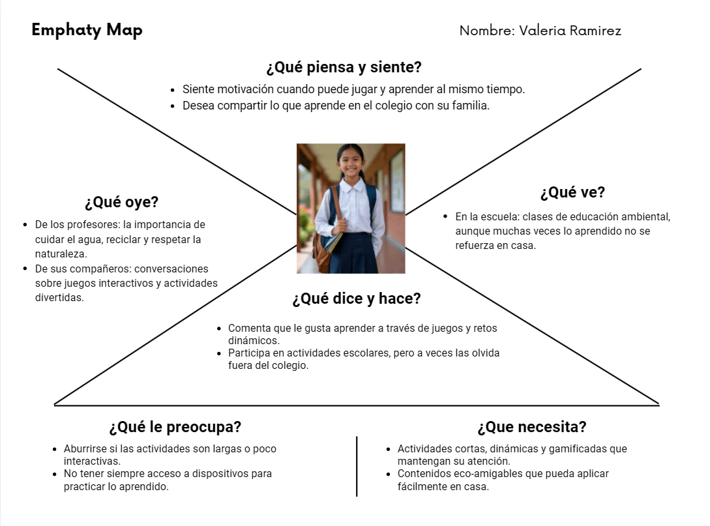

### 2.3.5. Big Picture EventStorming

El equipo realizó una sesión colaborativa de Big Picture EventStorming para comprender el dominio desde una perspectiva general. Durante esta actividad se identificaron los eventos más relevantes y se organizaron según su secuencia dentro de los principales procesos del negocio. Esto permitió visualizar el happy path, reconocer escenarios alternativos y detectar posibles problemas u oportunidades en el funcionamiento de la plataforma.

**Paso 1: Identificación de eventos.** Se identificaron y organizaron los eventos más importantes que ocurren durante la interacción de los usuarios con la plataforma.

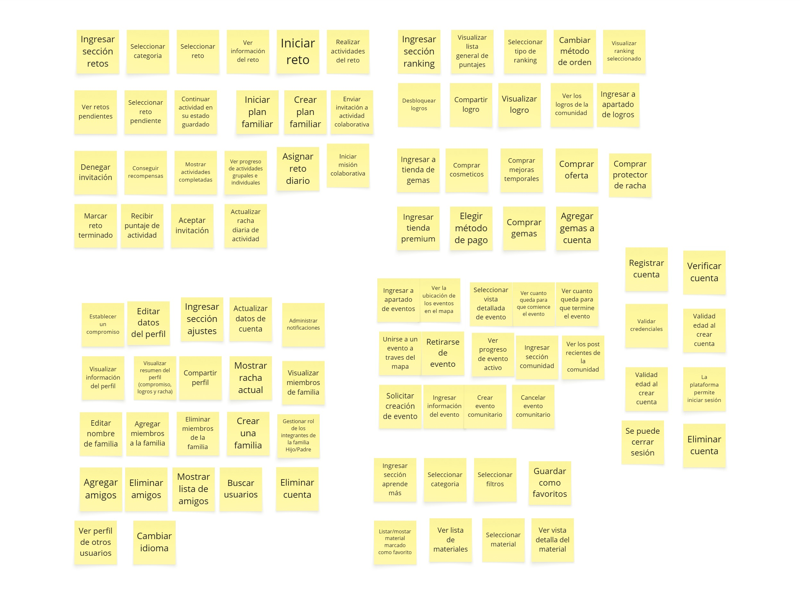

**Paso 2: Organización de los eventos.** Los eventos de dominio identificados se organizaron cronológicamente, comenzando por el happy path, que representa el flujo exitoso principal. Luego, se añadieron escenarios alternativos para mostrar posibles errores, decisiones diferentes y ramificaciones dentro de los procesos de GreenMinds.

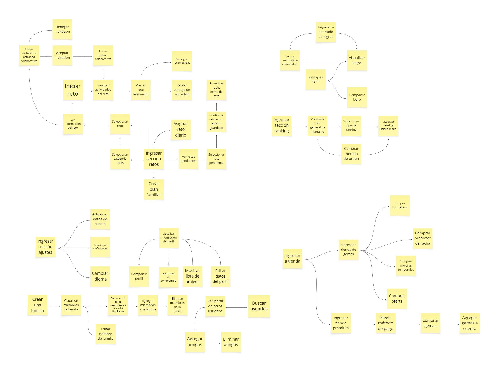
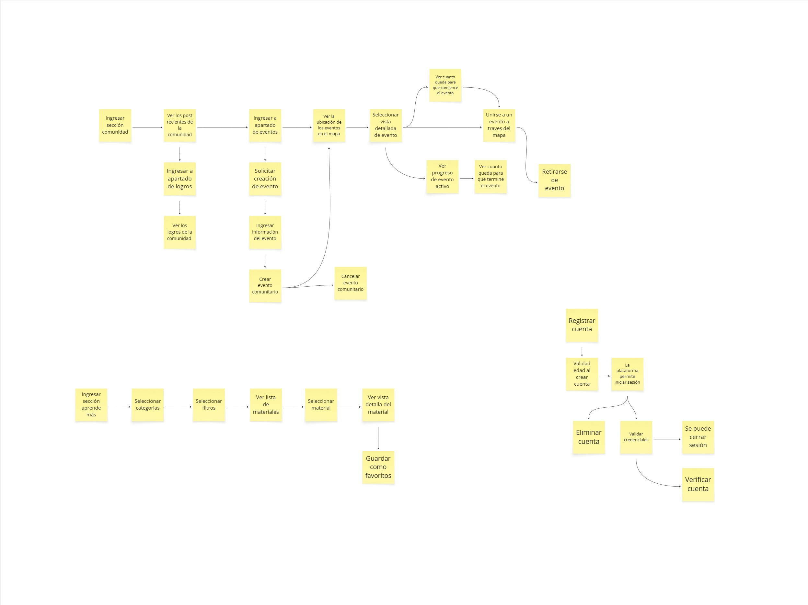

### 2.3.6. Ubiquitous Language

## 2.4. Requirements Specification
### 2.4.1. User Stories

En esta sección se presentan las épicas y user stories definidas para EcoMind, construidas a partir del análisis de la problemática, los segmentos objetivo y las necesidades identificadas durante el proceso de needfinding. Las historias de usuario permiten traducir los requerimientos funcionales y técnicos en unidades de trabajo claras, priorizables y verificables para el equipo de desarrollo.

Cada user story describe una necesidad desde la perspectiva del usuario o del equipo técnico, especificando el valor esperado y los criterios de aceptación necesarios para validar su cumplimiento. Estas historias abarcan los principales módulos de la solución, incluyendo retos gamificados, participación familiar, comunidad, ranking, perfil, monetización, autenticación y servicios backend.

### Épicas

<table align="center">
  <tr>
    <td align="center"><b>Epic ID</b></td>
    <td align="center"><b>Título</b></td>
    <td align="center"><b>Descripción</b></td>
  </tr>
  <tr>
    <td align="center"><b>EP01</b></td>
    <td align="center">Actividades gamificadas</td>
    <td>Como estudiante, quiero acceder a actividades gamificadas sobre cuidado ambiental, para aprender de forma entretenida y mantener mi interés en el tema.</td>
  </tr>
  <tr>
    <td align="center"><b>EP02</b></td>
    <td align="center">Participación familiar</td>
    <td>Como padre, quiero que la aplicación ofrezca actividades y proyectos grupales, para fortalecer la interacción, colaboración y aprendizaje dentro de mi familia.</td>
  </tr>
  <tr>
    <td align="center"><b>EP03</b></td>
    <td align="center">Información clara y amigable</td>
    <td>Como estudiante, quiero acceder a información sencilla y fácil de comprender sobre las actividades, para aprender sin perder la motivación.</td>
  </tr>
  <tr>
    <td align="center"><b>EP04</b></td>
    <td align="center">Acceso a comunidad</td>
    <td>Como estudiante, quiero una sección que me permita interactuar con otros usuarios y compartir logros, para sentir motivación en mejorar continuamente.</td>
  </tr>
  <tr>
    <td align="center"><b>EP05</b></td>
    <td align="center">Accesibilidad</td>
    <td>Como estudiante o padre, quiero que la aplicación funcione de manera rápida, sencilla y accesible en cualquier dispositivo, para contar con una experiencia fluida y agradable en cualquier situación.</td>
  </tr>
  <tr>
    <td align="center"><b>EP06</b></td>
    <td align="center">Landing page informativa</td>
    <td>Como estudiante o padre, quiero acceder a una página informativa de EcoMind, para conocer la propuesta del producto y unirme a la comunidad.</td>
  </tr>
  <tr>
    <td align="center"><b>EP07</b></td>
    <td align="center">Gestión de Usuarios y Autenticación</td>
    <td>Como equipo de desarrollo, necesitamos implementar los servicios de autenticación, registro y gestión de perfiles para soportar el acceso seguro a la plataforma.</td>
  </tr>
  <tr>
    <td align="center"><b>EP08</b></td>
    <td align="center">Backend: Gestión de Retos y Progreso</td>
    <td>Como equipo de desarrollo, necesitamos implementar los endpoints para la gestión de retos, puntajes e insignias, para soportar las funcionalidades gamificadas de la plataforma.</td>
  </tr>
  <tr>
    <td align="center"><b>EP09</b></td>
    <td align="center">Backend: Sincronización y Disponibilidad</td>
    <td>Como equipo de desarrollo, necesitamos implementar la sincronización offline y garantizar la disponibilidad del sistema para soportar el acceso desde zonas con baja conectividad.</td>
  </tr>
  <tr>
  <td align="center"><b>EP010</b></td>
  <td align="center">Monetización: Gestión de compras y recompensas</td>
  <td>Como equipo de desarrollo, necesitamos implementar mecanismos de monetización como la compra de avatares y cosméticos, así como la obtención de recompensas, para generar ingresos y mejorar la experiencia del usuario.</td>
</tr>
  <tr>
  <td align="center"><b>EP011</b></td>
  <td align="center">EP11 - Backend: Gestión de perfil</td>
  <td>Como equipo de desarrollo, necesitamos implementar los servicios de perfil, familia, amistades, progreso e inventario del usuario, para centralizar su información personal y permitir el seguimiento de su evolución dentro de la plataforma.</td>
</tr>
  <tr>
  <td align="center"><b>EP012</b></td>
  <td align="center">EP12 - Backend: Participación comunitaria</td>
  <td>Como equipo de desarrollo, necesitamos implementar los servicios de publicaciones, logros comunitarios, eventos ambientales e inscripción a actividades, para fomentar la interacción entre usuarios y la participación en iniciativas sostenibles.</td>
</tr>
  <tr>
  <td align="center"><b>EP013</b></td>
  <td align="center">EP13 - Backend: Monetización y cosméticos</td>
  <td>Como equipo de desarrollo, necesitamos implementar los servicios de tienda, gemas, compras, cosméticos y potenciadores, para gestionar transacciones, recompensas y personalización del usuario dentro de la aplicación.</td>
</tr>
</table>

### Technical Stories

<table align="center">
  <tr>
    <td><b>Technical Story ID</b></td><td>TS-001</td>
    <td><b>Epic ID</b></td><td>EP07</td>
  </tr>
  <tr>
    <td><b>Título</b></td>
    <td colspan="3">Endpoint de usuarios</td>
  </tr>
  <tr>
    <td><b>Descripción</b></td>
    <td colspan="3">Como desarrollador frontend, necesito consumir los endpoints GET /api/v1/user y PUT /api/v1/user/{id}, para consultar y actualizar la información del usuario, incluyendo ecopoints, gemas y racha.</td>
  </tr>
  <tr>
    <td colspan="4">
      <b>Criterios de aceptación:</b>
      <ol>
        <li>GET /api/v1/user retorna la lista de usuarios registrados en el mock API.</li>
        <li>GET /api/v1/user/{id} retorna la información de un usuario específico.</li>
        <li>PUT /api/v1/user/{id} permite actualizar campos como streak, last_streak_date, gem_balance y ecopoints.</li>
        <li>La respuesta incluye los campos necesarios para mostrar perfil, ranking, racha y balance de gemas.</li>
        <li>La aplicación sincroniza los cambios del usuario después de completar retos o comprar elementos en tienda.</li>
      </ol>
    </td>
  </tr>
</table>

<table align="center">
  <tr>
    <td><b>Technical Story ID</b></td><td>TS-002</td>
    <td><b>Epic ID</b></td><td>EP07</td>
  </tr>
  <tr>
    <td><b>Título</b></td>
    <td colspan="3">Endpoints de familia y miembros familiares</td>
  </tr>
  <tr>
    <td><b>Descripción</b></td>
    <td colspan="3">Como desarrollador frontend, necesito consumir los endpoints GET /api/v1/family y GET /api/v1/family_user, para mostrar la familia del usuario y sus miembros vinculados.</td>
  </tr>
  <tr>
    <td colspan="4">
      <b>Criterios de aceptación:</b>
      <ol>
        <li>GET /api/v1/family retorna las familias registradas en el mock API.</li>
        <li>GET /api/v1/family_user retorna las relaciones entre usuarios y familias.</li>
        <li>GET /api/v1/family_user?user_id={id} permite obtener las relaciones familiares de un usuario específico.</li>
        <li>La respuesta permite identificar el rol del usuario dentro de la familia mediante family_role.</li>
        <li>La aplicación muestra la sección de familia con datos de muestra cuando existen registros relacionados.</li>
      </ol>
    </td>
  </tr>
</table>

<table align="center">
  <tr>
    <td><b>Technical Story ID</b></td><td>TS-003</td>
    <td><b>Epic ID</b></td><td>EP07</td>
  </tr>
  <tr>
    <td><b>Título</b></td>
    <td colspan="3">Endpoint de amigos</td>
  </tr>
  <tr>
    <td><b>Descripción</b></td>
    <td colspan="3">Como desarrollador frontend, necesito consumir el endpoint GET /api/v1/friend, para consultar las relaciones de amistad del usuario y mostrar sus amigos dentro de la aplicación.</td>
  </tr>
  <tr>
    <td colspan="4">
      <b>Criterios de aceptación:</b>
      <ol>
        <li>GET /api/v1/friend retorna las relaciones de amistad registradas.</li>
        <li>GET /api/v1/friend?user_id={id} permite filtrar las amistades iniciadas por un usuario.</li>
        <li>La respuesta incluye user_id, friend_id y status para validar si la amistad está aceptada.</li>
        <li>La aplicación utiliza las amistades aceptadas para mostrar contactos disponibles.</li>
        <li>El endpoint puede ser combinado con GET /api/v1/user para obtener los nombres y datos de los amigos.</li>
      </ol>
    </td>
  </tr>
</table>

<table align="center">
  <tr>
    <td><b>Technical Story ID</b></td><td>TS-004</td>
    <td><b>Epic ID</b></td><td>EP08</td>
  </tr>
  <tr>
    <td><b>Título</b></td>
    <td colspan="3">Endpoints de retos y actividades</td>
  </tr>
  <tr>
    <td><b>Descripción</b></td>
    <td colspan="3">Como desarrollador frontend, necesito consumir GET /api/v1/quest y GET /api/v1/activity, para listar retos ambientales, identificar su tipo y mostrar las actividades asociadas.</td>
  </tr>
  <tr>
    <td colspan="4">
      <b>Criterios de aceptación:</b>
      <ol>
        <li>GET /api/v1/quest retorna los retos disponibles con id, category, title, type y recompensas.</li>
        <li>GET /api/v1/quest?category={category} permite filtrar retos por categoría, como energy, water, recycle o daily_quest.</li>
        <li>GET /api/v1/activity retorna las actividades asociadas a los retos.</li>
        <li>GET /api/v1/activity?quest_id={id} permite obtener las actividades de un reto específico.</li>
        <li>La aplicación utiliza el campo type para distinguir retos de actividades, minijuegos y colaborativos.</li>
      </ol>
    </td>
  </tr>
</table>

<table align="center">
  <tr>
    <td><b>Technical Story ID</b></td><td>TS-005</td>
    <td><b>Epic ID</b></td><td>EP08</td>
  </tr>
  <tr>
    <td><b>Título</b></td>
    <td colspan="3">Endpoints de progreso de retos y actividades</td>
  </tr>
  <tr>
    <td><b>Descripción</b></td>
    <td colspan="3">Como desarrollador frontend, necesito consumir los endpoints /api/v1/quest_user y /api/v1/activity_user, para registrar el inicio, progreso, abandono y finalización de retos del usuario.</td>
  </tr>
  <tr>
    <td colspan="4">
      <b>Criterios de aceptación:</b>
      <ol>
        <li>GET /api/v1/quest_user?user_id={id} retorna el progreso de retos del usuario.</li>
        <li>POST /api/v1/quest_user crea un registro cuando el usuario inicia un reto.</li>
        <li>PUT /api/v1/quest_user/{id} actualiza status, progress y end_date al completar un reto.</li>
        <li>DELETE /api/v1/quest_user/{id} elimina un reto activo cuando el usuario lo abandona o cuando caduca el reto diario.</li>
        <li>GET, POST, PUT y DELETE sobre /api/v1/activity_user permiten gestionar el progreso de actividades individuales.</li>
      </ol>
    </td>
  </tr>
</table>

<table align="center">
  <tr>
    <td><b>Technical Story ID</b></td><td>TS-006</td>
    <td><b>Epic ID</b></td><td>EP08</td>
  </tr>
  <tr>
    <td><b>Título</b></td>
    <td colspan="3">Endpoints de logros de usuario y comunidad</td>
  </tr>
  <tr>
    <td><b>Descripción</b></td>
    <td colspan="3">Como desarrollador frontend, necesito consumir GET /api/v1/achievement, GET /api/v1/user_achievement y GET /api/v1/community_achievement, para mostrar los logros disponibles y desbloqueados.</td>
  </tr>
  <tr>
    <td colspan="4">
      <b>Criterios de aceptación:</b>
      <ol>
        <li>GET /api/v1/achievement retorna los logros disponibles.</li>
        <li>GET /api/v1/user_achievement?user_id={id} retorna los logros desbloqueados por un usuario.</li>
        <li>GET /api/v1/community_achievement?community_id={id} retorna los logros obtenidos por una comunidad.</li>
        <li>Las respuestas permiten relacionar achievement_id con los datos del logro correspondiente.</li>
        <li>La aplicación muestra logros de usuario y comunidad cuando existen registros en el mock API.</li>
      </ol>
    </td>
  </tr>
</table>

<table align="center">
  <tr>
    <td><b>Technical Story ID</b></td><td>TS-007</td>
    <td><b>Epic ID</b></td><td>EP08</td>
  </tr>
  <tr>
    <td><b>Título</b></td>
    <td colspan="3">Endpoints de ranking semanal</td>
  </tr>
  <tr>
    <td><b>Descripción</b></td>
    <td colspan="3">Como desarrollador frontend, necesito consumir GET /api/v1/ranking, GET /api/v1/user y GET /api/v1/ecopoint_transaction, para calcular y mostrar el ranking semanal de usuarios.</td>
  </tr>
  <tr>
    <td colspan="4">
      <b>Criterios de aceptación:</b>
      <ol>
        <li>GET /api/v1/ranking retorna los tipos de ranking disponibles.</li>
        <li>GET /api/v1/user retorna los usuarios participantes y sus ecopoints acumulados.</li>
        <li>GET /api/v1/ecopoint_transaction retorna las transacciones usadas para calcular rankings por periodo.</li>
        <li>La aplicación calcula el ranking semanal filtrando transacciones por rango de fechas.</li>
        <li>El panel de retos muestra la posición semanal del usuario actual a partir del ranking calculado.</li>
      </ol>
    </td>
  </tr>
</table>

<table align="center">
  <tr>
    <td><b>Technical Story ID</b></td><td>TS-008</td>
    <td><b>Epic ID</b></td><td>EP09</td>
  </tr>
  <tr>
    <td><b>Título</b></td>
    <td colspan="3">Servicio de notificaciones push</td>
  </tr>
  <tr>
    <td><b>Descripción</b></td>
    <td colspan="3">Como desarrollador backend, necesito implementar un servicio de notificaciones push que envíe alertas de actividades, recordatorios y logros a los dispositivos registrados, para soportar las funcionalidades de alertas de la plataforma.</td>
  </tr>
  <tr>
    <td colspan="4">
      <b>Criterios de aceptación:</b>
      <ol>
        <li>El servicio soporta el registro de tokens de dispositivo (FCM para Android, APNs para iOS).</li>
        <li>Las notificaciones se envían para: nuevos retos disponibles, recordatorios de materiales pendientes, desbloqueo de insignias y resumen semanal de progreso.</li>
        <li>El usuario puede habilitar/deshabilitar categorías de notificaciones desde su perfil.</li>
        <li>Las preferencias de notificación se persisten en base de datos y se respetan en cada envío.</li>
      </ol>
    </td>
  </tr>
</table>

<table align="center">
  <tr>
    <td><b>Technical Story ID</b></td><td>TS-009</td>
    <td><b>Epic ID</b></td><td>EP011</td>
  </tr>
  <tr>
    <td><b>Título</b></td>
    <td colspan="3">Endpoint de resumen y edición de perfil</td>
  </tr>
  <tr>
    <td><b>Descripción</b></td>
    <td colspan="3">Como desarrollador backend, necesito implementar los endpoints GET /api/v1/user/{userId}, GET /api/v1/user_cosmetic y POST /api/v1/user_cosmetic, para permitir la consulta del resumen del perfil y el registro de cosméticos seleccionados por el usuario.</td>
  </tr>
  <tr>
    <td colspan="4">
      <b>Criterios de aceptación:</b>
      <ol>
        <li>GET /api/v1/user/{userId} retorna los datos principales del usuario, incluyendo nombre, ecopoints, gemas y racha.</li>
        <li>GET /api/v1/user_cosmetic retorna los cosméticos asociados a los perfiles de usuario.</li>
        <li>GET /api/v1/user_cosmetic/{userCosmeticId} retorna el detalle de un cosmético asignado a un usuario.</li>
        <li>POST /api/v1/user_cosmetic registra un nuevo cosmético dentro del perfil del usuario cuando corresponde.</li>
        <li>La respuesta permite refrescar el resumen visual del perfil sin modificar las tablas anteriores del sistema.</li>
      </ol>
    </td>
  </tr>
</table>

<table align="center">
  <tr>
    <td><b>Technical Story ID</b></td><td>TS-010</td>
    <td><b>Epic ID</b></td><td>EP011</td>
  </tr>
  <tr>
    <td><b>Título</b></td>
    <td colspan="3">Endpoint de progreso del perfil</td>
  </tr>
  <tr>
    <td><b>Descripción</b></td>
    <td colspan="3">Como desarrollador backend, necesito implementar los endpoints GET /api/v1/quest-users/user/{userId}/status/{status}, GET /api/v1/activity-users/quest-user/{questUserId} y GET /api/v1/gem_movement, para exponer el avance del usuario dentro de su perfil.</td>
  </tr>
  <tr>
    <td colspan="4">
      <b>Criterios de aceptación:</b>
      <ol>
        <li>GET /api/v1/quest-users/user/{userId}/status/{status} retorna los retos del usuario filtrados por estado.</li>
        <li>GET /api/v1/activity-users/quest-user/{questUserId} retorna las actividades asociadas a un reto asignado.</li>
        <li>GET /api/v1/activity-users/quest-user/{questUserId}/activity/{activityId} retorna el avance de una actividad específica.</li>
        <li>GET /api/v1/gem_movement permite consultar movimientos de gemas relacionados con recompensas obtenidas.</li>
        <li>La información obtenida permite construir el resumen de progreso del perfil con actividades, retos y recompensas.</li>
      </ol>
    </td>
  </tr>
</table>

<table align="center">
  <tr>
    <td><b>Technical Story ID</b></td><td>TS-011</td>
    <td><b>Epic ID</b></td><td>EP011</td>
  </tr>
  <tr>
    <td><b>Título</b></td>
    <td colspan="3">Endpoint de familia y amigos del perfil</td>
  </tr>
  <tr>
    <td><b>Descripción</b></td>
    <td colspan="3">Como desarrollador backend, necesito implementar los endpoints GET /api/v1/family, GET /api/v1/family_user y GET /api/v1/friend, para exponer la familia y amigos vinculados al perfil del usuario.</td>
  </tr>
  <tr>
    <td colspan="4">
      <b>Criterios de aceptación:</b>
      <ol>
        <li>GET /api/v1/family retorna las familias registradas en el sistema.</li>
        <li>GET /api/v1/family_user permite identificar los usuarios asociados a cada grupo familiar.</li>
        <li>GET /api/v1/friend retorna las relaciones de amistad registradas para mostrar contactos del usuario.</li>
        <li>La respuesta permite diferenciar miembros familiares y amigos dentro de la vista de perfil.</li>
        <li>Si no existen relaciones registradas, la interfaz muestra estados vacíos sin interrumpir la navegación del usuario.</li>
      </ol>
    </td>
  </tr>
</table>

<table align="center">
  <tr>
    <td><b>Technical Story ID</b></td><td>TS-012</td>
    <td><b>Epic ID</b></td><td>EP012</td>
  </tr>
  <tr>
    <td><b>Título</b></td>
    <td colspan="3">Endpoint de interacción comunitaria</td>
  </tr>
  <tr>
    <td><b>Descripción</b></td>
    <td colspan="3">Como desarrollador backend, necesito implementar los endpoints GET /api/v1/community/posts, POST /api/v1/community/posts y DELETE /api/v1/community/posts/{id}, para gestionar publicaciones dentro de la comunidad.</td>
  </tr>
  <tr>
    <td colspan="4">
      <b>Criterios de aceptación:</b>
      <ol>
        <li>GET /api/v1/community/posts retorna las publicaciones comunitarias disponibles.</li>
        <li>POST /api/v1/community/posts permite crear una nueva publicación asociada a la comunidad.</li>
        <li>DELETE /api/v1/community/posts/{id} permite eliminar una publicación existente cuando corresponde.</li>
        <li>La respuesta incluye información suficiente para actualizar el muro comunitario.</li>
        <li>Si no existen publicaciones, el sistema retorna una lista vacía para mostrar un estado inicial en la comunidad.</li>
      </ol>
    </td>
  </tr>
</table>

<table align="center">
  <tr>
    <td><b>Technical Story ID</b></td><td>TS-013</td>
    <td><b>Epic ID</b></td><td>EP012</td>
  </tr>
  <tr>
    <td><b>Título</b></td>
    <td colspan="3">Endpoint de eventos comunitarios y participación</td>
  </tr>
  <tr>
    <td><b>Descripción</b></td>
    <td colspan="3">Como desarrollador backend, necesito implementar los endpoints GET /api/v1/community/events, POST /api/v1/community/events, GET /api/v1/community/events/{eventId}/registrations y POST /api/v1/community/events/{eventId}/registrations, para listar eventos ambientales y registrar la participación de los usuarios.</td>
  </tr>
  <tr>
    <td colspan="4">
      <b>Criterios de aceptación:</b>
      <ol>
        <li>GET /api/v1/community/events retorna los eventos comunitarios disponibles.</li>
        <li>POST /api/v1/community/events permite crear un nuevo evento comunitario.</li>
        <li>GET /api/v1/community/events/{eventId}/registrations retorna las inscripciones registradas para un evento.</li>
        <li>POST /api/v1/community/events/{eventId}/registrations registra la participación de un usuario en el evento.</li>
        <li>PATCH /api/v1/community/events/{eventId}/registrations/{registrationId}/cancel permite cancelar una inscripción existente.</li>
      </ol>
    </td>
  </tr>
</table>

<table align="center">
  <tr>
    <td><b>Technical Story ID</b></td><td>TS-014</td>
    <td><b>Epic ID</b></td><td>EP013</td>
  </tr>
  <tr>
    <td><b>Título</b></td>
    <td colspan="3">Endpoint de catálogo y compra de cosméticos</td>
  </tr>
  <tr>
    <td><b>Descripción</b></td>
    <td colspan="3">Como desarrollador backend, necesito implementar los endpoints GET /api/v1/cosmetic, GET /api/v1/cosmetic/{cosmeticId}, GET /api/v1/user_cosmetic y POST /api/v1/user_cosmetic, para exponer el catálogo de cosméticos y registrar cosméticos adquiridos por el usuario.</td>
  </tr>
  <tr>
    <td colspan="4">
      <b>Criterios de aceptación:</b>
      <ol>
        <li>GET /api/v1/cosmetic retorna todos los cosméticos disponibles en el catálogo.</li>
        <li>GET /api/v1/cosmetic/{cosmeticId} retorna el detalle de un cosmético específico.</li>
        <li>GET /api/v1/user_cosmetic retorna los cosméticos asociados a usuarios.</li>
        <li>POST /api/v1/user_cosmetic registra un nuevo cosmético adquirido por el usuario.</li>
        <li>La respuesta permite actualizar el inventario visual del usuario dentro del perfil.</li>
      </ol>
    </td>
  </tr>
</table>

<table align="center">
  <tr>
    <td><b>Technical Story ID</b></td><td>TS-015</td>
    <td><b>Epic ID</b></td><td>EP013</td>
  </tr>
  <tr>
    <td><b>Título</b></td>
    <td colspan="3">Endpoint de compra de gemas</td>
  </tr>
  <tr>
    <td><b>Descripción</b></td>
    <td colspan="3">Como desarrollador backend, necesito implementar los endpoints GET /api/v1/gem_purchase, POST /api/v1/gem_purchase, GET /api/v1/gem_movement, POST /api/v1/gem_movement y GET /api/v1/multiplier, para registrar compras de gemas y exponer los potenciadores disponibles.</td>
  </tr>
  <tr>
    <td colspan="4">
      <b>Criterios de aceptación:</b>
      <ol>
        <li>GET /api/v1/gem_purchase retorna todas las compras de gemas registradas.</li>
        <li>POST /api/v1/gem_purchase permite crear una nueva compra de gemas.</li>
        <li>GET /api/v1/gem_movement retorna los movimientos de gemas asociados a compras o recompensas.</li>
        <li>POST /api/v1/gem_movement registra un nuevo movimiento de gemas cuando la compra se completa.</li>
        <li>GET /api/v1/multiplier retorna los multiplicadores disponibles para mostrarlos como potenciadores dentro de la tienda.</li>
      </ol>
    </td>
  </tr>
</table>

<table align="center">
  <tr>
    <td><b>Technical Story ID</b></td><td>TS-016</td>
    <td><b>Epic ID</b></td><td>EP09</td>
  </tr>
  <tr>
    <td><b>Título</b></td>
    <td colspan="3">Endpoint de notificaciones del usuario</td>
  </tr>
  <tr>
    <td><b>Descripción</b></td>
    <td colspan="3">Como desarrollador backend, necesito implementar los endpoints GET /api/v1/notification, POST /api/v1/notification, PATCH /api/v1/notification/{notificationId}/read, PATCH /api/v1/notification/read-all y GET /api/v1/notification/unread-count, para registrar, consultar y gestionar las notificaciones del usuario.</td>
  </tr>
  <tr>
    <td colspan="4">
      <b>Criterios de aceptación:</b>
      <ol>
        <li>GET /api/v1/notification retorna las notificaciones asociadas al usuario.</li>
        <li>POST /api/v1/notification permite crear una nueva notificación para recordatorios, logros, retos diarios o eventos comunitarios.</li>
        <li>PATCH /api/v1/notification/{notificationId}/read marca una notificación específica como leída.</li>
        <li>PATCH /api/v1/notification/read-all marca todas las notificaciones del usuario como leídas.</li>
        <li>GET /api/v1/notification/unread-count retorna la cantidad de notificaciones no leídas.</li>
      </ol>
    </td>
  </tr>
</table>

<table align="center">
  <tr>
    <td><b>Technical Story ID</b></td><td>TS-017</td>
    <td><b>Epic ID</b></td><td>EP010</td>
  </tr>
  <tr>
    <td><b>Título</b></td>
    <td colspan="3">Endpoint de materiales de aprendizaje</td>
  </tr>
  <tr>
    <td><b>Descripción</b></td>
    <td colspan="3">Como desarrollador backend, necesito implementar los endpoints GET /api/v1/educational-materials, GET /api/v1/educational-materials/{materialId}, POST /api/v1/educational-materials, PUT /api/v1/educational-materials/{materialId}, DELETE /api/v1/educational-materials/{materialId}, POST /api/v1/educational-materials/{materialId}/favorite y GET /api/v1/educational-materials/search, para gestionar materiales educativos dentro de la plataforma.</td>
  </tr>
  <tr>
    <td colspan="4">
      <b>Criterios de aceptación:</b>
      <ol>
        <li>GET /api/v1/educational-materials retorna todos los materiales educativos registrados.</li>
        <li>GET /api/v1/educational-materials/{materialId} retorna el detalle de un material educativo por identificador.</li>
        <li>POST /api/v1/educational-materials permite crear un nuevo material educativo.</li>
        <li>PUT /api/v1/educational-materials/{materialId} actualiza la información de un material educativo existente.</li>
        <li>DELETE /api/v1/educational-materials/{materialId} elimina un material educativo cuando corresponde.</li>
        <li>POST /api/v1/educational-materials/{materialId}/favorite permite marcar o desmarcar un material como favorito.</li>
        <li>GET /api/v1/educational-materials/search permite buscar materiales educativos según criterios definidos.</li>
      </ol>
    </td>
  </tr>
</table>

<table align="center">
  <tr>
    <td><b>Technical Story ID</b></td><td>TS-018</td>
    <td><b>Epic ID</b></td><td>EP012</td>
  </tr>
  <tr>
    <td><b>Título</b></td>
    <td colspan="3">Endpoint de metas comunitarias y chat temporal</td>
  </tr>
  <tr>
    <td><b>Descripción</b></td>
    <td colspan="3">Como desarrollador backend, necesito implementar los endpoints para gestionar metas comunitarias y chats temporales asociados a eventos, para soportar la participación comunitaria y la coordinación de actividades.</td>
  </tr>
  <tr>
    <td colspan="4">
      <b>Criterios de aceptación:</b>
      <ol>
        <li>Los endpoints permiten consultar las metas comunitarias disponibles dentro de una comunidad.</li>
        <li>Los endpoints permiten crear metas comunitarias a partir de opciones estandarizadas y calcular su cantidad objetivo según los miembros inscritos.</li>
        <li>Los endpoints permiten registrar y validar la inscripción de un usuario en una meta comunitaria, considerando el límite de 3 metas activas y la racha mínima de 5 días.</li>
        <li>Al crear un evento comunitario, el sistema genera un chat temporal asociado exclusivamente a dicho evento.</li>
        <li>Al registrar la inscripción de un usuario en un evento, el sistema lo agrega al chat temporal correspondiente.</li>
      </ol>
    </td>
  </tr>
</table>

### User Stories

<table align="center">
  <tr>
    <td><b>User Story ID</b></td><td>HU-001</td>
    <td><b>Epic ID</b></td><td>EP01</td>
  </tr>
  <tr>
    <td><b>Título</b></td>
    <td colspan="3">Miniactividad guiada con indicaciones</td>
  </tr>
  <tr>
    <td><b>Descripción</b></td>
    <td colspan="3">Como estudiante, quiero completar miniactividades guiadas con indicaciones claras, para aprender de forma entretenida dentro de la aplicación.</td>
  </tr>
  <tr>
    <td colspan="4">
      <b>Criterios de aceptación:</b>  
      <b>Escenario 1:</b> Ver miniactividad 
      <ul>
        <li><b>Dado que</b> el estudiante se encuentra en el menú principal,</li>
        <li><b>Cuando</b> elige una miniactividad,</li>
        <li><b>Entonces</b> la aplicación le muestra un resumen de la miniactividad.</li>
      </ul>
      <b>Escenario 2:</b> Iniciar miniactividad 
      <ul>
        <li><b>Dado que</b> el estudiante está viendo una miniactividad,</li>
        <li><b>Cuando</b> elige "iniciar actividad",</li>
        <li><b>Entonces</b> la aplicación marca la miniactividad como activa,</li>
        <li><b>Y</b> muestra un mensaje motivador de inicio.</li>
      </ul>
      <b>Escenario 3:</b> Miniactividad completada correctamente 
      <ul>
        <li><b>Dado que</b> el estudiante inicia una miniactividad y sigue todas las indicaciones mostradas en la pantalla,</li>
        <li><b>Cuando</b> registra que realizó cada paso correctamente,</li>
        <li><b>Entonces</b> la aplicación aprueba su trabajo,</li>
        <li><b>Y</b> muestra un mensaje motivador al finalizar.</li>
      </ul>
      <b>Escenario 4:</b> Miniactividad incompleta 
      <ul>
        <li><b>Dado que</b> el estudiante inicia una miniactividad y omite algunas indicaciones,</li>
        <li><b>Cuando</b> el estudiante intenta finalizar la miniactividad,</li>
        <li><b>Entonces</b> la aplicación no permite marcar como completado</li>
      </ul>
      <b>Escenario 5:</b> Eliminar miniactividad 
      <ul>
        <li><b>Dado que</b> el estudiante se encuentra en la sección de actividades activas y elige una miniactividad,</li>
        <li><b>Cuando</b> selecciona "eliminar actividad" y confirma su selección,</li>
        <li><b>Entonces</b> el sistema elimina la miniactividad de las actividades activas del usuario.</li>
      </ul>
    </td>
  </tr>
</table>

<table align="center">
  <tr>
    <td><b>User Story ID</b></td><td>HU-002</td>
    <td><b>Epic ID</b></td><td>EP01</td>
  </tr>
  <tr>
    <td><b>Título</b></td>
    <td colspan="3">Reto ambiental diario</td>
  </tr>
  <tr>
    <td><b>Descripción</b></td>
    <td colspan="3">Como estudiante, quiero realizar un reto ambiental diario en casa o escuela, para aplicar lo aprendido fuera de la aplicación.</td>
  </tr>
  <tr>
    <td colspan="4">
      <b>Criterios de aceptación:</b>  
      <b>Escenario 1:</b> Reto diario completado con éxito 
      <ul>
        <li><b>Dado que</b> el estudiante realiza el reto diario y cumple las indicaciones establecidas,</li>
        <li><b>Cuando</b> registra su resultado,</li>
        <li><b>Entonces</b> la aplicación valida la acción,</li>
        <li><b>Y</b> muestra un reconocimiento visual o puntos obtenidos.</li>
      </ul>
      <b>Escenario 2:</b> Actualización del reto diario 
      <ul>
        <li><b>Dado que</b> el estudiante no realiza el reto diario,</li>
        <li><b>Cuando</b> el tiempo establecido caduca,</li>
        <li><b>Entonces</b> la aplicación cambia el reto diario.</li>
      </ul>
    </td>
  </tr>
</table>

<table align="center">
  <tr>
    <td><b>User Story ID</b></td><td>HU-003</td>
    <td><b>Epic ID</b></td><td>EP01</td>
  </tr>
  <tr>
    <td><b>Título</b></td>
    <td colspan="3">Rachas por completar retos diarios</td>
  </tr>
  <tr>
    <td><b>Descripción</b></td>
    <td colspan="3">Como estudiante, quiero que mi racha aumente al completar un reto diario, para motivarme a mantener hábitos sostenibles de forma constante.</td>
  </tr>
  <tr>
    <td colspan="4">
      <b>Criterios de aceptación:</b>  
      <b>Escenario 1:</b> Incremento de racha al completar un reto diario 
      <ul>
        <li><b>Dado que</b> el estudiante tiene un reto diario asignado,</li>
        <li><b>Cuando</b> completa el reto diario por primera vez en el día,</li>
        <li><b>Entonces</b> la aplicación incrementa su racha en una unidad.</li>
      </ul>
      <b>Escenario 2:</b> Restricción de incremento una vez por día 
      <ul>
        <li><b>Dado que</b> el estudiante ya incrementó su racha durante el día actual,</li>
        <li><b>Cuando</b> completa otro reto el mismo día,</li>
        <li><b>Entonces</b> la aplicación mantiene el valor de la racha sin incrementarlo nuevamente.</li>
      </ul>
      <b>Escenario 3:</b> Visualización de racha actualizada 
      <ul>
        <li><b>Dado que</b> el estudiante completó un reto diario correctamente,</li>
        <li><b>Cuando</b> regresa al panel principal de retos,</li>
        <li><b>Entonces</b> la aplicación muestra la racha actualizada del usuario.</li>
      </ul>
    </td>
  </tr>
</table>

<table align="center">
  <tr>
    <td><b>User Story ID</b></td><td>HU-004</td>
    <td><b>Epic ID</b></td><td>EP01</td>
  </tr>
  <tr>
    <td><b>Título</b></td>
    <td colspan="3">Sistema de puntos por aprendizaje</td>
  </tr>
  <tr>
    <td><b>Descripción</b></td>
    <td colspan="3">Como estudiante, quiero obtener puntos al completar actividades, para mantener mi motivación dentro de la aplicación.</td>
  </tr>
  <tr>
    <td colspan="4">
      <b>Criterios de aceptación:</b>  
      <b>Escenario 1:</b> Puntos brindados exitosamente 
      <ul>
        <li><b>Dado que</b> el estudiante culmina una actividad exitosamente,</li>
        <li><b>Entonces</b> el sistema le brindará el puntaje correspondiente a la actividad,</li>
        <li><b>Y</b> lo actualizará en el sistema.</li>
      </ul>
      <b>Escenario 2:</b> Problema en brindado de puntaje 
      <ul>
        <li><b>Dado que</b> el estudiante culmina alguna actividad,</li>
        <li><b>Cuando</b> el sistema presenta un problema al asignar el puntaje,</li>
        <li><b>Entonces</b> el sistema mostrará un mensaje de error,</li>
        <li><b>Y</b> deshará la culminación de la actividad.</li>
      </ul>
    </td>
  </tr>
</table>

<table align="center">
  <tr>
    <td><b>User Story ID</b></td><td>HU-005</td>
    <td><b>Epic ID</b></td><td>EP01</td>
  </tr>
  <tr>
    <td><b>Título</b></td>
    <td colspan="3">Reconocimiento por constancia</td>
  </tr>
  <tr>
    <td><b>Descripción</b></td>
    <td colspan="3">Como estudiante, quiero recibir reconocimientos al completar varias actividades seguidas, para reforzar mi compromiso con el aprendizaje.</td>
  </tr>
  <tr>
    <td colspan="4">
      <b>Criterios de aceptación:</b>  
      <b>Escenario 1:</b> Bono de puntos por constancia 
      <ul>
        <li><b>Dado que</b> el estudiante entra de forma diaria a la aplicación y ha culminado exitosamente sus actividades,</li>
        <li><b>Cuando</b> llegue a 7 días seguidos,</li>
        <li><b>Entonces</b> el sistema le brindará un bono de puntos incremental por semana.</li>
      </ul>
    </td>
  </tr>
</table>

<table align="center">
  <tr>
    <td><b>User Story ID</b></td><td>HU-006</td>
    <td><b>Epic ID</b></td><td>EP01</td>
  </tr>
  <tr>
    <td><b>Título</b></td>
    <td colspan="3">Establecimiento de compromiso</td>
  </tr>
  <tr>
    <td><b>Descripción</b></td>
    <td colspan="3">Como estudiante, quiero establecer compromisos individuales, para mantenerme constante.</td>
  </tr>
  <tr>
    <td colspan="4">
      <b>Criterios de aceptación:</b>  
      <b>Escenario 1:</b> Agregar compromisos 
      <ul>
        <li><b>Dado que</b> el usuario se encuentra en su perfil de usuario y selecciona "Agregar compromiso",</li>
        <li><b>Cuando</b> registra su compromiso y valida su elección,</li>
        <li><b>Entonces</b> la aplicación agrega su compromiso al perfil del usuario.</li>
      </ul>
      <b>Escenario 2:</b> Editar compromisos 
      <ul>
        <li><b>Dado que</b> el usuario se encuentra en su perfil y hace tap/click en su compromiso y lo selecciona,</li>
        <li><b>Cuando</b> edita el compromiso y valida su elección,</li>
        <li><b>Entonces</b> la aplicación edita el compromiso seleccionado.</li>
      </ul>
    </td>
  </tr>
</table>

<table align="center">
  <tr>
    <td><b>User Story ID</b></td><td>HU-007</td>
    <td><b>Epic ID</b></td><td>EP01</td>
  </tr>
  <tr>
    <td><b>Título</b></td>
    <td colspan="3">Seguimiento de progreso</td>
  </tr>
  <tr>
    <td><b>Descripción</b></td>
    <td colspan="3">Como estudiante, quiero ver mi progreso de actividades iniciadas, para saber cuánto he avanzado en ellas.</td>
  </tr>
  <tr>
    <td colspan="4">
      <b>Criterios de aceptación:</b>  
      <b>Escenario 1:</b> Ver el progreso de actividades 
      <ul>
        <li><b>Dado que</b> el usuario está en el menú principal,</li>
        <li><b>Cuando</b> el usuario selecciona "Progreso",</li>
        <li><b>Entonces</b> el sistema mostrará una lista con todas las actividades iniciadas y el progreso de cada una.</li>
      </ul>
      <b>Escenario 2:</b> No hay actividades 
      <ul>
        <li><b>Dado que</b> el usuario está en el menú principal,</li>
        <li><b>Cuando</b> el usuario selecciona "Actividades activas",</li>
        <li><b>Entonces</b> el sistema mostrará el mensaje: "No tienes ninguna actividad activa".</li>
      </ul>
    </td>
  </tr>
</table>

<table align="center">
  <tr>
    <td><b>User Story ID</b></td><td>HU-008</td>
    <td><b>Epic ID</b></td><td>EP01</td>
  </tr>
  <tr>
    <td><b>Título</b></td>
    <td colspan="3">Animaciones de logro</td>
  </tr>
  <tr>
    <td><b>Descripción</b></td>
    <td colspan="3">Como estudiante, quiero ver animaciones motivadoras al aprobar una actividad, para sentir satisfacción por mi esfuerzo.</td>
  </tr>
  <tr>
    <td colspan="4">
      <b>Criterios de aceptación:</b>  
      <b>Escenario 1:</b> Animación por actividad exitosa 
      <ul>
        <li><b>Dado que</b> el estudiante selecciona una actividad,</li>
        <li><b>Cuando</b> la realiza de forma exitosa,</li>
        <li><b>Entonces</b> el sistema mostrará una animación especial de celebración.</li>
      </ul>
    </td>
  </tr>
</table>

<table align="center">
  <tr>
    <td><b>User Story ID</b></td><td>HU-009</td>
    <td><b>Epic ID</b></td><td>EP01</td>
  </tr>
  <tr>
    <td><b>Título</b></td>
    <td colspan="3">Ranking educativo</td>
  </tr>
  <tr>
    <td><b>Descripción</b></td>
    <td colspan="3">Como usuario, quiero ver un ranking de los mejores puntajes, para compararme de forma sana con otros usuarios.</td>
  </tr>
  <tr>
    <td colspan="4">
      <b>Criterios de aceptación:</b>  
      <b>Escenario 1:</b> Ver Ranking 
      <ul>
        <li><b>Dado que</b> el usuario ha realizado alguna actividad en la última semana,</li>
        <li><b>Cuando</b> el usuario selecciona el "Ranking",</li>
        <li><b>Entonces</b> el sistema mostrará el ranking de puntos de la comunidad y amigos del usuario,</li>
        <li><b>Y</b> la posición del usuario.</li>
      </ul>
      <b>Escenario 2:</b> Impedimento de acceso al ranking 
      <ul>
        <li><b>Dado que</b> el usuario no ha realizado alguna actividad,</li>
        <li><b>Cuando</b> el usuario selecciona el "Ranking",</li>
        <li><b>Entonces</b> el sistema mostrará el mensaje: "Para acceder al ranking debes realizar una actividad!".</li>
      </ul>
    </td>
  </tr>
</table>

<table align="center">
  <tr>
    <td><b>User Story ID</b></td><td>HU-010</td>
    <td><b>Epic ID</b></td><td>EP01</td>
  </tr>
  <tr>
    <td><b>Título</b></td>
    <td colspan="3">Desafío entre compañeros</td>
  </tr>
  <tr>
    <td><b>Descripción</b></td>
    <td colspan="3">Como estudiante, quiero realizar actividades en conjunto con mis amigos, para aprender y divertirnos al mismo tiempo.</td>
  </tr>
  <tr>
    <td colspan="4">
      <b>Criterios de aceptación:</b>  
      <b>Escenario 1:</b> Invitar a un amigo a una actividad en conjunto 
      <ul>
        <li><b>Dado que</b> el estudiante inicia una actividad, selecciona la opción de invitar amigo y no sobrepasa la cantidad de usuarios máximos,</li>
        <li><b>Cuando</b> el estudiante elija a un amigo y confirma la elección,</li>
        <li><b>Entonces</b> el sistema enviará la invitación de actividad en conjunto al amigo seleccionado.</li>
      </ul>
      <b>Escenario 2:</b> Aceptar invitación de actividad en conjunto 
      <ul>
        <li><b>Dado que</b> el estudiante recibe una invitación,</li>
        <li><b>Cuando</b> el estudiante acepta la invitación y la invitación sigue siendo válida,</li>
        <li><b>Entonces</b> el sistema inscribirá al estudiante a la actividad en conjunto.</li>
      </ul>
      <b>Escenario 3:</b> Rechazar invitación 
      <ul>
        <li><b>Dado que</b> el estudiante recibe una invitación,</li>
        <li><b>Cuando</b> el estudiante deniega la invitación,</li>
        <li><b>Entonces</b> el sistema desechará la invitación a la actividad en conjunto.</li>
      </ul>
      <b>Escenario 4:</b> Iniciar actividad en conjunto 
      <ul>
        <li><b>Dado que</b> el organizador de la actividad invitó a sus amigos,</li>
        <li><b>Cuando</b> el organizador seleccione "iniciar actividad",</li>
        <li><b>Entonces</b> el sistema iniciará la actividad para todos los usuarios inscritos.</li>
      </ul>
    </td>
  </tr>
</table>

<table align="center">
  <tr>
    <td><b>User Story ID</b></td><td>HU-011</td>
    <td><b>Epic ID</b></td><td>EP01</td>
  </tr>
  <tr>
    <td><b>Título</b></td>
    <td colspan="3">Colección de medallas</td>
  </tr>
  <tr>
    <td><b>Descripción</b></td>
    <td colspan="3">Como estudiante, quiero ganar medallas al superar retos, para sentir orgullo por mis logros.</td>
  </tr>
  <tr>
    <td colspan="4">
      <b>Criterios de aceptación:</b>  
      <b>Escenario 1:</b> Obtención de medalla 
      <ul>
        <li><b>Dado que</b> el estudiante halla culminado una sección o realizado una actividad importante,</li>
        <li><b>Cuando</b> el sistema registre su cumplimiento,</li>
        <li><b>Entonces</b> el sistema le brindará al estudiante una medalla relacionada.</li>
      </ul>
      <b>Escenario 2:</b> Ver medallas 
      <ul>
        <li><b>Dado que</b> el estudiante está en su perfil,</li>
        <li><b>Cuando</b> seleccione "Medallas y logros",</li>
        <li><b>Entonces</b> el sistema mostrará la lista de medallas del estudiante.</li>
      </ul>
    </td>
  </tr>
</table>

<table align="center">
  <tr>
    <td><b>User Story ID</b></td><td>HU-012</td>
    <td><b>Epic ID</b></td><td>EP01</td>
  </tr>
  <tr>
    <td><b>Título</b></td>
    <td colspan="3">Historial de aprendizaje</td>
  </tr>
  <tr>
    <td><b>Descripción</b></td>
    <td colspan="3">Como estudiante, quiero revisar mi historial de actividades completadas, para repasar contenido de mi progreso.</td>
  </tr>
  <tr>
    <td colspan="4">
      <b>Criterios de aceptación:</b>  
      <b>Escenario 1:</b> Ver Historial de aprendizaje 
      <ul>
        <li><b>Dado que</b> el estudiante ingresa al sistema y selecciona la sección de perfil,</li>
        <li><b>Cuando</b> seleccione la opción de "Ver progreso",</li>
        <li><b>Entonces</b> el sistema mostrará todas las actividades completadas y pendientes hasta el momento.</li>
      </ul>
      <b>Escenario 2:</b> Historial vacío 
      <ul>
        <li><b>Dado que</b> el estudiante ingresa al sistema y selecciona la sección de perfil,</li>
        <li><b>Cuando</b> seleccione la opción de "Ver progreso",</li>
        <li><b>Entonces</b> el sistema mostrará el mensaje: "No has completado ninguna actividad. ¡Empieza una!".</li>
      </ul>
    </td>
  </tr>
</table>

<table align="center">
  <tr>
    <td><b>User Story ID</b></td><td>HU-013</td>
    <td><b>Epic ID</b></td><td>EP02</td>
  </tr>
  <tr>
    <td><b>Título</b></td>
    <td colspan="3">Reto familiar en casa</td>
  </tr>
  <tr>
    <td><b>Descripción</b></td>
    <td colspan="3">Como padre, quiero realizar retos ambientales en casa junto a mi familia, para fortalecer nuestros hábitos sostenibles.</td>
  </tr>
  <tr>
    <td colspan="4">
      <b>Criterios de aceptación:</b>  
      <b>Escenario 1:</b> Publicación correcta de retos familiares 
      <ul>
        <li><b>Dado que</b> el padre ingresa al sistema,</li>
        <li><b>Cuando</b> seleccione la opción de retos en familia,</li>
        <li><b>Entonces</b> el sistema mostrará una lista de retos familiares ordenados por dificultad.</li>
      </ul>
      <b>Escenario 2:</b> Fallo en publicación de retos familiares 
      <ul>
        <li><b>Dado que</b> el padre ingresa al sistema,</li>
        <li><b>Cuando</b> seleccione la opción de retos en familia,</li>
        <li><b>Entonces</b> el sistema mostrará una sección sin retos,</li>
        <li><b>Y</b> mostrará un aviso de que no hay retos disponibles.</li>
      </ul>
    </td>
  </tr>
</table>

<table align="center">
  <tr>
    <td><b>User Story ID</b></td><td>HU-014</td>
    <td><b>Epic ID</b></td><td>EP02</td>
  </tr>
  <tr>
    <td><b>Título</b></td>
    <td colspan="3">Evento familiar en comunidad</td>
  </tr>
  <tr>
    <td><b>Descripción</b></td>
    <td colspan="3">Como padre, quiero participar con mi familia en eventos de la comunidad, para fomentar el trabajo en equipo.</td>
  </tr>
  <tr>
    <td colspan="4">
      <b>Criterios de aceptación:</b>  
      <b>Escenario 1:</b> Inscribirse en eventos de la comunidad 
      <ul>
        <li><b>Dado que</b> el padre se encuentra en la pantalla principal y tiene activado el GPS,</li>
        <li><b>Cuando</b> seleccione la opción de eventos de comunidad y elija una opción de la lista,</li>
        <li><b>Entonces</b> el sistema registrará al grupo familiar del usuario en el evento de la comunidad.</li>
      </ul>
      <b>Escenario 2:</b> Cancelar inscripción 
      <ul>
        <li><b>Dado que</b> el padre está inscrito en un evento de la comunidad y se encuentra en la sección eventos,</li>
        <li><b>Cuando</b> el padre seleccione eliminar evento y confirme la selección,</li>
        <li><b>Entonces</b> el sistema eliminará al grupo familiar del evento de la comunidad.</li>
      </ul>
    </td>
  </tr>
</table>

<table align="center">
  <tr>
    <td><b>User Story ID</b></td><td>HU-015</td>
    <td><b>Epic ID</b></td><td>EP02</td>
  </tr>
  <tr>
    <td><b>Título</b></td>
    <td colspan="3">Registro de logros familiares</td>
  </tr>
  <tr>
    <td><b>Descripción</b></td>
    <td colspan="3">Como padre, quiero registrar los logros de mi familia en la aplicación, para dar seguimiento a nuestras acciones.</td>
  </tr>
  <tr>
    <td colspan="4">
      <b>Criterios de aceptación:</b>  
      <b>Escenario 1:</b> Registro exitoso de logro familiar 
      <ul>
        <li><b>Dado que</b> el padre completó una actividad ambiental con su familia,</li>
        <li><b>Cuando</b> acceda a la sección de logros familiares,</li>
        <li><b>Entonces</b> el sistema mostrará los logros del historial familiar.</li>
      </ul>
    </td>
  </tr>
</table>

<table align="center">
  <tr>
    <td><b>User Story ID</b></td><td>HU-016</td>
    <td><b>Epic ID</b></td><td>EP02</td>
  </tr>
  <tr>
    <td><b>Título</b></td>
    <td colspan="3">Premios por colaboración familiar</td>
  </tr>
  <tr>
    <td><b>Descripción</b></td>
    <td colspan="3">Como padre, quiero que la aplicación premie nuestras acciones conjuntas, para mantenernos motivados.</td>
  </tr>
  <tr>
    <td colspan="4">
      <b>Criterios de aceptación:</b>  
      <b>Escenario 1:</b> Obtención de premio por colaboración 
      <ul>
        <li><b>Dado que</b> el padre registra una serie de retos conjuntos completados,</li>
        <li><b>Cuando</b> alcancen el umbral establecido,</li>
        <li><b>Entonces</b> el sistema otorgará una insignia familiar especial,</li>
        <li><b>Y</b> mostrará una animación de celebración.</li>
      </ul>
    </td>
  </tr>
</table>

<table align="center">
  <tr>
    <td><b>User Story ID</b></td><td>HU-017</td>
    <td><b>Epic ID</b></td><td>EP02</td>
  </tr>
  <tr>
    <td><b>Título</b></td>
    <td colspan="3">Planificación de retos familiares</td>
  </tr>
  <tr>
    <td><b>Descripción</b></td>
    <td colspan="3">Como padre, quiero planificar nuestras actividades ambientales desde la aplicación, para organizarnos mejor.</td>
  </tr>
  <tr>
    <td colspan="4">
      <b>Criterios de aceptación:</b>  
      <b>Escenario 1:</b> Agregar plan de retos familiar 
      <ul>
        <li><b>Dado que</b> el padre entra a la sección de retos familiares y selecciona "generar plan de actividades",</li>
        <li><b>Cuando</b> seleccione retos entre los disponibles y añada los integrantes participantes,</li>
        <li><b>Entonces</b> el sistema registrará las actividades en un plan y lo guardará en el perfil de padre.</li>
      </ul>
      <b>Escenario 2:</b> Editar reto familiar 
      <ul>
        <li><b>Dado que</b> el padre ha creado un plan familiar y se encuentra en "Mis planes familiares",</li>
        <li><b>Cuando</b> seleccione "Editar plan" y edite las actividades o integrantes,</li>
        <li><b>Entonces</b> el sistema actualizará las actividades en el plan y lo guardará.</li>
      </ul>
      <b>Escenario 3:</b> Eliminar reto familiar 
      <ul>
        <li><b>Dado que</b> el padre ha creado un plan familiar personalizado,</li>
        <li><b>Cuando</b> seleccione "Eliminar plan familiar" y confirme su elección,</li>
        <li><b>Entonces</b> el sistema eliminará el plan familiar.</li>
      </ul>
    </td>
  </tr>
</table>

<table align="center">
  <tr>
    <td><b>User Story ID</b></td><td>HU-018</td>
    <td><b>Epic ID</b></td><td>EP02</td>
  </tr>
  <tr>
    <td><b>Título</b></td>
    <td colspan="3">Alertas de eventos comunitarios para padres</td>
  </tr>
  <tr>
    <td><b>Descripción</b></td>
    <td colspan="3">Como padre, quiero recibir alertas únicamente sobre eventos de la comunidad, para estar informado de oportunidades de participación familiar.</td>
  </tr>
  <tr>
    <td colspan="4">
      <b>Criterios de aceptación:</b>  
      <b>Escenario 1:</b> Recibir alerta de evento comunitario 
      <ul>
        <li><b>Dado que</b> existe un evento comunitario disponible para familias y el padre tiene las notificaciones activadas,</li>
        <li><b>Cuando</b> el sistema publique o actualice el evento comunitario,</li>
        <li><b>Entonces</b> el padre recibirá una alerta con la información principal del evento.</li>
      </ul>
      <b>Escenario 2:</b> Alertas solo para padres 
      <ul>
        <li><b>Dado que</b> un estudiante y un padre pertenecen a la plataforma,</li>
        <li><b>Cuando</b> se genere una alerta de evento comunitario para familias,</li>
        <li><b>Entonces</b> el sistema enviará la alerta únicamente al perfil del padre.</li>
      </ul>
    </td>
  </tr>
</table>

<table align="center">
  <tr>
    <td><b>User Story ID</b></td><td>HU-019</td>
    <td><b>Epic ID</b></td><td>EP02</td>
  </tr>
  <tr>
    <td><b>Título</b></td>
    <td colspan="3">Agregar integrantes a la familia</td>
  </tr>
  <tr>
    <td><b>Descripción</b></td>
    <td colspan="3">Como padre, quiero crear mi grupo familiar para realizar actividades en conjunto y revisar la actividad de mis hijos.</td>
  </tr>
  <tr>
    <td colspan="4">
      <b>Criterios de aceptación:</b>  
      <b>Escenario 1:</b> Agregar integrante familiar 
      <ul>
        <li><b>Dado que</b> el padre está en su perfil y selecciona "Familia",</li>
        <li><b>Cuando</b> selecciona "Agregar" y elige a un amigo,</li>
        <li><b>Entonces</b> el sistema envía una invitación de familia al usuario seleccionado.</li>
      </ul>
      <b>Escenario 2:</b> Eliminar un integrante familiar 
      <ul>
        <li><b>Dado que</b> el padre está en la sección "Familia" y selecciona "ver perfil" del integrante,</li>
        <li><b>Cuando</b> selecciona eliminar,</li>
        <li><b>Entonces</b> el sistema elimina al usuario seleccionado del grupo familiar.</li>
      </ul>
    </td>
  </tr>
</table>

<table align="center">
  <tr>
    <td><b>User Story ID</b></td><td>HU-020</td>
    <td><b>Epic ID</b></td><td>EP02</td>
  </tr>
  <tr>
    <td><b>Título</b></td>
    <td colspan="3">Felicitación de logros familiares</td>
  </tr>
  <tr>
    <td><b>Descripción</b></td>
    <td colspan="3">Como padre, quiero que la aplicación muestre una animación al cumplir un reto en familia, para generar alegría y unión.</td>
  </tr>
  <tr>
    <td colspan="4">
      <b>Criterios de aceptación:</b>  
      <b>Escenario 1:</b> Mostrar animación al completar reto exitosamente 
      <ul>
        <li><b>Dado que</b> el padre se encuentra en la aplicación y ha cumplido todas las actividades del reto en curso,</li>
        <li><b>Cuando</b> el padre registra el reto como finalizado,</li>
        <li><b>Entonces</b> la aplicación muestra una animación de felicitación en la pantalla.</li>
      </ul>
      <b>Escenario 2:</b> Reto no completado 
      <ul>
        <li><b>Dado que</b> el padre se encuentra en la aplicación y no ha cumplido todas las actividades,</li>
        <li><b>Cuando</b> el padre registra el reto como finalizado,</li>
        <li><b>Entonces</b> la aplicación muestra un mensaje "Reto no finalizado",</li>
        <li><b>Y</b> no muestra ninguna animación.</li>
      </ul>
    </td>
  </tr>
</table>

<table align="center">
  <tr>
    <td><b>User Story ID</b></td><td>HU-021</td>
    <td><b>Epic ID</b></td><td>EP02</td>
  </tr>
  <tr>
    <td><b>Título</b></td>
    <td colspan="3">Reportes de progreso familiares</td>
  </tr>
  <tr>
    <td><b>Descripción</b></td>
    <td colspan="3">Como padre, quiero recibir reportes visuales del progreso familiar, para analizar cómo estamos mejorando juntos.</td>
  </tr>
  <tr>
    <td colspan="4">
      <b>Criterios de aceptación:</b>  
      <b>Escenario 1:</b> Generación automática de reportes familiares exitosa 
      <ul>
        <li><b>Dado que</b> el padre realiza retos en la aplicación,</li>
        <li><b>Cuando</b> se completa al menos un reto en un período semanal,</li>
        <li><b>Entonces</b> la aplicación genera un reporte visual del progreso familiar,</li>
        <li><b>Y</b> muestra la cantidad de retos cumplidos y logros obtenidos.</li>
      </ul>
      <b>Escenario 2:</b> Generación de reporte no exitosa 
      <ul>
        <li><b>Dado que</b> el padre no ha completado ningún reto en el período semanal,</li>
        <li><b>Cuando</b> la aplicación intenta generar el reporte,</li>
        <li><b>Entonces</b> la aplicación muestra el mensaje "No hay datos suficientes para generar un reporte esta semana",</li>
        <li><b>Y</b> no genera los datos.</li>
      </ul>
    </td>
  </tr>
</table>

<table align="center">
  <tr>
    <td><b>User Story ID</b></td><td>HU-022</td>
    <td><b>Epic ID</b></td><td>EP02</td>
  </tr>
  <tr>
    <td><b>Título</b></td>
    <td colspan="3">Ranking de familias</td>
  </tr>
  <tr>
    <td><b>Descripción</b></td>
    <td colspan="3">Como padre, quiero ver el ranking de familias participantes, para motivarnos con una competencia saludable.</td>
  </tr>
  <tr>
    <td colspan="4">
      <b>Criterios de aceptación:</b>  
      <b>Escenario 1:</b> Visualizar ranking general de familias 
      <ul>
        <li><b>Dado que</b> el padre accede a la sección "Ranking de familias",</li>
        <li><b>Cuando</b> la aplicación carga la información,</li>
        <li><b>Entonces</b> la aplicación muestra un listado ordenado de familias según su puntaje,</li>
        <li><b>Y</b> presenta la posición actual de la familia.</li>
      </ul>
      <b>Escenario 2:</b> Actualización automática del ranking 
      <ul>
        <li><b>Dado que</b> la familia ha completado un reto,</li>
        <li><b>Cuando</b> se valida el reto como cumplido,</li>
        <li><b>Entonces</b> el puntaje de la familia se actualiza en el ranking,</li>
        <li><b>Y</b> la nueva posición se refleja en tiempo real.</li>
      </ul>
      <b>Escenario 3:</b> Sin datos disponibles 
      <ul>
        <li><b>Dado que</b> el padre accede a la sección "Ranking de familias",</li>
        <li><b>Cuando</b> la aplicación no tiene datos de progreso de otras familias,</li>
        <li><b>Entonces</b> la aplicación muestra el mensaje "No hay información disponible".</li>
      </ul>
    </td>
  </tr>
</table>

<table align="center">
  <tr>
    <td><b>User Story ID</b></td><td>HU-023</td>
    <td><b>Epic ID</b></td><td>EP03</td>
  </tr>
  <tr>
    <td><b>Título</b></td>
    <td colspan="3">Guía simplificada</td>
  </tr>
  <tr>
    <td><b>Descripción</b></td>
    <td colspan="3">Como estudiante, quiero acceder a materiales didacticos, para entender conceptos ambientales sin dificultad.</td>
  </tr>
  <tr>
    <td colspan="4">
      <b>Criterios de aceptación:</b>  
      <b>Escenario 1:</b> Acceso a material exitoso 
      <ul>
        <li><b>Dado que</b> el estudiante ha iniciado sesión correctamente,</li>
        <li><b>Cuando</b> selecciona la opción "Aprende más" en el menú principal,</li>
        <li><b>Entonces</b> la aplicación muestra un listado de materiales y permite al estudiante elegir la que desea consultar.</li>
      </ul>
      <b>Escenario 2:</b> Visualización del contenido simplificado 
      <ul>
        <li><b>Dado que</b> el estudiante selecciona un material del listado,</li>
        <li><b>Cuando</b> accede al contenido </li>
        <li><b>Entonces</b> la aplicación muestra el material solicitado de manera maximixada.</li>
      </ul>
      <b>Escenario 3:</b> Acceso a material no exitoso 
      <ul>
        <li><b>Dado que</b> no existen materiales cargados </li>
        <li><b>Cuando</b> el estudiante selecciona "Aprende más",</li>
        <li><b>Entonces</b> la aplicación muestra el mensaje "No hay guías disponibles en este momento".</li>
      </ul>
    </td>
  </tr>
</table>

<table align="center">
  <tr>
    <td><b>User Story ID</b></td><td>HU-024</td>
    <td><b>Epic ID</b></td><td>EP03</td>
  </tr>
  <tr>
    <td><b>Título</b></td>
    <td colspan="3">Tutorial paso a paso</td>
  </tr>
  <tr>
    <td><b>Descripción</b></td>
    <td colspan="3">Como usuario, quiero seguir tutoriales paso a paso dentro de la aplicación, para aprender cómo usarla correctamente.</td>
  </tr>
  <tr>
    <td colspan="4">
      <b>Criterios de aceptación:</b>  
      <b>Escenario 1:</b> Finalización correcta del tutorial 
      <ul>
        <li><b>Dado que</b> el usuario se encuentra en un tutorial ,</li>
        <li><b>Cuando</b> marca como completado cada paso en el orden indicado,</li>
        <li><b>Entonces</b> la aplicación muestra el siguiente paso automáticamente,</li>
        <li><b>Y</b> al finalizar el último paso muestra un mensaje de confirmación.</li>
      </ul>
      <b>Escenario 2:</b> Intento de saltar pasos 
      <ul>
        <li><b>Dado que</b> el estudiante se encuentra en un tutorial,</li>
        <li><b>Cuando</b> intenta completar un paso posterior sin haber marcado los anteriores,</li>
        <li><b>Entonces</b> la aplicación muestra un mensaje indicando pasos pendientes,</li>
        <li><b>Y</b> impide avanzar hasta que se completen.</li>
      </ul>
      <b>Escenario 3:</b> Iniciar Tutorial 
      <ul>
        <li><b>Dado que</b> el usuario se registro,</li>
        <li><b>Cuando</b> es su primera sesión,</li>
        <li><b>Entonces</b> la aplicación inicia un tutorial de bienvenida,</li>
        <li><b>Y</b> impide avanzar hasta que lo complete.</li>
      </ul>
    </td>
  </tr>
</table>

<table align="center">
  <tr>
    <td><b>User Story ID</b></td><td>HU-025</td>
    <td><b>Epic ID</b></td><td>EP03</td>
  </tr>
  <tr>
    <td><b>Título</b></td>
    <td colspan="3">Recordatorios educativos</td>
  </tr>
  <tr>
    <td><b>Descripción</b></td>
    <td colspan="3">Como estudiante, quiero recibir recordatorios en la aplicación de materiales pendientes, para no olvidarme de revisarlos.</td>
  </tr>
  <tr>
    <td colspan="4">
      <b>Criterios de aceptación:</b>  
      <b>Escenario 1:</b> Recordatorio de material pendiente exitoso 
      <ul>
        <li><b>Dado que</b> el estudiante tiene materiales pendientes,</li>
        <li><b>Cuando</b> se acerca la fecha de recordatorio,</li>
        <li><b>Entonces</b> la aplicación muestra una notificación en la pantalla principal con el nombre del material y el tiempo restante.</li>
      </ul>
      <b>Escenario 2:</b> Acceso al material desde la notificación 
      <ul>
        <li><b>Dado que</b> el estudiante recibe una notificación de material,</li>
        <li><b>Cuando</b> hace clic en la notificación,</li>
        <li><b>Entonces</b> la aplicación abre directamente el contenido del material pendiente,</li>
        <li><b>Y</b> actualiza el estado de visualización si el estudiante lo revisa.</li>
      </ul>
      <b>Escenario 3:</b> Notificaciones deshabilitadas 
      <ul>
        <li><b>Dado que</b> el estudiante tiene las notificaciones deshabilitadas,</li>
        <li><b>Cuando</b> se alcanza la fecha de envío del recordatorio,</li>
        <li><b>Entonces</b> la aplicación muestra un mensaje de advertencia en la sección "Materiales pendientes" indicando que las notificaciones están deshabilitadas.</li>
      </ul>
    </td>
  </tr>
</table>

<table align="center">
  <tr>
    <td><b>User Story ID</b></td><td>HU-026</td>
    <td><b>Epic ID</b></td><td>EP03</td>
  </tr>
  <tr>
    <td><b>Título</b></td>
    <td colspan="3">Contenido breve y claro</td>
  </tr>
  <tr>
    <td><b>Descripción</b></td>
    <td colspan="3">Como estudiante, quiero que la información sea breve y clara, para mantener mi atención mientras aprendo.</td>
  </tr>
  <tr>
    <td colspan="4">
      <b>Criterios de aceptación:</b>  
      <b>Escenario 1:</b> Visualización de contenido breve y claro exitoso 
      <ul>
        <li><b>Dado que</b> el estudiante accede a un tema en la aplicación,</li>
        <li><b>Cuando</b> la información se carga,</li>
        <li><b>Entonces</b> la aplicación muestra el contenido en un formato breve con frases claras y directas.</li>
      </ul>
      <b>Escenario 2:</b> Inclusión de ejemplos 
      <ul>
        <li><b>Dado que</b> el estudiante accede a un tema,</li>
        <li><b>Cuando</b> la aplicación explica un concepto ambiental,</li>
        <li><b>Entonces</b> acompaña la información con un ejemplo práctico y resalta las ideas clave.</li>
      </ul>
    </td>
  </tr>
</table>

<table align="center">
  <tr>
    <td><b>User Story ID</b></td><td>HU-027</td>
    <td><b>Epic ID</b></td><td>EP03</td>
  </tr>
  <tr>
    <td><b>Título</b></td>
    <td colspan="3">Videos explicativos</td>
  </tr>
  <tr>
    <td><b>Descripción</b></td>
    <td colspan="3">Como estudiante, quiero ver videos explicativos dentro de la aplicación, para reforzar lo que leo en las guías.</td>
  </tr>
  <tr>
    <td colspan="4">
      <b>Criterios de aceptación:</b>  
      <b>Escenario 1:</b> Reproducción exitosa 
      <ul>
        <li><b>Dado que</b> el estudiante accede a los materiales,</li>
        <li><b>Cuando</b> selecciona un video,</li>
        <li><b>Entonces</b> la aplicación abre el reproductor y reproduce el video desde el inicio.</li>
      </ul>
      <b>Escenario 2:</b> Video no disponible 
      <ul>
        <li><b>Dado que</b> el estudiante accede a un video y el archivo no está disponible,</li>
        <li><b>Entonces</b> la aplicación muestra "Este video no está disponible" y no inicia la reproducción.</li>
      </ul>
    </td>
  </tr>
</table>

<table align="center">
  <tr>
    <td><b>User Story ID</b></td><td>HU-028</td>
    <td><b>Epic ID</b></td><td>EP03</td>
  </tr>
  <tr>
    <td><b>Título</b></td>
    <td colspan="3">Lenguaje sencillo</td>
  </tr>
  <tr>
    <td><b>Descripción</b></td>
    <td colspan="3">Como estudiante, quiero que el contenido esté en lenguaje sencillo, para comprenderlo fácilmente.</td>
  </tr>
  <tr>
    <td colspan="4">
      <b>Criterios de aceptación:</b>  
      <b>Escenario 1:</b> Contenido en lenguaje sencillo exitoso 
      <ul>
        <li><b>Dado que</b> el estudiante accede a un tema,</li>
        <li><b>Cuando</b> la aplicación carga la información,</li>
        <li><b>Entonces</b> muestra el contenido en lenguaje claro y sencillo.</li>
      </ul>
    </td>
  </tr>
</table>

<table align="center">
  <tr>
    <td><b>User Story ID</b></td><td>HU-029</td>
    <td><b>Epic ID</b></td><td>EP10</td>
  </tr>
  <tr>
    <td><b>Título</b></td>
    <td colspan="3">Avatares y comesticos personalizables</td>
  </tr>
  <tr>
    <td><b>Descripción</b></td>
    <td colspan="3">Como usuario, quiero personalizar mi avatar con comesticos para diferenciarme de otros usuarios. </td>
  </tr>
  <tr>
  <td colspan="4">
  <b>Criterios de aceptación:</b>  

  <b>Escenario 1:</b> Obtención de avatares y cosméticos por compra 
  <ul>
    <li><b>Dado que</b> el usuario accede a la tienda de avatares y cosméticos y tiene gemas suficiente,</li>
    <li><b>Cuando</b> selecciona un avatar o cosmético disponible y confirma la compra,</li>
    <li><b>Entonces</b> la aplicación procesa la compra, descuenta el saldo y agrega el ítem a su inventario.</li>
  </ul>

  <b>Escenario 2:</b> Obtención de avatares y cosméticos por logro 
  <ul>
    <li><b>Dado que</b> el usuario cumple las condiciones de un logro asociado a un avatar o cosmético,</li>
    <li><b>Cuando</b> el logro es desbloqueado,</li>
    <li><b>Entonces</b> la aplicación otorga automáticamente la recompensa y la agrega al inventario del usuario.</li>
  </ul>

  <b>Escenario 3:</b> Compra fallida por saldo insuficiente 
  <ul>
    <li><b>Dado que</b> el usuario accede a la tienda de avatares y cosméticos y no tiene saldo suficiente,</li>
    <li><b>Cuando</b> intenta comprar un avatar o cosmético,</li>
    <li><b>Entonces</b> la aplicación rechaza la compra y muestra un mensaje indicando que no cuenta con saldo suficiente.</li>
  </ul>

  <b>Escenario 4:</b> Equipamiento exitoso de cosmético 
  <ul>
    <li><b>Dado que</b> el usuario tiene avatares o cosméticos disponibles en su inventario,</li>
    <li><b>Cuando</b> selecciona un cosmético para equiparlo,</li>
    <li><b>Entonces</b> la aplicación actualiza la apariencia del avatar con el elemento seleccionado.</li>
  </ul>

  <b>Escenario 5:</b> Equipamiento fallido de cosmético no obtenido 
  <ul>
    <li><b>Dado que</b> el usuario no posee el avatar o cosmético en su inventario,</li>
    <li><b>Cuando</b> intenta equiparlo,</li>
    <li><b>Entonces</b> la aplicación impide la acción y muestra un mensaje indicando que debe obtenerlo primero.</li>
  </ul>

  <b>Escenario 6:</b> Visualización de avatares y cosméticos disponibles 
  <ul>
    <li><b>Dado que</b> el usuario accede a la tienda o al inventario,</li>
    <li><b>Cuando</b> ingresa a la sección de avatares y cosméticos,</li>
    <li><b>Entonces</b> la aplicación muestra los elementos disponibles, obtenidos y equipados según corresponda.</li>
  </ul>

  <b>Escenario 7:</b> Intento de obtener un ítem ya desbloqueado 
  <ul>
    <li><b>Dado que</b> el usuario ya posee un avatar o cosmético en su inventario,</li>
    <li><b>Cuando</b> intenta obtener nuevamente el mismo ítem,</li>
    <li><b>Entonces</b> la aplicación informa que el ítem ya fue obtenido y evita duplicarlo.</li>
  </ul>
</td>
  </tr>
</table>

<table align="center">
  <tr>
    <td><b>User Story ID</b></td><td>HU-030</td>
    <td><b>Epic ID</b></td><td>EP03</td>
  </tr>
  <tr>
    <td><b>Título</b></td>
    <td colspan="3">Preguntas frecuentes</td>
  </tr>
  <tr>
    <td><b>Descripción</b></td>
    <td colspan="3">Como estudiante, quiero acceder a una sección de preguntas frecuentes, para resolver mis dudas rápidamente.</td>
  </tr>
  <tr>
    <td colspan="4">
      <b>Criterios de aceptación:</b>  
      <b>Escenario 1:</b> Acceso exitoso 
      <ul>
        <li><b>Dado que</b> el estudiante está en la aplicación,</li>
        <li><b>Cuando</b> selecciona "Preguntas frecuentes",</li>
        <li><b>Entonces</b> la aplicación muestra una lista organizada por categorías.</li>
      </ul>
      <b>Escenario 2:</b> Ver respuesta a una pregunta 
      <ul>
        <li><b>Dado que</b> el estudiante está en la sección de preguntas frecuentes,</li>
        <li><b>Cuando</b> selecciona una pregunta,</li>
        <li><b>Entonces</b> la aplicación muestra la respuesta y permite regresar al listado.</li>
      </ul>
      <b>Escenario 3:</b> Sin datos cargados 
      <ul>
        <li><b>Dado que</b> el estudiante accede a "Preguntas frecuentes" sin datos cargados,</li>
        <li><b>Entonces</b> la aplicación muestra "No hay preguntas frecuentes disponibles".</li>
      </ul>
    </td>
  </tr>
</table>

<table align="center">
  <tr>
    <td><b>User Story ID</b></td><td>HU-031</td>
    <td><b>Epic ID</b></td><td>EP10</td>
  </tr>
  <tr>
    <td><b>Título</b></td>
    <td colspan="3">Multiplicador de XP</td>
  </tr>
  <tr>
    <td><b>Descripción</b></td>
    <td colspan="3">
      Como usuario, quiero comprar un multiplicador de XP, para aumentar la experiencia obtenida en mis actividades.
    </td>
  </tr>
  <tr>
    <td colspan="4">
      <b>Criterios de aceptación:</b>  
      <b>Escenario 1:</b> Compra exitosa de multiplicador 
      <ul>
        <li><b>Dado que</b> el usuario ha iniciado sesión y tiene las gemas suficientes,</li>
        <li><b>Cuando</b> selecciona un multiplicador de XP y confirma la compra,</li>
        <li><b>Entonces</b> el sistema procesa la compra, descuenta el saldo y activa el multiplicador.</li>
      </ul>
      <b>Escenario 2:</b> Compra fallida por saldo insuficiente 
      <ul>
        <li><b>Dado que</b> el usuario no tiene saldo suficiente,</li>
        <li><b>Cuando</b> intenta comprar un multiplicador de XP,</li>
        <li><b>Entonces</b> el sistema rechaza la compra y muestra el mensaje "Gemas insuficientes".</li>
      </ul>
      <b>Escenario 3:</b> Aplicación del multiplicador de XP 
      <ul>
        <li><b>Dado que</b> el usuario tiene un multiplicador de XP activo,</li>
        <li><b>Cuando</b> completa una actividad,</li>
        <li><b>Entonces</b> el sistema incrementa la experiencia obtenida según el multiplicador activo.</li>
      </ul>
    </td>
  </tr>
</table>

<table align="center">
  <tr>
    <td><b>User Story ID</b></td><td>HU-032</td>
    <td><b>Epic ID</b></td><td>EP03</td>
  </tr>
  <tr>
    <td><b>Título</b></td>
    <td colspan="3">Infografías resumen</td>
  </tr>
  <tr>
    <td><b>Descripción</b></td>
    <td colspan="3">Como estudiante, quiero acceder a infografías que resuman la información de cada actividad, para entender de manera rápida y visual el contenido.</td>
  </tr>
  <tr>
    <td colspan="4">
      <b>Criterios de aceptación:</b>  
      <b>Escenario 1:</b> Acceso exitoso a infografías 
      <ul>
        <li><b>Dado que</b> el estudiante ha iniciado sesión,</li>
        <li><b>Cuando</b> selecciona "Resúmenes" > "Infografías",</li>
        <li><b>Entonces</b> el sistema mostrará un listado de infografías ordenadas por secciones.</li>
      </ul>
      <b>Escenario 2:</b> Sin infografías disponibles 
      <ul>
        <li><b>Dado que</b> no hay infografías cargadas,</li>
        <li><b>Entonces</b> el sistema mostrará el mensaje "No hay infografías disponibles".</li>
      </ul>
      <b>Escenario 3:</b> Contenido atractivo 
      <ul>
        <li><b>Dado que</b> el estudiante selecciona una infografía específica,</li>
        <li><b>Entonces</b> el sistema la mostrará en tamaño completo con visuales simples y atractivos.</li>
      </ul>
    </td>
  </tr>
</table>

<table align="center">
  <tr>
    <td><b>User Story ID</b></td><td>HU-033</td>
    <td><b>Epic ID</b></td><td>EP04</td>
  </tr>
  <tr>
    <td><b>Título</b></td>
    <td colspan="3">Compartir logros ambientales</td>
  </tr>
  <tr>
    <td><b>Descripción</b></td>
    <td colspan="3">Como estudiante, quiero compartir mis logros ambientales en la comunidad de la aplicación, para inspirar a otros usuarios.</td>
  </tr>
  <tr>
    <td colspan="4">
      <b>Criterios de aceptación:</b>  
      <b>Escenario 1:</b> Publicación correcta 
      <ul>
        <li><b>Dado que</b> el estudiante completó exitosamente una actividad o reto,</li>
        <li><b>Cuando</b> seleccione "Compartir en comunidad",</li>
        <li><b>Entonces</b> el sistema creará una publicación con imagen del logro, descripción y puntos obtenidos,</li>
        <li><b>Y</b> la mostrará en el feed comunitario,</li>
        <li><b>Y</b> notificará a sus amigos conectados.</li>
      </ul>
      <b>Escenario 2:</b> Error de publicación 
      <ul>
        <li><b>Dado que</b> el estudiante intenta compartir un logro y ocurre un error de conexión,</li>
        <li><b>Cuando</b> selecciona la opción para publicar el logro,</li>
        <li><b>Entonces</b> el sistema mostrará un mensaje de error, guardará la publicación como borrador y permitirá reintentarlo.</li>
      </ul>
    </td>
  </tr>
</table>

<table align="center">
  <tr>
    <td><b>User Story ID</b></td><td>HU-034</td>
    <td><b>Epic ID</b></td><td>EP04</td>
  </tr>
  <tr>
    <td><b>Título</b></td>
    <td colspan="3">Reaccionar a publicaciones</td>
  </tr>
  <tr>
    <td><b>Descripción</b></td>
    <td colspan="3">Como estudiante, quiero reaccionar a las publicaciones de otros, para mostrar mi apoyo y reconocimiento.</td>
  </tr>
  <tr>
    <td colspan="4">
      <b>Criterios de aceptación:</b>  
      <b>Escenario 1:</b> Reacción a publicaciones de terceros 
      <ul>
        <li><b>Dado que</b> el estudiante visualiza el feed de la comunidad,</li>
        <li><b>Cuando</b> seleccione un icono de reacción en una publicación,</li>
        <li><b>Entonces</b> el sistema registrará la reacción, actualizará el contador y notificará al autor.</li>
      </ul>
      <b>Escenario 2:</b> Cancelar reacción 
      <ul>
        <li><b>Dado que</b> el estudiante ya reaccionó a una publicación,</li>
        <li><b>Cuando</b> seleccione nuevamente el mismo icono,</li>
        <li><b>Entonces</b> el sistema cancelará la reacción y actualizará el contador.</li>
      </ul>
    </td>
  </tr>
</table>

<table align="center">
  <tr>
    <td><b>User Story ID</b></td><td>HU-035</td>
    <td><b>Epic ID</b></td><td>EP10</td>
  </tr>
  <tr>
    <td><b>Título</b></td>
    <td colspan="3">Compra y obtención de gemas</td>
  </tr>
  <tr>
    <td><b>Descripción</b></td>
    <td colspan="3">Como usuario, quiero obtener gemas mediante compras con dinero real o completando retos y misiones diarias, para utilizarlas dentro de la aplicación.</td>
  </tr>
  <tr>
    <td colspan="4">
      <b>Criterios de aceptación:</b>  
      <b>Escenario 1:</b> Compra exitosa de gemas 
      <ul>
        <li><b>Dado que</b> el usuario ha iniciado sesión y selecciona un paquete de gemas,</li>
        <li><b>Cuando</b> realiza el pago con dinero real y este es aprobado,</li>
        <li><b>Entonces</b> el sistema acredita las gemas en su cuenta.</li>
      </ul>
      <b>Escenario 2:</b> Compra fallida de gemas 
      <ul>
        <li><b>Dado que</b> el usuario intenta comprar un paquete de gemas,</li>
        <li><b>Cuando</b> el pago es rechazado o falla,</li>
        <li><b>Entonces</b> el sistema no acredita gemas y muestra un mensaje de error.</li>
      </ul>
      <b>Escenario 3:</b> Obtención de gemas por retos o misiones 
      <ul>
        <li><b>Dado que</b> el usuario completa un reto o misión diaria,</li>
        <li><b>Cuando</b> se cumplen las condiciones de recompensa,</li>
        <li><b>Entonces</b> el sistema otorga automáticamente gemas al usuario.</li>
      </ul>
      <b>Escenario 4:</b> Visualización de gemas disponibles 
      <ul>
        <li><b>Dado que</b> el usuario accede a su perfil o panel principal,</li>
        <li><b>Cuando</b> consulta su saldo de gemas,</li>
        <li><b>Entonces</b> el sistema muestra la cantidad actual de gemas disponibles.</li>
      </ul>
    </td>
  </tr>
</table>

<table align="center">
  <tr>
    <td><b>User Story ID</b></td><td>HU-036</td>
    <td><b>Epic ID</b></td><td>EP04</td>
  </tr>
  <tr>
    <td><b>Título</b></td>
    <td colspan="3">Ranking comunitario</td>
  </tr>
  <tr>
    <td><b>Descripción</b></td>
    <td colspan="3">Como estudiante, quiero ver un ranking de usuarios en mi comunidad, para mantener la motivación en los retos.</td>
  </tr>
  <tr>
    <td colspan="4">
      <b>Criterios de aceptación:</b>  
      <b>Escenario 1:</b> Visualización del ranking semanal 
      <ul>
        <li><b>Dado que</b> el estudiante accede a la sección de comunidad y selecciona "Ranking",</li>
        <li><b>Cuando</b> solicita consultar la clasificación semanal,</li>
        <li><b>Entonces</b> el sistema mostrará un top 20 de estudiantes con más puntos de la semana, destacando la posición del usuario actual.</li>
      </ul>
      <b>Escenario 2:</b> Filtros en el ranking 
      <ul>
        <li><b>Dado que</b> el estudiante visualiza el ranking,</li>
        <li><b>Cuando</b> seleccione filtros de tiempo (diario, semanal, mensual, histórico),</li>
        <li><b>Entonces</b> el sistema actualizará la lista según el periodo seleccionado.</li>
      </ul>
    </td>
  </tr>
</table>

<table align="center">
  <tr>
    <td><b>User Story ID</b></td><td>HU-037</td>
    <td><b>Epic ID</b></td><td>EP04</td>
  </tr>
  <tr>
    <td><b>Título</b></td>
    <td colspan="3">Eventos ambientales</td>
  </tr>
  <tr>
    <td><b>Descripción</b></td>
    <td colspan="3">Como estudiante, quiero participar en eventos ambientales comunitarios desde la aplicación, para sentir la participación comunitaria.</td>
  </tr>
  <tr>
    <td colspan="4">
      <b>Criterios de aceptación:</b>  
      <b>Escenario 1:</b> Inscripción exitosa a un evento 
      <ul>
        <li><b>Dado que</b> el estudiante accede a la sección de eventos y confirma su participación en un evento disponible,</li>
        <li><b>Cuando</b> selecciona la opción "Inscribirme" y confirma la inscripción,</li>
        <li><b>Entonces</b> el sistema registrará su inscripción, lo agregará al chat grupal temporal del evento, enviará una notificación con sus detalles y lo agregará al calendario personal de la aplicación.</li>
      </ul>
      <b>Escenario 2:</b> Cancelación de inscripción 
      <ul>
        <li><b>Dado que</b> el estudiante está inscrito en un evento y cancela con al menos 12 horas de anticipación,</li>
        <li><b>Cuando</b> selecciona la opción "Cancelar inscripción" y confirma la acción,</li>
        <li><b>Entonces</b> el sistema eliminará su inscripción, liberará el cupo y enviará confirmación de cancelación.</li>
      </ul>
    </td>
  </tr>
</table>

<table align="center">
  <tr>
    <td><b>User Story ID</b></td><td>HU-038</td>
    <td><b>Epic ID</b></td><td>EP04</td>
  </tr>
  <tr>
    <td><b>Título</b></td>
    <td colspan="3">Panel de logros compartidos</td>
  </tr>
  <tr>
    <td><b>Descripción</b></td>
    <td colspan="3">Como estudiante, quiero consultar un panel con los logros más destacados, para inspirarme en los avances de otros.</td>
  </tr>
  <tr>
    <td colspan="4">
      <b>Criterios de aceptación:</b>  
      <b>Escenario 1:</b> Consultar panel de logros destacados 
      <ul>
        <li><b>Dado que</b> el estudiante se encuentra en la sección "Comunidad",</li>
        <li><b>Cuando</b> seleccione "Logros de la comunidad",</li>
        <li><b>Entonces</b> el sistema le mostrará una lista con los logros más destacados de los usuarios de la comunidad.</li>
      </ul>
    </td>
  </tr>
</table>

<table align="center">
  <tr>
    <td><b>User Story ID</b></td><td>HU-039</td>
    <td><b>Epic ID</b></td><td>EP04</td>
  </tr>
  <tr>
    <td><b>Título</b></td>
    <td colspan="3">Invitar a amigos</td>
  </tr>
  <tr>
    <td><b>Descripción</b></td>
    <td colspan="3">Como estudiante, quiero enviar solicitudes de amistad para compartir experiencias de aprendizaje.</td>
  </tr>
  <tr>
    <td colspan="4">
      <b>Criterios de aceptación:</b>  
      <b>Escenario 1:</b> Invitación enviada correctamente 
      <ul>
        <li><b>Dado que</b> el estudiante selecciona "Invitar amigos" y elige contactos o genera un código de invitación,</li>
        <li><b>Cuando</b> confirma el envío de la invitación,</li>
        <li><b>Entonces</b> el sistema enviará la invitación y otorgará puntos bonus por cada amigo que se una.</li>
      </ul>
      <b>Escenario 2:</b> Invitación rechazada 
      <ul>
        <li><b>Dado que</b> el amigo rechaza o ignora la invitación después de 48 horas,</li>
        <li><b>Cuando</b> finaliza el plazo de respuesta de la invitación,</li>
        <li><b>Entonces</b> el sistema notificará al estudiante y permitirá enviar una nueva invitación después de 7 días.</li>
      </ul>
    </td>
  </tr>
</table>

<table align="center">
  <tr>
    <td><b>User Story ID</b></td><td>HU-040</td>
    <td><b>Epic ID</b></td><td>EP04</td>
  </tr>
  <tr>
    <td><b>Título</b></td>
    <td colspan="3">Felicitación de logros comunitarios</td>
  </tr>
  <tr>
    <td><b>Descripción</b></td>
    <td colspan="3">Como estudiante, quiero que la aplicación felicite logros colectivos, para sentir orgullo por lo que logramos como comunidad.</td>
  </tr>
  <tr>
    <td colspan="4">
      <b>Criterios de aceptación:</b>  
      <b>Escenario 1:</b> Felicitación al alcanzar meta colectiva 
      <ul>
        <li><b>Dado que</b> la comunidad alcanza una meta colectiva,</li>
        <li><b>Cuando</b> el sistema detecte el cumplimiento del objetivo,</li>
        <li><b>Entonces</b> mostrará una animación especial, publicará un anuncio en el feed y otorgará una insignia conmemorativa a todos los participantes.</li>
      </ul>
      <b>Escenario 2:</b> Progreso de la meta comunitaria 
      <ul>
        <li><b>Dado que</b> la comunidad trabaja hacia un objetivo colectivo,</li>
        <li><b>Cuando</b> los estudiantes accedan a la sección de comunidad,</li>
        <li><b>Entonces</b> el sistema mostrará una barra de progreso y enviará notificaciones motivadoras al alcanzar hitos intermedios (25%, 50%, 75%).</li>
      </ul>
    </td>
  </tr>
</table>

<table align="center">
  <tr>
    <td><b>User Story ID</b></td><td>HU-041</td>
    <td><b>Epic ID</b></td><td>EP05</td>
  </tr>
  <tr>
    <td><b>Título</b></td>
    <td colspan="3">Puntaje decreciente por repetición de minijuegos</td>
  </tr>
  <tr>
    <td><b>Descripción</b></td>
    <td colspan="3">Como estudiante, quiero que al repetir un minijuego el puntaje obtenido disminuya progresivamente hasta llegar a 0, para motivarme a practicar nuevos retos y evitar acumular puntos por repetir la misma actividad.</td>
  </tr>
  <tr>
    <td colspan="4">
      <b>Criterios de aceptación:</b>  
      <b>Escenario 1:</b> Primera finalización del minijuego 
      <ul>
        <li><b>Dado que</b> el estudiante inicia un minijuego que aún no ha completado,</li>
        <li><b>Cuando</b> finalice el minijuego correctamente,</li>
        <li><b>Entonces</b> el sistema otorgará el puntaje completo definido para esa actividad.</li>
      </ul>
      <b>Escenario 2:</b> Repetición del minijuego 
      <ul>
        <li><b>Dado que</b> el estudiante ya completó previamente un minijuego,</li>
        <li><b>Cuando</b> vuelva a completarlo,</li>
        <li><b>Entonces</b> el sistema calculará un puntaje menor que el obtenido en la finalización anterior.</li>
      </ul>
      <b>Escenario 3:</b> Puntaje agotado por repetición 
      <ul>
        <li><b>Dado que</b> el estudiante repitió el mismo minijuego varias veces hasta agotar su valor de recompensa,</li>
        <li><b>Cuando</b> lo complete nuevamente,</li>
        <li><b>Entonces</b> el sistema otorgará 0 puntos y mostrará un mensaje indicando que debe practicar otros minijuegos para seguir sumando puntaje.</li>
      </ul>
    </td>
  </tr>
</table>

<table align="center">
  <tr>
    <td><b>User Story ID</b></td><td>HU-042</td>
    <td><b>Epic ID</b></td><td>EP05</td>
  </tr>
  <tr>
    <td><b>Título</b></td>
    <td colspan="3">Multiplataforma</td>
  </tr>
  <tr>
    <td><b>Descripción</b></td>
    <td colspan="3">Como estudiante, quiero que la aplicación funcione en distintos dispositivos, para mantener mi experiencia fluida.</td>
  </tr>
  <tr>
    <td colspan="4">
      <b>Criterios de aceptación:</b>  
      <b>Escenario 1:</b> Compatibilidad entre dispositivos 
      <ul>
        <li><b>Dado que</b> el estudiante inicia sesión desde distintos dispositivos,</li>
        <li><b>Entonces</b> el sistema adapta la interfaz a cada tipo de pantalla y conserva la misma funcionalidad.</li>
      </ul>
      <b>Escenario 2:</b> Continuidad de sesión 
      <ul>
        <li><b>Dado que</b> el estudiante utiliza varios dispositivos,</li>
        <li><b>Cuando</b> cambia de uno a otro,</li>
        <li><b>Entonces</b> la aplicación mantiene el estado de su sesión y permite continuar desde el mismo punto.</li>
      </ul>
      <b>Escenario 3:</b> Error de sincronización 
      <ul>
        <li><b>Dado que</b> el estudiante alterna entre dispositivos sin conexión estable,</li>
        <li><b>Entonces</b> el sistema detecta la falta de sincronización y muestra un mensaje informando que la actualización se completará al reconectarse.</li>
      </ul>
    </td>
  </tr>
</table>

<table align="center">
  <tr>
    <td><b>User Story ID</b></td><td>HU-043</td>
    <td><b>Epic ID</b></td><td>EP05</td>
  </tr>
  <tr>
    <td><b>Título</b></td>
    <td colspan="3">Carga rápida</td>
  </tr>
  <tr>
    <td><b>Descripción</b></td>
    <td colspan="3">Como estudiante, quiero que la aplicación cargue en menos de 2 segundos entre pestañas, para acceder ágilmente a mis actividades.</td>
  </tr>
  <tr>
    <td colspan="4">
      <b>Criterios de aceptación:</b>  
      <b>Escenario 1:</b> Respuesta inmediata 
      <ul>
        <li><b>Dado que</b> el estudiante accede al sistema y realiza una acción,</li>
        <li><b>Cuando</b> envía la solicitud,</li>
        <li><b>Entonces</b> el sistema realiza la acción en menos de 2 segundos.</li>
      </ul>
      <b>Escenario 2:</b> Respuesta lenta 
      <ul>
        <li><b>Dado que</b> el estudiante accede al sistema y realiza una acción,</li>
        <li><b>Cuando</b> el sistema demora más de 3 segundos,</li>
        <li><b>Entonces</b> el sistema muestra un indicador de carga y un mensaje de espera.</li>
      </ul>
    </td>
  </tr>
</table>

<table align="center">
  <tr>
    <td><b>User Story ID</b></td><td>HU-044</td>
    <td><b>Epic ID</b></td><td>EP05</td>
  </tr>
  <tr>
    <td><b>Título</b></td>
    <td colspan="3">Interfaz simple</td>
  </tr>
  <tr>
    <td><b>Descripción</b></td>
    <td colspan="3">Como estudiante, quiero que la interfaz de la aplicación sea simple, para navegar sin dificultad.</td>
  </tr>
  <tr>
    <td colspan="4">
      <b>Criterios de aceptación:</b>  
      <b>Escenario 1:</b> Interfaz clara y comprensible 
      <ul>
        <li><b>Dado que</b> el estudiante accede a la aplicación,</li>
        <li><b>Cuando</b> navega entre las diferentes secciones,</li>
        <li><b>Entonces</b> los botones, menús e íconos se muestran de forma clara y ordenada.</li>
      </ul>
      <b>Escenario 2:</b> Diseño confuso o sobrecargado 
      <ul>
        <li><b>Dado que</b> el diseño presenta muchos elementos innecesarios,</li>
        <li><b>Entonces</b> el sistema simplifica la visualización y muestra mensajes de ayuda para orientar al usuario.</li>
      </ul>
      <b>Escenario 3:</b> Adaptabilidad de la interfaz 
      <ul>
        <li><b>Dado que</b> el estudiante utiliza diferentes dispositivos,</li>
        <li><b>Entonces</b> la interfaz mantiene su estructura simple y ajusta automáticamente los tamaños y posiciones de los elementos.</li>
      </ul>
    </td>
  </tr>
</table>

<table align="center">
  <tr>
    <td><b>User Story ID</b></td><td>HU-045</td>
    <td><b>Epic ID</b></td><td>EP05</td>
  </tr>
  <tr>
    <td><b>Título</b></td>
    <td colspan="3">Disponibilidad 24/7</td>
  </tr>
  <tr>
    <td><b>Descripción</b></td>
    <td colspan="3">Como estudiante, quiero que la aplicación esté disponible las 24 horas del día y 7 días de la semana, para poder realizar mis retos o acceder a información en cualquier momento.</td>
  </tr>
  <tr>
    <td colspan="4">
      <b>Criterios de aceptación:</b>  
      <b>Escenario 1:</b> Plataforma disponible 24/7 
      <ul>
        <li><b>Dado que</b> el estudiante necesite revisar información o realizar un reto,</li>
        <li><b>Cuando</b> accede a la aplicación en cualquier horario del día,</li>
        <li><b>Entonces</b> el sistema carga y funciona correctamente.</li>
      </ul>
      <b>Escenario 2:</b> Error de disponibilidad 
      <ul>
        <li><b>Dado que</b> el estudiante intenta acceder y hay un fallo del sistema,</li>
        <li><b>Entonces</b> el sistema muestra un error detallado explicando el problema.</li>
      </ul>
    </td>
  </tr>
</table>

<table align="center">
  <tr>
    <td><b>User Story ID</b></td><td>HU-046</td>
    <td><b>Epic ID</b></td><td>EP05</td>
  </tr>
  <tr>
    <td><b>Título</b></td>
    <td colspan="3">Seguridad y Datos Personales</td>
  </tr>
  <tr>
    <td><b>Descripción</b></td>
    <td colspan="3">Como estudiante, quiero que mis datos personales estén protegidos mediante cifrado para evitar filtraciones o mal uso.</td>
  </tr>
  <tr>
    <td colspan="4">
      <b>Criterios de aceptación:</b>  
      <b>Escenario 1:</b> Datos de usuarios protegidos 
      <ul>
        <li><b>Dado que</b> el estudiante ingresa sus datos personales,</li>
        <li><b>Cuando</b> guarda o consulta su información,</li>
        <li><b>Entonces</b> esta se almacena de forma cifrada y solo usuarios autorizados pueden acceder.</li>
      </ul>
      <b>Escenario 2:</b> Vulneración de datos 
      <ul>
        <li><b>Dado que</b> se detecta un error desconocido guardando los datos,</li>
        <li><b>Entonces</b> el sistema borra los datos del usuario, los recupera de la copia de seguridad e informa al usuario del error.</li>
      </ul>
    </td>
  </tr>
</table>

<table align="center">
  <tr>
    <td><b>User Story ID</b></td><td>HU-047</td>
    <td><b>Epic ID</b></td><td>EP05</td>
  </tr>
  <tr>
    <td><b>Título</b></td>
    <td colspan="3">Soporte técnico</td>
  </tr>
  <tr>
    <td><b>Descripción</b></td>
    <td colspan="3">Como estudiante, quiero contar con soporte técnico dentro de la aplicación, para resolver problemas fácilmente.</td>
  </tr>
  <tr>
    <td colspan="4">
      <b>Criterios de aceptación:</b>  
      <b>Escenario 1:</b> Soporte disponible 
      <ul>
        <li><b>Dado que</b> el estudiante presenta un problema y accede a la sección de soporte técnico,</li>
        <li><b>Entonces</b> el sistema muestra opciones de ayuda, chat en vivo o centro de preguntas frecuentes.</li>
      </ul>
      <b>Escenario 2:</b> Soporte no disponible 
      <ul>
        <li><b>Dado que</b> el estudiante necesita soporte fuera del horario de atención,</li>
        <li><b>Entonces</b> el sistema muestra un mensaje de no disponibilidad y ofrece dejar un ticket o correo para recibir respuesta posterior.</li>
      </ul>
      <b>Escenario 3:</b> Retroalimentación del soporte 
      <ul>
        <li><b>Dado que</b> el estudiante recibe atención técnica,</li>
        <li><b>Cuando</b> finaliza la conversación,</li>
        <li><b>Entonces</b> el sistema permite calificar la atención recibida y registra la evaluación.</li>
      </ul>
    </td>
  </tr>
</table>

<table align="center">
  <tr>
    <td><b>User Story ID</b></td><td>HU-048</td>
    <td><b>Epic ID</b></td><td>EP04</td>
  </tr>
  <tr>
    <td><b>Título</b></td>
    <td colspan="3">Visualización de eventos de la comunidad en mapa</td>
  </tr>
  <tr>
    <td><b>Descripción</b></td>
    <td colspan="3">Como usuario, quiero ver eventos de la comunidad cercanos en un mapa, para participar en actividades cercanas a mi ubicación.</td>
  </tr>
  <tr>
    <td colspan="4">
      <b>Criterios de aceptación:</b>  
      <b>Escenario 1:</b> Visualización de eventos en mapa 
      <ul>
        <li><b>Dado que</b> el usuario accede a la pantalla de comunidad,</li>
        <li><b>Cuando</b> ingresa a la sección de eventos de la comunidad,</li>
        <li><b>Entonces</b> el sistema muestra un mapa con los eventos cercanos a su ubicación.</li>
      </ul>
      <b>Escenario 2:</b> Visualización de detalle de evento 
      <ul>
        <li><b>Dado que</b> el usuario visualiza el mapa con eventos,</li>
        <li><b>Cuando</b> selecciona un evento en el mapa,</li>
        <li><b>Entonces</b> el sistema muestra la información detallada del evento.</li>
      </ul>
      <b>Escenario 3:</b> Sin eventos cercanos 
      <ul>
        <li><b>Dado que</b> no existen eventos de la comunidad cercanos a la ubicación del usuario,</li>
        <li><b>Cuando</b> consulta los eventos disponibles en el mapa,</li>
        <li><b>Entonces</b> el sistema muestra el mensaje "No hay eventos cercanos disponibles".</li>
      </ul>
      <b>Escenario 4:</b> Error de ubicación 
      <ul>
        <li><b>Dado que</b> el usuario no otorga permisos de ubicación o hay un error al obtenerla,</li>
        <li><b>Cuando</b> intenta acceder al mapa de eventos,</li>
        <li><b>Entonces</b> el sistema muestra un mensaje solicitando habilitar la ubicación.</li>
      </ul>
    </td>
  </tr>
</table>

<table align="center">
  <tr>
    <td><b>User Story ID</b></td><td>HU-049</td>
    <td><b>Epic ID</b></td><td>EP05</td>
  </tr>
  <tr>
    <td><b>Título</b></td>
    <td colspan="3">Sincronización automática</td>
  </tr>
  <tr>
    <td><b>Descripción</b></td>
    <td colspan="3">Como estudiante, quiero que la aplicación sincronice mis datos automáticamente, para no perder mi progreso.</td>
  </tr>
  <tr>
    <td colspan="4">
      <b>Criterios de aceptación:</b>  
      <b>Escenario 1:</b> Sincronización exitosa 
      <ul>
        <li><b>Dado que</b> el estudiante actualiza sus datos,</li>
        <li><b>Cuando</b> la aplicación detecta conexión a internet,</li>
        <li><b>Entonces</b> sincroniza automáticamente la información con la nube y confirma que los datos fueron guardados.</li>
      </ul>
      <b>Escenario 2:</b> Sincronización fallida 
      <ul>
        <li><b>Dado que</b> el estudiante usa la aplicación sin conexión,</li>
        <li><b>Entonces</b> el sistema almacena los datos localmente y los sincroniza al restablecer la conexión.</li>
      </ul>
      <b>Escenario 3:</b> Conflicto de datos 
      <ul>
        <li><b>Dado que</b> el estudiante usa varios dispositivos y se detectan diferencias en la información,</li>
        <li><b>Entonces</b> el sistema muestra una notificación del conflicto y solicita al usuario elegir qué versión conservar.</li>
      </ul>
    </td>
  </tr>
</table>

<table align="center">
  <tr>
    <td><b>User Story ID</b></td><td>HU-050</td>
    <td><b>Epic ID</b></td><td>EP05</td>
  </tr>
  <tr>
    <td><b>Título</b></td>
    <td colspan="3">Optimización de recursos</td>
  </tr>
  <tr>
    <td><b>Descripción</b></td>
    <td colspan="3">Como estudiante, quiero que la aplicación use pocos recursos, para que funcione correctamente en cualquier dispositivo.</td>
  </tr>
  <tr>
    <td colspan="4">
      <b>Criterios de aceptación:</b>  
      <b>Escenario 1:</b> Uso eficiente de recursos 
      <ul>
        <li><b>Dado que</b> el estudiante usa la aplicación en un dispositivo con baja capacidad,</li>
        <li><b>Entonces</b> el sistema gestiona los procesos de forma optimizada y evita el consumo excesivo de memoria o batería.</li>
      </ul>
      <b>Escenario 2:</b> Detección de sobrecarga 
      <ul>
        <li><b>Dado que</b> el sistema identifica un uso alto de recursos,</li>
        <li><b>Entonces</b> reduce las animaciones o efectos visuales para mantener la estabilidad.</li>
      </ul>
      <b>Escenario 3:</b> Modo de bajo consumo 
      <ul>
        <li><b>Dado que</b> el estudiante activa el modo de ahorro de energía,</li>
        <li><b>Entonces</b> el sistema limita funciones no esenciales y prioriza las tareas principales.</li>
      </ul>
    </td>
  </tr>
</table>

<table align="center">
  <tr>
    <td><b>User Story ID</b></td><td>HU-051</td>
    <td><b>Epic ID</b></td><td>EP06</td>
  </tr>
  <tr>
    <td><b>Título</b></td>
    <td colspan="3">Información descriptiva clara</td>
  </tr>
  <tr>
    <td><b>Descripción</b></td>
    <td colspan="3">Como visitante, quiero que la información presentada sobre las funcionalidades disponibles se encuentre de forma sencilla, para que pueda ser entendible.</td>
  </tr>
  <tr>
    <td colspan="4">
      <b>Criterios de aceptación:</b>  
      <b>Escenario 1:</b> Visualización de información 
      <ul>
        <li><b>Dado que</b> el visitante accede a la landing page,</li>
        <li><b>Cuando</b> se encuentre en la sección inicial,</li>
        <li><b>Entonces</b> el sistema mostrará una breve descripción de las funcionalidades, del equipo de desarrollo e imágenes descriptivas.</li>
      </ul>
      <b>Escenario 2:</b> Información sobrecargada 
      <ul>
        <li><b>Dado que</b> la landing page presenta información no concisa o excesiva,</li>
        <li><b>Entonces</b> el sistema debe presentar la información de manera concisa y ordenada.</li>
      </ul>
      <b>Escenario 3:</b> Error en carga de información 
      <ul>
        <li><b>Dado que</b> el sistema no puede cargar la información necesaria,</li>
        <li><b>Entonces</b> mostrará el mensaje: "Hubo un fallo en la carga de información".</li>
      </ul>
    </td>
  </tr>
</table>

<table align="center">
  <tr>
    <td><b>User Story ID</b></td><td>HU-052</td>
    <td><b>Epic ID</b></td><td>EP06</td>
  </tr>
  <tr>
    <td><b>Título</b></td>
    <td colspan="3">Consejos de uso para padres</td>
  </tr>
  <tr>
    <td><b>Descripción</b></td>
    <td colspan="3">Como padre, quiero visualizar recomendaciones de uso de la aplicación, para familiarizarme de mejor forma a manejarla.</td>
  </tr>
  <tr>
    <td colspan="4">
      <b>Criterios de aceptación:</b>  
      <b>Escenario 1:</b> Visualización de consejos para padres 
      <ul>
        <li><b>Dado que</b> el padre accede a la landing page,</li>
        <li><b>Cuando</b> seleccione la sección "Guía para padres",</li>
        <li><b>Entonces</b> el sistema mostrará una breve descripción de aspectos de la aplicación, los materiales disponibles y una lista de consejos de uso.</li>
      </ul>
      <b>Escenario 2:</b> Error en carga 
      <ul>
        <li><b>Dado que</b> el sistema no puede cargar la sección,</li>
        <li><b>Entonces</b> mostrará el mensaje: "Hubo un fallo en la carga de información".</li>
      </ul>
    </td>
  </tr>
</table>

<table align="center">
  <tr>
    <td><b>User Story ID</b></td><td>HU-053</td>
    <td><b>Epic ID</b></td><td>EP06</td>
  </tr>
  <tr>
    <td><b>Título</b></td>
    <td colspan="3">Preguntas frecuentes en landing page</td>
  </tr>
  <tr>
    <td><b>Descripción</b></td>
    <td colspan="3">Como visitante, quiero visualizar una sección de preguntas frecuentes sobre la aplicación en la landing page, para contar con un conocimiento básico de la aplicación.</td>
  </tr>
  <tr>
    <td colspan="4">
      <b>Criterios de aceptación:</b>  
      <b>Escenario 1:</b> Acceso a preguntas frecuentes 
      <ul>
        <li><b>Dado que</b> el visitante se encuentra en la landing page,</li>
        <li><b>Cuando</b> presione "Preguntas frecuentes",</li>
        <li><b>Entonces</b> el sistema redirige a la sección y muestra una lista de preguntas con sus respuestas.</li>
      </ul>
      <b>Escenario 2:</b> Error en acceso 
      <ul>
        <li><b>Dado que</b> el visitante presiona "Preguntas frecuentes",</li>
        <li><b>Cuando</b> hay un fallo de navegación,</li>
        <li><b>Entonces</b> el sistema no redirige a ningún lado.</li>
      </ul>
      <b>Escenario 3:</b> Error en carga 
      <ul>
        <li><b>Dado que</b> el sistema redirige correctamente pero falla al cargar las preguntas,</li>
        <li><b>Entonces</b> mostrará el mensaje: "Hubo un fallo en la carga de información".</li>
      </ul>
    </td>
  </tr>
</table>

<table align="center">
  <tr>
    <td><b>User Story ID</b></td><td>HU-054</td>
    <td><b>Epic ID</b></td><td>EP06</td>
  </tr>
  <tr>
    <td><b>Título</b></td>
    <td colspan="3">Información de la comunidad</td>
  </tr>
  <tr>
    <td><b>Descripción</b></td>
    <td colspan="3">Como visitante, quiero visualizar información de la sección de comunidad en la landing page, para conocer de qué formas puedo interactuar con otras personas dentro de la aplicación.</td>
  </tr>
  <tr>
    <td colspan="4">
      <b>Criterios de aceptación:</b>  
      <b>Escenario 1:</b> Acceso a la sección "Comunidad" 
      <ul>
        <li><b>Dado que</b> el visitante se encuentra en la landing page,</li>
        <li><b>Cuando</b> selecciona la opción "Comunidad" o hace scroll hacia esa sección,</li>
        <li><b>Entonces</b> el sistema muestra la sección con una descripción general e indicadores de impacto.</li>
      </ul>
      <b>Escenario 2:</b> Interacción y logros comunitarios 
      <ul>
        <li><b>Dado que</b> el visitante revisa el bloque "¿Qué puedes hacer en la comunidad?",</li>
        <li><b>Entonces</b> el sistema muestra el mensaje "Comparte tus logros" y explica cómo celebrar logros con otras familias.</li>
      </ul>
      <b>Escenario 3:</b> Testimonios y motivación 
      <ul>
        <li><b>Dado que</b> el visitante llega al final de la sección,</li>
        <li><b>Entonces</b> el sistema muestra testimonios con nombre, rol y ubicación de los usuarios.</li>
      </ul>
      <b>Escenario 4:</b> Error de carga 
      <ul>
        <li><b>Dado que</b> ocurre un error al obtener los datos,</li>
        <li><b>Entonces</b> el sistema muestra el mensaje: "Hubo un fallo en la carga de información."</li>
      </ul>
    </td>
  </tr>
</table>

<<table align="center">
  <tr>
    <td><b>User Story ID</b></td><td>HU-055</td>
    <td><b>Epic ID</b></td><td>EP06</td>
  </tr>

  <tr>
    <td><b>Título</b></td>
    <td colspan="3">Redirección a registro de cuenta</td>
  </tr>
  <tr>
    <td><b>Descripción</b></td>
    <td colspan="3">
      Como visitante, quiero poder ser redirigido desde la landing page hacia la pantalla de registro de cuenta, para crear mi cuenta y así participar en las actividades de la plataforma.
    </td>
  </tr>
  <tr>
    <td colspan="4">
      <b>Criterios de aceptación:</b>  
      <b>Escenario 1:</b> Acceso desde el botón principal 
      <ul>
        <li><b>Dado que</b> el visitante se encuentra en la landing page,</li>
        <li><b>Cuando</b> hace clic en el botón "Únete ahora",</li>
        <li><b>Entonces</b> el sistema redirige automáticamente al formulario de registro.</li>
      </ul>
      <b>Escenario 2:</b> Redirección desde menú de navegación 
      <ul>
        <li><b>Dado que</b> el visitante navega por la página,</li>
        <li><b>Cuando</b> selecciona "Únete ahora" desde la barra de navegación,</li>
        <li><b>Entonces</b> el sistema lo lleva al formulario de registro.</li>
      </ul>
    </td>
  </tr>
</table>

<table align="center">
  <tr>
    <td><b>User Story ID</b></td><td>HU-056</td>
    <td><b>Epic ID</b></td><td>EP07</td>
  </tr>
  <tr>
    <td><b>Título</b></td>
    <td colspan="3">Registro de usuario</td>
  </tr>
  <tr>
    <td><b>Descripción</b></td>
    <td colspan="3">Como usuario, quiero crear una cuenta y seleccionar mi rol dentro de la plataform como estudiante o padre, para acceder a funcionalidades personalizadas de la aplicación.</td>
  </tr>
  <tr>
    <td colspan="4">
      <b>Criterios de aceptación:</b>  
      <b>Escenario 1:</b> Registro exitoso 
      <ul>
        <li><b>Dado que</b> el usuario se encuentra en la pantalla de registro,</li>
        <li><b>Y</b> completa correctamente los campos "Name", "Email address", "Password" y selecciona un rol ("Padre" o "Estudiante"),</li>
        <li><b>Cuando</b> selecciona el botón "Sign up",</li>
        <li><b>Entonces</b> el sistema valida la información ingresada,</li>
        <li><b>Y</b> crea la cuenta exitosamente con el rol seleccionado,</li>
        <li><b>Y</b> redirige al usuario al panel principal de la aplicación.</li>
      </ul>
      <b>Escenario 2:</b> Error en el registro 
      <ul>
        <li><b>Dado que</b> el usuario deja campos obligatorios vacíos o ingresa un correo previamente registrado,</li>
        <li><b>Cuando</b> intenta completar el registro,</li>
        <li><b>Entonces</b> el sistema muestra mensajes de validación indicando los errores encontrados,</li>
        <li><b>Y</b> evita que la cuenta sea creada hasta corregir la información.</li>
      </ul>
    </td>
  </tr>
</table>

<table align="center">
  <tr>
    <td><b>User Story ID</b></td><td>HU-057</td>
    <td><b>Epic ID</b></td><td>EP07</td>
  </tr>
  <tr>
    <td><b>Título</b></td>
    <td colspan="3">Inicio de sesión</td>
  </tr>
  <tr>
    <td><b>Descripción</b></td>
    <td colspan="3">Como usuario registrado, quiero autenticarme en el sistema mediante la validación de mis credenciales únicas (correo electrónico y contraseña), para establecer una sesión segua.</td>
  </tr>
  <tr>
    <td colspan="4">
      <b>Criterios de aceptación:</b>  
      <b>Escenario 1:</b> Inicio de sesión exitoso 
      <ul>
        <li><b>Dado que</b> el usuario posee una cuenta registrada en la plataforma,</li>
        <li><b>Cuando</b> ingresa correctamente su correo y contraseña,</li>
        <li><b>Entonces</b> el sistema valida las credenciales,</li>
        <li><b>Y</b> brinda acceso a la aplicación,</li>
        <li><b>Y</b> redirige al usuario al panel principal.</li>
      </ul>
      <b>Escenario 2:</b> Error en el inicio de sesión 
      <ul>
        <li><b>Dado que</b> el usuario ingresa credenciales inválidas o deja campos vacíos,</li>
        <li><b>Cuando</b> intenta iniciar sesión,</li>
        <li><b>Entonces</b> el sistema muestra mensajes de validación indicando los errores encontrados,</li>
        <li><b>Y</b> evita el acceso a la plataforma.</li>
      </ul>
    </td>
  </tr>
</table>

<table align="center">
  <tr>
    <td><b>User Story ID</b></td><td>HU-058</td>
    <td><b>Epic ID</b></td><td>EP07</td>
  </tr>
  <tr>
    <td><b>Título</b></td>
    <td colspan="3">Recuperación de contraseña</td>
  </tr>
  <tr>
    <td><b>Descripción</b></td>
    <td colspan="3">Como usuario, quiero iniciar el protocolo de recuperación de credenciales mediante mi dirección de correo electrónico vinculada, para volver a acceder a mi cuenta.</td>
  </tr>
  <tr>
    <td colspan="4">
      <b>Criterios de aceptación:</b>  
      <b>Escenario 1:</b> Envío de enlace de recuperación 
      <ul>
        <li><b>Dado que</b> el usuario se encuentra en la pantalla de inicio de sesión,</li>
        <li><b>Cuando</b> selecciona la opción "Forgot password?" e ingresa su correo registrado,</li>
        <li><b>Entonces</b> el sistema envía un enlace de recuperación al correo electrónico del usuario.</li>
      </ul>
      <b>Escenario 2:</b> Correo no registrado 
      <ul>
        <li><b>Dado que</b> el usuario ingresa un correo que no existe en la plataforma,</li>
        <li><b>Cuando</b> solicita recuperar su contraseña,</li>
        <li><b>Entonces</b> el sistema informa que el correo ingresado no se encuentra registrado.</li>
      </ul>
      <b>Escenario 3:</b> Restablecimiento exitoso de contraseña 
      <ul>
        <li><b>Dado que</b> el usuario accede al enlace de recuperación enviado a su correo,</li>
        <li><b>Cuando</b> ingresa y confirma una nueva contraseña válida,</li>
        <li><b>Entonces</b> el sistema actualiza la contraseña y permite iniciar sesión nuevamente.</li>
      </ul>
    </td>
  </tr>
</table>

<table align="center">
  <tr>
    <td><b>User Story ID</b></td><td>HU-059</td>
    <td><b>Epic ID</b></td><td>EP07</td>
  </tr>
  <tr>
    <td><b>Título</b></td>
    <td colspan="3">Cierre de sesión</td>
  </tr>
  <tr>
    <td><b>Descripción</b></td>
    <td colspan="3">Como usuario, quiero ejecutar la finalización de mi sesión activa mediante la opción de "Log out, para proteger mi información personal en la plataforma.</td>
  </tr>
  <tr>
    <td colspan="4">
      <b>Criterios de aceptación:</b>  
      <b>Escenario 1:</b> Cierre de sesión exitoso 
      <ul>
        <li><b>Dado que</b> el usuario se encuentra autenticado en la plataforma,</li>
        <li><b>Cuando</b> selecciona la opción "Log out",</li>
        <li><b>Entonces</b> el sistema finaliza la sesión activa,</li>
        <li><b>Y</b> redirige al usuario a la pantalla de inicio de sesión.</li>
      </ul>
      <b>Escenario 2:</b> Restricción de acceso tras cerrar sesión 
      <ul>
        <li><b>Dado que</b> el usuario cerró sesión correctamente,</li>
        <li><b>Cuando</b> intenta acceder nuevamente a una pantalla protegida desde la aplicación,</li>
        <li><b>Entonces</b> el sistema solicita iniciar sesión nuevamente antes de permitir el acceso.</li>
      </ul>
    </td>
  </tr>
</table>

<table align="center">
  <tr>
    <td><b>User Story ID</b></td><td>HU-060</td>
    <td><b>Epic ID</b></td><td>EP04</td>
  </tr>
  <tr>
    <td><b>Título</b></td>
    <td colspan="3">Inscripción a una comunidad local cercana</td>
  </tr>
  <tr>
    <td><b>Descripción</b></td>
    <td colspan="3">Como usuario, quiero elegir una comunidad local cercana la primera vez que accedo a la sección Comunidad, para mantenerme al tanto de las actividades de mi entorno.</td>
  </tr>
  <tr>
    <td colspan="4">
      <b>Criterios de aceptación:</b>  
      <b>Escenario 1:</b> Comunidades locales disponibles 
      <ul>
        <li><b>Dado que</b> el usuario accede por primera vez a la sección Comunidad y ha concedido permiso de ubicación,</li>
        <li><b>Cuando</b> la aplicación consulta las comunidades locales cercanas,</li>
        <li><b>Entonces</b> muestra un listado ordenado por proximidad para que el usuario elija una comunidad.</li>
      </ul>
      <b>Escenario 2:</b> Selección de comunidad local 
      <ul>
        <li><b>Dado que</b> la aplicación muestra comunidades locales cercanas,</li>
        <li><b>Cuando</b> el usuario selecciona una comunidad y confirma su elección,</li>
        <li><b>Entonces</b> la aplicación registra su inscripción y muestra el contenido de la comunidad seleccionada.</li>
      </ul>
      <b>Escenario 3:</b> Ubicación no disponible 
      <ul>
        <li><b>Dado que</b> el usuario accede por primera vez a Comunidad y no ha concedido permiso de ubicación,</li>
        <li><b>Cuando</b> intenta buscar una comunidad local cercana,</li>
        <li><b>Entonces</b> la aplicación solicita habilitar la ubicación y ofrece reintentar la búsqueda.</li>
      </ul>
    </td>
  </tr>
</table>

<table align="center">
  <tr><td><b>User Story ID</b></td><td>HU-061</td><td><b>Epic ID</b></td><td>EP04</td></tr>
  <tr><td><b>Título</b></td><td colspan="3">Creación de comunidades personalizadas</td></tr>
  <tr><td><b>Descripción</b></td><td colspan="3">Como padre, quiero crear una comunidad sobre un tópico específico, para encontrar y motivar a personas con intereses en común.</td></tr>
  <tr><td colspan="4"><b>Criterios de aceptación:</b>  
    <b>Escenario 1:</b> Creación exitosa de comunidad 
    <ul><li><b>Dado que</b> el padre se encuentra autenticado,</li><li><b>Cuando</b> registra el nombre, tópico, descripción y ubicación de la comunidad y confirma la acción,</li><li><b>Entonces</b> la aplicación valida los datos, crea la comunidad y asigna al padre como administrador.</li></ul>
    <b>Escenario 2:</b> Datos incompletos 
    <ul><li><b>Dado que</b> el padre intenta crear una comunidad,</li><li><b>Cuando</b> deja campos obligatorios vacíos o no selecciona un tópico válido,</li><li><b>Entonces</b> la aplicación muestra los errores correspondientes y no crea la comunidad.</li></ul>
  </td></tr>
</table>

<table align="center">
  <tr><td><b>User Story ID</b></td><td>HU-062</td><td><b>Epic ID</b></td><td>EP04</td></tr>
  <tr><td><b>Título</b></td><td colspan="3">Inscripción a comunidades personalizadas</td></tr>
  <tr><td><b>Descripción</b></td><td colspan="3">Como usuario, quiero inscribirme en comunidades de tópicos específicos, para interactuar con personas afines y conocer sus actividades.</td></tr>
  <tr><td colspan="4"><b>Criterios de aceptación:</b>  
    <b>Escenario 1:</b> Inscripción exitosa 
    <ul><li><b>Dado que</b> el usuario consulta comunidades personalizadas disponibles,</li><li><b>Cuando</b> selecciona una comunidad y confirma la opción "Inscribirme",</li><li><b>Entonces</b> la aplicación registra su inscripción y le permite acceder al contenido y actividades de la comunidad.</li></ul>
    <b>Escenario 2:</b> Comunidad no disponible 
    <ul><li><b>Dado que</b> el usuario intenta inscribirse en una comunidad que alcanzó su límite o dejó de estar disponible,</li><li><b>Cuando</b> confirma la inscripción,</li><li><b>Entonces</b> la aplicación informa el motivo y no registra la inscripción.</li></ul>
  </td></tr>
</table>

<table align="center">
  <tr><td><b>User Story ID</b></td><td>HU-063</td><td><b>Epic ID</b></td><td>EP04</td></tr>
  <tr><td><b>Título</b></td><td colspan="3">Creación de meta comunitaria</td></tr>
  <tr><td><b>Descripción</b></td><td colspan="3">Como padre administrador de una comunidad, quiero crear una meta comunitaria a partir de opciones estandarizadas de la aplicación, para obtener recompensas y motivar la participación de la comunidad.</td></tr>
  <tr><td colspan="4"><b>Criterios de aceptación:</b>  
    <b>Escenario 1:</b> Creación de meta estandarizada 
    <ul><li><b>Dado que</b> el padre es administrador de una comunidad,</li><li><b>Cuando</b> selecciona un tópico y una meta disponible del catálogo, </li><li><b>Entonces</b> la aplicación crea la meta con su tópico, periodo, recompensa y cantidad objetivo calculada según el número de miembros inscritos en la comunidad.</li></ul>
    <b>Escenario 2:</b> Meta no válida 
    <ul><li><b>Dado que</b> el padre intenta crear una meta comunitaria,</li><li><b>Cuando</b> no existe una opción estandarizada compatible o la comunidad ya tiene una meta activa del mismo tópico,</li><li><b>Entonces</b> la aplicación informa la restricción y no crea una meta duplicada.</li></ul>
  </td></tr>
</table>

<table align="center">
  <tr><td><b>User Story ID</b></td><td>HU-064</td><td><b>Epic ID</b></td><td>EP04</td></tr>
  <tr><td><b>Título</b></td><td colspan="3">Inscripción a meta comunitaria</td></tr>
  <tr><td><b>Descripción</b></td><td colspan="3">Como padre o niño miembro de una comunidad, quiero inscribirme en metas comunitarias disponibles, para obtener recompensas y aumentar mi interacción con la comunidad.</td></tr>
  <tr><td colspan="4"><b>Criterios de aceptación:</b>  
    <b>Escenario 1:</b> Inscripción válida 
    <ul><li><b>Dado que</b> el usuario pertenece a una comunidad, tiene una racha de al menos 5 días y tiene menos de 3 metas activas,</li><li><b>Cuando</b> selecciona una meta comunitaria disponible y confirma su inscripción,</li><li><b>Entonces</b> la aplicación registra su participación y muestra el progreso de la meta.</li></ul>
    <b>Escenario 2:</b> Límite de metas alcanzado 
    <ul><li><b>Dado que</b> el usuario ya está inscrito en 3 metas comunitarias activas,</li><li><b>Cuando</b> intenta inscribirse en una cuarta meta,</li><li><b>Entonces</b> la aplicación rechaza la inscripción e informa que debe finalizar una meta activa antes de participar en otra.</li></ul>
    <b>Escenario 3:</b> Racha insuficiente 
    <ul><li><b>Dado que</b> el usuario pertenece a la comunidad, pero su racha actual es menor a 5 días,</li><li><b>Cuando</b> intenta inscribirse en una meta comunitaria,</li><li><b>Entonces</b> la aplicación informa que necesita una racha mínima de 5 días y no registra la inscripción.</li></ul>
  </td></tr>
</table>

<table align="center">
  <tr><td><b>User Story ID</b></td><td>HU-065</td><td><b>Epic ID</b></td><td>EP04</td></tr>
  <tr><td><b>Título</b></td><td colspan="3">Creación de chat temporal de evento</td></tr>
  <tr><td><b>Descripción</b></td><td colspan="3">Como padre, quiero que al terminar la creación de mi evento se cree un chat grupal temporal, para coordinar con los futuros participantes.</td></tr>
  <tr><td colspan="4"><b>Criterios de aceptación:</b>  
    <b>Escenario 1:</b> Chat creado al publicar el evento 
    <ul><li><b>Dado que</b> el padre ha completado los datos obligatorios de un evento comunitario,</li><li><b>Cuando</b> confirma la creación y publicación del evento,</li><li><b>Entonces</b> la aplicación crea un chat grupal temporal asociado exclusivamente a ese evento y agrega al padre como administrador.</li></ul>
    <b>Escenario 2:</b> Acceso de participantes inscritos 
    <ul><li><b>Dado que</b> existe un chat grupal temporal asociado a un evento,</li><li><b>Cuando</b> un usuario confirma su inscripción al evento,</li><li><b>Entonces</b> la aplicación lo agrega automáticamente al chat grupal de ese evento específico.</li></ul>
    <b>Escenario 3:</b> Cierre del chat 
    <ul><li><b>Dado que</b> el evento asociado al chat ha finalizado,</li><li><b>Cuando</b> termina el periodo definido para la actividad,</li><li><b>Entonces</b> la aplicación cierra el chat para nuevos mensajes y conserva su historial para los participantes.</li></ul>
  </td></tr>
</table>

<table align="center">
  <tr><td><b>User Story ID</b></td><td>HU-066</td><td><b>Epic ID</b></td><td>EP04</td></tr>
  <tr><td><b>Título</b></td><td colspan="3">Selección de comunidad de preferencia</td></tr>
  <tr><td><b>Descripción</b></td><td colspan="3">Como usuario, quiero elegir qué comunidad consultar al entrar a la sección Comunidad, para mantener ordenado el contenido de las comunidades a las que pertenezco.</td></tr>
  <tr><td colspan="4"><b>Criterios de aceptación:</b>  
    <b>Escenario 1:</b> Listado de comunidades inscritas 
    <ul><li><b>Dado que</b> el usuario pertenece a más de una comunidad,</li><li><b>Cuando</b> abre la sección Comunidad,</li><li><b>Entonces</b> la aplicación muestra el listado de comunidades en las que está inscrito.</li></ul>
    <b>Escenario 2:</b> Acceso a una comunidad seleccionada 
    <ul><li><b>Dado que</b> la aplicación muestra el listado de comunidades inscritas,</li><li><b>Cuando</b> el usuario selecciona una comunidad,</li><li><b>Entonces</b> la aplicación muestra el feed, eventos, metas y demás contenido de esa comunidad.</li></ul>
    <b>Escenario 3:</b> Única comunidad inscrita 
    <ul><li><b>Dado que</b> el usuario solo pertenece a una comunidad local,</li><li><b>Cuando</b> abre la sección Comunidad,</li><li><b>Entonces</b> la aplicación muestra directamente el detalle de esa comunidad sin solicitar una selección.</li></ul>
  </td></tr>
</table>

<table align="center">
  <tr><td><b>User Story ID</b></td><td>HU-067</td><td><b>Epic ID</b></td><td>EP01</td></tr>
  <tr><td><b>Título</b></td><td colspan="3">Protector de racha</td></tr>
  <tr><td><b>Descripción</b></td><td colspan="3">Como usuario, quiero adquirir protectores para mi racha actual, para evitar perder mi progreso y mantener mi motivación.</td></tr>
  <tr><td colspan="4"><b>Criterios de aceptación:</b>  
    <b>Escenario 1:</b> Adquisición exitosa de protector 
    <ul><li><b>Dado que</b> el usuario tiene una racha activa y suficientes gemas,</li><li><b>Cuando</b> selecciona un protector y confirma la adquisición,</li><li><b>Entonces</b> la aplicación descuenta el costo y agrega el protector a su inventario.</li></ul>
    <b>Escenario 2:</b> Uso automático del protector 
    <ul><li><b>Dado que</b> el usuario tiene un protector disponible en su inventario y no completa el reto diario,</li><li><b>Cuando</b> finaliza el día sin registrar la actividad requerida,</li><li><b>Entonces</b> la aplicación consume un protector y conserva la racha del usuario.</li></ul>
    <b>Escenario 3:</b> Saldo insuficiente 
    <ul><li><b>Dado que</b> el usuario no tiene suficientes gemas para adquirir un protector,</li><li><b>Cuando</b> confirma la compra,</li><li><b>Entonces</b> la aplicación rechaza la operación y muestra el saldo requerido.</li></ul>
  </td></tr>
</table>

### 2.4.2. Impact Mapping

Con el desarrollo del Impact Mapping veremos la relación entre los objetivos de negocio, los actores clave, los impactos esperados y las funcionalidades que los sustentan, esto para ambos segmentos objetivo en los que nos enfocamos

**Primer Segmento Objetivo (Padres de Familia)**

 
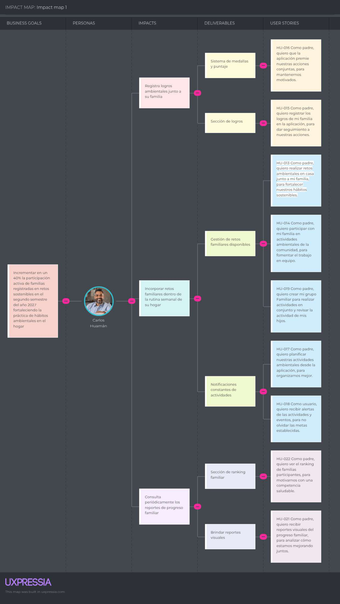

---

**Segundo Segmento Objetivo (Escolares de primaria)**

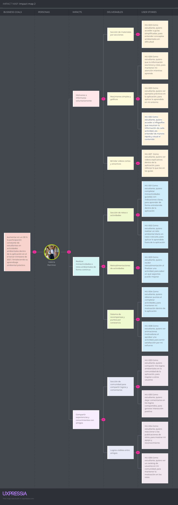

### 2.4.3. Product Backlog

Para establecer el orden de prioridad de las historias de usuario planteadas para el desarrollo de la aplicación, realizamos su respectivo product backlog, con el cual podemos ver tanto el orden adecuado, como su estimación de tiempo para su desarrollo, con lo cual, con lo cual podremos administrar bien las fases de desarrollo de la aplicación. Para ello nos ayudamos de la herramienta de Trello: https://trello.com/invite/b/6aab0c88ceb4dbbd587813e8/ATTI7a418a77844bbcbb6af417af4269d40dF11B3E7B/app-movil-ecomind

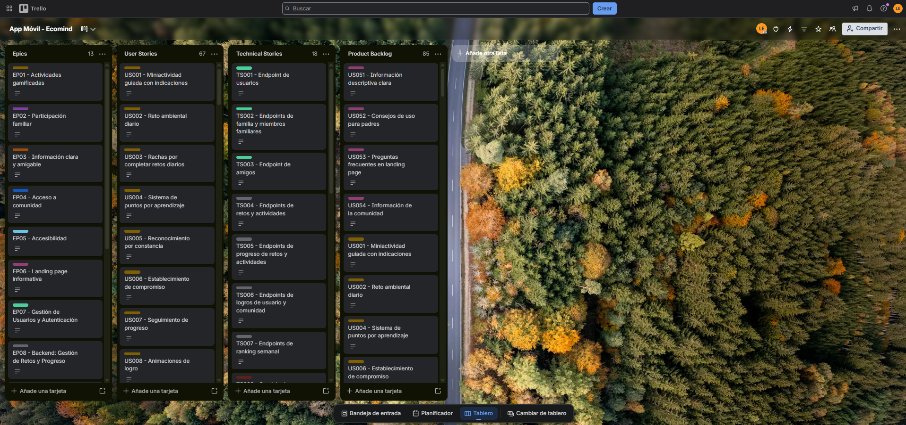

| # | ID | Título | Descripción | SP |
|---|---|---|---|---|
| 1 | HU-051 | Información descriptiva clara | Como visitante, quiero que la información presentada sobre las funcionalidades disponibles se encuentre de forma sencilla, para que pueda ser entendible. | 3 |
| 2 | HU-052 | Consejos de uso para padres | Como padre, quiero visualizar recomendaciones de uso de la aplicación, para familiarizarme de mejor forma a manejarla. | 3 |
| 3 | HU-053 | Preguntas frecuentes en landing | Como visitante, quiero visualizar una sección de preguntas frecuentes sobre la aplicación en la landing page, para contar con un conocimiento básico de la aplicación. | 2 |
| 4 | HU-054 | Información de la comunidad en landing | Como visitante, quiero visualizar información de la sección de comunidad en la landing page, para conocer de qué formas puedo interactuar con otras personas dentro de la aplicación. | 3 |
| 5 | HU-001 | Miniactividad guiada con indicaciones | Como estudiante, quiero completar miniactividades guiadas con indicaciones claras, para aprender de forma entretenida dentro de la aplicación. | 8 |
| 6 | HU-002 | Reto ambiental diario | Como estudiante, quiero realizar un reto ambiental diario en casa o escuela, para aplicar lo aprendido fuera de la aplicación. | 5 |
| 7 | HU-004 | Sistema de puntos por aprendizaje | Como estudiante, quiero obtener puntos al completar actividades, para mantener mi motivación dentro de la aplicación. | 5 |
| 8 | HU-006 | Establecimiento de compromiso | Como estudiante, quiero establecer compromisos individuales, para mantenerme constante. | 3 |
| 9 | HU-009 | Ranking educativo | Como usuario, quiero ver un ranking de los mejores puntajes, para compararme de forma sana con otros usuarios. | 3 |
| 10 | HU-010 | Desafío entre compañeros | Como estudiante, quiero realizar actividades en conjunto con mis amigos, para aprender y divertirnos al mismo tiempo. | 8 |
| 11 | HU-014 | Evento familiar en comunidad | Como padre, quiero participar con mi familia en eventos de la comunidad, para fomentar el trabajo en equipo. | 8 |
| 12 | HU-029 | Avatares y cosméticos personalizables | Como usuario, quiero personalizar mi avatar con comesticos para diferenciarme de otros usuarios. | 5 |
| 13 | HU-031 | Multiplicador de XP | Como usuario, quiero comprar un multiplicador de XP, para aumentar la experiencia obtenida en mis actividades. | 5 |
| 14 | HU-035 | Compra y obtención de gemas | Como usuario, quiero obtener gemas mediante compras con dinero real o completando retos y misiones diarias, para utilizarlas dentro de la aplicación. | 5 |
| 15 | HU-060 | Inscripción a una comunidad local cercana | Como usuario, quiero elegir una comunidad local cercana la primera vez que accedo a la sección Comunidad, para mantenerme al tanto de las actividades de mi entorno. | 5 |
| 16 | HU-061 | Creación de comunidades personalizadas | Como padre, quiero crear una comunidad sobre un tópico específico, para encontrar y motivar a personas con intereses en común. | 8 |
| 17 | HU-062 | Inscripción a comunidades personalizadas | Como usuario, quiero inscribirme en comunidades de tópicos específicos, para interactuar con personas afines y conocer sus actividades. | 5 |
| 18 | HU-066 | Selección de comunidad de preferencia | Como usuario, quiero elegir qué comunidad consultar al entrar a la sección Comunidad, para mantener ordenado el contenido de las comunidades a las que pertenezco. | 3 |
| 19 | HU-063 | Creación de meta comunitaria | Como padre administrador de una comunidad, quiero crear una meta comunitaria a partir de opciones estandarizadas de la aplicación, para obtener recompensas y motivar la participación de la comunidad. | 8 |
| 20 | HU-064 | Inscripción a meta comunitaria | Como padre o niño miembro de una comunidad, quiero inscribirme en metas comunitarias disponibles, para obtener recompensas y aumentar mi interacción con la comunidad. | 5 |
| 21 | HU-036 | Ranking comunitario | Como estudiante, quiero ver un ranking de usuarios en mi comunidad, para mantener la motivación en los retos. | 3 |
| 22 | HU-037 | Eventos ambientales | Como estudiante, quiero participar en eventos ambientales comunitarios desde la aplicación, para sentir la participación comunitaria. | 5 |
| 23 | HU-065 | Creación de chat temporal de evento | Como padre, quiero que al terminar la creación de mi evento se cree un chat grupal temporal, para coordinar con los futuros participantes. | 8 |
| 24 | HU-038 | Panel de logros compartidos | Como estudiante, quiero consultar un panel con los logros más destacados, para inspirarme en los avances de otros. | 3 |
| 25 | HU-039 | Invitar amigos | Como estudiante, quiero enviar solicitudes de amistad para compartir experiencias de aprendizaje. | 3 |
| 26 | HU-048 | Eventos de la comunidad en mapa | Como usuario, quiero ver eventos de la comunidad cercanos en un mapa, para participar en actividades cercanas a mi ubicación. | 5 |
| 27 | HU-067 | Protector de racha | Como usuario, quiero adquirir protectores para mi racha actual, para evitar perder mi progreso y mantener mi motivación. | 5 |
| 28 | TS-004 | Endpoint de gestión de retos (CRUD) | Como desarrollador backend, quiero implementar la gestión de retos. | 8 |
| 29 | TS-005 | Endpoint de progreso y puntaje del usuario | Como desarrollador backend, quiero implementar el progreso del usuario. | 5 |
| 30 | TS-007 | Endpoint de ranking de usuarios y familias | Como desarrollador backend, quiero implementar rankings. | 5 |
| 31 | HU-003 | Rachas por completar retos diarios | Como estudiante, quiero que mi racha aumente al completar un reto diario, para motivarme a mantener hábitos sostenibles de forma constante. | 5 |
| 32 | TS-009 | Endpoint de resumen y edición de perfil | Como desarrollador backend, quiero implementar resumen y edición de perfil. | 5 |
| 33 | TS-010 | Endpoint de progreso del perfil | Como desarrollador backend, quiero implementar progreso de usuario. | 5 |
| 34 | TS-011 | Endpoint de familia y amigos del perfil | Como desarrollador backend, quiero implementar amigos y familia. | 5 |
| 35 | TS-012 | Endpoint de interacción comunitaria | Como desarrollador backend, quiero implementar interación de post y logros comunitarios. | 5 |
| 36 | TS-013 | Endpoint de eventos comunitarios y participación | Como desarrollador backend, quiero implementar eventos comunitarios. | 5 |
| 37 | TS-018 | Endpoint de metas comunitarias y chat temporal | Como desarrollador backend, quiero implementar la gestión de metas comunitarias y chats temporales asociados a eventos, para soportar la participación comunitaria y la coordinación de actividades. | 8 |
| 38 | TS-014 | Endpoint de catálogo y compra de cosméticos | Como desarrollador backend, quiero implementar catalgo y compra de cosmeticos. | 5 |
| 39 | TS-015 | Endpoint de compra de gemas | Como desarrollador backend, quiero implementar gemas. | 5 |
| 40 | TS-016 | Endpoint de notificaciones del usuario | Como desarrollador backend, quiero implementar la gestión de notificaciones del usuario. | 5 |
| 41 | TS-017 | Endpoint de materiales de aprendizaje | Como desarrollador backend, quiero implementar la gestión de materiales de aprendizaje. | 5 |
| 42 | HU-055 | Redirección a registro | Como visitante, quiero poder ser redirigido desde la landing page hacia la pantalla de registro de cuenta, para crear mi cuenta y así participar en las actividades de la plataforma. | 5 |
| 43 | HU-005 | Reconocimiento por constancia | Como estudiante, quiero recibir reconocimientos al completar varias actividades seguidas, para reforzar mi compromiso con el aprendizaje. | 3 |
| 44 | HU-007 | Seguimiento de progreso | Como estudiante, quiero ver mi progreso de actividades iniciadas, para saber cuánto he avanzado en ellas. | 5 |
| 45 | HU-008 | Animaciones de logro | Como estudiante, quiero ver animaciones motivadoras al aprobar una actividad, para sentir satisfacción por mi esfuerzo. | 3 |
| 46 | HU-011 | Colección de medallas | Como estudiante, quiero ganar medallas al superar retos, para sentir orgullo por mis logros. | 5 |
| 47 | HU-012 | Historial de aprendizaje | Como estudiante, quiero revisar mi historial de actividades completadas, para repasar contenido de mi progreso. | 3 |
| 48 | HU-023 | Guía simplificada | Como estudiante, quiero acceder a materiales didacticos, para entender conceptos ambientales sin dificultad. | 5 |
| 49 | HU-024 | Tutorial paso a paso | Como usuario, quiero seguir tutoriales paso a paso dentro de la aplicación, para aprender cómo usarla correctamente. | 5 |
| 50 | HU-025 | Recordatorios educativos | Como estudiante, quiero recibir recordatorios en la aplicación de materiales pendientes, para no olvidarme de revisarlos. | 3 |
| 51 | HU-026 | Contenido breve y claro | Como estudiante, quiero que la información sea breve y clara, para mantener mi atención mientras aprendo. | 3 |
| 52 | HU-027 | Videos explicativos | Como estudiante, quiero ver videos explicativos dentro de la aplicación, para reforzar lo que leo en las guías. | 3 |
| 53 | HU-028 | Lenguaje sencillo | Como estudiante, quiero que el contenido esté en lenguaje sencillo, para comprenderlo fácilmente. | 2 |
| 54 | HU-030 | Preguntas frecuentes | Como estudiante, quiero acceder a una sección de preguntas frecuentes, para resolver mis dudas rápidamente. | 2 |
| 55 | HU-032 | Infografías resumen | Como estudiante, quiero acceder a infografías que resuman la información de cada actividad, para entender de manera rápida y visual el contenido. | 3 |
| 56 | HU-013 | Reto familiar en casa | Como padre, quiero realizar retos ambientales en casa junto a mi familia, para fortalecer nuestros hábitos sostenibles. | 5 |
| 57 | HU-015 | Registro de logros familiares | Como padre, quiero registrar los logros de mi familia en la aplicación, para dar seguimiento a nuestras acciones. | 5 |
| 58 | HU-016 | Premios por colaboración familiar | Como padre, quiero que la aplicación premie nuestras acciones conjuntas, para mantenernos motivados. | 5 |
| 59 | HU-017 | Planificación de retos familiares | Como padre, quiero planificar nuestras actividades ambientales desde la aplicación, para organizarnos mejor. | 8 |
| 60 | HU-018 | Alertas de eventos comunitarios para padres | Como padre, quiero recibir alertas únicamente sobre eventos de la comunidad, para estar informado de oportunidades de participación familiar. | 5 |
| 61 | HU-019 | Agregar integrantes a la familia | Como padre, quiero crear mi grupo familiar para realizar actividades en conjunto y revisar la actividad de mis hijos. | 5 |
| 62 | HU-020 | Felicitación de logros familiares | Como padre, quiero que la aplicación muestre una animación al cumplir un reto en familia, para generar alegría y unión. | 3 |
| 63 | HU-021 | Reportes de progreso familiares | Como padre, quiero recibir reportes visuales del progreso familiar, para analizar cómo estamos mejorando juntos. | 5 |
| 64 | HU-022 | Ranking de familias | Como padre, quiero ver el ranking de familias participantes, para motivarnos con una competencia saludable. | 5 |
| 65 | HU-033 | Compartir logros ambientales | Como estudiante, quiero compartir mis logros ambientales en la comunidad de la aplicación, para inspirar a otros usuarios. | 5 |
| 66 | HU-034 | Reaccionar a publicaciones | Como estudiante, quiero reaccionar a las publicaciones de otros, para mostrar mi apoyo y reconocimiento. | 3 |
| 67 | HU-040 | Logros colectivos | Como estudiante, quiero que la aplicación felicite logros colectivos, para sentir orgullo por lo que logramos como comunidad. | 3 |
| 68 | HU-041 | Puntaje decreciente por repetición de minijuegos | Como estudiante, quiero que al repetir un minijuego el puntaje obtenido disminuya progresivamente hasta llegar a 0, para motivarme a practicar nuevos retos y evitar acumular puntos por repetir la misma actividad. | 5 |
| 69 | HU-042 | Multiplataforma | Como estudiante, quiero que la aplicación funcione en distintos dispositivos, para mantener mi experiencia fluida. | 5 |
| 70 | HU-043 | Carga rápida | Como estudiante, quiero que la aplicación cargue en menos de 2 segundos entre pestañas, para acceder ágilmente a mis actividades. | 3 |
| 71 | HU-044 | Interfaz simple | Como estudiante, quiero que la interfaz de la aplicación sea simple, para navegar sin dificultad. | 3 |
| 72 | HU-045 | Disponibilidad | Como estudiante, quiero que la aplicación esté disponible las 24 horas del día y 7 días de la semana, para poder realizar mis retos o acceder a información en cualquier momento. | 3 |
| 73 | HU-046 | Seguridad | Como estudiante, quiero que mis datos personales estén protegidos mediante cifrado para evitar filtraciones o mal uso. | 5 |
| 74 | HU-047 | Soporte | Como estudiante, quiero contar con soporte técnico dentro de la aplicación, para resolver problemas fácilmente. | 3 |
| 75 | HU-049 | Sincronización automática | Como estudiante, quiero que la aplicación sincronice mis datos automáticamente, para no perder mi progreso. | 5 |
| 76 | HU-050 | Optimización | Como estudiante, quiero que la aplicación use pocos recursos, para que funcione correctamente en cualquier dispositivo. | 3 |
| 77 | TS-001 | Endpoint de registro de usuarios | Como desarrollador backend, quiero implementar el registro de usuarios. | 5 |
| 78 | TS-002 | Endpoint de autenticación con JWT | Como desarrollador backend, quiero implementar autenticación con JWT. | 5 |
| 79 | TS-003 | Endpoint de vinculación de cuentas padre-hijo | Como desarrollador backend, quiero implementar la vinculación familiar. | 5 |
| 80 | TS-006 | Endpoint de insignias y sistema de recompensas | Como desarrollador backend, quiero implementar el sistema de insignias. | 5 |
| 81 | TS-008 | Servicio de notificaciones push | Como desarrollador backend, quiero implementar notificaciones push. | 5 |
| 82 | HU-056 | Registro de usuario | Como usuario, quiero crear una cuenta y seleccionar mi rol dentro de la plataform como estudiante o padre, para acceder a funcionalidades personalizadas de la aplicación. | 7 |
| 83 | HU-057 | Inicio de sesión | Como usuario registrado, quiero autenticarme en el sistema mediante la validación de mis credenciales únicas (correo electrónico y contraseña), para establecer una sesión segua. | 7 |
| 84 | HU-058 | Recuperación de contraseña | Como usuario, quiero iniciar el protocolo de recuperación de credenciales mediante mi dirección de correo electrónico vinculada, para volver a acceder a mi cuenta. | 7 |
| 85 | HU-059 | Cierre de sesión | Como usuario, quiero ejecutar la finalización de mi sesión activa mediante la opción de "Log out, para proteger mi información personal en la plataforma. | 7 |

## 2.5. Strategic-Level Domain-Driven Design
### 2.5.1. EventStorming

A partir de los resultados obtenidos en el Big Picture EventStorming, se realizó una sesión de EventStorming para profundizar en el modelado del dominio de EcoMind. Los procesos identificados se desarrollaron con mayor detalle mediante la incorporación de eventos, comandos, actores, políticas y otros elementos.

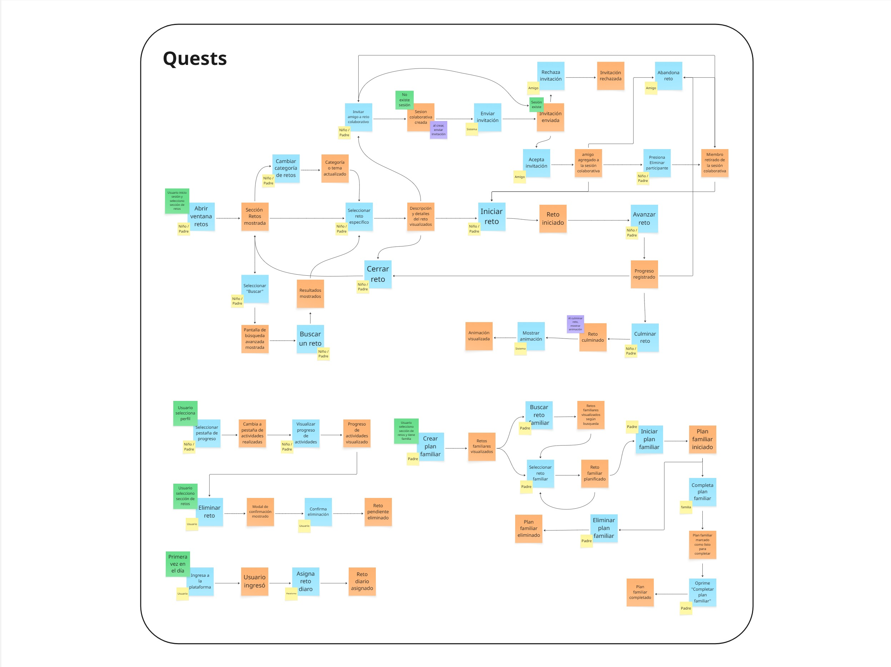
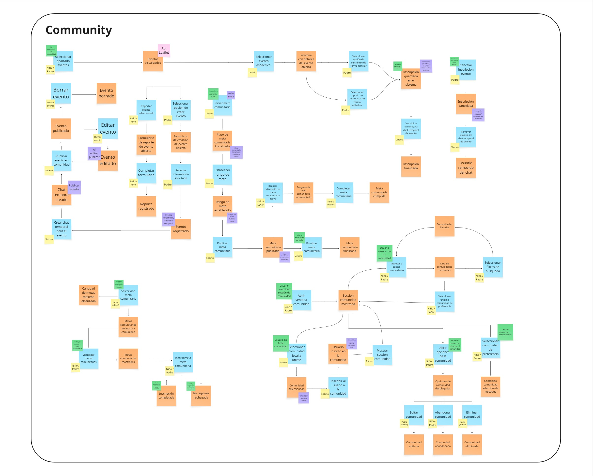
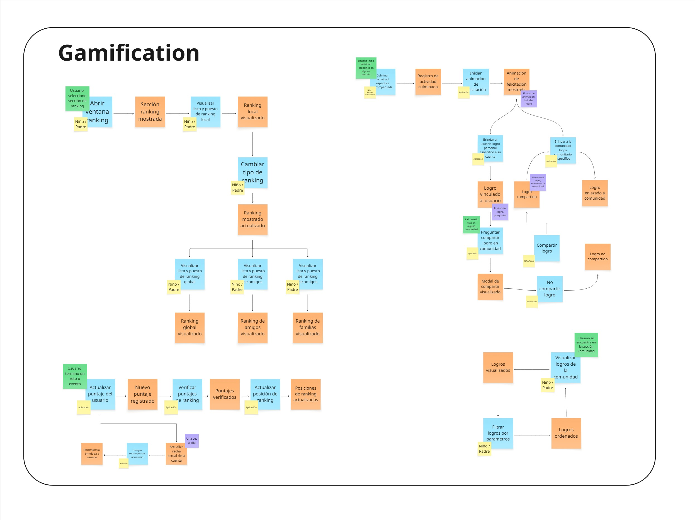
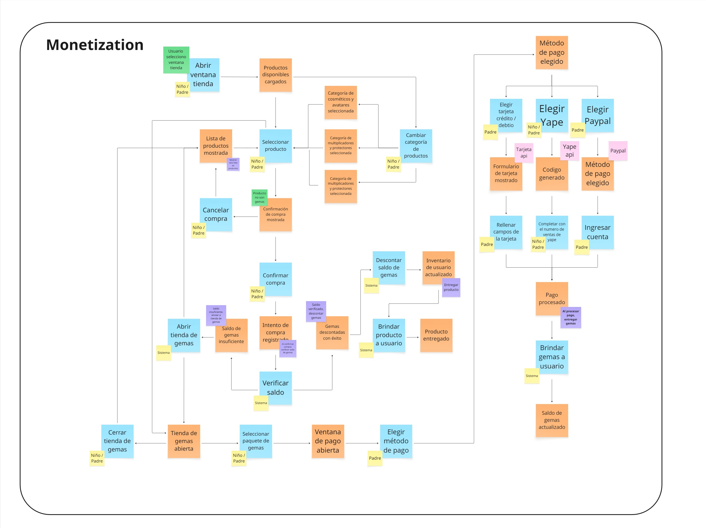
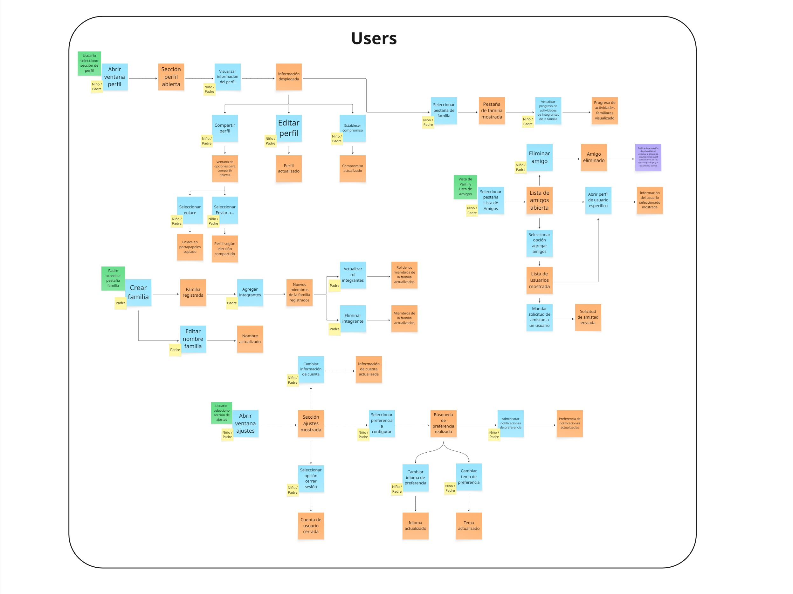
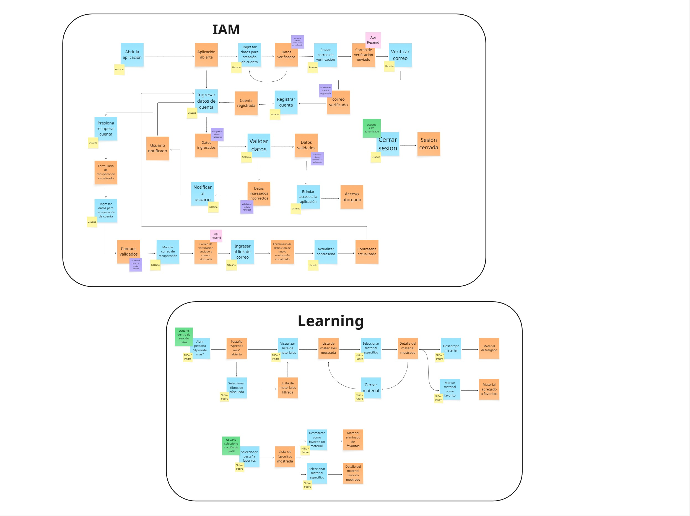

#### 2.5.1.1. Candidate Context Discovery

La sesión de *Candidate Context Discovery* tuvo como objetivo revisar y refinar los bounded contexts identificados inicialmente en el EventStorm de EcoMind.Para realizar el proceso se combinaron las técnicas **start-with-simple** y **look-for-pivotal-events**.

Se aplicó **start-with-simple** porque se partió de una división preliminar del dominio y esta fue refinada progresivamente.
La técnica **look-for-pivotal-events** se utilizó para identificar eventos que evidenciaban cambios de responsabilidad dentro del flujo del negocio.

La sesión tuvo una duración menor a dos horas y se realizó utilizando Miro.

**Propuesta inicial**

Al comienzo de la sesión se contaba con siete bounded contexts candidatos:

- Gestión de usuarios
- Perfil
- Retos
- Comunidad
- Ranking
- Preferencias
- Monetización

Esta división representaba una primera aproximación a las capacidades del sistema. Sin embargo, al revisar los comandos, eventos, actores y reglas de negocio de cada contexto, se encontraron responsabilidades que debían separarse y otras que podían consolidarse.

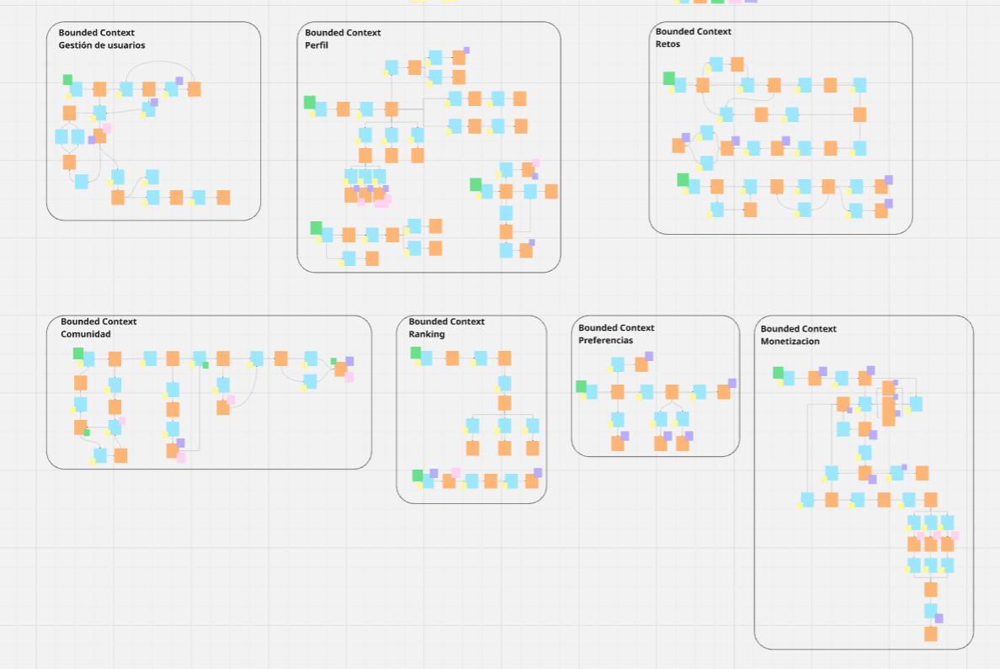

*Figura X. Propuesta inicial de bounded contexts del EventStorm.*

**Separación del contexto Learning**

Durante el análisis del bounded context **Retos**, se observó que este concentraba dos responsabilidades diferentes. Por un lado, tenia el cumplimiento de misiones, progreso, misiones colaborativas y planes familiares. Por el otro, incluía funcionalidades relacionadas con la consulta y visualización de materiales educativos.

Se determinó que los materiales educativos poseen un propósito propio: facilitar el aprendizaje del usuario independientemente de su participación en un reto. Además, su contenido, organización y evolución responden a reglas diferentes de las utilizadas para gestionar retos. Por esta razón, se extrajeron de Retos los eventos y funcionalidades relacionados con la consulta de materiales, creando el bounded context **Learning**.

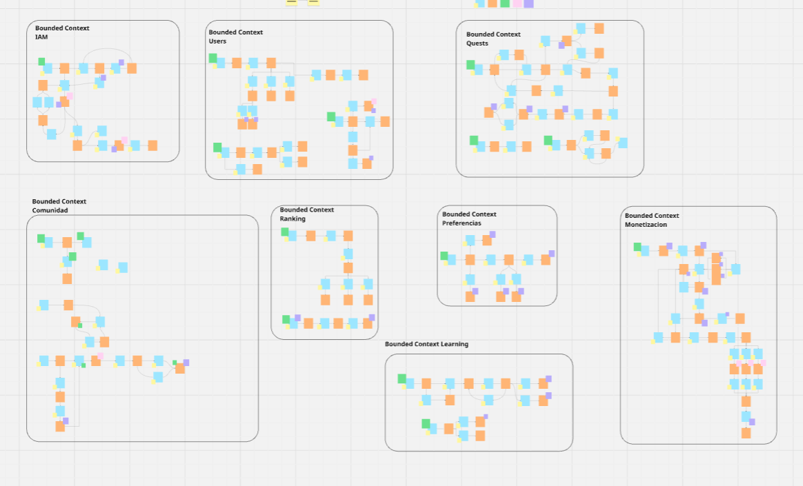

*Figura X. Separación de Learning a partir del bounded context Retos.*

**Creación del contexto Achievements**

Posteriormente, se identificó que los eventos relacionados con la obtención de logros estaban distribuidos entre distintos bounded contexts. Esto provocaba que la responsabilidad de reconocer el progreso de los usuarios no tuviera un límite claramente definido.

Como primera medida, dichos eventos fueron retirados de los contextos en los que se encontraban y agrupados en un nuevo bounded context denominado **Achievements**. Este contexto se propuso inicialmente como responsable de determinar cuándo un usuario cumplía las condiciones necesarias para obtener un logro y de registrar los reconocimientos alcanzados.

**Integración de Perfil y Preferencias**

También se revisó la separación existente entre los bounded contexts Perfil y Preferencias. Se concluyó que ambos manejaban información directamente asociada con la experiencia individual del usuario. Las preferencias no presentaban reglas ni un ciclo de vida con suficiente independencia para justificar un bounded context separado. Además, mantener esta división habría generado una comunicación constante entre ambos contextos.

Por ello, Perfil absorbió las responsabilidades de Preferencias. Posteriormente, el contexto resultante fue denominado **Users**, encargado de gestionar la información personal, el perfil y las preferencias de cada usuario.

**Creación del contexto Gamification**

Después de crear Achievements, se evaluó su relación con Ranking. Se observó que ambos contextos compartían el mismo propósito de negocio: incentivar la participación y reconocer el progreso de los usuarios dentro de EcoMind.

Ranking administraba las posiciones y puntuaciones obtenidas por los usuarios, mientras que Achievements gestionaba los logros concedidos por alcanzar determinados objetivos. Debido a que ambas capacidades forman parte de una misma estrategia de motivación, mantenerlas separadas podía fragmentar innecesariamente las reglas de gamificación.

En consecuencia, Ranking y Achievements se fusionaron para formar el bounded context Gamification. El nuevo contexto quedó encargado de administrar las puntuaciones, clasificaciones, logros y demás mecanismos de reconocimiento del sistema.

**Renombramiento y consolidación de los contextos**

Como parte del refinamiento, algunos bounded contexts fueron renombrados para representar con mayor precisión sus responsabilidades:

- **Gestión de usuarios** pasó a denominarse **IAM**, ya que su responsabilidad principal corresponde a la gestión de identidad, autenticación y acceso.
- El contexto resultante de la integración entre Perfil y Preferencias pasó a denominarse **Users**.
- **Retos** pasó a denominarse **Quests**, quedando enfocado exclusivamente en la gestión de retos.
- **Ranking** y **Achievements** se consolidaron bajo el nombre **Gamification**.
- Los demás contextos adoptaron nombres consistentes en inglés: **Monetization**, **Learning** y **Community**.

Es importante distinguir **IAM** de **Users**. IAM gestiona la identidad digital, las credenciales, la autenticación y la autorización, mientras que Users administra la información del perfil y las preferencias personales.

**Resultado final**

Después de analizar, separar y consolidar las distintas responsabilidades, se definieron siete bounded contexts finales:

| Bounded context | Descripción |
|---|---|
| IAM | Gestionar la identidad, autenticación, autorización y acceso de los usuarios |
| Users | Administrar la información del perfil y las preferencias del usuario |
| Quests | Gestionar la participación y cumplimiento de misiones |
| Gamification | Gestionar puntuaciones, rankings, logros y mecanismos de reconocimiento |
| Monetization | Administrar las funcionalidades y reglas relacionadas con la monetización |
| Learning | Gestionar los materiales educativos y las experiencias de aprendizaje |
| Community | Gestionar la interacción y participación entre los miembros de la comunidad |

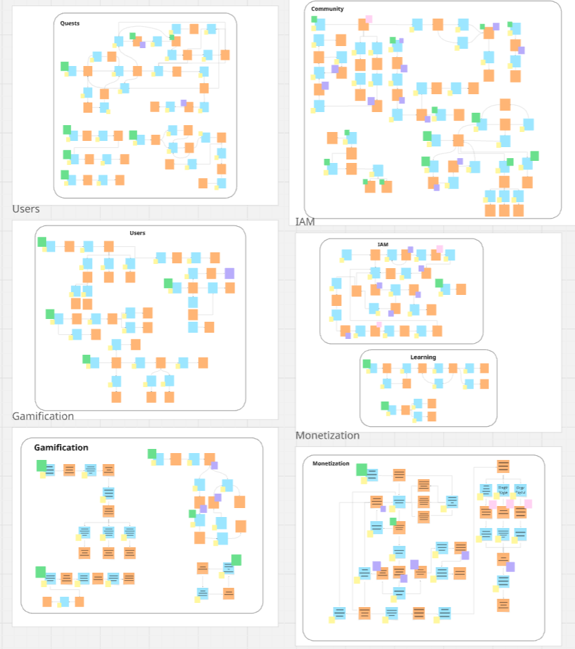

*Figura X. Resultado final de la sesión de Candidate Context Discovery.*

#### 2.5.1.2. Domain Message Flows Modeling

Luego de identificar los bounded contexts candidatos, se realizó una sesión de Flow Modeling con el propósito de representar la colaboración entre las distintas capacidades del dominio. Para ello, se seleccionaron los flujos que generan mayor valor para los usuarios y se identificaron los comandos, eventos y consultas intercambiados entre los bounded contexts.

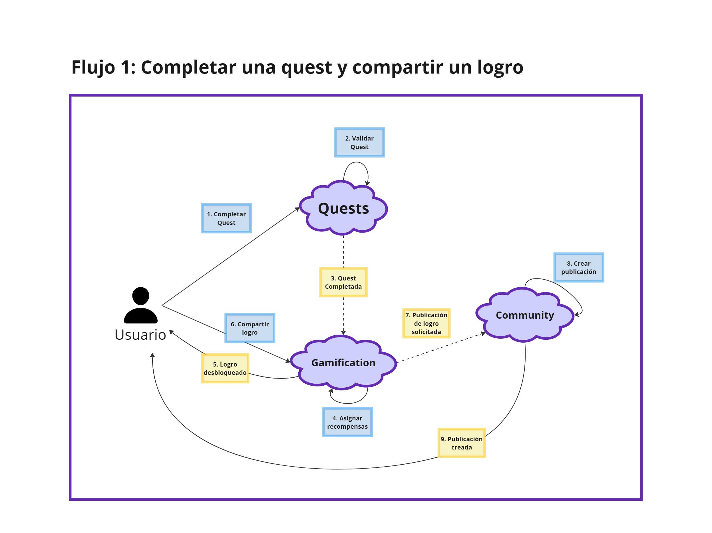
*Figura X. Domain Storytelling del flujo de participación en quests y publicación de un logro.*
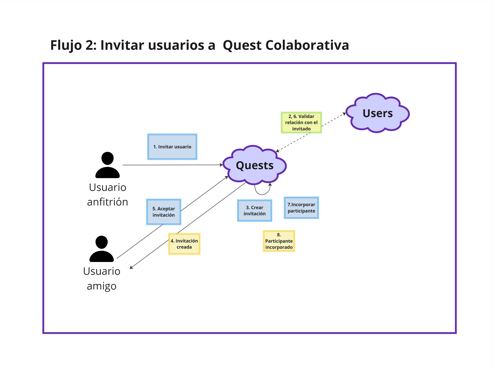
*Figura X. Domain Storytelling del flujo de invitación a una quest colaborativa.*
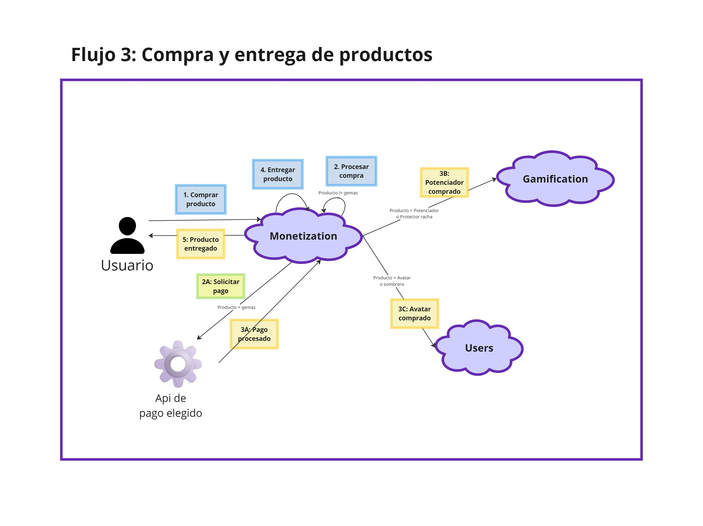
*Figura X. Domain Storytelling del flujo de compra y entrega de productos.*
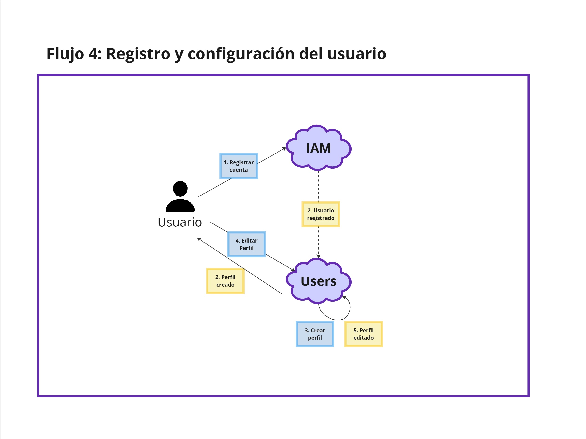
*Figura X. Domain Storytelling del flujo de registro y configuración del perfil.*

#### 2.5.1.3. Bounded Context Canvases
Después de identificar los candidate bounded contexts, se elaboró un Bounded Context Canvas para cada uno, comenzando por los contextos de mayor importancia para el negocio. El objetivo fue precisar sus límites, responsabilidades, lenguaje, reglas y dependencias antes de tomar decisiones de diseño posteriores.

La elaboración se realizó de manera iterativa mediante los pasos de Context Overview Definition, Business Rules Distillation & Ubiquitous Language Capture, Capability Analysis, Capability Layering, Dependencies Capture y Design Critique.

**1. Bounded Context Canvas Quests**
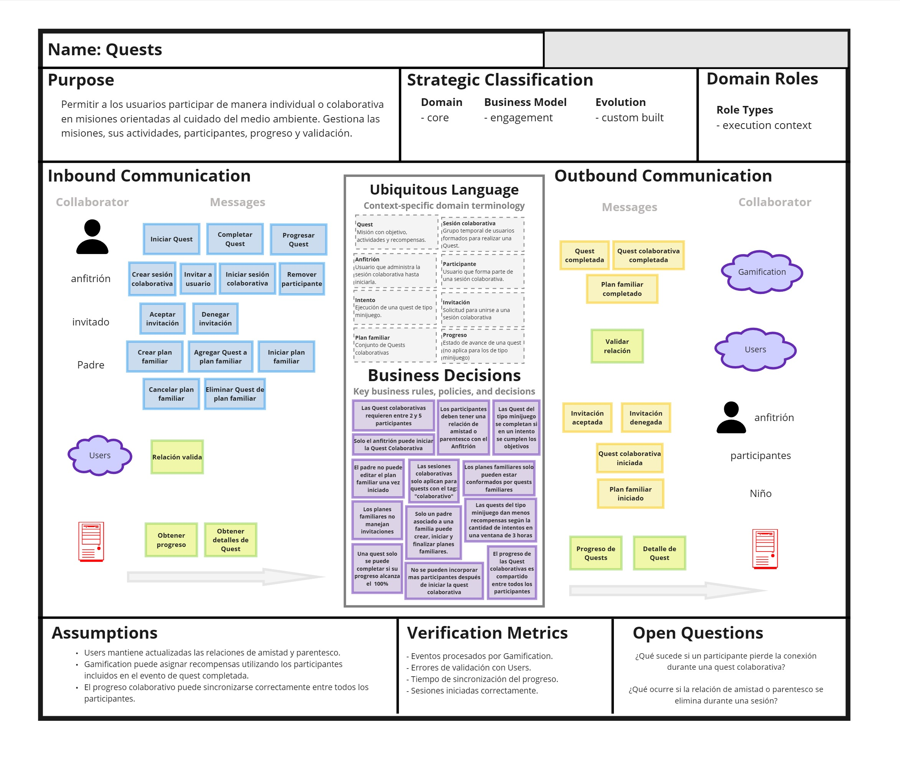

*Figura X. Bounded Context Canvas del contexto Quests.*

**2. Bounded Context Canvas Community**
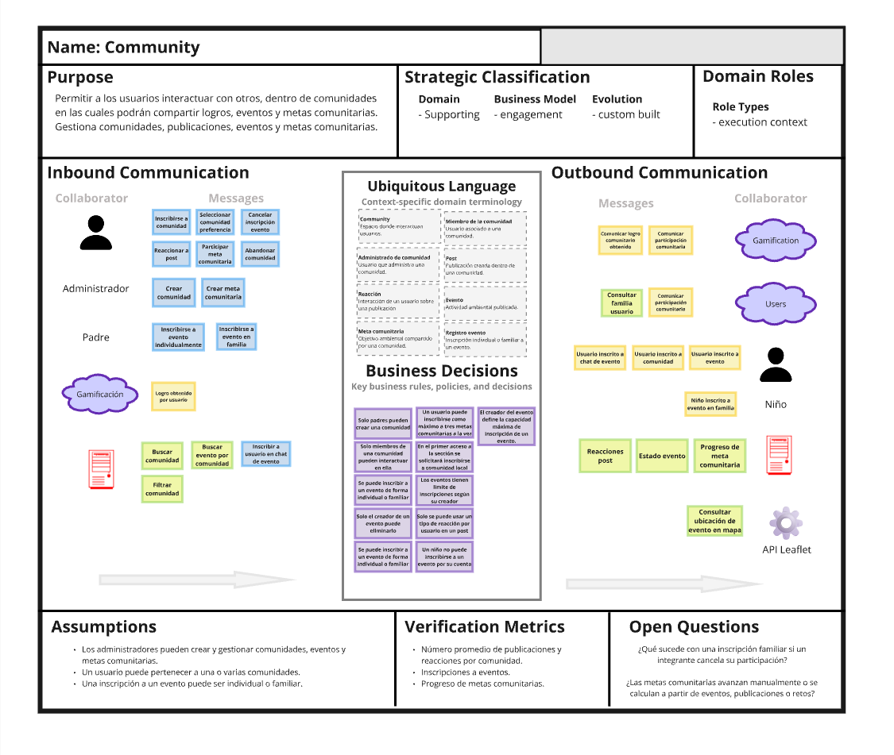

*Figura X. Bounded Context Canvas del contexto Community.*

**3. Bounded Context Canvas Monetization**
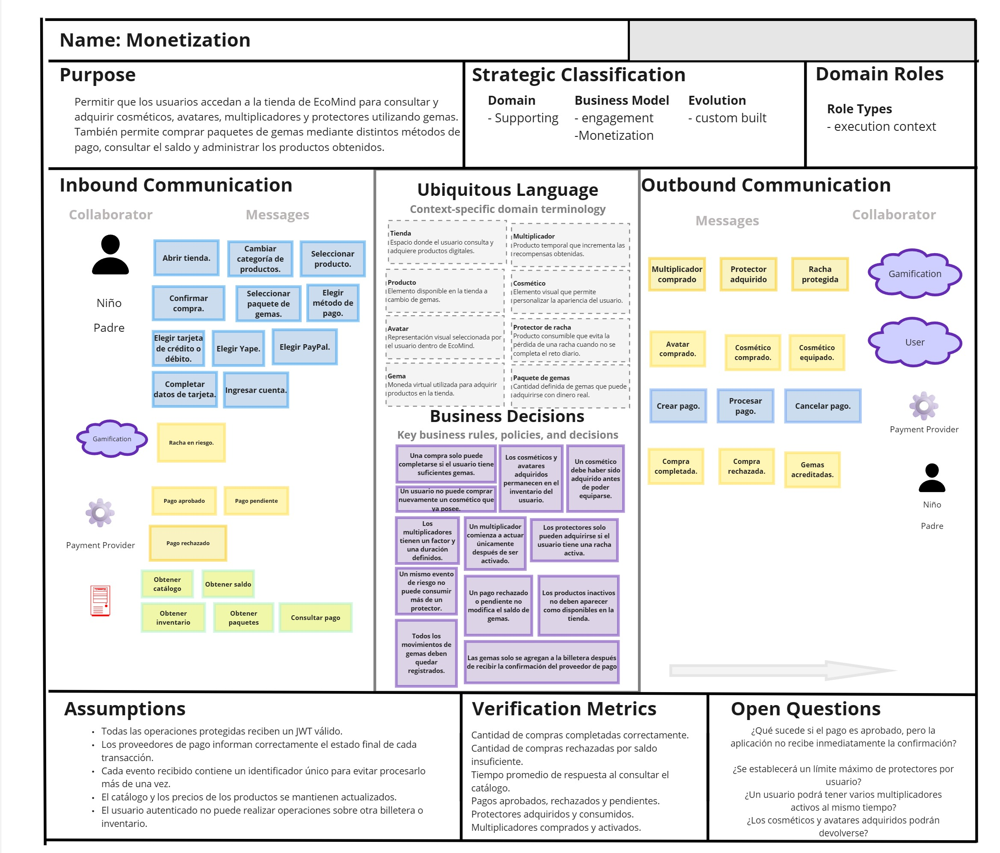

*Figura X. Bounded Context Canvas del contexto Monetization.*

**4. Bounded Context Canvas IAM**
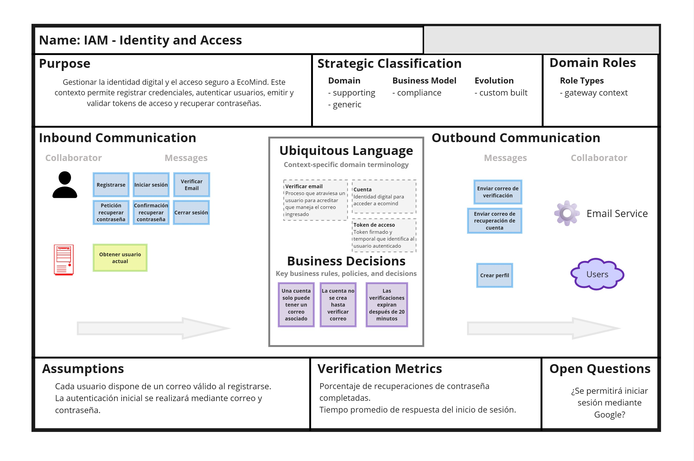

*Figura X. Bounded Context Canvas del contexto Identity and Access.*

**5. Bounded Context Canvas Users**
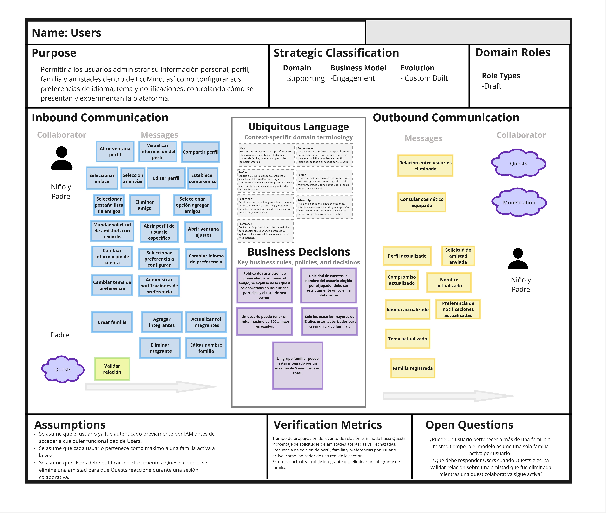

*Figura X. Bounded Context Canvas del contexto Identity and Access.*

### 2.5.2. Context Mapping

### 2.5.3. Software Architecture
#### 2.5.3.1. Software Architecture Context Level Diagrams
#### 2.5.3.2. Software Architecture Container Level Diagrams
#### 2.5.3.3. Software Architecture Deployment Diagrams

## 2.6. Tactical-Level Domain-Driven Design

### 2.6.1. Bounded Context: IAM

El bounded context **IAM (Identity and Access Management)** administra el registro y la verificación de cuentas, las credenciales, la autenticación, los access tokens y la recuperación de contraseña. Los perfiles, preferencias, amistades, familias y roles sociales pertenecen al bounded context **Users**.

#### 2.6.1.1. Domain Layer

Esta capa representa las reglas que protegen la identidad digital y las credenciales. Una cuenta solo se crea después de verificar el correo y comprobar nuevamente su disponibilidad; las contraseñas y los tokens de recuperación se conservan únicamente mediante sus hashes.

**Sub-capa Model**

| Tipo | Nombre | Descripción | Responsabilidad principal | Relación con otros elementos |
|---|---|---|---|---|
| Aggregate Root | `PendingRegistration` | Registro temporal previo a la creación de la cuenta. | Mantener los datos de registro y controlar su vigencia y verificación. | Origina una `Account` después de verificar el correo y reconfirmar su disponibilidad. |
| Entity | `EmailVerification` | Verificación asociada con un registro pendiente. | Validar el código o token dentro del plazo de 20 minutos e impedir su reutilización. | Pertenece a `PendingRegistration`. |
| Aggregate Root | `Account` | Identidad digital habilitada para acceder a EcoMind. | Crear y mantener el estado de la cuenta autenticable. | Posee una `AccountCredential` y se identifica mediante `AccountId`. |
| Entity | `AccountCredential` | Credencial de acceso de una cuenta. | Asociar un correo normalizado con el hash de la contraseña y permitir su actualización segura. | Pertenece a `Account`; utiliza `EmailAddress` y `PasswordHash`. |
| Aggregate Root | `PasswordResetToken` | Autorización temporal para cambiar una contraseña. | Controlar expiración, consumo único y asociación con la cuenta solicitante. | Se busca mediante su `TokenHash` y, al consumirse, permite actualizar `AccountCredential`. |
| Value Object | `AccountId` | Identificador estable de una cuenta. | Identificar al usuario autenticado sin exponer credenciales. | Se incluye como subject del `AccessToken` y se comunica a Users. |
| Value Object | `EmailAddress` | Correo normalizado. | Eliminar espacios laterales, convertir a minúsculas y validar el formato. | Usado por `PendingRegistration` y `AccountCredential`. |
| Value Object | `PasswordHash` | Representación no reversible de una contraseña. | Evitar que la contraseña en texto plano forme parte del modelo persistido. | Utilizado por `AccountCredential`. |
| Value Object | `AccessToken` | JWT firmado y temporal. | Representar la identidad autenticada y su expiración. | Se emite después de una autenticación válida. |
| Value Object | `TokenHash` | Huella de un token sensible. | Permitir la validación sin almacenar el token de recuperación en texto plano. | Utilizado por `PasswordResetToken`. |

**Sub-capa Domain Services**

| Nombre | Responsabilidad principal | Relación con otros elementos |
|---|---|---|
| `RegistrationPolicy` | Validar los datos del registro, la disponibilidad del correo y la vigencia de la verificación antes de crear la cuenta. | Opera sobre `PendingRegistration`, `EmailAddress` y `AccountRepository`. |
| `AuthenticationService` | Comprobar correo y contraseña sin revelar cuál credencial fue incorrecta. | Utiliza `AccountCredentialRepository` y `PasswordHasher`. |
| `PasswordPolicy` | Validar que una contraseña nueva cumpla las reglas de seguridad de IAM. | Se aplica al registro y a la recuperación de contraseña. |

**Sub-capa Repositories y contratos del dominio**

| Tipo | Nombre | Responsabilidad principal |
|---|---|---|
| Repository | `PendingRegistrationRepository` | Persistir registros temporales y consultar una verificación vigente. |
| Repository | `AccountRepository` | Persistir cuentas y comprobar la unicidad del correo normalizado. |
| Repository | `AccountCredentialRepository` | Consultar y actualizar las credenciales asociadas con una cuenta. |
| Repository | `PasswordResetTokenRepository` | Persistir, localizar y marcar como consumidos los tokens de recuperación. |
| Domain Port | `PasswordHasher` | Generar y comparar hashes de contraseñas sin acoplar el dominio a un algoritmo concreto. |

#### 2.6.1.2. Interface Layer

Esta capa expone los casos de uso de IAM mediante una API REST. Los endpoints protegidos reciben la identidad establecida por la capa de seguridad después de validar el JWT.

**Sub-capa REST - Controllers**

| Tipo | Nombre | Responsabilidad principal | Relación con otros elementos |
|---|---|---|---|
| REST Controller | `RegistrationController` | Recibir el inicio del registro y la verificación del correo. | Ejecuta `SubmitRegistration` y `VerifyEmail`. |
| REST Controller | `AuthenticationController` | Atender el inicio de sesión y obtener al usuario autenticado. | Ejecuta `SignIn` y `GetCurrentAuthenticatedUser`; no expone la causa específica de credenciales inválidas. |
| REST Controller | `PasswordRecoveryController` | Recibir la solicitud y confirmación de recuperación de contraseña. | Ejecuta `RequestPasswordRecovery` y `ConfirmPasswordRecovery` sin revelar si el correo existe. |
| REST Controller | `SessionController` | Atender el cierre de sesión de la aplicación. | Ejecuta `Logout`; el cliente elimina localmente el access token. |

**Sub-capa REST - Resources y Assemblers**

| Tipo | Nombre | Responsabilidad principal | Relación con otros elementos |
|---|---|---|---|
| Request Resource | `SubmitRegistrationResource` | Transportar correo y contraseña para iniciar el registro. | Se convierte en `SubmitRegistrationCommand`. |
| Request Resource | `VerifyEmailResource` | Transportar la prueba de verificación del correo. | Se convierte en `VerifyEmailCommand`. |
| Request Resource | `SignInResource` | Transportar las credenciales de inicio de sesión. | Se convierte en `SignInCommand`. |
| Request Resource | `PasswordRecoveryResource` | Transportar el correo para solicitar la recuperación. | Se convierte en `RequestPasswordRecoveryCommand`. |
| Request Resource | `ConfirmPasswordRecoveryResource` | Transportar el token temporal y la nueva contraseña. | Se convierte en `ConfirmPasswordRecoveryCommand`. |
| Response Resource | `AuthenticationResource` | Exponer el access token, su expiración y la identidad autenticada. | Se ensambla a partir del resultado de `SignIn`. |
| Response Resource | `AuthenticatedUserResource` | Exponer la identidad de la cuenta autenticada. | No contiene perfil, preferencias ni roles sociales. |
| Assembler | `AuthenticationCommandFromResourceAssembler` | Convertir los resources de entrada en commands. | Conecta los controllers con Application Layer. |
| Assembler | `AuthenticationResourceAssembler` | Convertir resultados de aplicación en respuestas HTTP seguras. | Evita exponer hashes, tokens internos o detalles de autenticación. |

#### 2.6.1.3. Application Layer

Esta capa coordina los casos de uso, sus transacciones y las comunicaciones salientes hacia el servicio de correo y Users.

**Sub-capa Command Services**

| Nombre | Responsabilidad principal | Relación con otros elementos |
|---|---|---|
| `RegistrationCommandService` | Iniciar el registro, generar la verificación temporal y crear la cuenta una vez verificado el correo. | Procesa `SubmitRegistration` y `VerifyEmail`; usa repositorios, `EmailService` y `UsersContextGateway`. |
| `AuthenticationCommandService` | Validar las credenciales y emitir un access token firmado. | Procesa `SignIn`; utiliza `AuthenticationService` y `TokenService`. |
| `PasswordRecoveryCommandService` | Generar un token de recuperación de un solo uso y actualizar la contraseña tras validarlo. | Procesa `RequestPasswordRecovery` y `ConfirmPasswordRecovery`; usa `EmailService`. |
| `SessionCommandService` | Coordinar el cierre de sesión solicitado por el cliente. | Procesa `Logout`; informa que el token debe eliminarse localmente y no promete revocación server-side. |

**Sub-capa Query Services**

| Nombre | Responsabilidad principal | Relación con otros elementos |
|---|---|---|
| `CurrentAuthenticatedUserService` | Obtener el `AccountId` y el correo de la identidad ya autenticada. | Procesa `GetCurrentAuthenticatedUserQuery` a partir de `AuthenticatedUserPrincipal`. |

**Commands y Queries**

| Tipo | Nombre | Propósito |
|---|---|---|
| Command | `SubmitRegistrationCommand` | Iniciar un registro pendiente y solicitar el envío de la verificación. |
| Command | `VerifyEmailCommand` | Verificar el correo, crear la cuenta y solicitar a Users la creación del perfil. |
| Command | `SignInCommand` | Autenticar credenciales y obtener un access token. |
| Command | `RequestPasswordRecoveryCommand` | Solicitar una recuperación con una respuesta que no revele si el correo existe. |
| Command | `ConfirmPasswordRecoveryCommand` | Consumir el token temporal y establecer una nueva contraseña. |
| Command | `LogoutCommand` | Finalizar la sesión en la aplicación cliente. |
| Query | `GetCurrentAuthenticatedUserQuery` | Obtener la identidad asociada con el JWT validado. |

**Puertos de salida**

| Nombre | Responsabilidad principal | Destino |
|---|---|---|
| `EmailService` | Enviar correos de verificación y de recuperación de contraseña. | Email Service / Resend. |
| `UsersContextGateway` | Enviar `CreateProfile` después de crear correctamente la cuenta. | Bounded context Users mediante comunicación interna síncrona. |
| `TokenService` | Emitir y validar access tokens firmados con expiración. | Implementación JWT en Infrastructure Layer. |

#### 2.6.1.4. Infrastructure Layer

Esta capa implementa la persistencia, la seguridad y las integraciones técnicas requeridas por IAM.

| Tipo | Nombre | Responsabilidad principal | Implementa o utiliza |
|---|---|---|---|
| Persistence Entity | `PendingRegistrationPersistenceEntity` | Almacenar temporalmente el registro, la verificación hasheada y su expiración. | Mapeada por JPA. |
| Persistence Entity | `AccountCredentialPersistenceEntity` | Almacenar la cuenta, el correo normalizado y el hash de contraseña. | Mapeada por JPA; nunca almacena la contraseña en texto plano. |
| Persistence Entity | `PasswordResetTokenPersistenceEntity` | Almacenar el hash, la expiración y el estado de consumo del token. | Mapeada por JPA. |
| Repository Implementation | `PendingRegistrationRepositoryImpl` | Persistir y recuperar registros pendientes vigentes. | Implementa `PendingRegistrationRepository`. |
| Repository Implementation | `AccountCredentialRepositoryImpl` | Persistir cuentas y credenciales y comprobar la unicidad del correo. | Implementa `AccountRepository` y `AccountCredentialRepository`. |
| Repository Implementation | `PasswordResetTokenRepositoryImpl` | Persistir y consumir tokens de recuperación de forma segura. | Implementa `PasswordResetTokenRepository`. |
| Security Adapter | `TokenServiceImpl` | Firmar JWT, validar firma y expiración, y extraer el subject. | Implementa `TokenService`. |
| Security Filter | `BearerAuthorizationRequestFilter` | Validar el bearer token antes de que la solicitud alcance un recurso protegido. | Spring Security y `TokenService`. |
| Security Configuration | `WebSecurityConfiguration` | Definir endpoints públicos, protegidos y el orden del filtro JWT. | Spring Security. |
| Security Principal | `AuthenticatedUserPrincipal` | Representar el `AccountId` autenticado dentro de la solicitud. | Consumido por controllers y `CurrentAuthenticatedUserService`. |
| Cryptography Adapter | `PasswordHasherImpl` | Generar y comparar hashes resistentes para contraseñas. | Implementa `PasswordHasher`. |
| Email Adapter | `ResendEmailService` | Enviar correos de verificación y recuperación. | Implementa `EmailService` mediante la API de Resend. |
| Internal Context Client | `UsersContextClient` | Enviar el command `CreateProfile` después de crear la cuenta. | Implementa `UsersContextGateway`; llamada interna síncrona. |
| Android API Client | `IamApiService` | Consumir los endpoints de registro, autenticación y recuperación. | HTTPS/JSON desde la aplicación Android. |
| Android Token Storage | `AccessTokenStore` | Guardar el JWT en almacenamiento seguro, adjuntarlo a solicitudes y eliminarlo al cerrar sesión. | Almacenamiento cifrado e interceptor HTTP de Android. |

#### 2.6.1.5. Bounded Context Software Architecture Component Level Diagrams

En esta sección se presentan los diagramas de componentes correspondientes al bounded context IAM. Debido a que sus funcionalidades se distribuyen entre la aplicación móvil y la API backend, se incluye un diagrama para cada container. El diagrama de la aplicación Android muestra las pantallas, ViewModels, casos de uso, el repositorio de IAM, el cliente HTTP y el almacenamiento seguro del access token. El diagrama de IAM API presenta los controllers REST, servicios de aplicación, elementos de dominio y adaptadores de infraestructura que intervienen en el registro, la verificación del correo, el inicio de sesión y la recuperación de contraseña. También se representan la autenticación mediante JWT y las integraciones síncronas con Resend y Users.

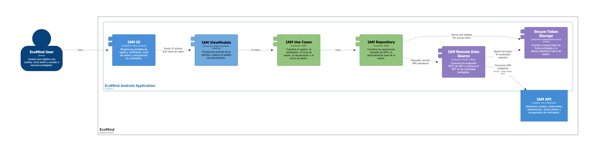

*Figura X. Diagrama C4 de componentes de la aplicación Android para el bounded context IAM, elaborado con Structurizr DSL.*

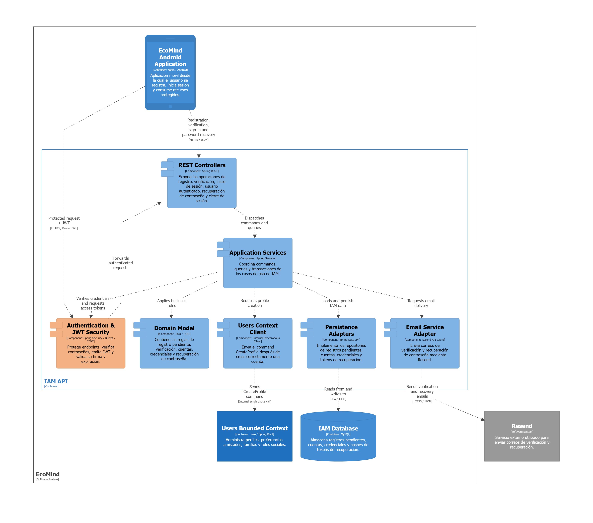

*Figura X. Diagrama C4 de componentes de la API del bounded context IAM, elaborado con Structurizr DSL.*

#### 2.6.1.6. Bounded Context Software Architecture Code Level Diagrams

En esta sección se presentan los diagramas que describen la estructura interna de IAM a nivel de código. Se documentan por separado el modelo de dominio y el diseño de persistencia para evitar mezclar las reglas del negocio con detalles técnicos de la base de datos.

##### 2.6.1.6.1. Bounded Context Domain Layer Class Diagrams

El diagrama de clases del Domain Layer representa los aggregates, entities, value objects, domain services y repositories que protegen el ciclo de vida de las cuentas y sus credenciales. Incluye el registro pendiente, la verificación del correo, la cuenta, la autenticación y los tokens de recuperación, sin incorporar perfiles, preferencias, amistades, familias ni roles sociales pertenecientes a Users.

##### 2.6.1.6.2. Bounded Context Database Design Diagram

El diagrama de base de datos presenta las estructuras de persistencia necesarias para las cuentas, las credenciales, los registros pendientes y los tokens de recuperación. Su diseño conserva únicamente hashes de contraseñas y tokens sensibles, registra sus fechas de expiración y consumo, y garantiza la unicidad del correo normalizado.

### 2.6.2. Bounded Context: Users
#### 2.6.2.1. Domain Layer
#### 2.6.2.2. Interface Layer
#### 2.6.2.3. Application Layer
#### 2.6.2.4. Infrastructure Layer
#### 2.6.2.5. Bounded Context Software Architecture Component Level Diagrams
#### 2.6.2.6. Bounded Context Software Architecture Code Level Diagrams
##### 2.6.2.6.1. Bounded Context Domain Layer Class Diagrams
##### 2.6.2.6.2. Bounded Context Database Design Diagram

### 2.6.3. Bounded Context: Learning

El bounded context **Learning** administra los materiales educativos ambientales de EcoMind. Permite consultar el catálogo, aplicar filtros, revisar el detalle de cada material, reproducir recursos multimedia, guardar favoritos, registrar revisiones y descargar contenido disponible para utilizarlo sin conexión.

#### 2.6.3.1. Domain Layer

La Domain Layer representa el catálogo de materiales educativos y las interacciones propias de Learning. Contiene las reglas necesarias para publicar contenido válido, administrar favoritos, registrar revisiones y validar descargas sin depender de la interfaz o de la persistencia.

**Sub-capa Model**

| Tipo | Nombre | Descripción | Responsabilidad principal | Relaciones |
|---|---|---|---|---|
| Aggregate Root | `EducationalMaterial` | Recurso educativo disponible en “Aprende más”. | Mantener título, resumen, tipo, idioma, categoría, URLs, disponibilidad y estado de publicación. | Referencia `MaterialCategory`; origina favoritos, revisiones y descargas. |
| Entity | `MaterialCategory` | Clasificación temática del contenido. | Organizar materiales por temas ambientales. | Agrupa múltiples `EducationalMaterial`. |
| Aggregate Root | `UserLearningLibrary` | Colección de aprendizaje de un usuario. | Controlar favoritos y evitar registros duplicados. | Compone `FavoriteMaterial`. |
| Entity | `FavoriteMaterial` | Relación entre un usuario y un material guardado. | Registrar cuándo se agregó un material a favoritos. | Referencia `EducationalMaterial`. |
| Aggregate Root | `MaterialReview` | Registro de revisión de un material. | Garantizar una única revisión vigente por usuario y material. | Referencia `EducationalMaterial` y `UserId`. |
| Entity | `MaterialDownload` | Registro de una descarga solicitada. | Auditar la entrega del recurso y su versión. | Referencia `EducationalMaterial` y `UserId`. |

**Sub-capa Model - Value Objects y Enumerations**

| Tipo | Nombre | Descripción |
|---|---|---|
| Value Object | `MaterialId` | Identificador único de un material educativo. |
| Value Object | `CategoryId` | Identificador de una categoría. |
| Value Object | `UserId` | Identificador extraído del principal autenticado por la capa de seguridad. |
| Value Object | `LanguageCode` | Código de idioma soportado, por ejemplo `es-PE`. |
| Value Object | `ContentUrl` | Dirección validada del contenido o recurso multimedia. |
| Value Object | `SearchCriteria` | Texto, categoría, tipo e idioma utilizados para filtrar el catálogo. |
| Enumeration | `MaterialType` | `READING`, `VIDEO`, `INFOGRAPHIC`. |
| Enumeration | `PublicationStatus` | `DRAFT`, `PUBLISHED`, `ARCHIVED`. |
| Enumeration | `DownloadStatus` | `REQUESTED`, `COMPLETED`, `FAILED`. |

**Sub-capa Model - Commands**

| Tipo | Nombre | Responsabilidad principal |
|---|---|---|
| Command | `CreateEducationalMaterialCommand` | Crear un material educativo válido. |
| Command | `UpdateEducationalMaterialCommand` | Actualizar la información y recursos de un material. |
| Command | `ArchiveEducationalMaterialCommand` | Retirar un material sin eliminar su historial. |
| Command | `AddMaterialToFavoritesCommand` | Agregar un material publicado a la colección del usuario. |
| Command | `RemoveMaterialFromFavoritesCommand` | Retirar un material de favoritos. |
| Command | `MarkMaterialReviewedCommand` | Registrar que el usuario revisó el material. |
| Command | `RegisterMaterialDownloadCommand` | Registrar la solicitud y resultado de una descarga. |

**Sub-capa Model - Queries**

| Tipo | Nombre | Responsabilidad principal |
|---|---|---|
| Query | `GetEducationalMaterialsQuery` | Obtener los materiales publicados. |
| Query | `GetEducationalMaterialByIdQuery` | Consultar el detalle de un material. |
| Query | `SearchEducationalMaterialsQuery` | Buscar por texto, categoría, tipo e idioma. |
| Query | `GetFavoriteMaterialsQuery` | Consultar los materiales favoritos del usuario. |

**Sub-capa Model - Domain Events**

| Tipo | Nombre | Responsabilidad principal |
|---|---|---|
| Domain Event | `EducationalMaterialPublishedEvent` | Informar que un material está disponible para consulta. |
| Domain Event | `MaterialAddedToFavoritesEvent` | Registrar que el usuario agregó un favorito. |
| Domain Event | `MaterialRemovedFromFavoritesEvent` | Registrar que el usuario eliminó un favorito. |
| Domain Event | `MaterialReviewedEvent` | Informar que el material fue revisado. |
| Domain Event | `MaterialDownloadedEvent` | Informar que la descarga concluyó correctamente. |

**Sub-capa Services**

| Tipo | Nombre | Responsabilidad principal |
|---|---|---|
| Domain Service | `MaterialPublicationPolicy` | Verificar título, contenido, idioma y recurso requerido antes de publicar. |
| Domain Service | `MaterialSearchService` | Aplicar criterios de búsqueda y ordenamiento del catálogo. |
| Domain Service | `FavoritePolicy` | Evitar favoritos duplicados y materiales no disponibles. |
| Domain Service | `DownloadPolicy` | Permitir la descarga solo cuando el material está publicado y es descargable. |

**Sub-capa Repositories**

| Tipo | Nombre | Responsabilidad principal |
|---|---|---|
| Repository | `EducationalMaterialRepository` | Guardar materiales y consultar catálogo, detalle y resultados de búsqueda. |
| Repository | `MaterialCategoryRepository` | Consultar las categorías disponibles. |
| Repository | `UserLearningLibraryRepository` | Persistir favoritos del usuario. |
| Repository | `MaterialReviewRepository` | Registrar y consultar materiales revisados. |
| Repository | `MaterialDownloadRepository` | Registrar las descargas solicitadas. |

#### 2.6.3.2. Interface Layer

**Sub-capa REST - Controllers**

| Tipo | Nombre | Descripción | Responsabilidad principal | Relación con otros elementos |
|---|---|---|---|---|
| Security Filter | `JwtAuthenticationFilter` | Filtro previo a los controllers. | Validar firma y expiración del JWT y construir el principal autenticado. | Entrega la solicitud autorizada a los controllers. |
| Security Context | `AuthenticatedUserProvider` | Acceso al usuario de la solicitud. | Proporcionar el `UserId` validado sin consultar nuevamente a IAM. | Utilizado por controllers y assemblers. |
| Controller | `EducationalMaterialsController` | API del catálogo educativo. | Listar, obtener, buscar, crear, actualizar y archivar materiales. | Invoca command y query services de materiales. |
| Controller | `FavoritesController` | API de favoritos. | Agregar, eliminar y consultar favoritos del usuario autenticado. | Invoca `LearningLibraryCommandService` y `LearningQueryService`. |
| Controller | `MaterialReviewsController` | API de materiales revisados. | Registrar una revisión y consultar su estado. | Invoca `MaterialReviewCommandService`. |
| Controller | `MaterialDownloadsController` | API de descargas. | Validar la descarga y entregar una URL segura. | Invoca `MaterialDownloadCommandService`. |

**Endpoints principales**

| Método y ruta | Responsabilidad |
|---|---|
| `GET /api/v1/educational-materials` | Listar materiales publicados y filtrar por idioma. |
| `GET /api/v1/educational-materials/{materialId}` | Obtener el detalle de un material. |
| `GET /api/v1/educational-materials/search` | Buscar materiales según los criterios proporcionados. |
| `POST /api/v1/educational-materials` | Crear un material educativo. |
| `PUT /api/v1/educational-materials/{materialId}` | Actualizar un material existente. |
| `DELETE /api/v1/educational-materials/{materialId}` | Archivar un material cuando corresponda. |
| `POST /api/v1/educational-materials/{materialId}/favorite` | Marcar o desmarcar un material como favorito. |
| `POST /api/v1/material-reviews` | Registrar que el usuario revisó un material. |

**Sub-capa REST - Resources y Assemblers**

| Tipo | Nombre | Responsabilidad principal |
|---|---|---|
| Request Resource | `CreateEducationalMaterialResource` | Transportar los datos necesarios para crear un material. |
| Request Resource | `UpdateEducationalMaterialResource` | Transportar los cambios permitidos sobre un material. |
| Request Resource | `MaterialSearchResource` | Transportar texto, categoría, tipo e idioma. |
| Request Resource | `FavoriteMaterialResource` | Transportar el material que será agregado o retirado; no acepta `userId`, pues se obtiene del principal autenticado. |
| Request Resource | `MaterialReviewResource` | Transportar el material revisado por el usuario. |
| Response Resource | `EducationalMaterialResource` | Exponer los datos y recursos seguros del material. |
| Response Resource | `LearningCatalogResource` | Exponer listado, filtros y paginación. |
| Assembler | `EducationalMaterialAssembler` | Convertir entre recursos REST y objetos del dominio. |

#### 2.6.3.3. Application Layer

La Application Layer coordina los casos de uso y las transacciones de Learning.
**Sub-capa Command Services**

| Tipo | Nombre | Responsabilidad principal | Relación con otros elementos |
|---|---|---|---|
| Command Handler | `EducationalMaterialCommandService` | Crear, actualizar, publicar o archivar materiales. | Utiliza `MaterialPublicationPolicy` y `EducationalMaterialRepository`. |
| Command Handler | `LearningLibraryCommandService` | Agregar o eliminar favoritos sin duplicados. | Utiliza `FavoritePolicy` y `UserLearningLibraryRepository`. |
| Command Handler | `MaterialReviewCommandService` | Registrar de forma idempotente que un material fue revisado. | Utiliza `MaterialReviewRepository`. |
| Command Handler | `MaterialDownloadCommandService` | Validar y registrar descargas. | Utiliza `DownloadPolicy`, almacenamiento y repositorio de descargas. |

**Sub-capa Query Services**

| Tipo | Nombre | Responsabilidad principal | Relación con otros elementos |
|---|---|---|---|
| Query Handler | `LearningQueryService` | Listar, buscar y obtener el detalle de materiales publicados. | Utiliza `EducationalMaterialRepository`. |
| Query Handler | `FavoritesQueryService` | Obtener los favoritos del usuario autenticado. | Utiliza `UserLearningLibraryRepository`. |

**Sub-capa Event Handlers**

| Tipo | Nombre | Responsabilidad principal |
|---|---|---|
| Event Handler | `EducationalMaterialPublishedEventHandler` | Invalidar y actualizar la caché del catálogo. |
| Event Handler | `MaterialDownloadedEventHandler` | Confirmar el registro de una descarga completada. |

**Use Cases de la aplicación Android**

`GetEducationalMaterialsUseCase`,
`SearchEducationalMaterialsUseCase`,
`GetEducationalMaterialDetailUseCase`,
`AddMaterialToFavoritesUseCase`,
`RemoveMaterialFromFavoritesUseCase`,
`GetFavoriteMaterialsUseCase`,
`MarkMaterialReviewedUseCase` y
`DownloadMaterialUseCase`.

Cada Use Case posee una responsabilidad concreta, se ejecuta desde un ViewModel y depende de contratos definidos por Domain o Application.

#### 2.6.3.4. Infrastructure Layer

La Infrastructure Layer implementa los contratos técnicos de Learning.

La Infrastructure Layer implementa los contratos técnicos de Learning. Contiene el acceso a la API REST, la persistencia relacional, la caché Room, la descarga local y la reproducción del contenido multimedia.

| Tipo | Nombre | Responsabilidad principal | Implementa o utiliza |
|---|---|---|---|
| Security Adapter | `JwtAuthenticationFilter` | Validar firma y expiración del JWT antes de ejecutar Learning. | Spring Security / JWT. |
| Security Adapter | `AuthenticatedPrincipalAdapter` | Proporcionar el `UserId` autenticado a Interface y Application. | No realiza una llamada a IAM por operación. |
| Local Data Source | `LearningDatabase` | Mantener catálogo, favoritos y descargas disponibles sin conexión. | Room. |
| Local DAO | `EducationalMaterialDao` | Consultar y reemplazar la caché de materiales. | `LearningDatabase`. |
| Local DAO | `FavoriteMaterialDao` | Mantener favoritos disponibles localmente. | `LearningDatabase`. |
| Local DAO | `DownloadedMaterialDao` | Registrar archivos descargados y su ruta local. | `LearningDatabase`. |
| Repository Implementation | `EducationalMaterialRepositoryImpl` | Combinar datos remotos y caché local. | Implementa `EducationalMaterialRepository`. |
| Repository Implementation | `UserLearningLibraryRepositoryImpl` | Sincronizar favoritos locales y remotos. | Implementa `UserLearningLibraryRepository`. |
| Persistence Adapter | `JpaEducationalMaterialRepository` | Persistir materiales en la base relacional. | Implementa el repositorio del backend. |
| Persistence Adapter | `JpaLearningActivityRepository` | Persistir favoritos, revisiones, descargas y progreso. | Implementa repositorios del usuario. |
| Content Delivery Adapter | `LearningContentDeliveryAdapter` | Entregar desde Learning API el archivo o la URL registrada para el material. | Utiliza los metadatos del catálogo y no depende de un sistema externo de almacenamiento. |
| Android Service | `MaterialDownloadManager` | Descargar archivos y reanudar operaciones según conectividad. | WorkManager y almacenamiento privado. |
| Media Adapter | `VideoPlayerAdapter` | Reproducir videos educativos desde URL o archivo local. | Media3/ExoPlayer. |
| Mapper | `EducationalMaterialMapper` | Convertir DTO, entidad Room y modelo de dominio. | Anti-Corruption Layer. |
| Dependency Injection | `LearningModule` | Vincular contratos con implementaciones. | Hilt. |

**Relaciones con otros contextos y sistemas**

| Colaborador | Relación con Learning |
|---|---|
| `IAM` | Autentica durante el inicio de sesión y emite el JWT. Luego, la capa de seguridad valida el token y obtiene el `UserId`; Learning no llama a IAM en cada operación ni conserva credenciales. |
| `Users` | Proporciona en el perfil el acceso visual a la sección de favoritos. Learning sigue siendo propietario y responsable de consultar esos favoritos mediante `userId`. |
| `Quests` | Proporciona el punto de navegación “Aprende más”. Abrir esa opción lleva a la UI de Learning, pero Quests no administra materiales. |
| `EcoMind Android Application` | Ejecuta la navegación entre Quests, perfil y Learning; consume Learning API mediante HTTPS/JSON. |

#### 2.6.3.5. Bounded Context Software Architecture Component Level Diagrams

El siguiente diagrama C4 muestra cómo se relaciona el bounded context de **Learning** con los principales componentes de EcoMind. Incluye la aplicación Android, la API de Learning y su base de datos. También representa la validación del token de acceso antes de ejecutar operaciones que requieren un usuario autenticado, como agregar o eliminar materiales favoritos y registrar descargas.

  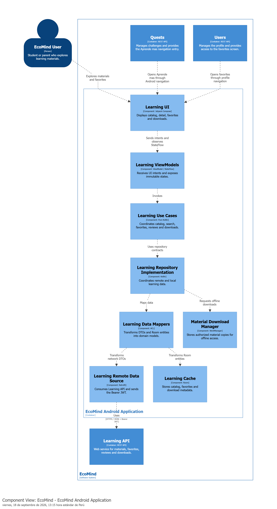

*Figura X. Diagrama C4 de componentes de la aplicación Android para el bounded context Learning, elaborado con Structurizr DSL.*

  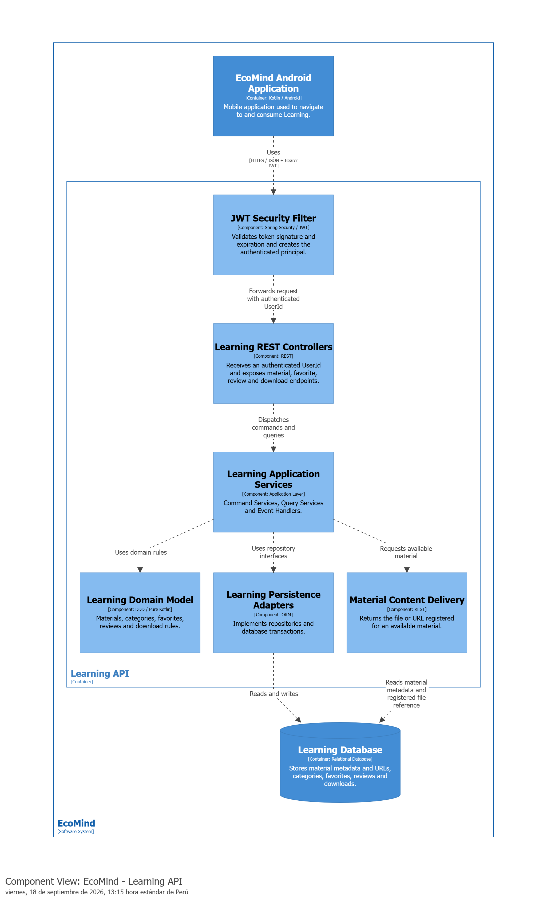

*Figura X. Diagrama C4 de componentes de la API del bounded context Learning, elaborado con Structurizr DSL.*

#### 2.6.3.6. Bounded Context Software Architecture Code Level Diagrams

En esta sección se presentan los diagramas que describen la estructura interna del bounded context de **Learning**, incluyendo sus principales clases de dominio y el diseño de su base de datos. Para mantener los diagramas claros y fáciles de comprender, los Commands, Queries, Use Cases y adaptadores se explican en las secciones anteriores.

##### 2.6.3.6.1. Bounded Context Domain Layer Class Diagrams

El diagrama de clases presenta los principales elementos del dominio de Learning y las relaciones entre ellos. Incluye los materiales educativos, sus categorías, favoritos, valoraciones y registros de descarga. También representa las operaciones necesarias para consultar y filtrar materiales, obtener sus detalles, descargarlos y administrar los materiales favoritos de cada usuario.

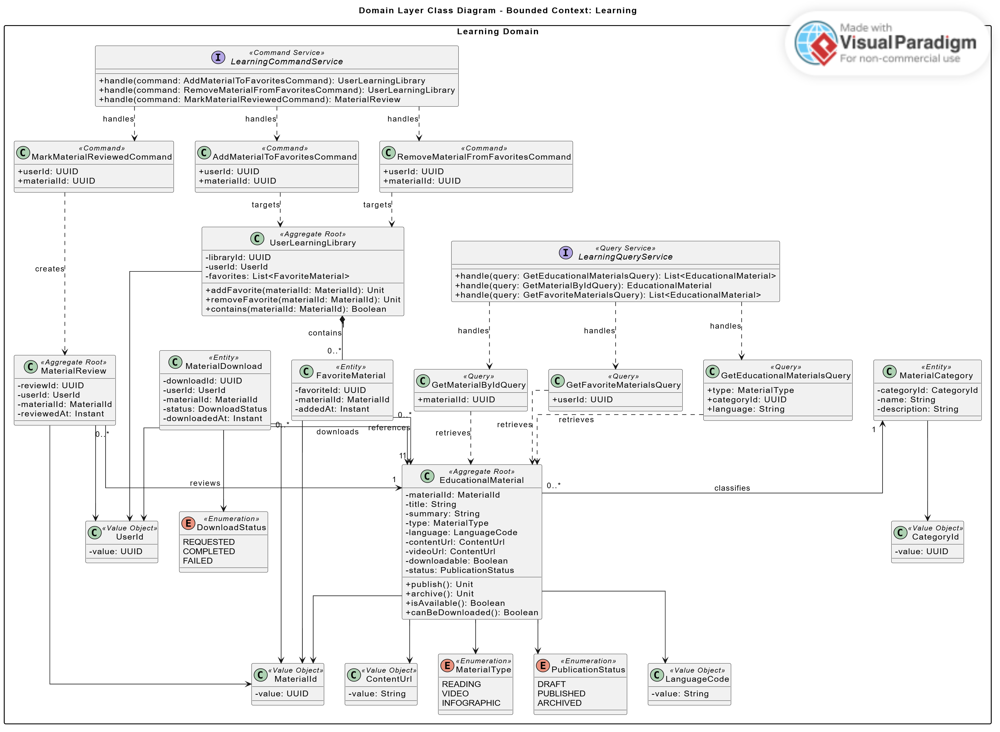

*Figura X. Diagrama de clases de la capa de dominio del bounded context Learning.*

##### 2.6.3.6.2. Bounded Context Database Design Diagram

El diagrama de base de datos presenta la estructura de persistencia utilizada por el bounded context de Learning. Incluye las tablas `material_categories`, `educational_materials`, `material_favorites`, `material_reviews` y `material_downloads`, así como sus claves y relaciones.

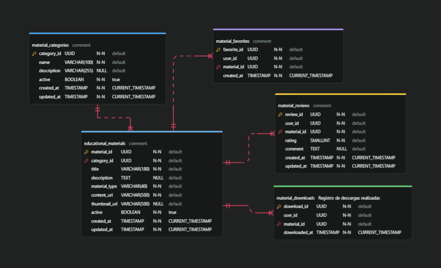

*Figura X. Diagrama de diseño de la base de datos del bounded context Learning.*

### 2.6.4. Bounded Context: Quests
El bounded context **Quests** administra las misiones ecológicas, sus actividades, las asignaciones a usuarios, los minijuegos, las misiones colaborativas y los planes familiares. También controla el progreso, consulta datos necesarios de **Users** y comunica a **Gamification** cuándo una misión fue completada.
#### 2.6.4.1. Domain Layer
En esta capa se representa el núcleo del bounded context y sus reglas de negocio.

**Sub-capa Model**
| Tipo | Nombre | Descripción | Responsabilidad principal | Relación con otros elementos |
|---|---|---|---|---|
| Aggregate Root | `Quest` | Versión persistente de una misión ecológica. | Mantener sus datos, categoría, tipo, recompensa, versión y estado de publicación sin eliminar el historial. | Se relaciona con `Activity`, `QuestUser`, `Minigame`, `CollabQuestSession`, `FamilyPlanItem` y las demás versiones de la misma misión. |
| Aggregate Root | `QuestUser` | Asignación de una misión a un usuario. | Controlar el progreso y los estados `IN_PROGRESS`, `READY_TO_COMPLETE`, `COMPLETED`, `EXPIRED` y `CANCELLED`. | Pertenece a una `Quest`, referencia a un usuario de `Users` y contiene ejecuciones `ActivityUser`. |
| Aggregate Root | `Minigame` | Definición de un minijuego. | Mantener su nombre, URL y reglas de finalización. | Puede estar asociado con una `Quest` y posee varios `MinigameAttempt`. |
| Aggregate Root | `MinigameAttempt` | Intento de un usuario en un minijuego. | Registrar puntaje, estado, fechas y metadatos del intento. | Se relaciona con `Minigame`, `Quest` y un usuario de `Users`. |
| Aggregate Root | `CollabQuestSession` | Ejecución compartida de una misión. | Controlar el inicio, finalización o cancelación de la sesión. | Pertenece a una `Quest` y agrupa varios `CollabQuestMember`. |
| Aggregate Root | `FamilyPlan` | Plan de misiones de una familia. | Administrar el ciclo `DRAFT`, `ACTIVE`, `COMPLETED` o `CANCELLED`. | Referencia a una familia de `Users` y contiene varios `FamilyPlanItem`. |
| Entity | `Activity` | Paso que forma parte de una misión. | Mantener la descripción, tipo, configuración y orden de ejecución. | Pertenece a `Quest` y origina instancias `ActivityUser`. |
| Entity | `ActivityUser` | Ejecución de una actividad por un usuario. | Registrar el avance entre 0 y 100 y su fecha de finalización. | Pertenece a `QuestUser` y referencia a `Activity`. |
| Entity | `CollabQuestMember` | Participante de una misión colaborativa. | Gestionar invitación, aceptación, rechazo o abandono. | Pertenece a `CollabQuestSession` y referencia a un usuario de `Users`. |
| Entity | `FamilyPlanItem` | Misión incluida en un plan familiar. | Vincular una misión y, cuando corresponde, una sesión colaborativa con el plan. | Pertenece a `FamilyPlan` y referencia a `Quest` y `CollabQuestSession`. |
| Value Object | `Reward` | Recompensa base asociada a una misión. | Representar los valores que Gamification deberá procesar al completarse la misión. | Es parte de `Quest` y se incluye en el evento enviado a `Gamification`. |
| Value Object | `Category` | Categoría ambiental de la misión. | Clasificar misiones como agua, reciclaje o energía. | Es utilizado por `Quest`. |
| Value Object | `QuestType` | Modalidad de una misión. | Diferenciar misiones de actividades, diarias, colaborativas, familiares y minijuegos. | Determina el flujo aplicado a `Quest`. |
| Value Object | `Theme` | Tema visual o mecánico de la misión. | Indicar la forma principal de presentación. | Es utilizado por `Quest`. |
| Value Object | `QuestStatus` | Estado de una asignación. | Representar el ciclo de vida de `QuestUser`. | Es utilizado por `QuestUser`. |
| Value Object | `QuestPublicationStatus` | Estado de publicación de una misión. | Representar si la misión está `DRAFT`, `PUBLISHED` o `ARCHIVED`. | Es utilizado por `Quest`; una misión archivada permanece consultable, pero no admite nuevas asignaciones. |
| Value Object | `ActivityType` | Tipo de respuesta de una actividad. | Determinar la forma en que se valida su cumplimiento. | Es utilizado por `Activity` y `ActivityUserCommandService`. |
| Value Object | `MinigameAttemptStatus` | Estado de un intento. | Representar si el intento está iniciado, completado o cancelado. | Es utilizado por `MinigameAttempt`. |
| Value Object | `CollabQuestStatus` | Estado de una sesión colaborativa. | Controlar las transiciones de la sesión. | Es utilizado por `CollabQuestSession`. |
| Value Object | `CollabMemberStatus` | Estado de un participante. | Representar invitación pendiente, aceptación, rechazo o abandono. | Es utilizado por `CollabQuestMember`. |
| Value Object | `MemberRole` | Rol dentro de una sesión. | Diferenciar al propietario de los participantes. | Es utilizado por `CollabQuestMember`. |
| Value Object | `FamilyPlanStatus` | Estado del plan familiar. | Controlar el ciclo de vida del plan. | Es utilizado por `FamilyPlan`. |

**Sub-capa Model - Commands**
| Nombre | Responsabilidad principal | Relación con otros elementos |
| --- | --- | --- |
| `CreateQuestCommand` | Transportar los datos de la nueva misión. | Atendido por `QuestCommandService`. |
| `UpdateQuestCommand` | Editar directamente un `DRAFT` o, si está `PUBLISHED`, archivar la versión original y crear una nueva copia `DRAFT` con los cambios. | Atendido transaccionalmente por `QuestCommandService` y devuelve la nueva versión. |
| `PublishQuestCommand` | Pasar una misión de `DRAFT` a `PUBLISHED`. | Atendido por `QuestCommandService`. |
| `ArchiveQuestCommand` | Retirarla del catálogo asignable sin eliminarla ni romper el historial. | Atendido por `QuestCommandService`. |
| `CreateActivityCommand` | Incorporar una actividad ordenada a una misión. | Atendido por `ActivityCommandService`. |
| `UpdateActivityCommand` | Modificar contenido, configuración u orden. | Atendido por `ActivityCommandService`. |
| `DeleteActivityCommand` | Retirar una actividad y reorganizar las restantes. | Atendido por `ActivityCommandService`. |
| `CreateQuestUserCommand` | Asociar una misión con un usuario. | Atendido por `QuestUserCommandService`. |
| `CompleteQuestUserCommand` | Confirmar la misión y publicar su finalización. | Atendido por `QuestUserCommandService`. |
| `CancelQuestUserCommand` | Cambiar su estado a `CANCELLED` conservando el registro histórico. | Atendido por `QuestUserCommandService`. |
| `CreateActivityUserCommand` | Asociar una actividad con una asignación. | Atendido por `ActivityUserCommandService`. |
| `SubmitActivityUserCommand` | Actualizar la actividad y recalcular el progreso de la misión. | Atendido por `ActivityUserCommandService`. |
| `CreateMinigameCommand` | Registrar sus datos y reglas de finalización. | Atendido por `MinigameCommandService`. |
| `DeleteMinigameCommand` | Retirar un minijuego que no esté siendo utilizado. | Atendido por `MinigameCommandService`. |
| `CreateMinigameAttemptCommand` | Crear un intento en estado `STARTED`. | Atendido por `MinigameAttemptCommandService`. |
| `FinishMinigameAttemptCommand` | Validar el resultado y publicar la finalización del minijuego. | Atendido por `MinigameAttemptCommandService`. |
| `CancelMinigameAttemptCommand` | Cancelar un intento iniciado. | Atendido por `MinigameAttemptCommandService`. |
| `CreateCollabQuestSessionCommand` | Crear la sesión y definir a su propietario. | Atendido por `CollabQuestSessionCommandService`. |
| `StartCollabQuestSessionCommand` | Iniciar una sesión pendiente con miembros válidos. | Atendido por `CollabQuestSessionCommandService`. |
| `DeletePendingCollabQuestSessionCommand` | Retirar una sesión que todavía no comenzó. | Atendido por `CollabQuestSessionCommandService`. |
| `InviteCollabQuestMemberCommand` | Añadir un participante elegible. | Atendido por `CollabQuestMemberCommandService`. |
| `AcceptCollabQuestMemberCommand` | Confirmar la participación del usuario. | Atendido por `CollabQuestMemberCommandService`. |
| `DeclineCollabQuestMemberCommand` | Registrar que el usuario no participará. | Atendido por `CollabQuestMemberCommandService`. |
| `LeaveCollabQuestMemberCommand` | Retirar a un participante aceptado. | Atendido por `CollabQuestMemberCommandService`. |
| `RemoveCollabQuestMemberCommand` | Permitir al propietario retirar una invitación o participante. | Atendido por `CollabQuestMemberCommandService`. |
| `CreateFamilyPlanCommand` | Crear el plan y sus ítems. | Atendido por `FamilyPlanCommandService`. |
| `UpdateFamilyPlanCommand` | Reemplazar o reorganizar sus misiones. | Atendido por `FamilyPlanCommandService`. |
| `ActivateFamilyPlanCommand` | Pasar el plan de `DRAFT` a `ACTIVE`. | Atendido por `FamilyPlanCommandService`. |
| `CompleteFamilyPlanCommand` | Completar el plan y publicar el hecho de negocio. | Atendido por `FamilyPlanCommandService`. |
| `DeleteFamilyPlanCommand` | Retirar un plan permitido por las reglas de estado. | Atendido por `FamilyPlanCommandService`. |
| `FamilyPlanItemCommand` | Representar cada ítem solicitado durante la creación o edición. | Forma parte de los comandos de `FamilyPlan`. |

**Sub-capa Model - Queries**
| Nombre | Responsabilidad principal | Relación con otros elementos |
| --- | --- | --- |
| `GetQuestByIdQuery` | Obtener una misión específica. | Atendida por `QuestQueryService`. |
| `GetPublishedQuestsQuery` | Obtener únicamente las misiones publicadas. | Atendida por `QuestQueryService`. |
| `SearchQuestQuery` | Filtrar el catálogo mediante criterios. | Atendida por `QuestQueryService`. |
| `GetActivityByIdQuery` | Obtener una actividad específica. | Atendida por `ActivityQueryService`. |
| `GetActivitiesByQuestIdQuery` | Obtener sus actividades en orden. | Atendida por `ActivityQueryService`. |
| `GetQuestUserByIdQuery` | Obtener una ejecución de misión. | Atendida por `QuestUserQueryService`. |
| `GetQuestUserByUserIdAndQuestIdQuery` | Localizar la ejecución correspondiente. | Atendida por `QuestUserQueryService`. |
| `GetQuestUsersByUserIdAndStatusQuery` | Listar misiones de un usuario según su situación. | Atendida por `QuestUserQueryService`. |
| `GetQuestUserVersionStatusQuery` | Determinar si el usuario posee la misión diaria vigente. | Atendida por `QuestUserQueryService`. |
| `GetActivityUserByIdQuery` | Obtener su estado y progreso. | Atendida por `ActivityUserQueryService`. |
| `GetActivityUsersByQuestUserIdQuery` | Listar todas las ejecuciones de actividad. | Atendida por `ActivityUserQueryService`. |
| `GetMinigameByIdQuery` | Obtener su definición y reglas. | Atendida por `MinigameQueryService`. |
| `GetAllMinigamesQuery` | Obtener el catálogo de minijuegos. | Atendida por `MinigameQueryService`. |
| `GetMinigameAttemptsByUserAndMinigameQuery` | Listar intentos de un usuario en un minijuego. | Atendida por `MinigameAttemptQueryService`. |
| `GetCollabQuestSessionStateQuery` | Obtener sesión, miembros, permisos y contadores. | Atendida por `CollabQuestSessionQueryService`. |
| `GetFamilyPlanByIdQuery` | Obtener un plan y sus ítems. | Atendida por `FamilyPlanQueryService`. |
| `GetFamilyPlansByFamilyIdQuery` | Listar su historial de planes. | Atendida por `FamilyPlanQueryService`. |
| `GetActiveFamilyPlanByFamilyIdQuery` | Obtener el plan actualmente ejecutado. | Atendida por `FamilyPlanQueryService`. |

**Sub-capa Model - Domain Events**
| Tipo | Nombre | Responsabilidad principal | Relación con otros elementos |
| --- | --- | --- | --- |
| Domain Event | `QuestCreatedEvent` | Notificar que la misión fue registrada. | Publicado por `Quest`. |
| Domain Event | `ActivityCreatedEvent` | Notificar la incorporación del paso. | Publicado por `Activity`. |
| Domain Event | `QuestUserCreatedEvent` | Notificar el inicio de una ejecución. | Publicado por `QuestUser`. |
| Domain Event | `ActivityUserCreatedEvent` | Notificar la creación de su registro de ejecución. | Publicado por `ActivityUser`. |
| Domain Event | `CollabQuestSessionCreatedEvent` | Notificar la apertura de una sesión. | Publicado por `CollabQuestSession`. |
| Domain Event | `CollabQuestMemberCreatedEvent` | Notificar una nueva invitación. | Publicado por `CollabQuestMember`. |
| Integration Event | `QuestCompletedIntegrationEvent` | Comunicar usuario, misión, tipo, fecha y recompensa base. | Consumido por `Gamification`. |
| Integration Event | `MinigameCompletedIntegrationEvent` | Comunicar usuario, misión, intento y puntaje alcanzado. | Consumido por `Gamification`. |
| Integration Event | `CollaborativeQuestCompletedIntegrationEvent` | Comunicar la misión, sesión y participantes que la completaron. | Consumido por `Gamification`. |
| Integration Event | `FamilyPlanCompletedIntegrationEvent` | Comunicar familia, plan y participantes. | Consumido por `Gamification`. |

**Sub-capa Repositories**
| Tipo | Nombre | Responsabilidad principal | Relación con otros elementos |
| --- | --- | --- | --- |
| Repository | `QuestRepository` | Guardar y consultar misiones activas o históricas sin eliminación física. | Utilizado por servicios de misión. |
| Repository | `ActivityRepository` | Persistir actividades y consultar su orden. | Utilizado por servicios de actividad. |
| Repository | `QuestUserRepository` | Consultar progreso por usuario, misión, fecha y estado. | Utilizado por servicios de ejecución. |
| Repository | `ActivityUserRepository` | Guardar entregas y consultar el progreso de una misión. | Utilizado por `ActivityUserCommandService`. |
| Repository | `MinigameRepository` | Mantener el catálogo de juegos. | Utilizado por servicios de minijuego. |
| Repository | `MinigameAttemptRepository` | Mantener intentos e impedir intentos activos duplicados. | Utilizado por servicios de intento. |
| Repository | `CollabQuestSessionRepository` | Persistir y consultar sesiones. | Utilizado por servicios colaborativos. |
| Repository | `CollabQuestMemberRepository` | Mantener invitaciones y membresías. | Utilizado por servicios colaborativos. |
| Repository | `FamilyPlanRepository` | Mantener planes por familia y estado. | Utilizado por servicios familiares. |
| Repository | `FamilyPlanItemRepository` | Mantener las misiones incluidas en cada plan. | Utilizado por `FamilyPlanCommandService`. |
| Application Event Publisher | `QuestEventPublisher` | Definir la publicación interna de eventos de finalización sin acoplar Quests a Gamification. | Es utilizado por los Event Handlers e implementado en Infrastructure Layer. |

#### 2.6.4.2. Interface Layer
Esta capa expone los casos de uso mediante una API REST.

**Sub-capa REST - Controllers**

| Tipo | Nombre | Responsabilidad principal | Relación con otros elementos |
| --- | --- | --- | --- |
| Controller | `QuestController` | Exponer creación, modificación versionada, publicación, archivado y consulta. | Al modificar una misión publicada responde con la nueva versión `DRAFT`. |
| Controller | `ActivityController` | Exponer mantenimiento y consulta de actividades. | Invoca servicios de `Activity`. |
| Controller | `QuestUserController` | Exponer asignación, progreso y finalización. | Invoca servicios de `QuestUser`. |
| Controller | `ActivityUserController` | Recibir respuestas de actividades. | Invoca servicios de `ActivityUser`. |
| Controller | `MinigameController` | Exponer el catálogo de juegos. | Invoca servicios de `Minigame`. |
| Controller | `MinigameAttemptController` | Iniciar, finalizar y cancelar intentos. | Invoca servicios de `MinigameAttempt`. |
| Controller | `CollaborativeQuestController` | Crear, iniciar y consultar sesiones. | Invoca servicios colaborativos. |
| Controller | `CollabQuestMemberController` | Gestionar invitaciones y miembros. | Invoca `CollabQuestMemberCommandService`. |
| Controller | `FamilyPlanController` | Gestionar y consultar planes familiares. | Invoca servicios de `FamilyPlan`. |

**Sub-capa REST - Resources y Assemblers**

| Tipo | Nombre | Responsabilidad principal | Relación con otros elementos |
| --- | --- | --- | --- |
| Request Resource | `Create*Resource` | Validar la estructura de entrada. | Convertido a command por un assembler. |
| Request Resource | `Update*Resource` | Validar cambios solicitados. | Convertido a command por un assembler. |
| Request Resource | `SubmitActivityUserResource` | Transportar los datos de la entrega. | Se convierte en `SubmitActivityUserCommand`. |
| Request Resource | `FinishMinigameAttemptResource` | Transportar puntaje y metadatos. | Se convierte en `FinishMinigameAttemptCommand`. |
| Response Resource | `QuestResource` | Exponer información del catálogo. | Ensamblado desde `Quest`. |
| Response Resource | `QuestUserResource` | Exponer estado y progreso. | Ensamblado desde `QuestUser`. |
| Response Resource | `CollabQuestSessionStateResource` | Exponer miembros, contadores y permisos. | Ensamblado desde el modelo de lectura colaborativo. |
| Response Resource | `FamilyPlanResource` | Exponer estado e ítems. | Ensamblado desde `FamilyPlanState`. |
| Assembler | `*CommandFromResourceAssembler` | Convertir resources REST en commands. | Conecta controllers con Application Layer. |
| Assembler | `*ResourceFromEntityAssembler` | Convertir modelos del dominio en resources. | Conecta Application Layer con controllers. |
| Assembler | `ResponseEntityAssembler` | Uniformizar respuestas exitosas. | Utilizado por los controllers. |
| Assembler | `ErrorResponseAssembler` | Uniformizar respuestas de error. | Utilizado por los controllers. |

#### 2.6.4.3. Application Layer
En esta capa se coordinan los casos de uso y la comunicación con otros bounded contexts.

**Sub-capa Command Services**

| Nombre | Responsabilidad principal | Relación con otros elementos |
| --- | --- | --- |
| `QuestCommandService`, `ActivityCommandService`, `MinigameCommandService` | Crear, versionar, publicar y archivar misiones; mantener sus actividades y minijuegos. | Utilizan los repositorios del catálogo. |
| `QuestUserCommandService`, `ActivityUserCommandService`, `MinigameAttemptCommandService` | Iniciar, completar o cancelar misiones, procesar actividades y controlar intentos. | Utilizan los repositorios de ejecución. |
| `CollabQuestSessionCommandService`, `CollabQuestMemberCommandService` | Crear sesiones, gestionar invitaciones y controlar participantes. | Utilizan repositorios colaborativos y consultan `Users`. |
| `FamilyPlanCommandService` | Crear, editar, activar y completar planes. | Consulta familias en `Users`. |

**Sub-capa Query Services**

| Nombre | Responsabilidad principal | Relación con otros elementos |
| --- | --- | --- |
| `QuestQueryService`, `ActivityQueryService`, `MinigameQueryService` | Obtener misiones publicadas, actividades, minijuegos y versiones históricas. | Utilizan los repositorios del catálogo. |
| `QuestUserQueryService`, `ActivityUserQueryService`, `MinigameAttemptQueryService` | Consultar asignaciones, avances e historial de intentos. | Utilizan los repositorios de ejecución. |
| `CollabQuestSessionQueryService` | Construir el estado completo de una sesión y sus participantes. | Utiliza repositorios colaborativos. |
| `FamilyPlanQueryService` | Construir el estado de los planes. | Utiliza repositorios familiares. |

**Sub-capa Event Handlers**

| Nombre | Responsabilidad principal | Relación con otros elementos |
| --- | --- | --- |
| `QuestCompletedEventHandler`, `MinigameCompletedEventHandler`, `CollaborativeQuestCompletedEventHandler` | Publicar la finalización de misiones individuales, colaborativas y minijuegos. | Informan a `Gamification` el tipo de ejecución y sus participantes. |
| `FamilyPlanCompletedEventHandler` | Publicar la finalización del plan familiar. | Informa a `Gamification` la familia, el plan y sus participantes. |

#### 2.6.4.4. Infrastructure Layer
Esta capa contiene las clases que implementan la persistencia y la comunicación con servicios externos.

| Tipo | Nombre | Responsabilidad principal | Relación con otros elementos |
| --- | --- | --- | --- |
| Repository Implementations | `QuestRepositoryImpl`, `ActivityRepositoryImpl`, `MinigameRepositoryImpl` | Persistir versiones de misiones, actividades y minijuegos. | Implementan los repositories de catálogo del Domain Layer. |
| Repository Implementations | `QuestUserRepositoryImpl`, `ActivityUserRepositoryImpl`, `MinigameAttemptRepositoryImpl` | Persistir asignaciones, progreso e intentos. | Implementan los repositories de ejecución del Domain Layer. |
| Repository Implementations | `CollabQuestSessionRepositoryImpl`, `CollabQuestMemberRepositoryImpl` | Persistir sesiones, invitaciones y participantes. | Implementan los repositories colaborativos. |
| Repository Implementations | `FamilyPlanRepositoryImpl`, `FamilyPlanItemRepositoryImpl` | Persistir planes familiares y sus misiones. | Implementan los repositories familiares. |
| External Service Client | `UsersServiceClient` | Consultar usuarios, amistades, familias y roles necesarios para validar un caso de uso. | Es utilizado por los command handlers colaborativos y familiares. |
| Application Event Publisher Implementation | `SpringQuestEventPublisher` | Publicar los eventos de finalización dentro del backend mediante Spring Application Events. | Es utilizado por los Event Handlers y permite que `Gamification` procese los hechos sin una llamada directa. |

**Relaciones entre bounded contexts**

| Bounded Context | Relación con Quests |
|---|---|
| `Users` | Proporciona los datos de usuarios, amistades, familias y roles requeridos para validar la participación. |
| `Gamification` | Consume eventos de misión, minijuego y plan completado para asignar puntos, actualizar rankings y evaluar logros. |

Las consultas necesarias se realizan mediante `UsersServiceClient`, mientras que las finalizaciones se comunican internamente a `Gamification` mediante `SpringQuestEventPublisher` y Spring Application Events.

**Mobile Application - Quests Feature**

La aplicación móvil consume los casos de uso del backend sin duplicar sus reglas de negocio.

| Tipo | Nombre | Responsabilidad principal | Relación con otros elementos |
|---|---|---|---|
| Use Cases | `GetQuestCatalogUseCase`, `GetQuestDetailUseCase`, `StartQuestUseCase` | Consultar misiones y comenzar una ejecución. | Utilizan `QuestsMobileRepository`. |
| Use Cases | `GetQuestProgressUseCase`, `SubmitActivityUseCase`, `CompleteQuestUseCase`, `PlayMinigameUseCase` | Gestionar el avance de una misión desde el dispositivo. | Utilizan `QuestsMobileRepository`. |
| Use Cases | `GetCollaborativeQuestUseCase`, `ManageQuestMembersUseCase` | Consultar sesiones y gestionar invitaciones colaborativas. | Utilizan `QuestsMobileRepository`. |
| Use Cases | `GetFamilyPlanUseCase`, `ManageFamilyPlanUseCase` | Consultar y administrar el plan familiar. | Utilizan `QuestsMobileRepository`. |
| ViewModel | `QuestCatalogViewModel`, `QuestExecutionViewModel` | Administrar el estado de las pantallas de catálogo, detalle y progreso. | Invocan los use cases de catálogo y ejecución. |
| ViewModel | `CollaborativeQuestViewModel`, `FamilyPlanViewModel` | Administrar el estado de las pantallas colaborativas y familiares. | Invocan los use cases correspondientes. |
| Remote Service | `QuestsApiService` | Consumir los endpoints REST del bounded context Quests. | Es utilizado por `QuestsMobileRepositoryImpl`. |
| Repository Implementation | `QuestsMobileRepositoryImpl` | Implementar el acceso móvil a Quests. | Implementa `QuestsMobileRepository` y utiliza `QuestsApiService`. |
| Mapper | `QuestMobileMapper` | Convertir DTOs de red en modelos utilizados por la aplicación móvil. | Es utilizado por `QuestsMobileRepositoryImpl`. |

#### 2.6.4.5. Bounded Context Software Architecture Component Level Diagrams
En esta sección se presentan los diagramas de componentes correspondientes al bounded context Quests. Debido a que sus funcionalidades se distribuyen entre la aplicación móvil y la API backend, se incluye un diagrama para cada container. Estos diagramas muestran los principales componentes de cada container, sus responsabilidades e interacciones, así como la comunicación de Quests con otros bounded contexts y servicios de infraestructura.

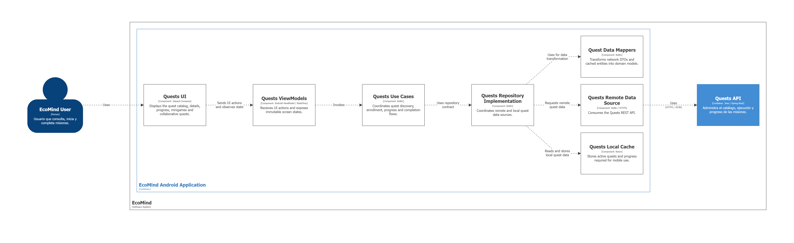

*Figura X. Diagrama C4 de componentes de la aplicación Android para el bounded context Quests, elaborado con Structurizr DSL.*

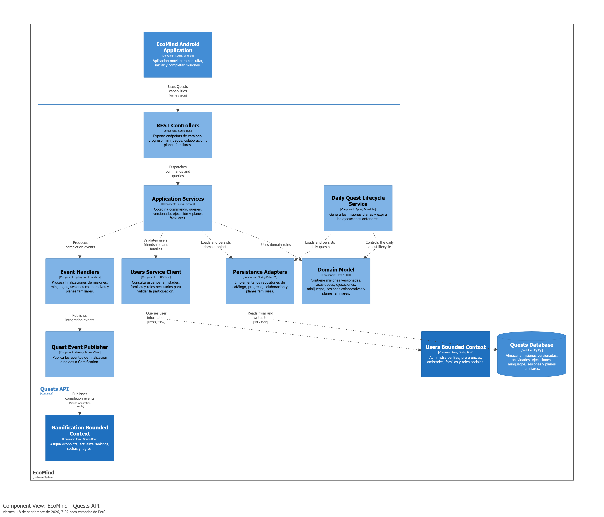

*Figura X. Diagrama C4 de componentes de la API del bounded context Quests, elaborado con Structurizr DSL.*

#### 2.6.4.6. Bounded Context Software Architecture Code Level Diagrams
Los diagramas permiten identificar sus principales elementos de dominio, las relaciones entre ellos y la manera en que representan las reglas de negocio asociadas con las misiones, su ejecución, los minijuegos, la colaboración y los planes familiares.

##### 2.6.4.6.1. Bounded Context Domain Layer Class Diagrams
El siguiente diagrama muestra las clases que conforman el Domain Layer de Quests, organizadas según sus principales capacidades. Se incluyen aggregates, entities, value objects y enumeraciones responsables de representar el catálogo de misiones, el progreso de los usuarios, los minijuegos, las misiones colaborativas y los planes familiares.

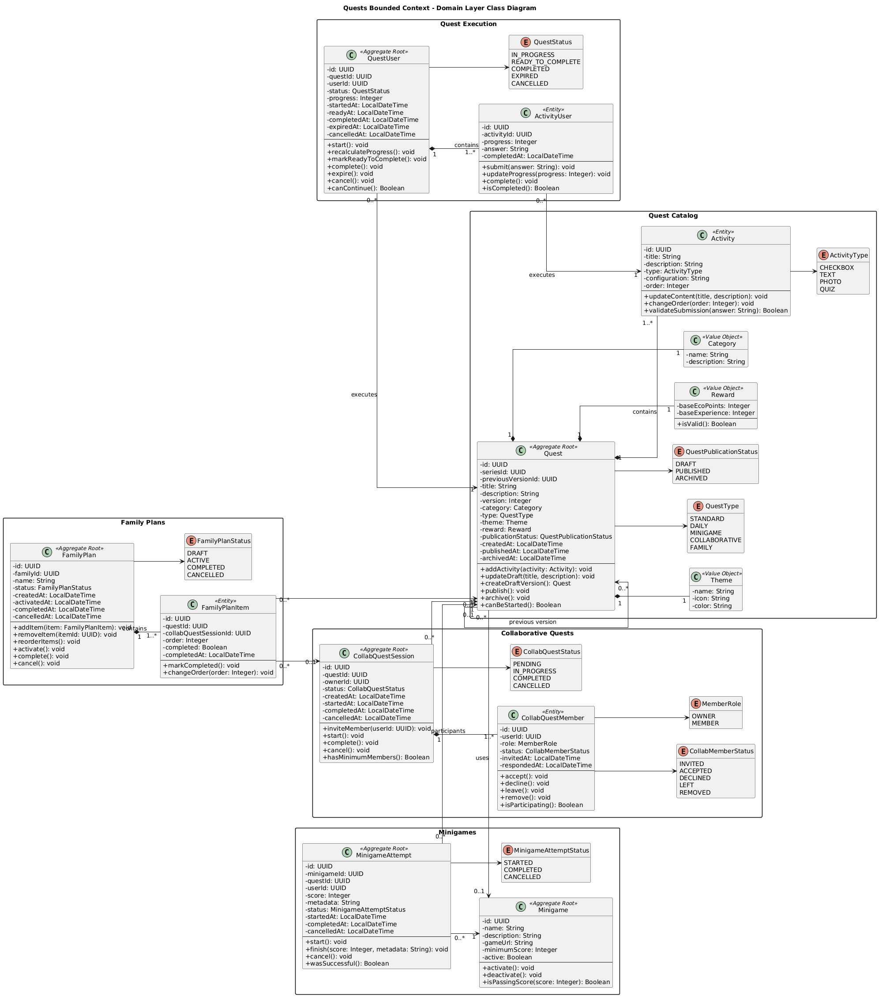
*Figura X. Diagrama de clases del bounded context quest, elaborado con plantuml.*

##### 2.6.4.6.2. Bounded Context Database Design Diagram
El presente diagrama representa el modelo de base de datos del bounded context **Quests** de EcoMind. Este contexto gestiona la definición y ejecución de retos, actividades, minijuegos, retos colaborativos y planes familiares, además de registrar el progreso de los usuarios. Las relaciones internas se representan mediante claves foráneas, mientras que los identificadores pertenecientes a otros bounded contexts, como usuarios y familias, se conservan como referencias externas para mantener la independencia entre contextos.

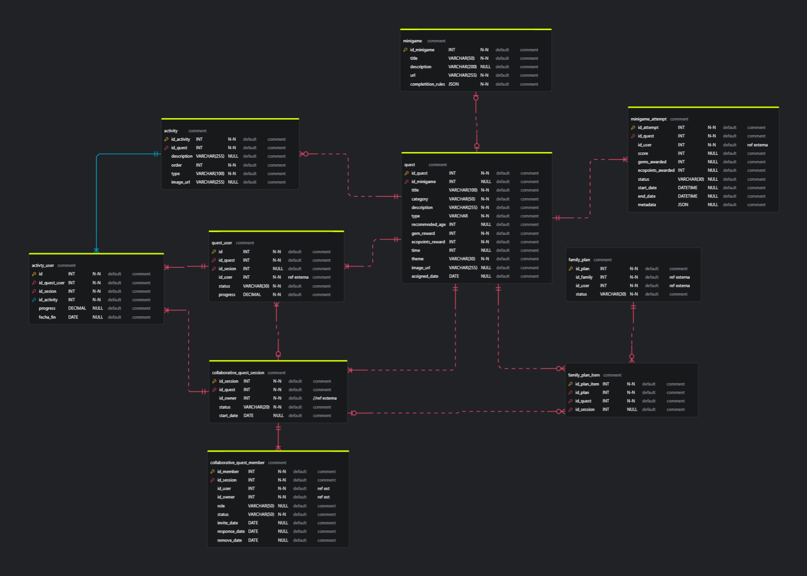
*Figura X. Diagrama de diseño de la base de datos del bounded context Quests.*

### 2.6.5. Bounded Context: Community
#### 2.6.5.1. Domain Layer
#### 2.6.5.2. Interface Layer
#### 2.6.5.3. Application Layer
#### 2.6.5.4. Infrastructure Layer
#### 2.6.5.5. Bounded Context Software Architecture Component Level Diagrams
#### 2.6.5.6. Bounded Context Software Architecture Code Level Diagrams
##### 2.6.5.6.1. Bounded Context Domain Layer Class Diagrams
##### 2.6.5.6.2. Bounded Context Database Design Diagram

### 2.6.6. Bounded Context: Gamification
#### 2.6.6.1. Domain Layer
#### 2.6.6.2. Interface Layer
#### 2.6.6.3. Application Layer
#### 2.6.6.4. Infrastructure Layer
#### 2.6.6.5. Bounded Context Software Architecture Component Level Diagrams
#### 2.6.6.6. Bounded Context Software Architecture Code Level Diagrams
##### 2.6.6.6.1. Bounded Context Domain Layer Class Diagrams
##### 2.6.6.6.2. Bounded Context Database Design Diagram

### 2.6.7. Bounded Context: Monetization

El bounded context **Monetization** administra la economía virtual y la tienda de EcoMind. Su catálogo está organizado en tres secciones visibles: **avatares y cosméticos**, **multiplicadores y protectores**, y **paquetes de gemas**. Los cosméticos, multiplicadores y protectores se adquieren con gemas; los paquetes de gemas se compran con dinero real mediante tarjeta, Yape o PayPal. El contexto también controla el saldo, los movimientos de gemas, el inventario comercial, las compras y las órdenes de pago.

Los protectores de racha se incorporan sin trasladar la propiedad de la racha a Monetization. **Gamification** conserva la racha y detecta que está en riesgo; Monetization posee el inventario de protectores, consume una unidad disponible y publica la confirmación necesaria para que Gamification mantenga la racha.

#### 2.6.7.1. Domain Layer

**Sub-capa Model**

| Tipo | Nombre | Descripción | Responsabilidad principal | Relaciones |
|---|---|---|---|---|
| Aggregate Root | Store | Tienda virtual de EcoMind. | Exponer los catálogos de Cosmetic, Multiplier, StreakProtector y GemPackage. | Compone las cuatro colecciones. |
| Entity | Cosmetic | Avatar o accesorio visual. | Mantener tipo, slot, precio en gemas y disponibilidad. | Pertenece a Store; es referenciado por UserCosmetic. |
| Entity | Multiplier | Potenciador temporal de XP. | Mantener factor, duración, precio y disponibilidad. | Pertenece a Store; origina UserMultiplier. |
| Entity | StreakProtector | Producto consumible que preserva una racha. | Mantener nombre, precio y disponibilidad. | Pertenece a Store; incrementa ProtectorInventory. |
| Entity | GemPackage | Paquete de gemas pagado con dinero real. | Mantener cantidad de gemas y precio monetario. | Pertenece a Store; es seleccionado por GemOrder. |
| Aggregate Root | GemWallet | Billetera de gemas del usuario. | Acreditar y debitar sin permitir saldo negativo. | Compone GemMovement. |
| Entity | GemMovement | Movimiento inmutable de gemas. | Auditar compras, recompensas, créditos y devoluciones. | Pertenece a GemWallet. |
| Aggregate Root | Purchase | Compra de cosmético, multiplicador o protector. | Conservar ítem, precio histórico, estado y resultado. | Debita GemWallet y concede el beneficio. |
| Aggregate Root | UserInventory | Inventario de avatares y cosméticos. | Evitar duplicados y controlar equipamiento por slot. | Compone UserCosmetic. |
| Entity | UserCosmetic | Cosmético obtenido por compra o logro. | Registrar procedencia y estado de equipamiento. | Referencia Cosmetic. |
| Aggregate Root | UserMultiplier | Activación de un multiplicador adquirido. | Controlar factor, inicio, expiración y estado. | Referencia Multiplier. |
| Aggregate Root | ProtectorInventory | Inventario consumible de protectores. | Incrementar, comprobar y consumir unidades de forma atómica. | Referencia StreakProtector y un usuario. |
| Aggregate Root | GemOrder | Orden para comprar gemas. | Controlar método, importe, transición de pago e idempotencia. | Referencia GemPackage. |

**Sub-capa Model - Value Objects y Enumerations**

| Tipo | Nombre | Descripción |
|---|---|---|
| Value Object | UserId | Identificador extraído del principal autenticado por la capa de seguridad. || Value Object | CosmeticId | Identificador de un cosmético. |
| Value Object | MultiplierId | Identificador de un multiplicador. |
| Value Object | ProtectorId | Identificador de un protector. |
| Value Object | GemPackageId | Identificador de un paquete de gemas. |
| Value Object | GemBalance | Saldo entero no negativo. |
| Value Object | GemPrice | Precio entero en gemas mayor que cero. |
| Value Object | Money | Importe positivo y moneda ISO 4217. |
| Value Object | Duration | Duración positiva del multiplicador. |
| Value Object | PaymentMethod | Método seleccionado y referencia segura, sin datos financieros sensibles. |
| Enumeration | CosmeticType | `AVATAR`, `HEAD`, `BODY`, `ACCESSORY`. |
| Enumeration | PurchasableType | `COSMETIC`, `MULTIPLIER`, `STREAK_PROTECTOR`. |
| Enumeration | PurchaseStatus| `PENDING`, `COMPLETED`, `REJECTED`. |
| Enumeration | MultiplierStatus| `ACTIVE`, `EXPIRED`. |
| Enumeration | AcquisitionSource | `PURCHASE`, `ACHIEVEMENT_REWARD`. |
| Enumeration | GemMovementType | `PURCHASE_DEBIT`, `GEM_PURCHASE_CREDIT`, `REWARD_CREDIT`, `REFUND_CREDIT`. |
| Enumeration | PaymentMethodType | `CARD`, `YAPE`, `PAYPAL`. |
| Enumeration | PaymentStatus | `CREATED`, `PROCESSING`, `APPROVED`, `REJECTED`, `CANCELLED`. |

**Sub-capa Model - Commands**

| Tipo | Nombre | Responsabilidad principal |
|---|---|---|
| Command | BuyCosmeticCommand | Comprar un avatar o cosmético con gemas. |
| Command | EquipCosmeticCommand | Equipar un cosmético previamente obtenido. |
| Command | GrantCosmeticRewardCommand | Registrar un cosmético recibido por logro. |
| Command | BuyMultiplierCommand | Comprar y activar un multiplicador. |
| Command | BuyStreakProtectorCommand | Comprar un protector si la racha está activa y existe saldo suficiente. |
| Command | ConsumeStreakProtectorCommand | Consumir automáticamente una unidad cuando Gamification informa que la racha está en riesgo. |
| Command | CreateGemOrderCommand | Crear una orden de compra de gemas. |
| Command | ConfirmGemPaymentCommand| Confirmar idempotentemente un pago aprobado. |
| Command | CreditRewardGemsCommand | Acreditar las gemas concedidas por Gamification. |

**Sub-capa Model - Queries**

| Tipo | Nombre | Responsabilidad principal |
|---|---|---|
| Query | GetCosmeticsQuery | Consultar avatares y cosméticos disponibles. |
| Query | GetMultipliersAndProtectorsQuery | Consultar multiplicadores y protectores disponibles. |
| Query | GetGemPackagesQuery | Consultar paquetes de gemas. |
| Query | GetWalletBalanceQuery | Consultar saldo actualizado. |
| Query | GetCosmeticsQuery | Consultar avatares y cosméticos disponibles en la tienda. |
| Query | GetActiveMultiplierQuery | Consultar factor y vigencia del multiplicador activo. |
| Query | GetProtectorInventoryQuery | Consultar unidades de protectores disponibles. |
| Query | GetPurchaseHistoryQuery | Consultar el historial de compras. |

**Sub-capa Model - Domain e Integration Events**

| Tipo | Nombre | Responsabilidad principal |
|---|---|---|
| Domain Event | VirtualItemPurchasedEvent | Registrar la compra completada de un cosmético, multiplicador o protector. |
| Domain Event | CosmeticEquippedEvent | Informar el cambio de apariencia. |
| Domain Event | MultiplierActivatedEvent | Informar factor y expiración. |
| Domain Event | StreakProtectorPurchasedEvent | Informar que el inventario de protectores aumentó. |
| Domain Event | StreakProtectorConsumedEvent | Informar que se consumió una unidad. |
| Domain Event | GemPaymentApprovedEvent | Representar la aprobación de una orden. |
| Integration Event | DailyStreakAtRiskIntegrationEvent | Evento recibido desde Gamification al terminar el día sin actividad. |
| Integration Event | StreakProtectedIntegrationEvent | Confirmar a Gamification que puede conservar la racha. |
| Integration Event | StreakProtectionUnavailableIntegrationEvent | Informar que no había protectores disponibles. |
| Integration Event | RewardGrantedIntegrationEvent | Recibir desde Gamification una recompensa de gemas concedida a un usuario. |

**Sub-capa Services**

| Tipo | Nombre | Responsabilidad principal |
|---|---|---|
| Domain Service | PurchasePolicy | Verificar disponibilidad, saldo, duplicidad y requisitos específicos. |
| Domain Service | ProtectorPurchasePolicy | Exigir una racha activa y gemas suficientes para adquirir un protector. |
| Domain Service | StreakProtectionService | Consumir una unidad atómicamente y producir el resultado de protección. |
| Domain Service | GemCreditService | Acreditar una orden aprobada exactamente una vez. |

**Sub-capa Repositories**

| Tipo | Nombre | Responsabilidad principal |
|---|---|---|
| Repository | CosmeticRepository| Consultar cosméticos activos y detalle. |
| Repository | MultiplierRepository | Consultar multiplicadores activos. |
| Repository | StreakProtectorRepository | Consultar protectores activos. |
| Repository | GemPackageRepository | Consultar paquetes de gemas activos. |
| Repository | GemWalletRepository | Recuperar y guardar la billetera con control de versión. |
| Repository | PurchaseRepository | Guardar compras y consultar historial. |
| Repository | UserInventoryRepository | Persistir propiedad y equipamiento de cosméticos. |
| Repository | UserMultiplierRepository | Persistir activaciones de multiplicadores. |
| Repository | ProtectorInventoryRepository | Persistir y bloquear el inventario durante el consumo. |
| Repository | GemOrderRepository | Persistir órdenes y verificar idempotencia. |
| Repository | GemMovementRepository | Persistir el libro de movimientos. |
| Message Broker | MonetizationEventPublisher | Publicar eventos hacia Gamification y otros contextos. |

#### 2.6.7.2. Interface Layer

Esta capa expone los casos de uso mediante la interfaz móvil y una API REST. 

**Sub-capa REST - Controllers y Consumers**

| Tipo | Nombre | Descripción | Responsabilidad principal | Relación con otros elementos |
|---|---|---|---|---|
| Controller | StoreController | API de catálogos. | Exponer cosméticos, multiplicadores, protectores y paquetes. | Invoca `StoreQueryService`. |
| Controller | PurchaseController | API de compras con gemas. | Comprar cosméticos, multiplicadores y protectores; consultar historial. | Invoca `PurchaseCommandService` y `PurchaseQueryService`. |
| Controller | InventoryController | API de inventario. | Consultar inventario y equipar cosméticos. | Invoca servicios de inventario. |
| Controller | WalletController | API de billetera. | Exponer saldo y movimientos. | Invoca `WalletQueryService`. |
| Controller | GemOrderController | API de compra de gemas. | Crear órdenes y consultar su estado. | Invoca servicios de `GemOrder`. |
| Consumer | PaymentWebhookController | Endpoint del proveedor de pago. | Verificar la firma y enviar `ConfirmGemPaymentCommand`. | Utiliza GemOrderCommandService. |
| Consumer | DailyStreakAtRiskConsumer | Consumidor de eventos de Gamification. | Transformar el evento de riesgo en `ConsumeStreakProtectorCommand`. | Invoca `ProtectorCommandService`. |
| Security Filter | JwtAuthenticationFilter | Filtro previo a los controllers. | Validar firma y expiración del JWT y construir el principal autenticado. | Entrega la solicitud autorizada a los controllers. |
| Security Context | AuthenticatedUserProvider | Acceso al usuario de la solicitud. | Proporcionar el `UserId` validado sin consultar nuevamente a IAM. | Utilizado por controllers y assemblers. |

**Sub-capa REST - Resources y Assemblers**

| Tipo | Nombre | Descripción | Responsabilidad principal | Relación con otros elementos |
|---|---|---|---|---|
| Request Resource | BuyItemResource | Solicitud de compra con gemas. | Transportar `itemId` y `itemType`; nunca aceptar precio ni `userId` del cliente. | El assembler incorpora el `UserId` del principal autenticado. |
| Request Resource | EquipCosmeticResource | Solicitud de equipamiento. | Transportar el cosmético obtenido que será equipado. | Convertido a `EquipCosmeticCommand`. |
| Request Resource | CreateGemOrderResource | Solicitud de compra de gemas. | Transportar paquete y método de pago; no acepta `userId`. | El assembler incorpora el `UserId` del principal autenticado. |
| Response Resource | StoreCatalogResource | Representación HTTP del catálogo. | Exponer las tres pestañas y sus productos. | Ensamblado desde el modelo de lectura. |
| Response Resource | WalletResource | Representación de la billetera. | Exponer saldo y fecha de actualización. | Ensamblado desde `GemWallet`. |
| Response Resource | InventoryResource | Representación del inventario. | Exponer cosméticos, multiplicador y cantidad de protectores. | Ensamblado desde los agregados de inventario. |
| Response Resource | GemOrderResource | Representación de una orden. | Exponer importe, estado y referencia segura. | Ensamblado desde `GemOrder`. |
| Assembler | CommandFromResourceAssembler | Traductor de entrada. | Convertir resources REST en commands. | Conecta controllers con Application Layer. |
| Assembler | ResourceFromEntityAssembler | Traductor de salida. | Convertir entidades o modelos de lectura en resources. | Conecta Application Layer con controllers. |
| Assembler | ErrorResponseAssembler | Constructor de errores. | Uniformizar respuestas de saldo, pago o regla inválida. | Utilizado por controllers. |

#### 2.6.7.3. Application Layer

En esta capa se coordinan los casos de uso, las transacciones y la comunicación con Gamification y los proveedores de pago.

**Sub-capa Command Services**

| Tipo | Nombre | Descripción | Responsabilidad principal | Relación con otros elementos |
|---|---|---|---|---|
| Command Handler | PurchaseCommandService | Servicio de compras con gemas. | Comprar cosméticos, multiplicadores o protectores y confirmar débito más concesión de forma atómica. | Utiliza `PurchasePolicy`, billetera y repositorios de inventario. |
| Command Handler | InventoryCommandService | Servicio de cosméticos. | Agregar recompensas y equipar únicamente artículos obtenidos. | Utiliza `UserInventoryRepository`. |
| Command Handler | MultiplierCommandService | Servicio de multiplicadores. | Activar el multiplicador después de una compra exitosa. | Utiliza `UserMultiplierRepository`. |
| Command Handler | ProtectorCommandService | Servicio de protectores. | Comprar unidades y consumir una unidad de manera automática e idempotente. | Utiliza `ProtectorInventoryRepository` y `GamificationGateway`. |
| Command Handler | WalletCommandService | Servicio de billetera. | Acreditar recompensas y registrar movimientos. | Utiliza `GemWalletRepository` y `GemMovementRepository`. |
| Command Handler | GemOrderCommandService | Servicio de órdenes de gemas. | Crear, procesar, aprobar o rechazar órdenes sin doble acreditación. | Utiliza `PaymentGateway` y `GemOrderRepository`. |

**Sub-capa Query Services**

| Tipo | Nombre | Descripción | Responsabilidad principal | Relación con otros elementos |
|---|---|---|---|---|
| Query Handler | StoreQueryService | Servicio de consulta de catálogos. | Obtener cosméticos, multiplicadores, protectores y paquetes activos. | Utiliza repositorios de catálogo. |
| Query Handler | PurchaseQueryService | Servicio de historial. | Consultar compras por usuario. | Utiliza `PurchaseRepository`. |
| Query Handler | InventoryQueryService | Servicio de inventario. | Construir la vista de cosméticos, multiplicador activo y protectores. | Utiliza los tres repositorios de inventario. |
| Query Handler | WalletQueryService | Servicio de billetera. | Consultar saldo y movimientos. | Utiliza repositorios de billetera. |
| Query Handler | GemOrderQueryService | Servicio de órdenes. | Consultar el estado de una compra de gemas. | Utiliza `GemOrderRepository`. |

**Sub-capa Event Handlers**

| Tipo | Nombre | Descripción | Responsabilidad principal | Relación con otros elementos |
|---|---|---|---|---|
| Event Handler | DailyStreakAtRiskEventHandler | Handler de racha en riesgo. | Procesar el evento una vez, consumir un protector y publicar el resultado. | Recibe de Gamification y utiliza `ProtectorCommandService`. |
| Event Handler | PaymentApprovedEventHandler | Handler de pago aprobado. | Acreditar gemas exactamente una vez. | Utiliza `WalletCommandService`. |
| Event Handler | VirtualItemPurchasedEventHandler | Handler de compra virtual. | Conceder cosmético, activar multiplicador o incrementar protector. | Utiliza el inventario correspondiente. |
| Event Handler | RewardGemsGrantedEventHandler | Handler de recompensa. | Procesar idempotentemente `RewardGrantedIntegrationEvent` y acreditar las gemas concedidas por Gamification. | Utiliza `WalletCommandService`. |

**Use Cases de la aplicación Android**

`GetCosmeticsUseCase`, `GetMultipliersAndProtectorsUseCase`, `GetGemPackagesUseCase`, `BuyCosmeticUseCase`, `EquipCosmeticUseCase`, `BuyMultiplierUseCase`, `BuyStreakProtectorUseCase`, `GetProtectorInventoryUseCase`, `GetWalletBalanceUseCase`, `CreateGemOrderUseCase` y `ConfirmGemPaymentUseCase` constituyen la entrada móvil a los servicios anteriores.

#### 2.6.7.4. Infrastructure Layer

Esta capa contiene las clases que implementan persistencia, caché local, comunicación HTTP, pagos y mensajería.

| Tipo | Nombre | Descripción | Responsabilidad principal | Relación con otros elementos |
|---|---|---|---|---|
| Remote Service | MonetizationApiService | Cliente Retrofit de Monetization. | Consumir catálogos, compras, inventarios, billetera y órdenes. | Utilizado por MonetizationRepositoryImpl. |
| Mapper / ACL | CosmeticMapper | Traductor de cosméticos. | Convertir Network DTO y Room Entity en Cosmetic. | Impide que modelos externos crucen al dominio. |
| Mapper / ACL | MultiplierMapper | Traductor de multiplicadores. | Convertir modelos de datos en Multiplier. | Utilizado por el repositorio móvil. |
| Mapper / ACL | ProtectorMapper | Traductor de protectores. | Convertir modelos de datos en StreakProtector. | Utilizado por el repositorio móvil. |
| Repository Implementation | MonetizationRepositoryImpl | Implementación móvil del repositorio. | Coordinar fuentes remota y local. | Implementa contratos utilizados por Use Cases. |
| Repository Implementation | CosmeticRepositoryImpl | Persistencia backend de cosméticos. | Consultar el catálogo de cosméticos. | Implementa CosmeticRepository. |
| Repository Implementation | MultiplierRepositoryImpl | Persistencia backend de multiplicadores. | Consultar el catálogo de multiplicadores. | Implementa MultiplierRepository. |
| Repository Implementation | StreakProtectorRepositoryImpl | Persistencia backend de protectores. | Consultar protectores activos. | Implementa StreakProtectorRepository. |
| Repository Implementation | GemWalletRepositoryImpl | Persistencia de billetera. | Aplicar control optimista y cambios de saldo. | Implementa GemWalletRepository. |
| Repository Implementation | PurchaseRepositoryImpl | Persistencia de compras. | Mantener historial y precio adquirido. | Implementa PurchaseRepository. |
| Repository Implementation | ProtectorInventoryRepositoryImpl | Persistencia de protectores del usuario. | Incrementar y consumir unidades de forma atómica. | Implementa ProtectorInventoryRepository. |
| Repository Implementation | GemOrderRepositoryImpl | Persistencia de órdenes. | Mantener órdenes e idempotencia de pagos. | Implementa GemOrderRepository. |
| External Service Client | GamificationServiceClient | Cliente de Gamification. | Consultar si el usuario tiene una racha activa. | Utilizado al comprar un protector. |
| Payment Adapter | CardPaymentGateway | Adaptador de tarjeta. | Crear y verificar pagos de tarjeta. | Implementa PaymentGateway. |
| Payment Adapter | YapePaymentGateway | Adaptador de Yape. | Crear y verificar pagos mediante Yape. | Implementa PaymentGateway. |
| Payment Adapter | PayPalPaymentGateway | Adaptador de PayPal. | Crear y verificar pagos de PayPal. | Implementa PaymentGateway. |
| Message Broker Implementation | GamificationEventConsumer | Consumidor de eventos de racha. | Recibir DailyStreakAtRiskIntegrationEvent. | Activa DailyStreakAtRiskEventHandler. |
| Message Broker Implementation | MonetizationEventPublisherImpl | Publicador transaccional. | Enviar resultados de protección y compras. | Implementa MonetizationEventPublisher mediante outbox. |
| Dependency Injection | MonetizationModule | Configuración de dependencias. | Vincular contratos con implementaciones. | Utilizado al iniciar la aplicación. |

**Relaciones entre bounded contexts**

| Bounded Context | Relación con Monetization |
|---|---|
| `IAM` | Autentica durante el inicio de sesión y emite el JWT. Luego, la capa de seguridad valida el token y proporciona el `UserId`; Monetization no llama a IAM en cada operación ni conserva credenciales. |
| `Users` | Consume el cosmético equipado para representar la apariencia del perfil. |
| `Quests` | Puede originar recompensas de gemas o cosméticos. |
| `Gamification` | Es propietario de la racha y la XP; valida la racha activa, informa riesgos y recibe la confirmación de protección. |

Las solicitudes protegidas llegan con un JWT emitido previamente por IAM. El filtro de seguridad valida el token antes de permitir el acceso a los controllers. Las demás consultas síncronas se realizan mediante clientes ACL y los cambios asíncronos mediante eventos y transactional outbox.

#### 2.6.7.5. Bounded Context Software Architecture Component Level Diagrams

El siguiente diagrama C4 muestra cómo se relaciona el bounded context de Monetization con los principales componentes de EcoMind. Incluye la aplicación Android, la API de Monetization, su base de datos y los servicios externos de autenticación y pagos. También muestra la comunicación con Gamification, que informa cuando una racha está en riesgo, para que Monetization verifique si el usuario tiene un protector disponible y comunique el resultado.

  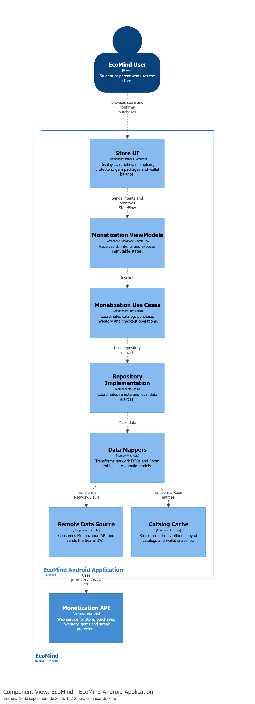

*Figura X. Diagrama C4 de componentes de la aplicación Android para el bounded context Monetization, elaborado con Structurizr DSL.*

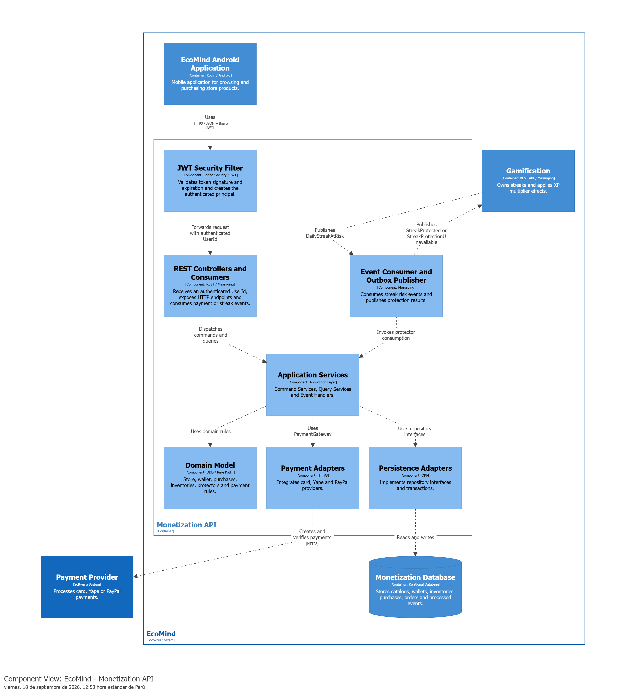

*Figura X. Diagrama C4 de componentes de la API del bounded context Monetization, elaborado con Structurizr DSL.*

#### 2.6.7.6. Bounded Context Software Architecture Code Level Diagrams

En esta sección se presentan los diagramas que describen la estructura interna del bounded context de Monetization, incluyendo sus principales clases de dominio y el diseño de la base de datos. Para mantener los diagramas claros y fáciles de comprender, los Commands, Queries, Use Cases y adaptadores se explican en las secciones anteriores.

##### 2.6.7.6.1. Bounded Context Domain Layer Class Diagrams

El diagrama de clases presenta los principales elementos del dominio de Monetization y las relaciones entre ellos. Incluye la tienda, la billetera de gemas, las compras, los inventarios y los distintos productos disponibles, como cosméticos, multiplicadores, protectores y paquetes de gemas. También representa las operaciones necesarias para consultar productos, verificar el saldo, realizar compras y administrar los artículos adquiridos por el usuario.

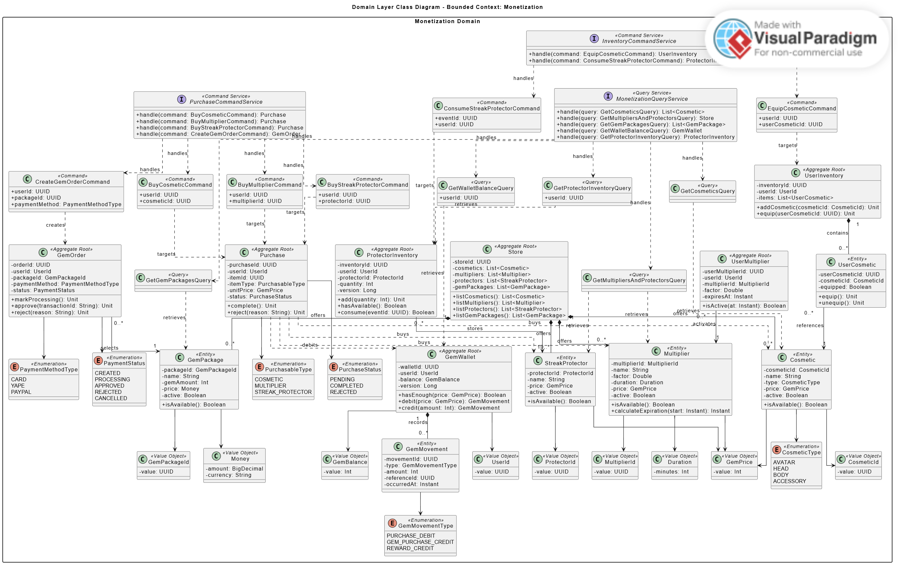

*Figura X. Diagrama de clases de la capa de dominio del bounded context Monetization.*

##### 2.6.7.6.2. Bounded Context Database Design Diagram

El diseño de la base de datos organiza por separado los cosméticos, multiplicadores, protectores y paquetes de gemas, ya que cada tipo de producto posee características propias.

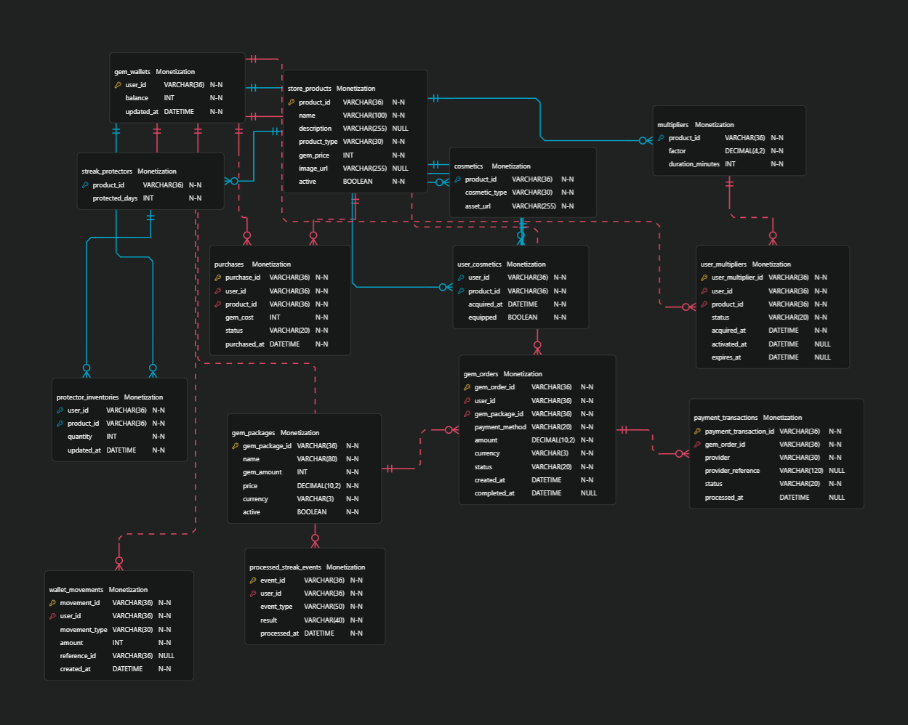

*Figura X. Diagrama de diseño de la base de datos del bounded context Monetization.*

# Bibliografía

- Adrilo, R (s.f.). Happy Little Planet App. Adrilo Rincz. https://www.adrilorincz.com/happy-little-planet-app  

- Chuliá, E. (1995). La conciencia ambiental de los españoles en los noventa. Análistas socio-políticos. https://www.asp-research.com/es/node/412  

- Earth Cubs. (s.f.). Earth Cubs App. Earth Cubs. https://earthcubs.com/ 

- Estrada Araoz, E. G., Huaypar Loayza, K. H., Gallegos Ramos, N. A., & Velásquez Giersch, L. (2022). Conciencia ambiental y actitudes proambientales en estudiantes de educación secundaria de Madre de Dios, Perú. Ciencia Amazónica (Iquitos), 9(2), 69-80. https://www.researchgate.net/publication/360519918_Conciencia_ambiental_y_actitudes_proambientales_en_estudiantes_de_educacion_secundaria_de_Madre_de_Dios_Peru  

- Martínez, R. (2010). La importancia de la educación ambiental ante la problemática actual. Revista Electrónica Educare, 14(1), 97–111.  https://www.redalyc.org/articulo.oa?id=194114419010  

- Ministerio del Ambiente. Viceministerio de Gestión Ambiental. Dirección General de Educación, Ciudadanía e Información Ambiental. Dirección de Información, Investigación e Innovación Ambiental. (2024). Anuario estadístico del sector ambiente 2023 (1.ª ed.). Ministerio del Ambiente https://sinia.minam.gob.pe/documentos/anuario-estadistico-sector-ambiente-2023  

- Reyes, R. (2018). El fenómeno del consumismo y sus desafíos para la mejora del medio ambiente. Documentos de Trabajo Areandina, 1. https://revia.areandina.edu.co/index.php/DT/article/view/1265

- Y-Group Games. (s. f.). Defender of the nature. Google Play. https://play.google.com/store/apps/details?id=com.YovoGames.Defender&hl=es_PE 

