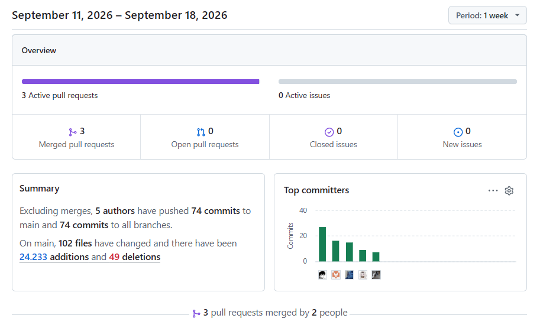
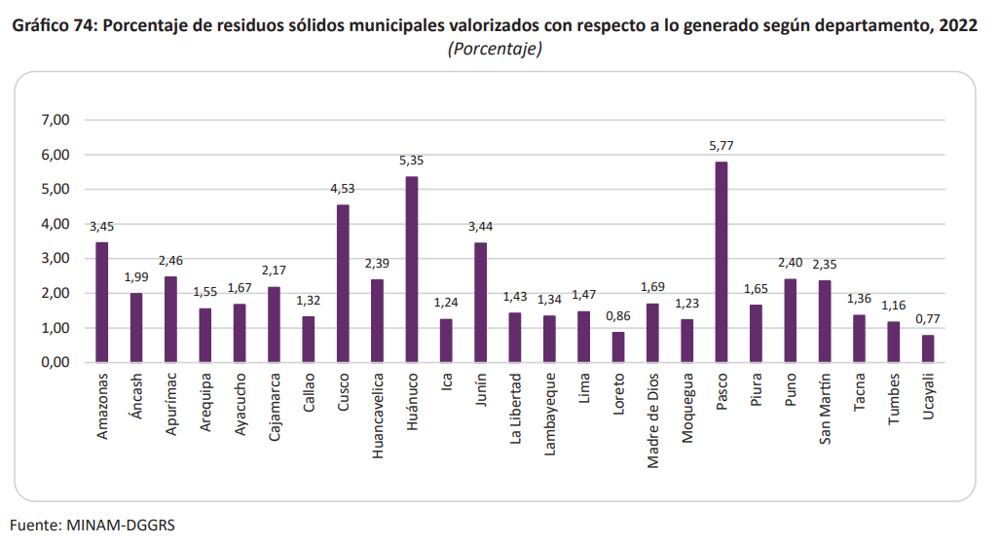
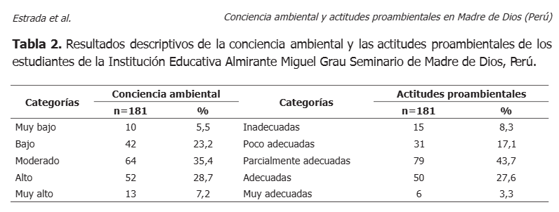
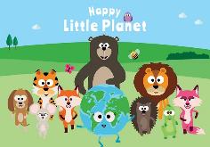
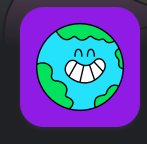

  
   

Universidad Peruana de Ciencias Aplicadas

Carrera de Ingeniería de Software

 

**1ACC0238**

**Aplicaciones para Dispositivos Móviles**

NRC   **13980**

Docente

**Mayta Guillermo, Jorge Luis**   

**Informe del Trabajo Final**

Equipo  
**GreenMinds**

Proyecto  
**EcoMind**   

**Integrantes**

<table style="border-collapse: collapse; border: none;">
  <tr>
    <th style="border: none; text-align: left; padding-right: 20px;">Código</th>
    <th style="border: none; text-align: left;">Apellidos y Nombres</th>
  </tr>
  <tr>
    <td style="border: none; padding-right: 20px;">u20241e158</td>
    <td style="border: none;">Aponte Pablo, Isabel Luisa</td>
  </tr>
  <tr>
    <td style="border: none; padding-right: 20px;">u202410678</td>
    <td style="border: none;">Astocondor Bazan, Alejandra Isabel</td>
  </tr>
  <tr>
    <td style="border: none; padding-right: 20px;">u202410254</td>
    <td style="border: none;">Dulanto Espino, Leo César</td>
  </tr>
  <tr>
    <td style="border: none; padding-right: 20px;">u202410093</td>
    <td style="border: none;">Pajes Leon, Mauricio Luis</td>
  </tr>
  <tr>
    <td style="border: none; padding-right: 20px;">u202416107</td>
    <td style="border: none;">Philco Mota, Katty Yolanda</td>
  </tr>
</table>

 

**Período 202620**

**Setiembre 2026**

# Registro de Versiones del Informe

| Version | Fecha | Autor | Descripción de modificación |
| -------- | -------- | -------- | -------- |
| 1.0.0    | 01/09/2026     | Alejandra Astocondor     | initial commit   docs: añadir estructura del proyecto |
| 1.0.0    | 06/09/2026     | Katty Philco | docs: agregar Startup Profile   docs: añadir antecedentes y problemática  |
| 1.0.0    | 00/09/2026     |    | docs: agregar    docs: agregar    docs: agregar  |
| 1.0.0    | 00/09/2026     |    | docs: agregar    docs: agregar    docs: agregar  |
| 1.0.0    | 00/09/2026     |    | docs: agregar    docs: agregar    docs: agregar  |
| 1.0.0    | 00/09/2026     |    | docs: agregar    docs: agregar    docs: agregar  |
| 1.0.0    | 00/09/2026     |    | docs: agregar    docs: agregar    docs: agregar  |
| 1.0.0    | 00/09/2026     |    | docs: agregar    docs: agregar    docs: agregar  |

# Projet Report Collaboration Insights

Project Report URL: https://github.com/upc-pre-202620-13980-greenminds/GreenMinds_Report.git 

*AV1*

Durante el desarrollo de la entrega AV1, el equipo organizó la elaboración del informe mediante la asignación de responsabilidades por secciones, lo que permitió un trabajo colaborativo y paralelo entre los integrantes. Cada miembro contribuyó en función de su área asignada, abarcando aspectos de experiencia de usuario, análisis de negocio y arquitectura del sistema.

El proceso de desarrollo del informe se realizó de manera incremental, integrando progresivamente los contenidos conforme se avanzaba en el proyecto. Esto se refleja en el Registro de Versiones del Informe, donde se evidencia la evolución del documento desde la estructura inicial hasta la incorporación de elementos como Lean UX, análisis competitivo, user stories, arquitectura de software, wireframes y flujos de interacción.

Asimismo, todos los integrantes participaron activamente en la elaboración del informe, realizando aportes continuos que permitieron consolidar una documentación coherente y alineada entre sus distintas secciones. Esta colaboración se evidencia en los analíticos de contribución y commits, los cuales reflejan la participación distribuida del equipo.

# Tabla de contenidos

[Student Outcome](#abet---eac---student-outcome-7)  
[Objetivos SMART](#objetivos-smart)  

**Capítulo I: Presentación**  
1.1. [Startup Profile](#11-startup-profile)  
1.1.1. [Descripción de la Startup](#111-descripción-de-la-startup)  
1.1.2. [Perfiles de integrantes del equipo](#112-perfiles-de-integrantes-del-equipo)  
1.2. [Solution Profile](#12-solution-profile)  
1.2.1. [Antecedentes y problemática](#121-antecedentes-y-problemática)  
1.2.2. [Lean UX Process](#122-lean-ux-process)  
1.2.2.1. [Lean UX Problem Statements](#1221-lean-ux-problem-statements)  
1.2.2.2. [Lean UX Assumptions](#1222-lean-ux-assumptions)  
1.2.2.3. [Lean UX Hypothesis Statements](#1223-lean-ux-hypothesis-statements)  
1.2.2.4. [Lean UX Canvas](#1224-lean-ux-canvas)  
1.3. [Segmentos objetivo](#13-segmentos-objetivo)  

**Capítulo II: Requirements Development and Software Solution Design**  
2.1. [Competidores](#21-competidores)  
2.1.1. [Análisis competitivo](#211-análisis-competitivo)  
2.1.2. [Estrategias y tácticas frente a competidores](#212-estrategias-y-tácticas-frente-a-competidores)  
2.2. [Entrevistas](#22-entrevistas)  
2.2.1. [Diseño de entrevistas](#221-diseño-de-entrevistas)  
2.2.2. [Registro de entrevistas](#222-registro-de-entrevistas)  
2.2.3. [Análisis de entrevistas](#223-análisis-de-entrevistas)  
2.3. [Needfinding](#23-needfinding)  
2.3.1. [User Personas](#231-user-personas)  
2.3.2. [User Task Matrix](#232-user-task-matrix)  
2.3.3. [User Journey Mapping](#233-user-journey-mapping)  
2.3.4. [Empathy Mapping](#234-empathy-mapping)  
2.3.5. [Big Picture EventStorming](#235-big-picture-eventstorming)  
2.3.6. [Ubiquitous Language](#236-ubiquitous-language)  
2.4. [Requirements Specification](#24-requirements-specification)  
2.4.1. [User Stories](#241-user-stories)  
2.4.2. [Impact Mapping](#242-impact-mapping)  
2.4.3. [Product Backlog](#243-product-backlog)  
2.5. [Strategic-Level Domain-Driven Design](#25-strategic-level-domain-driven-design)  
2.5.1. [EventStorming](#251-eventstorming)  
2.5.1.1. [Candidate Context Discovery](#2511-candidate-context-discovery)  
2.5.1.2. [Domain Message Flows Modeling](#2512-domain-message-flows-modeling)  
2.5.1.3. [Bounded Context Canvases](#2513-bounded-context-canvases)  
2.5.2. [Context Mapping](#252-context-mapping)  
2.5.3. [Software Architecture](#253-software-architecture)  
2.5.3.1. [Software Architecture Context Level Diagrams](#2531-software-architecture-context-level-diagrams)  
2.5.3.2. [Software Architecture Container Level Diagrams](#2532-software-architecture-container-level-diagrams)  
2.5.3.3. [Software Architecture Deployment Diagrams](#2533-software-architecture-deployment-diagrams)  
2.6. [Tactical-Level Domain-Driven Design](#26-tactical-level-domain-driven-design)  
2.6.1. [Bounded Context: IAM](#261-bounded-context-iam)  
2.6.1.1. [Domain Layer](#2611-domain-layer)  
2.6.1.2. [Interface Layer](#2612-interface-layer)  
2.6.1.3. [Application Layer](#2613-application-layer)  
2.6.1.4. [Infrastructure Layer](#2614-infrastructure-layer)  
2.6.1.5. [Bounded Context Software Architecture Component Level Diagrams](#2615-bounded-context-software-architecture-component-level-diagrams)  
2.6.1.6. [Bounded Context Software Architecture Code Level Diagrams](#2616-bounded-context-software-architecture-code-level-diagrams)  
2.6.1.6.1. [Bounded Context Domain Layer Class Diagrams](#26161-bounded-context-domain-layer-class-diagrams)  
2.6.1.6.2. [Bounded Context Database Design Diagram](#26162-bounded-context-database-design-diagram)  
2.6.2. [Bounded Context: Profile](#262-bounded-context-profile)  
2.6.2.1. [Domain Layer](#2621-domain-layer)  
2.6.2.2. [Interface Layer](#2622-interface-layer)  
2.6.2.3. [Application Layer](#2623-application-layer)  
2.6.2.4. [Infrastructure Layer](#2624-infrastructure-layer)  
2.6.2.5. [Bounded Context Software Architecture Component Level Diagrams](#2625-bounded-context-software-architecture-component-level-diagrams)  
2.6.2.6. [Bounded Context Software Architecture Code Level Diagrams](#2626-bounded-context-software-architecture-code-level-diagrams)  
2.6.2.6.1. [Bounded Context Domain Layer Class Diagrams](#26261-bounded-context-domain-layer-class-diagrams)  
2.6.2.6.2. [Bounded Context Database Design Diagram](#26262-bounded-context-database-design-diagram)  
2.6.3. [Bounded Context: Learning](#263-bounded-context-learning)  
2.6.3.1. [Domain Layer](#2631-domain-layer)  
2.6.3.2. [Interface Layer](#2632-interface-layer)  
2.6.3.3. [Application Layer](#2633-application-layer)  
2.6.3.4. [Infrastructure Layer](#2634-infrastructure-layer)  
2.6.3.5. [Bounded Context Software Architecture Component Level Diagrams](#2635-bounded-context-software-architecture-component-level-diagrams)  
2.6.3.6. [Bounded Context Software Architecture Code Level Diagrams](#2636-bounded-context-software-architecture-code-level-diagrams)  
2.6.3.6.1. [Bounded Context Domain Layer Class Diagrams](#26361-bounded-context-domain-layer-class-diagrams)  
2.6.3.6.2. [Bounded Context Database Design Diagram](#26362-bounded-context-database-design-diagram)  
2.6.4. [Bounded Context: Quests](#264-bounded-context-quests)  
2.6.4.1. [Domain Layer](#2641-domain-layer)  
2.6.4.2. [Interface Layer](#2642-interface-layer)  
2.6.4.3. [Application Layer](#2643-application-layer)  
2.6.4.4. [Infrastructure Layer](#2644-infrastructure-layer)  
2.6.4.5. [Bounded Context Software Architecture Component Level Diagrams](#2645-bounded-context-software-architecture-component-level-diagrams)  
2.6.4.6. [Bounded Context Software Architecture Code Level Diagrams](#2646-bounded-context-software-architecture-code-level-diagrams)  
2.6.4.6.1. [Bounded Context Domain Layer Class Diagrams](#26461-bounded-context-domain-layer-class-diagrams)  
2.6.4.6.2. [Bounded Context Database Design Diagram](#26462-bounded-context-database-design-diagram)  
2.6.5. [Bounded Context: Community](#265-bounded-context-community)  
2.6.5.1. [Domain Layer](#2651-domain-layer)  
2.6.5.2. [Interface Layer](#2652-interface-layer)  
2.6.5.3. [Application Layer](#2653-application-layer)  
2.6.5.4. [Infrastructure Layer](#2654-infrastructure-layer)  
2.6.5.5. [Bounded Context Software Architecture Component Level Diagrams](#2655-bounded-context-software-architecture-component-level-diagrams)  
2.6.5.6. [Bounded Context Software Architecture Code Level Diagrams](#2656-bounded-context-software-architecture-code-level-diagrams)  
2.6.5.6.1. [Bounded Context Domain Layer Class Diagrams](#26561-bounded-context-domain-layer-class-diagrams)  
2.6.5.6.2. [Bounded Context Database Design Diagram](#26562-bounded-context-database-design-diagram)  
2.6.6. [Bounded Context: Ranking](#266-bounded-context-ranking)  
2.6.6.1. [Domain Layer](#2661-domain-layer)  
2.6.6.2. [Interface Layer](#2662-interface-layer)  
2.6.6.3. [Application Layer](#2663-application-layer)  
2.6.6.4. [Infrastructure Layer](#2664-infrastructure-layer)  
2.6.6.5. [Bounded Context Software Architecture Component Level Diagrams](#2665-bounded-context-software-architecture-component-level-diagrams)  
2.6.6.6. [Bounded Context Software Architecture Code Level Diagrams](#2666-bounded-context-software-architecture-code-level-diagrams)  
2.6.6.6.1. [Bounded Context Domain Layer Class Diagrams](#26661-bounded-context-domain-layer-class-diagrams)  
2.6.6.6.2. [Bounded Context Database Design Diagram](#26662-bounded-context-database-design-diagram)  
2.6.7. [Bounded Context: Monetization](#267-bounded-context-monetization)  
2.6.7.1. [Domain Layer](#2671-domain-layer)  
2.6.7.2. [Interface Layer](#2672-interface-layer)  
2.6.7.3. [Application Layer](#2673-application-layer)  
2.6.7.4. [Infrastructure Layer](#2674-infrastructure-layer)  
2.6.7.5. [Bounded Context Software Architecture Component Level Diagrams](#2675-bounded-context-software-architecture-component-level-diagrams)  
2.6.7.6. [Bounded Context Software Architecture Code Level Diagrams](#2676-bounded-context-software-architecture-code-level-diagrams)  
2.6.7.6.1. [Bounded Context Domain Layer Class Diagrams](#26761-bounded-context-domain-layer-class-diagrams)  
2.6.7.6.2. [Bounded Context Database Design Diagram](#26762-bounded-context-database-design-diagram)  
2.6.8. [Bounded Context: Achievements](#268-bounded-context-achievements)  
2.6.8.1. [Domain Layer](#2681-domain-layer)  
2.6.8.2. [Interface Layer](#2682-interface-layer)  
2.6.8.3. [Application Layer](#2683-application-layer)  
2.6.8.4. [Infrastructure Layer](#2684-infrastructure-layer)  
2.6.8.5. [Bounded Context Software Architecture Component Level Diagrams](#2685-bounded-context-software-architecture-component-level-diagrams)  
2.6.8.6. [Bounded Context Software Architecture Code Level Diagrams](#2686-bounded-context-software-architecture-code-level-diagrams)  
2.6.8.6.1. [Bounded Context Domain Layer Class Diagrams](#26861-bounded-context-domain-layer-class-diagrams)  
2.6.8.6.2. [Bounded Context Database Design Diagram](#26862-bounded-context-database-design-diagram)

**Capítulo III: Solution UI/UX Design**  
3.1. [Product Design](#31-product-design)  
3.1.1. [Style Guidelines](#311-style-guidelines)  
3.1.1.1. [General Style Guidelines](#3111-general-style-guidelines)  
3.1.2. [Information Architecture](#312-information-architecture)  
3.1.2.1. [Organization Systems](#3121-organization-systems)  
3.1.2.2. [Labelling Systems](#3122-labelling-systems)  
3.1.2.3. [SEO Tags and Meta Tags](#3123-seo-tags-and-meta-tags)  
3.1.2.4. [Searching Systems](#3124-searching-systems)  
3.1.2.5. [Navigation Systems](#3125-navigation-systems)  
3.1.3. [Landing Page UI Design](#313-landing-page-ui-design)  
3.1.3.1. [Landing Page Wireframe](#3131-landing-page-wireframe)  
3.1.3.2. [Landing Page Mock-up](#3132-landing-page-mock-up)  
3.1.4. [Mobile Applications UX/UI Design](#314-mobile-applications-uxui-design)  
3.1.4.1. [Mobile Applications Wireframes](#3141-mobile-applications-wireframes)  
3.1.4.2. [Mobile Applications Wireflow Diagrams](#3142-mobile-applications-wireflow-diagrams)  
3.1.4.3. [Mobile Applications Mock-ups](#3143-mobile-applications-mock-ups)  
3.1.4.4. [Mobile Applications User Flow Diagrams](#3144-mobile-applications-user-flow-diagrams)  
3.1.4.5. [Mobile Applications Prototyping](#3145-mobile-applications-prototyping)  

**Capítulo IV: Product Implementation & Validation**  
4. [Product Implementation & Validation](#4-product-implementation-&-validation)  
4.1. [Software Configuration Management](#41-software-configuration-management)  
4.1.1. [Software Development Environment Configuration](#411-software-development-environment-configuration)  
4.1.2. [Source Code Management](#412-source-code-management)  
4.1.3. [Source Code Style Guide & Conventions](#413-source-code-style-guide--conventions)  
4.1.4. [Software Deployment Configuration](#414-software-deployment-configuration)  
4.2. [Landing Page & Mobile Application Implementation](#42-landing-page--mobile-application-implementation)  
4.2.1. [Sprint 1](#421-sprint-1)  
4.2.1.1. [Sprint Planning 1](#4211-sprint-planning-1)  
4.2.1.2. [Aspect Leaders and Collaborators](#4212-aspect-leaders-and-collaborators)  
4.2.1.3. [Sprint Backlog 1](#4213-sprint-backlog-1)  
4.2.1.4. [Development Evidence for Sprint Review](#4214-development-evidence-for-sprint-review)  
4.2.1.5. [Testing Suite Evidence for Sprint Review](#4215-testing-suite-evidence-for-sprint-review)  
4.2.1.6. [Execution Evidence for Sprint Review](#4216-execution-evidence-for-sprint-review)  
4.2.1.7. [Services Documentation Evidence for Sprint Review](#4217-services-documentation-evidence-for-sprint-review)  
4.2.1.8. [Software Deployment Evidence for Sprint Review](#4218-software-deployment-evidence-for-sprint-review)  
4.2.1.9. [Team Collaboration Insights during Sprint](#4219-team-collaboration-insights-during-sprint)  
4.3. [Validation Interviews](#43-validation-interviews)  
4.3.1. [Diseño de Entrevistas](#431-diseño-de-entrevistas)  
4.3.2. [Registro de Entrevistas](#432-registro-de-entrevistas)  
4.3.3. [Evaluaciones según heurísticas](#433-evaluaciones-según-heurísticas)

[Conclusiones](#conclusiones)  
[Conclusiones y Recomendaciones](#conclusiones-y-recomendaciones)  
[Video App Validation](#video-app-validation)  
[Video About the Product](#video-about-the-product)  
[Video About the Team](#video-about-the-team)  
[Glosario](#glosario)  
[Bibliografía](#bibliografía)  
[Anexos](#anexos)

# ABET - EAC - Student Outcome 7

El curso contribuye al cumplimiento del Student Outcome ABET:
**ABET – EAC - Student Outcome 7**

**Criterio:** La capacidad de adquirir y aplicar nuevos conocimientos según sea necesario, utilizando estrategias deaprendizaje apropiadas.

En el siguiente cuadro se describe las acciones realizadas y enunciados de conclusiones por parte del grupo, que permiten sustentar el haber alcanzado el logro del ABET – EAC - Student Outcome 7.

| Criterio Especifico | Acciones realizadas | Conclusiones |
| -------- | -------- | -------- |
| **Actualiza conceptos y conocimientos necesarios para su desarrollo profesional y en especial para su proyecto en soluciones de software.** | Aponte Pablo, Isabel Luisa  *AV1*   Aa.        Astocondor Bazan, Alejandra Isabel   *AV1*   Aa       Dulanto Espino, Leo César   *AV1*   Aa.        Pajes Leon, Mauricio Luis   *AV1*   Aa.       Philco Mota, Katty Yolanda   *AV1*   Aa.     | *AV1*   El equipo...      |
| **Reconoce la necesidad del aprendizaje permanente para el desempeño profesional y el desarrollo de proyectos en soluciones de software.** | Aponte Pablo, Isabel Luisa  *AV1*   Aa.        Astocondor Bazan, Alejandra Isabel   *AV1*   Aa       Dulanto Espino, Leo César   *AV1*   Aa.        Pajes Leon, Mauricio Luis   *AV1*   Aa.       Philco Mota, Katty Yolanda   *AV1*   Aa.      | *AV1*   El equipo ...   |

# Objetivos Smart

# Capítulo I: Introducción

## 1.1. Startup Profile

### 1.1.1. Descripción del startup

**Nombre de la startup**

GreenMinds

**Descripción**

ECOMIND es una plataforma interactiva que busca fortalecer la conciencia ambiental en escolares a través de la gamificación y dinámicas educativas como retos y juegos prácticos. Su propuesta no solo transmite conocimientos sobre reciclaje, ahorro de agua, eficiencia energética y cuidado del entorno, sino que también busca transformar hábitos cotidianos al involucrar tanto a los estudiantes como a sus familias y comunidades. A diferencia de otras herramientas, funciona en modalidad online y offline, lo que hace accesible en contextos con limitaciones de conectividad y garantiza su alcance en zonas urbanas y rurales.

**Visión**

Posicionarnos en el corto y mediano plazo como la plataforma educativa de referencia en conciencia ambiental para escolares en el Perú, ampliando gradualmente nuestro alcance hacia otras comunidades y paises de la región. Aspiramos a contribuir en la construcción de una generación más consciente, capaz de integrar hábitos sostenibles en su vida cotidiana y de inspirar cambios positivos en su entorno.

**Misión**

Brindar a los escolares una educación ambiental innovadora, accesible y dinámica que convierta el aprendizaje en una experiencia significativa. A través de la gamificación, buscamos que los niños no solo adquieran conocimientos, sino que desarrollen actitudes responsables y prácticas sostenibles que puedan replicar en su vida diaria y en sus entornos familiares y comunitarios.

**Propuesta de Valor**

GreenMinds convierte la educación ambiental en una experiencia práctica y motivadora mediante gamificación. Los estudiantes no solo aprenden, sino que aplican hábitos sostenibles en su vida diaria a través de retos interactivos.

La plataforma es accesible online y offline, lo que permite su uso en distintos contextos, incluyendo zonas con baja conectividad. Además, involucra a la familia y comunidad, generando un impacto real más allá del aula.

**Características principales**

GreenMinds ofrece un sistema de retos gamificados que motiva a los estudiantes a participar activamente en actividades relacionadas con el reciclaje, el ahorro de agua y la eficiencia energética. Estas actividades están organizadas en retos progresivos que fomentan el aprendizaje mediante la acción.

La plataforma incorpora un sistema de logros y recompensas que incentiva la constancia y el compromiso, permitiendo a los usuarios acumular puntos, desbloquear reconocimientos y visualizar su progreso. Este enfoque refuerza la motivación y convierte el aprendizaje en una experiencia entretenida.

Asimismo, promueve la participación familiar, integrando actividades que pueden realizarse en casa y fortaleciendo el aprendizaje en el entorno cotidiano del estudiante. A esto se suma la creación de comunidades educativas, donde los usuarios pueden interactuar, colaborar y participar en rankings o retos grupales.

GreenMinds también permite el seguimiento del progreso individual, mostrando avances, rachas y niveles de compromiso, lo que ayuda a los estudiantes a tomar conciencia de su impacto. Además, incluye contenido educativo interactivo como videos, lecturas e infografías que complementan los retos prácticos.

Finalmente, la plataforma ofrece opciones de personalización, como la creación de avatares y perfiles, lo que incrementa la conexión del usuario con la experiencia y refuerza su motivación.

### 1.1.2. Perfiles de integrantes del equipo

| Foto | Nombre | Descripción |
| -------- | -------- | -------- |
|  | Aponte Pablo, Isabel Luisa (u20241e158) | Estudiante de Ingeniería de Software. Me interesa la programación y el desarrollo de soluciones prácticas. Tengo conocimientos en C++ y otras herramientas tecnólogicas, me caracterizo por ser responsable, organizada y enfocada en el trabajo en equipo. |
|  | Astocondor Bazan, Alejandra Isabel (U202410678) | Estudiante de Ingeniería de Software, enfocada en el desarrollo de soluciones tecnológicas. Poseo habilidades en programación y diseño digital. Me caracterizo por mi creatividad, responsabilidad y capacidad de adaptación. |
|  | Dulanto Espino, Leo César (U202410254) | Estudiante de Ingeniería de Software, con conocimientos en C++, Python y fundamentos de desarrollo web y Java. Me gusta crear soluciones creativas a problemas y apoyar activamente al equipo en los proyectos. |
|  |  |  |
|  | Philco Mota, Katty Yolanda (u202416107) | Soy una persona responsable y comprometida con mi crecimiento académico. Cuento con conocimientos en programación, especialmente en C++, así como en estructuras de datos, algoritmos y desarrollo de soluciones tecnológicas orientadas a proyectos reales. |
## 1.2. Solution Profile

### 1.2.1. Antecedentes y problemática

La falta de conciencia ambiental constituye un problema que afecta tanto al planeta como a la calidad de vida de las personas, pues provoca contaminación, riesgos para la salud y un uso ineficiente de recursos básicos como el agua y la energía. Este problema se manifiesta principalmente durante la etapa escolar, cuando deberían consolidarse valores y hábitos sostenibles, pero no siempre ocurre porque los aprendizajes en la escuela no encuentran continuidad en el hogar ni respaldo en la comunidad. 

Surge sobre todo en espacios cercanos a los estudiantes, donde las prácticas cotidianas no refuerzan lo enseñado en el aula. Los más afectados son los escolares de educación básica, en quienes la ausencia de una conciencia ambiental sólida limita la adopción de conductas responsables en su vida diaria. 

Entre las causas destacan: la cultura consumista, que promueve la compra y el desecho excesivo; las prioridades económicas y de seguridad que desplazan la preocupación ambiental; y la falta de educación ambiental, que deja a los ciudadanos sin claridad sobre cómo sus acciones diarias contribuyen al deterioro del entorno. 

Esta situación surge porque los conocimientos transmitidos en la escuela no se consolidan en la práctica cotidiana, ya que los hogares y comunidades mantienen hábitos poco sostenibles. Los datos muestran la magnitud del problema: en el Perú, solo el 1,8 % de los residuos municipales generados en 2022 fueron valorizados, reflejando un bajo aprovechamiento de materiales reciclables. Asimismo, en Madre de Dios, un estudio con estudiantes de secundaria reveló que la mayoría presentaba niveles apenas moderados de conciencia y actitudes ambientales, con solo un porcentaje reducido que alcanzó niveles altos o muy adecuados. 

**Aplicación de 5W+2H:** 

**¿Cuál es el problema? (What?)**

La conciencia ambiental puede entenderse como el nivel de conocimientos, actitudes y prácticas que desarrollan los individuos para actuar de manera responsable con el entorno, integrando valores de respeto y cuidado hacia los recursos naturales (Chuliá, 1995). La falta de esta se ha convertido en un problema que, además de afectar nuestro planeta, impacta directamente en la calidad de vida de las personas, ya que genera entornos contaminados, riesgos para la salud y un uso ineficiente de recursos básicos como el agua y la energía. 

**¿Cuándo sucede el problema? (When?)** 

El problema de la falta de conciencia ambiental se manifiesta principalmente durante la etapa escolar. Es en esta fase donde deberían consolidarse actitudes responsables hacia el entorno y prácticas sostenibles que se mantengan a lo largo de la vida. Sin embargo, cuando este proceso no ocurre de manera adecuada, los escolares no desarrollan una conciencia ambiental sólida, lo que se traduce en conductas poco responsables frente al cuidado del medio ambiente en su vida cotidiana. 

**¿Dónde surge el problema? (Where?)** 

El problema de la falta de conciencia ambiental surge principalmente en los espacios de socialización más cercanos a los estudiantes: la escuela, el hogar y la comunidad. Si bien en las instituciones educativas se incluyen contenidos ambientales en el currículo, estos aprendizajes muchas veces no se consolidan porque no encuentran respaldo en el entorno familiar ni en la cultura comunitaria. Según Róger Martinez (2010), “la educación ambiental debe constituir un proceso integral, que juega su papel en todo el entramado de la enseñanza y el aprendizaje” (p. 97). 

**¿A quiénes les sucede el problema? (Who?)** 

El problema de la falta de conciencia ambiental afecta principalmente a los escolares de educación básica, tanto en primaria como en secundaria, quienes se encuentran en una etapa crucial para la formación de valores y hábitos sostenibles. Estos estudiantes, al no desarrollar una conciencia ambiental sólida, tienen mayores dificultades para incorporar prácticas responsables en su vida cotidiana. 

**¿Cuál es la causa del problema? (Why?)** 

Entre las principales causas están: 

**Cultura de consumismo:** se impulsa a las personas a adquirir productos que no responden a necesidades reales, sino a deseos creados por la publicidad y las tendencias sociales. Este patrón de consumo lleva a valorar más la posesión y el estatus que el uso responsable de los recursos, generando hábitos de compra excesiva, desecho rápido y desperdicio (Reyes, 2018). 

**Prioridades económicas/seguridad:** en muchos contextos, especialmente en países en desarrollo, las preocupaciones inmediatas de la población están relacionadas con la estabilidad económica, la generación de ingresos y la seguridad personal. Estas prioridades suelen desplazar la atención hacia el cuidado del medio ambiente, que se percibe como un tema secundario o de largo plazo. 

**Falta de educación ambiental:**  muchos escolares y ciudadanos desconocen cómo sus acciones cotidianas, como el consumo excesivo de agua, la disposición inadecuada de residuos o el uso indiscriminado de plásticos, contribuyen al deterioro del entorno. 

**¿Qué llevo a la persona a llegar a esa situación?** (How) 

La falta de conciencia ambiental es el resultado de un proceso en el que los aprendizajes recibidos en la escuela no logran consolidarse en su vida cotidiana. Aunque en el aula se transmiten conocimientos básicos sobre reciclaje, ahorro de agua y cuidado de los recursos, estos no encuentran continuidad en el hogar ni respaldo en la comunidad, donde persisten hábitos de sobreconsumo y prácticas poco sostenibles. 

**Estadísticas o datos que sustenten la problemática (How much?)** 

En el Perú, la gestión de residuos sólidos evidencia serias limitaciones. Aunque la valorización de residuos municipales pasó de 17 189 toneladas en 2014 a 148 559 toneladas en 2022, este volumen representa apenas el 1,8 % del total generado a nivel nacional (Ministerio del Ambiente, 2024), lo que refleja un bajo nivel de aprovechamiento de materiales reciclables.

**Figura 1**
*Porcentaje de residuos sólidos municipales valorizados con respecto a lo generado según departamento*

Nota.*Adaptado de Anuario estadístico del sector Ambiente 2023, por el Ministerio del Ambiente, 2023.*

Un estudio realizado en Madre de Dios mostró que el 35,4 % de los estudiantes tenía un nivel moderado de conciencia ambiental, el 28,7 % un nivel alto y solo el 7,2 % alcanzó un nivel muy alto, mientras que un 5,5 % se ubicó en un nivel muy bajo. Respecto a las actitudes proambientales, el 43,7 % presentó niveles parcialmente adecuados y apenas un 3,3 % logró niveles muy adecuados (Estrada, et al. 2022). 

**Figura 2**

*Resultados descriptivos de conciencia ambiental y las actitudes proambientales de los estudiantes de la Institución Educativa Almirante Miguel Grau Seminario de Madre de Dios, Perú.*

Nota. *Adaptado de Conciencia ambiental y actitudes proambientales en estudiantes de educación secundaria de Madre de Dios, Perú, por Estrada E., 2022.* 

### 1.2.2. Lean UX Process

#### *1.2.2.1. Lean UX Problem Statements*

#### *1.2.2.2. Lean UX Assumptions*

#### *1.2.2.3. Lean UX Hypothesis Statements*

#### *1.2.2.4. Lean UX Canvas*

## 1.3. Segmentos objetivo

# Capítulo II: Requirements Development and Software Solution Design

## 2.1. Competidores

#### 1. Defensor de la naturaleza  
Defensor de la naturaleza es una aplicación móvil educativa y ecológica dirigida a niños, orientada a fomentar la conciencia ambiental de manera lúdica y accesible. Lanzada por Y-Group Games, esta app ofrece una serie de minijuegos interactivos en los que los pequeños limpian jardines, parques y zonas de juego, plantan árboles y flores, clasifican residuos y limpian ríos y estanques contaminados. La experiencia está diseñada especialmente para enseñar a los niños la importancia de proteger la naturaleza y los entornos que los rodea. (Y-Group Games. (s. f.)  

#### 2. Happy Litle Planet  
Happy Little Planet es una aplicación educativa diseñada para niños, cuyo objetivo es enseñar hábitos sostenibles y el cuidado del medio ambiente de manera lúdica e interactiva. La app combina juegos educativos y libros con audio, proporcionando experiencias de aprendizaje divertidas y dinámicas que ayudan a los niños a comprender conceptos como reciclaje, ahorro de recursos y respeto por la naturaleza. (Adrilo Rincz, s.f.)   

#### 3. Earth Cubs  
Earth Cubs es una aplicación educativa orientada a niños, cuyo propósito es enseñar sobre el medio ambiente, la sostenibilidad y el cambio climático mediante experiencias lúdicas e interactivas. La app combina minijuegos, acertijos, cómics y videos, además de recursos para el aula, ofreciendo un aprendizaje dinámico que motiva a los más pequeños a desarrollar conciencia ambiental y hábitos responsables con la naturaleza. (Earth Cubs, s.f.)

### 2.1.1. Análisis competitivo

|  | Competitive Analysis Landscape |
|---|---|
| ¿Por qué llevar a cabo este análisis? | Llevamos a cabo este análisis con la finalidad de conocer a los competidores, identificar sus fortalezas y debilidades, y definir estrategias de diferenciación y posicionamiento para Green Mind. |

|  |  | **Green Mind** | **Defensor de la Naturaleza** | **Happy Little Planet** | **Earth Cubs** |
|---|---|---|---|---|---|
| **Perfil** | Logo |  |  |  |  |
|  | Overview | Plataforma educativa gamificada que enseña hábitos sostenibles a escolares, con acceso en línea y sin conexión, e involucra a familias y comunidades. | Juego móvil centrado en acciones ambientales directas dentro de un entorno lúdico. | Aplicación educativa infantil que enseña hábitos sostenibles y cuidado ambiental mediante juegos interactivos y audiolibros, con acompañamiento de los padres. | Aplicación educativa gamificada que enseña a los niños sobre el medio ambiente, la sostenibilidad y el cambio climático mediante minijuegos, acertijos, cómics y recursos escolares. |
|  | Ventaja competitiva | Plataforma inclusiva con acceso en línea y sin conexión, que conecta el aprendizaje escolar con la participación de las familias y comunidades. | Educación ambiental sencilla y entretenida para niños de primeras edades. | Aprendizaje ambiental lúdico y seguro para niños pequeños, con participación de los padres y contenido disponible sin conexión. | Contenidos educativos integrales, diversos y orientados a generar un impacto real. |
| **Perfil de marketing** | Mercado objetivo | Escolares y padres de familia interesados en el cuidado ambiental. | Niños de educación preescolar y primeros grados de primaria. | Niños pequeños y padres interesados en la educación ambiental. | Niños de educación preescolar y primaria, así como sus padres y educadores. |
|  | Estrategias de marketing | Promoción en redes sociales, alianzas con instituciones educativas y actividades con familias y comunidades. | Promoción en tiendas de aplicaciones y uso de una propuesta visual atractiva para el público infantil. | Promoción en tiendas de aplicaciones, blogs y redes sociales sobre educación infantil, con énfasis en una experiencia visual segura y atractiva. | Difusión multiplataforma y colaboración con escuelas y asociaciones ambientales. |
| **Perfil de Producto** | Productos y servicios | Plataforma gamificada con minirretos, juegos educativos y actividades sobre hábitos sostenibles. | Aplicación móvil con minijuegos ecológicos interactivos. | Juegos educativos interactivos, audiolibros y contenido descargable para utilizar sin conexión. | Plataforma digital con juegos, videos y recursos educativos. |
|  | Precios y costos | Acceso gratuito, con suscripciones y microtransacciones opcionales. | Aplicación gratuita financiada mediante anuncios. | Aplicación gratuita. | Aplicación gratuita con acceso a contenidos básicos. |
|  | Canales de distribución | Plataforma web, aplicación móvil y acceso sin conexión. | Aplicación móvil disponible en Google Play. | Aplicación móvil disponible en Google Play y App Store, además de un sitio web oficial. | Sitio web oficial y aplicaciones móviles disponibles en App Store y Google Play. |
| **Análisis SWOT** | Fortalezas | Gamificación que fomenta la motivación, acceso en línea y sin conexión, e integración de familias y comunidades. | Juego sencillo, divertido y accesible para niños pequeños. | Vincula el aprendizaje digital con acciones ambientales en la vida cotidiana. | Combina diversión y educación ambiental con una amplia variedad de contenidos. |
|  | Debilidades | Requiere inversión constante para desarrollar, mantener y actualizar los juegos y contenidos. | Contenido limitado y dependencia de la publicidad. | Contenido limitado y poca interacción social entre usuarios. | Su enfoque amplio puede dificultar la especialización y exige actualizaciones constantes. |
|  | Oportunidades | Creciente interés por la educación ambiental y posibilidad de establecer alianzas con colegios, municipalidades y organizaciones ambientales. | Crecimiento de la demanda de aplicaciones educativas con temática ecológica. | Expansión hacia grupos de mayor edad e incorporación de experiencias multijugador. | Integración de nuevos contenidos ambientales y ampliación de su presencia educativa global. |
|  | Amenazas | Competencia de aplicaciones educativas consolidadas y aparición constante de nuevas alternativas digitales. | Alta competencia de aplicaciones educativas similares. | Necesidad de actualizaciones frecuentes y elevada competencia en el mercado de aplicaciones educativas. | Riesgo de quedar rezagada frente a plataformas digitales más innovadoras. |

### 2.1.2. Estrategias y tácticas frente a competidores

#### Estrategias

1. **Acceso inclusivo y continuidad**  
   ECOMIND funcionará tanto online como offline, asegurando que los escolares puedan seguir aprendiendo y realizando actividades educativas incluso en zonas con conectividad limitada o desde sus hogares.

2. **Gamificación y personalización mediante tecnología**  
   La plataforma incorporará gamificación avanzada para el seguimiento del progreso y recomendaciones automáticas. Esto permitirá personalizar el aprendizaje y mantener el interés de los usuarios.

#### Tácticas

#### Desarrollo de contenido hiperlocalizado  
Creación de retos, misiones y juegos basados en situaciones reales, con énfasis en acciones concretas de cuidado ambiental que los escolares puedan aplicar en su entorno.

#### Gamificación con incentivos y seguimiento  
Implementación de puntos, medallas, niveles y rankings para motivar a los niños. Además, los padres podrán acceder a reportes de progreso, reforzando el aprendizaje y fomentando hábitos sostenibles.

#### Aprovechamiento de debilidades de la competencia

1. **Frente a Defensor de la Naturaleza**  
   Dado que su experiencia es limitada y depende de publicidad para financiar el contenido, ECOMIND ofrecerá contenido más completo y libre de anuncios, garantizando aprendizaje continuo y mayor motivación de los usuarios.

## 2.2. Entrevistas
### 2.2.1. Diseño de entrevistas
### 2.2.2. Registro de entrevistas
### 2.2.3. Análisis de entrevistas

# Bibliografía

- Adrilo, R (s.f.). Happy Little Planet App. Adrilo Rincz. https://www.adrilorincz.com/happy-little-planet-app  

- Chuliá, E. (1995). La conciencia ambiental de los españoles en los noventa. Análistas socio-políticos. https://www.asp-research.com/es/node/412  

- Earth Cubs. (s.f.). Earth Cubs App. Earth Cubs. https://earthcubs.com/ 

- Estrada Araoz, E. G., Huaypar Loayza, K. H., Gallegos Ramos, N. A., & Velásquez Giersch, L. (2022). Conciencia ambiental y actitudes proambientales en estudiantes de educación secundaria de Madre de Dios, Perú. Ciencia Amazónica (Iquitos), 9(2), 69-80. https://www.researchgate.net/publication/360519918_Conciencia_ambiental_y_actitudes_proambientales_en_estudiantes_de_educacion_secundaria_de_Madre_de_Dios_Peru  

- Martínez, R. (2010). La importancia de la educación ambiental ante la problemática actual. Revista Electrónica Educare, 14(1), 97–111.  https://www.redalyc.org/articulo.oa?id=194114419010  

- Ministerio del Ambiente. Viceministerio de Gestión Ambiental. Dirección General de Educación, Ciudadanía e Información Ambiental. Dirección de Información, Investigación e Innovación Ambiental. (2024). Anuario estadístico del sector ambiente 2023 (1.ª ed.). Ministerio del Ambiente https://sinia.minam.gob.pe/documentos/anuario-estadistico-sector-ambiente-2023  

- Reyes, R. (2018). El fenómeno del consumismo y sus desafíos para la mejora del medio ambiente. Documentos de Trabajo Areandina, 1. https://revia.areandina.edu.co/index.php/DT/article/view/1265

- Y-Group Games. (s. f.). Defender of the nature. Google Play. https://play.google.com/store/apps/details?id=com.YovoGames.Defender&hl=es_PE 

